# Princípios da Arquitetura do Projeto

## Objetivo

Este documento estabelece os princípios arquiteturais que deverão ser seguidos durante todo o desenvolvimento do **ConcursoAI**.

Diferentemente de um documento de requisitos, este documento define as regras de engenharia de software que nortearão todas as decisões técnicas do projeto.

Todos os módulos, classes, componentes e serviços deverão respeitar estes princípios.

---

# Objetivos Arquiteturais

O ConcursoAI possui cinco grandes objetivos técnicos.

1. Ser simples para o usuário.
2. Ser modular para o desenvolvedor.
3. Ser seguro desde a concepção.
4. Ser sustentável financeiramente.
5. Ser facilmente evolutivo.

Esses objetivos prevalecem sobre decisões de implementação específicas.

---

# Filosofia do Projeto

O ConcursoAI não será um sistema que depende de Inteligência Artificial para funcionar.

Ele será uma plataforma completa de estudos para concursos públicos que utiliza Inteligência Artificial apenas quando esta agrega valor real ao usuário.

A IA é um componente do sistema, e não o centro da aplicação.

Caso um serviço de IA esteja indisponível, o sistema deverá continuar funcionando normalmente, preservando todas as funcionalidades que não dependam diretamente de geração de linguagem natural.

---

# Visão Geral da Arquitetura

```text
                        Angular

                           │

                    REST / JSON

                           │

                    Spring Boot

                           │

        ┌────────────────────────────────┐
        │                                │
        │         Domínio                │
        │                                │
        └────────────────────────────────┘

                           │

        ┌──────────────┬───────────────┐
        │              │               │

    PostgreSQL      AI Gateway     Arquivos

        │              │

        │         Provider Adapter

        │              │

        │        Grok / Outros
```

Toda comunicação com modelos de Inteligência Artificial ocorrerá exclusivamente através do **AI Gateway**.

Nenhum outro módulo poderá acessar diretamente provedores externos.

---

# Princípios Fundamentais

## 1. Separação de Responsabilidades

Cada módulo possuirá uma única responsabilidade claramente definida.

Não será permitido que uma classe concentre regras de negócio, acesso ao banco de dados e integração externa simultaneamente.

---

## 2. Independência de Provedor de IA

O domínio da aplicação nunca conhecerá Grok, Gemini, OpenAI ou qualquer outro fornecedor.

O domínio conhecerá apenas uma interface de serviço.

Exemplo:

```
AIService
```

A implementação concreta será responsabilidade do módulo de infraestrutura.

---

## 3. Clean Architecture

O projeto seguirá os princípios da Clean Architecture.

As dependências sempre apontarão para o domínio.

```
Controller

↓

Use Case

↓

Domain

↓

Repository Interface

↓

Infrastructure
```

Nunca o contrário.

---

## 4. Domain-Driven Design (DDD)

O sistema será organizado por domínio de negócio.

Exemplos:

- Concurso
- Edital
- Matéria
- Questão
- Simulado
- Usuário
- IA
- Dashboard

Cada domínio possuirá autonomia e baixo acoplamento.

---

## 5. SOLID

Todas as classes deverão respeitar os cinco princípios SOLID.

Especial atenção será dada aos princípios:

- Single Responsibility Principle.
- Dependency Inversion Principle.
- Open/Closed Principle.

---

## 6. Segurança desde a Concepção

Todo recurso será desenvolvido considerando segurança como requisito obrigatório.

Entre os aspectos contemplados:

- autenticação;
- autorização;
- validação de entrada;
- upload seguro;
- sanitização;
- auditoria;
- proteção contra ataques conhecidos;
- proteção contra Prompt Injection.

Nenhuma funcionalidade será considerada concluída sem análise de segurança.

---

## 7. Sustentabilidade Financeira

O projeto será arquitetado para operar com custo operacional mínimo.

Princípios:

- reutilização de respostas da IA;
- cache;
- processamento determinístico sempre que possível;
- uso de IA apenas quando necessário;
- independência de provedores pagos.

O objetivo é permitir que o sistema seja utilizado gratuitamente durante desenvolvimento, estudos e uso por pequenos grupos de usuários.

---

## 8. Inteligência Artificial como Serviço

A IA será tratada como um serviço especializado.

Ela será utilizada para:

- interpretar editais;
- gerar questões inéditas quando necessário;
- explicar respostas;
- responder dúvidas do estudante;
- resumir conteúdos;
- gerar planos de estudo.

Todas as demais funcionalidades deverão utilizar algoritmos tradicionais.

---

## 9. Persistência como Fonte de Verdade

Toda informação produzida pelo sistema deverá ser persistida quando fizer sentido.

Exemplos:

- matérias extraídas;
- tópicos;
- simulados;
- respostas;
- estatísticas;
- explicações geradas.

Isso reduz chamadas repetidas à IA e melhora a experiência do usuário.

---

## 10. Arquitetura Orientada à Evolução

Nenhuma decisão arquitetural deverá impedir futuras expansões.

O sistema deverá permitir a inclusão de novos:

- provedores de IA;
- bancos de dados;
- módulos;
- integrações;
- funcionalidades.

Sem alterações significativas no domínio.

---

# Estrutura Inicial do Projeto

Atualmente o projeto encontra-se na seguinte fase.

```
concursos

│

├── build.gradle

├── settings.gradle

├── src

│   ├── main

│   └── test
```

Essa estrutura corresponde ao projeto base gerado pelo Spring Boot.

Ao longo do desenvolvimento ela evoluirá para uma arquitetura modular baseada em domínios.

---

# Tecnologias Adotadas

## Backend

- Java 21
- Spring Boot
- Spring Data JPA
- Spring Validation
- Spring Security
- Gradle

## Banco de Dados

- PostgreSQL
- Flyway

## Front-end

- Angular

## IA

- Spring AI
- AI Gateway
- Provider Adapter
- Grok (provedor inicial previsto)
- Possibilidade de inclusão de novos provedores

## Ferramentas

- Git
- GitHub
- Docker
- Postman
- IntelliJ IDEA Community

---

# Diagrama de Princípios

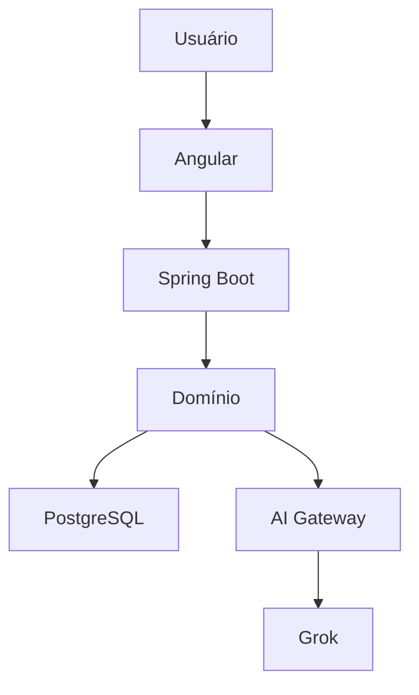

---

# Convenções Gerais

Todos os módulos deverão:

- possuir responsabilidade única;
- ser documentados;
- possuir testes;
- utilizar DTOs;
- utilizar validações;
- utilizar tratamento de exceções;
- utilizar logs estruturados;
- evitar acoplamento desnecessário.

---

# Decisões Arquiteturais Iniciais (ADR)

| Código | Decisão |
|---------|---------|
| ADR-001 | Utilizar Java + Spring Boot como backend |
| ADR-002 | Utilizar Angular como frontend |
| ADR-003 | Utilizar PostgreSQL como banco principal |
| ADR-004 | Utilizar Gradle como ferramenta de build |
| ADR-005 | Centralizar toda comunicação com IA através do AI Gateway |
| ADR-006 | Tratar IA como serviço desacoplado do domínio |
| ADR-007 | Priorizar algoritmos tradicionais sempre que possível |
| ADR-008 | Projetar o sistema para operar com custo mínimo de IA |

---

# Próximo Documento

O próximo documento apresentará a estrutura completa dos pacotes, módulos, classes e responsabilidades do sistema.

Arquivo:

```
docs/00-arquitetura/01-organizacao-do-projeto.md
```

---
title: "01 - Organização do Projeto"
version: "1.0.0"
status: "Aprovado"
project: "ConcursoAI"
author: "Marcos Bassetto"
created: "2026-08-06"
updated: "2026-08-06"
---

# Organização do Projeto

## Objetivo

Este documento define a estrutura oficial do projeto ConcursoAI.

Ele estabelece:

- Organização dos diretórios.
- Organização dos pacotes Java.
- Organização dos módulos.
- Responsabilidades de cada camada.
- Dependências permitidas.
- Convenções de nomenclatura.
- Estrutura que deverá ser mantida durante toda a evolução do projeto.

Este documento é a referência principal para todos os desenvolvedores.

---

# Estrutura Geral do Repositório

A estrutura oficial do projeto será:

```text
concursos/

├── docs/
│
├── src/
│   ├── main/
│   └── test/
│
├── docker/
│
├── scripts/
│
├── postman/
│
├── README.md
├── build.gradle
├── settings.gradle
└── .gitignore
```

---

# Organização da Pasta docs

Toda documentação ficará versionada juntamente com o código-fonte.

```text
docs/

00-arquitetura/

01-visao-geral/

02-requisitos/

03-modelo-dominio/

04-banco/

05-backend/

06-frontend/

07-inteligencia-artificial/

08-seguranca/

09-api/

10-diagramas/

11-devops/

12-testes/

13-manual-desenvolvedor/

14-manual-administrador/

adr/
```

---

# Estrutura do Código-Fonte

Todo o código Java ficará localizado em:

```text
src/main/java/br/com/marcosbassetto/concursos
```

A partir desse ponto inicia-se a organização por domínios.

---

# Estrutura Prevista

```text
concursos

│
├── common
├── security
├── infrastructure
├── ai
├── usuario
├── concurso
├── edital
├── banca
├── materia
├── topico
├── questao
├── simulado
├── estudo
├── dashboard
└── shared
```

Cada diretório representa um módulo funcional.

Não será utilizada uma arquitetura baseada apenas em camadas ("controller", "service", "repository" globais), pois isso tende a gerar alto acoplamento.

---

# Organização Interna dos Módulos

Todos os módulos deverão seguir exatamente a mesma organização.

Exemplo:

```text
materia/

controller/

service/

usecase/

domain/

entity/

repository/

dto/

mapper/

validator/

exception/
```

Essa padronização facilita:

- manutenção;
- localização de código;
- testes;
- evolução da aplicação.

---

# Responsabilidade dos Módulos

## common

Responsável por funcionalidades compartilhadas.

Exemplos:

- constantes;
- utilitários;
- mapeadores genéricos;
- exceções comuns;
- validações comuns.

Nunca conterá regras de negócio.

---

## security

Responsável por toda a segurança.

Incluindo:

- autenticação;
- autorização;
- JWT;
- filtros;
- auditoria;
- permissões;
- criptografia.

Nenhum outro módulo poderá implementar autenticação própria.

---

## infrastructure

Camada de infraestrutura.

Responsável por:

- banco de dados;
- Flyway;
- integração REST;
- leitura de PDFs;
- armazenamento de arquivos;
- cache;
- schedulers;
- configurações técnicas.

Não poderá conter regras de negócio.

---

## ai

Responsável exclusivamente pela integração com Inteligência Artificial.

Será totalmente desacoplado do domínio.

---

## usuario

Responsável pelos usuários do sistema.

---

## concurso

Responsável pelos concursos cadastrados.

---

## edital

Responsável pelo upload, processamento e armazenamento dos editais.

---

## banca

Responsável pelas bancas examinadoras.

---

## materia

Gerencia as disciplinas do concurso.

---

## topico

Gerencia os tópicos de cada matéria.

---

## questao

Gerencia questões cadastradas e geradas.

---

## simulado

Responsável pelos simulados.

---

## estudo

Responsável pelo histórico de estudos do usuário.

---

## dashboard

Responsável pelos indicadores e estatísticas.

---

## shared

Componentes compartilhados entre módulos específicos, desde que não pertençam ao `common`.

Seu uso deverá ser excepcional.

---

# Dependências Permitidas

A arquitetura deverá respeitar as seguintes dependências:

```text
Controller

↓

Service

↓

UseCase

↓

Domain

↓

Repository Interface

↓

Infrastructure
```

Nunca será permitido:

```
Controller → Repository

Controller → Entity

Service → Controller

Repository → Controller

Infrastructure → Controller
```

---

# Organização das Classes

As classes deverão seguir um padrão uniforme.

Exemplo:

```text
MateriaController

MateriaService

CadastrarMateriaUseCase

MateriaRepository

MateriaEntity

MateriaDTO

MateriaMapper

MateriaValidator

MateriaException
```

---

# Organização dos Testes

A estrutura de testes deverá refletir a estrutura do código-fonte.

```text
src/test/java

br/com/marcosbassetto/concursos

materia/

controller/

service/

usecase/

repository/
```

Todo módulo deverá possuir seus próprios testes.

---

# Organização dos Recursos

```text
src/main/resources

application.properties

db/

migration/

static/

templates/

prompts/

messages/
```

Novos diretórios previstos:

- `prompts/` → prompts versionados da IA.
- `messages/` → internacionalização e mensagens.

---

# Convenções de Nomenclatura

## Classes

PascalCase

Exemplo:

```
ConcursoController
```

---

## Métodos

camelCase

Exemplo:

```
gerarSimulado()
```

---

## Constantes

UPPER_SNAKE_CASE

Exemplo:

```
MAX_QUESTOES
```

---

## Pacotes

Sempre minúsculos.

Exemplo:

```
simulado
```

Nunca:

```
Simulado
```

---

# Estrutura Atual

O projeto encontra-se atualmente na seguinte fase:

```text
src

main

java

br

com

marcosbassetto

concursos

ConcursosApplication.java
```

Essa estrutura corresponde ao projeto inicial criado pelo Spring Boot.

Os módulos definidos neste documento serão adicionados gradualmente durante o desenvolvimento.

---

# Diagrama da Organização

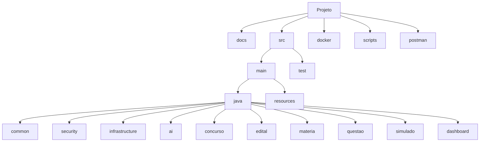

---

# Regras Obrigatórias

Todos os módulos deverão:

- possuir responsabilidade única;
- possuir documentação;
- possuir testes;
- possuir DTOs;
- possuir validações;
- possuir tratamento de exceções;
- utilizar logs estruturados;
- evitar dependências cíclicas;
- respeitar a Clean Architecture.

---

# Critérios de Evolução

Um novo módulo somente poderá ser criado quando:

- representar um novo domínio de negócio;
- possuir responsabilidade claramente definida;
- não aumentar o acoplamento da aplicação.

---

# Próximo Documento

```
docs/00-arquitetura/02-estrutura-dos-pacotes.md
```

Esse documento detalhará cada pacote Java, suas classes, interfaces, responsabilidades, dependências permitidas e relacionamento com os demais módulos.

---
title: "02 - Estrutura dos Pacotes"
version: "1.0.0"
status: "Aprovado"
project: "ConcursoAI"
author: "Marcos Bassetto"
created: "2026-08-07"
updated: "2026-08-07"
---

# Estrutura dos Pacotes

## Objetivo

Este documento define a estrutura oficial dos pacotes Java do ConcursoAI.

Cada pacote representa um módulo funcional do sistema.

Todos os módulos deverão seguir a mesma organização interna, facilitando manutenção, testes, reutilização e evolução da arquitetura.

---

# Estrutura Geral

```text
br.com.marcosbassetto.concursos

├── common
├── security
├── infrastructure
├── ai
├── usuario
├── concurso
├── edital
├── banca
├── materia
├── topico
├── questao
├── simulado
├── estudo
├── dashboard
└── shared
```

---

# Organização Interna de Cada Módulo

Todos os módulos deverão seguir exatamente esta estrutura.

```text
modulo

├── controller
├── service
├── usecase
├── domain
├── entity
├── repository
├── dto
├── mapper
├── validator
├── exception
└── event
```

Nem todos os módulos precisarão utilizar todos os diretórios inicialmente.

Entretanto, a estrutura deverá permanecer padronizada.

---

# Pacote common

## Objetivo

Armazenar recursos compartilhados por toda aplicação.

## Estrutura

```text
common

config/

constant/

exception/

mapper/

util/

validator/

event/

response/
```

## Responsabilidades

- Utilitários
- Constantes
- Exceptions genéricas
- Classes auxiliares
- Objetos de resposta comuns
- Conversores reutilizáveis

## Não permitido

- Regras de negócio
- Controllers
- Repositories

---

# Pacote security

## Objetivo

Centralizar toda segurança da aplicação.

## Estrutura

```text
security

config/

jwt/

filter/

service/

permission/

audit/

handler/

crypto/
```

## Responsabilidades

- Login
- JWT
- Refresh Token
- Controle de acesso
- Auditoria
- Perfis
- Criptografia
- Password Encoder

---

# Pacote infrastructure

## Objetivo

Concentrar toda infraestrutura técnica.

## Estrutura

```text
infrastructure

config/

database/

flyway/

pdf/

storage/

rest/

cache/

scheduler/

mail/

http/
```

## Responsabilidades

- Banco de dados
- Migrações
- Leitura de PDF
- Upload
- Download
- Configurações
- Integrações externas
- Cache

---

# Pacote ai

## Objetivo

Concentrar toda integração com Inteligência Artificial.

Nenhum outro módulo poderá acessar diretamente um provedor de IA.

---

## Estrutura

```text
ai

gateway/

provider/

service/

prompt/

parser/

cache/

rag/

embedding/

dto/

model/

exception/
```

---

## gateway

Responsável por fornecer uma única porta de entrada para IA.

Exemplo:

```java
AIService
```

Todos os demais módulos conversarão apenas com essa interface.

---

## provider

Implementações concretas.

Exemplos:

```text
GrokProvider

GeminiProvider

OpenAIProvider

ClaudeProvider

MockProvider
```

Inicialmente apenas o Grok será implementado.

---

## prompt

Prompts versionados.

Exemplos.

```text
ExtractSubjectsPrompt

GenerateQuestionsPrompt

ExplainQuestionPrompt

SummarizePrompt

StudyPlanPrompt
```

---

## parser

Responsável por interpretar respostas da IA.

Exemplos.

- JSON
- Markdown
- Texto estruturado

---

## cache

Evita chamadas repetidas para IA.

Exemplos.

- Explicações
- Questões
- Resumos

---

## rag

Preparação para futura implementação de RAG.

Mesmo que inicialmente não seja utilizado.

---

## embedding

Preparação para vetorização futura.

---

# Pacote usuario

## Responsabilidade

Gerenciar usuários.

### Classes previstas

```text
UsuarioController

UsuarioService

CadastrarUsuarioUseCase

AtualizarUsuarioUseCase

UsuarioRepository

UsuarioEntity

UsuarioDTO

UsuarioMapper
```

---

# Pacote concurso

Responsável pelos concursos.

### Casos de uso

- Cadastrar concurso
- Atualizar concurso
- Remover concurso
- Consultar concurso
- Listar concursos

---

# Pacote edital

Responsável pelo ciclo de vida do edital.

### Casos de uso

- Upload
- Validação
- Extração de texto
- Processamento
- Armazenamento

---

# Pacote banca

Responsável pelas bancas examinadoras.

### Responsabilidades

- Cadastro
- Perfil da banca
- Estatísticas
- Frequência de assuntos

---

# Pacote materia

Responsável pelas disciplinas.

### Casos de uso

- Criar matéria
- Atualizar
- Excluir
- Ordenar
- Consultar

---

# Pacote topico

Responsável pelos tópicos do conteúdo programático.

Relaciona matérias ao edital.

---

# Pacote questao

Responsável pelas questões.

Tipos.

- Importadas
- Geradas por IA
- Corrigidas
- Comentadas

---

# Pacote simulado

Responsável pelos simulados.

### Casos de uso

- Gerar
- Salvar
- Corrigir
- Reabrir
- Estatísticas

---

# Pacote estudo

Responsável pelo histórico de aprendizagem.

Exemplos.

- Tempo estudado
- Matérias
- Evolução
- Acertos
- Erros

---

# Pacote dashboard

Responsável pelos indicadores.

Exemplos.

- Percentual de acertos
- Evolução
- Horas estudadas
- Desempenho por banca

---

# Pacote shared

Pacote destinado a componentes compartilhados entre domínios específicos.

Seu uso deverá ser mínimo.

Sempre que possível utilizar o pacote common.

---

# Relacionamento entre Pacotes

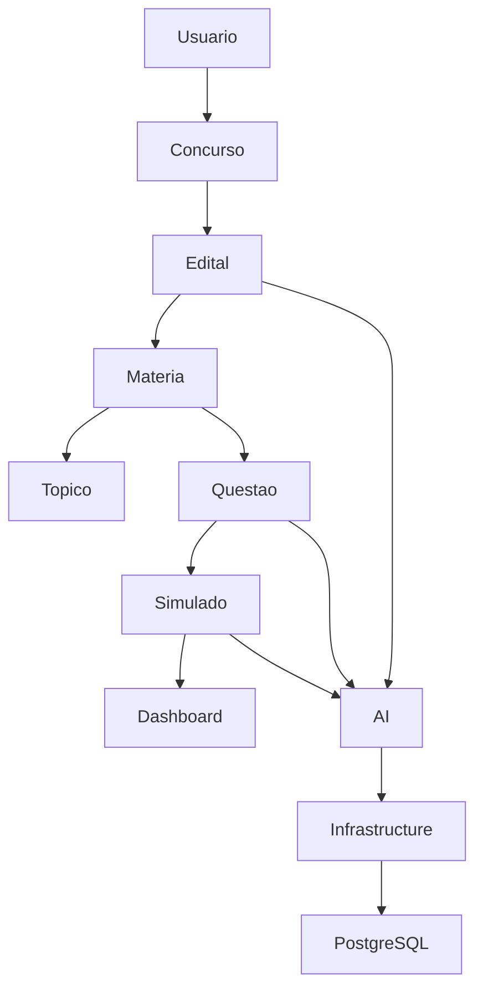

---

# Dependências Permitidas

| Pacote | Pode acessar |
|---------|--------------|
| controller | service |
| service | usecase |
| usecase | domain |
| usecase | repository |
| repository | infrastructure |
| ai | infrastructure |
| dashboard | repository |

---

# Dependências Proibidas

Nunca será permitido.

- Controller acessar Repository
- Controller acessar Entity
- Repository acessar Controller
- Entity acessar Controller
- Entity acessar Service
- Infrastructure acessar Controller
- Provider acessar módulos de domínio

---

# Convenções

## Controllers

Sempre terminar com:

```text
Controller
```

---

## Services

Sempre terminar com:

```text
Service
```

---

## Use Cases

Sempre terminar com:

```text
UseCase
```

---

## DTOs

Sempre terminar com:

```text
DTO
```

---

## Mappers

Sempre terminar com:

```text
Mapper
```

---

## Validators

Sempre terminar com:

```text
Validator
```

---

## Exceptions

Sempre terminar com:

```text
Exception
```

---

# Fluxo Arquitetural

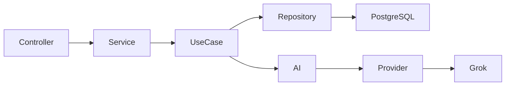

---

# Estrutura Prevista do Projeto

Ao final do desenvolvimento, a estrutura principal deverá se aproximar do seguinte modelo:

```text
src/main/java/br/com/marcosbassetto/concursos

common/
security/
infrastructure/
ai/
usuario/
concurso/
edital/
banca/
materia/
topico/
questao/
simulado/
estudo/
dashboard/
shared/

ConcursosApplication.java
```

---

# Critérios para Criação de Novos Pacotes

Um novo pacote somente poderá ser criado quando:

- representar um novo domínio de negócio;
- possuir responsabilidade exclusiva;
- não gerar dependência circular;
- possuir documentação;
- possuir testes;
- respeitar a Clean Architecture.

---

# Próximo Documento

```
docs/00-arquitetura/03-padroes-de-codigo.md
```

Esse documento definirá os padrões obrigatórios para nomenclatura, organização das classes, estilo de código, convenções de desenvolvimento, boas práticas Java, Spring Boot e Angular, garantindo uniformidade em todo o projeto.

---
title: "03 - Padrões de Código"
version: "1.0.0"
status: "Aprovado"
project: "ConcursoAI"
author: "Marcos Bassetto"
created: "2026-08-07"
updated: "2026-08-07"
---

# Padrões de Código

## Objetivo

Este documento define os padrões obrigatórios para desenvolvimento do ConcursoAI.

Todos os desenvolvedores deverão seguir estas convenções.

O objetivo é garantir:

- legibilidade;
- padronização;
- facilidade de manutenção;
- facilidade de testes;
- baixo acoplamento;
- alta coesão.

---

# Princípios Gerais

Todo código deverá ser:

- simples;
- previsível;
- reutilizável;
- testável;
- documentado;
- desacoplado.

Sempre que houver dúvida entre uma solução simples e uma solução complexa, deverá ser escolhida a mais simples.

---

# Clean Code

Todo código deverá seguir os princípios de Clean Code.

## Nomes

Os nomes devem revelar claramente sua intenção.

Correto:

```java
gerarSimulado()
```

Errado:

```java
processar()
```

---

## Métodos

Um método deverá executar apenas uma responsabilidade.

Preferencialmente:

- até 20 linhas;
- apenas um nível de abstração.

Exemplo:

```java
public void cadastrarUsuario() {

    validarDados();

    salvarUsuario();

    publicarEvento();

}
```

---

## Classes

Cada classe deverá possuir apenas uma responsabilidade.

Nunca misturar:

- regra de negócio;
- acesso ao banco;
- integração externa.

---

# SOLID

Todo desenvolvimento deverá respeitar:

## SRP

Uma responsabilidade.

---

## OCP

Aberto para extensão.

Fechado para modificação.

---

## LSP

Implementações devem respeitar contratos.

---

## ISP

Interfaces pequenas.

---

## DIP

Sempre depender de abstrações.

Nunca de implementações concretas.

---

# Organização das Classes

A ordem dos membros deverá ser:

```text
Constantes

Atributos

Construtores

Métodos públicos

Métodos protegidos

Métodos privados
```

---

# Comentários

Comentários deverão explicar o "porquê".

Nunca o "como".

Ruim:

```java
// Soma dois números

int total = a + b;
```

Bom:

```java
// A banca considera questões anuladas como corretas.
```

---

# Métodos

## Tamanho

Ideal:

Até 20 linhas.

Máximo recomendado:

40 linhas.

---

## Parâmetros

Ideal:

Até 3 parâmetros.

Caso contrário utilizar DTO.

---

# Classes

Ideal:

Até 300 linhas.

Acima disso deverá ser avaliada refatoração.

---

# Interfaces

Interfaces deverão representar comportamento.

Nunca apenas "duplicar" classes.

Exemplo.

```java
AIService
```

---

# Exceptions

Nunca lançar Exception genérica.

Sempre utilizar exceptions específicas.

Exemplo.

```java
EditalNaoEncontradoException

UsuarioSemPermissaoException

QuestaoInvalidaException
```

---

# DTOs

DTOs deverão conter apenas dados.

Nunca regras de negócio.

---

# Entities

Entidades representam persistência.

Nunca deverão conter:

- chamadas HTTP;
- acesso à IA;
- regras complexas.

---

# Repositories

Responsáveis apenas por persistência.

Nunca implementar:

- regras de negócio;
- validações.

---

# Services

Responsáveis por coordenar casos de uso.

Nunca acessar banco diretamente sem passar pelos repositórios.

---

# Use Cases

Toda regra de negócio deverá ficar em Use Cases.

Exemplo:

```text
GerarSimuladoUseCase

CorrigirSimuladoUseCase

ProcessarEditalUseCase
```

---

# Mappers

Toda conversão deverá ser centralizada.

Nunca converter manualmente em Controllers.

---

# Validators

Toda validação complexa deverá ser isolada.

Exemplo.

```text
EditalValidator

QuestaoValidator

UsuarioValidator
```

---

# Eventos

Sempre que possível utilizar eventos de domínio.

Exemplo.

```text
EditalProcessadoEvent

SimuladoGeradoEvent

QuestaoCorrigidaEvent
```

---

# Logs

Todos os logs deverão possuir contexto.

Exemplo.

```text
Concurso

Usuário

Matéria

Simulado

Tempo de execução
```

Nunca utilizar:

```java
System.out.println();
```

Sempre utilizar o logger do Spring Boot.

---

# Tratamento de Erros

Todos os erros deverão ser tratados por um GlobalExceptionHandler.

Controllers nunca deverão tratar exceptions manualmente.

---

# Testabilidade

Todo código deverá permitir:

- testes unitários;
- testes de integração;
- mocks.

Nunca utilizar dependências estáticas quando houver alternativa.

---

# Dependências

Sempre utilizar injeção de dependência.

Nunca:

```java
new Service();
```

Sempre:

```java
@RequiredArgsConstructor
```

ou

```java
Constructor Injection
```

---

# Padrões de Retorno

Todos os endpoints deverão retornar DTOs.

Nunca retornar Entity diretamente.

---

# Organização dos Imports

1. Java

2. Spring

3. Terceiros

4. Projeto

---

# TODOs

TODOs deverão seguir padrão.

```java
// TODO ADR-023
```

Nunca deixar TODOs sem identificação.

---

# Boas Práticas para IA

Nenhum módulo poderá acessar diretamente um Provider.

Sempre utilizar:

```text
AI Gateway

↓

AI Service

↓

Provider
```

---

# Checklist de Desenvolvimento

Antes de finalizar qualquer implementação verificar:

- [ ] Nome da classe adequado.
- [ ] Nome dos métodos claros.
- [ ] Classe possui responsabilidade única.
- [ ] Existem testes.
- [ ] Existe documentação.
- [ ] Exceptions específicas.
- [ ] DTOs utilizados.
- [ ] Não retorna Entity.
- [ ] Logs adicionados.
- [ ] Validações implementadas.
- [ ] Código revisado.

---

# Diagrama

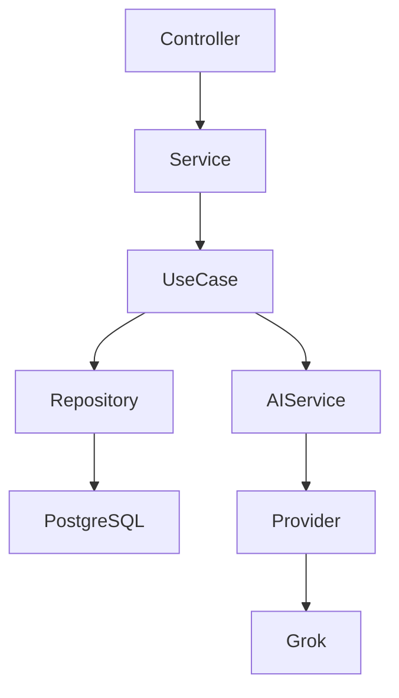

---

# ADR Relacionadas

| Código | Decisão |
|---------|---------|
| ADR-009 | Utilizar Clean Code em todo projeto |
| ADR-010 | Toda regra de negócio ficará em Use Cases |
| ADR-011 | Controllers nunca acessarão Repository |
| ADR-012 | Toda comunicação com IA passará pelo AI Gateway |
| ADR-013 | Toda conversão será realizada por Mappers |
| ADR-014 | Toda validação complexa ficará em Validators |

---

# Próximo Documento

```
docs/00-arquitetura/04-convencoes-java.md
```

Neste documento serão definidos todos os padrões específicos para Java 21, Spring Boot, Gradle e organização das classes da aplicação.

---
title: "04 - Convenções Java"
version: "1.0.0"
status: "Aprovado"
project: "ConcursoAI"
author: "Marcos Bassetto"
created: "2026-08-07"
updated: "2026-08-07"
---

# Convenções Java

## Objetivo

Este documento estabelece os padrões obrigatórios para desenvolvimento em Java no projeto ConcursoAI.

Seu objetivo é garantir uniformidade, legibilidade, manutenção simplificada e aderência às boas práticas da plataforma Java.

Todas as classes do projeto deverão seguir estas convenções.

---

# Versão do Java

Versão oficial:

```text
Java 21 LTS
```

Não será permitido utilizar recursos obsoletos ou APIs depreciadas sem justificativa técnica.

---

# Organização dos Arquivos

Cada arquivo Java deverá conter apenas uma classe pública.

Exemplo:

```
ConcursoController.java
```

Nunca:

```
ConcursoController.java

+

MateriaController.java
```

---

# Organização dos Pacotes

Os pacotes deverão permanecer totalmente em letras minúsculas.

Exemplo:

```
br.com.marcosbassetto.concursos.simulado
```

Nunca:

```
Simulado
```

---

# Organização das Classes

Toda classe deverá obedecer a seguinte ordem.

```text
Constantes

Campos

Construtores

Métodos Públicos

Métodos Protegidos

Métodos Privados

Classes Internas
```

---

# Convenção de Nomes

## Classes

Sempre em PascalCase.

Exemplo.

```
GerarSimuladoUseCase
```

---

## Interfaces

Sempre representar comportamento.

Exemplo.

```
AIService

EditalParser

QuestionGenerator
```

Nunca utilizar prefixo "I".

Errado.

```
IAIService
```

---

## Métodos

Sempre utilizar verbo.

Exemplos.

```
salvar()

buscar()

listar()

gerar()

corrigir()

processar()

validar()
```

Nunca:

```
dados()

materia()

simulado()
```

---

## Variáveis

Sempre em camelCase.

Exemplo.

```
nomeMateria

tempoResposta

quantidadeQuestoes
```

---

## Constantes

Sempre em maiúsculo.

Exemplo.

```
MAX_QUESTOES

DEFAULT_TIMEOUT

TOKEN_EXPIRATION
```

---

# Modificadores

A ordem deverá ser:

```
public

protected

private
```

Campos privados sempre que possível.

---

# Uso do final

Sempre utilizar `final` quando o valor não sofrer alteração.

Exemplo.

```java
final String nome;
```

---

# Records

Sempre que possível utilizar Records para DTOs imutáveis.

Exemplo.

```java
public record ConcursoDTO(

Long id,

String nome

){}
```

---

# Lombok

Biblioteca oficial.

Permitido utilizar.

```
@Getter

@Setter

@Builder

@RequiredArgsConstructor

@NoArgsConstructor

@AllArgsConstructor
```

Evitar:

```
@Data
```

Motivo:

gera equals/hashCode automaticamente e pode produzir efeitos colaterais em entidades JPA.

---

# Optional

Nunca utilizar Optional como atributo.

Correto.

```java
Optional<Usuario> buscarUsuario();
```

Errado.

```java
class Usuario{

Optional<String> nome;

}
```

---

# Streams

Utilizar Streams apenas quando melhorarem a legibilidade.

Evitar cadeias excessivamente longas.

---

# Collections

Preferir interfaces.

Correto.

```java
List<Usuario>
```

Errado.

```java
ArrayList<Usuario>
```

---

# Enums

Sempre utilizar Enum para valores fixos.

Exemplo.

```
StatusSimulado

NivelDificuldade

PerfilUsuario

TipoQuestao
```

Nunca utilizar String para representar estados conhecidos.

---

# Datas

Utilizar API java.time.

Permitido.

```
LocalDate

LocalDateTime

Instant

Duration
```

Não utilizar:

```
Date

Calendar
```

---

# Null

Evitar ao máximo.

Preferir:

- validações;
- Optional;
- objetos vazios quando fizer sentido.

---

# Equals e HashCode

Entidades deverão implementar equals/hashCode utilizando apenas o identificador quando persistidas.

DTOs não deverão sobrescrever esses métodos, salvo necessidade específica.

---

# Serialização

Utilizar Jackson como biblioteca padrão.

Não utilizar bibliotecas alternativas sem necessidade.

---

# Exceptions

Sempre criar exceções específicas.

Exemplo.

```
ConcursoNaoEncontradoException

EditalInvalidoException

QuestaoDuplicadaException
```

Nunca lançar:

```java
throw new Exception();
```

---

# Builders

Objetos complexos deverão utilizar Builder.

Exemplo.

```java
Simulado.builder()

.usuario(usuario)

.materia(materia)

.questoes(lista)

.build();
```

---

# Métodos Estáticos

Utilizar apenas para funções puras.

Nunca utilizar métodos estáticos para regras de negócio.

---

# Utilitários

Classes utilitárias deverão:

- ser finais;
- possuir construtor privado.

Exemplo.

```java
public final class StringUtils {

    private StringUtils(){}

}
```

---

# Herança

Evitar herança profunda.

Preferir composição.

---

# Interfaces Funcionais

Utilizar apenas quando agregarem simplicidade.

---

# Generics

Sempre tipar corretamente.

Nunca utilizar.

```java
List
```

Sempre.

```java
List<QuestaoDTO>
```

---

# Javadoc

Obrigatório apenas para:

- APIs públicas;
- interfaces;
- classes utilitárias;
- componentes compartilhados.

Não documentar métodos triviais.

---

# Organização dos Imports

Ordem.

```
Java

Jakarta

Spring

Terceiros

Projeto
```

---

# Formatação

Indentação.

```
4 espaços
```

Nunca TAB.

Comprimento máximo recomendado.

```
120 caracteres
```

---

# Estrutura Recomendada de uma Classe

```text
Classe

Constantes

Campos

Construtor

Métodos Públicos

Métodos Privados
```

---

# Exemplo

```java
@Service
@RequiredArgsConstructor
public class GerarSimuladoUseCase {

    private final QuestaoRepository repository;

    public SimuladoDTO executar(Long materiaId){

        validarMateria(materiaId);

        return gerarSimulado(materiaId);

    }

    private void validarMateria(Long materiaId){

    }

    private SimuladoDTO gerarSimulado(Long materiaId){

        return new SimuladoDTO();

    }

}
```

---

# Checklist

Antes de concluir qualquer classe verificar.

- [ ] Nome adequado.
- [ ] Responsabilidade única.
- [ ] Construtor por injeção.
- [ ] Métodos pequenos.
- [ ] Sem duplicação.
- [ ] DTO utilizado.
- [ ] Streams legíveis.
- [ ] Optional correto.
- [ ] Logs quando necessário.
- [ ] Testável.

---

# ADR Relacionadas

| Código | Decisão |
|---------|---------|
| ADR-015 | Java 21 LTS será a versão oficial |
| ADR-016 | Utilizar Records para DTOs sempre que possível |
| ADR-017 | Utilizar Builder em objetos complexos |
| ADR-018 | Evitar herança profunda |
| ADR-019 | Preferir composição |
| ADR-020 | Utilizar API java.time |

---

# Próximo Documento

```
docs/00-arquitetura/05-convencoes-spring.md
```

Este documento definirá os padrões oficiais para utilização do Spring Boot, Spring Data JPA, Spring Security, validações, transações, eventos, cache e integração entre os módulos do sistema.

---
title: "05 - Convenções Spring Boot"
version: "1.0.0"
status: "Aprovado"
project: "ConcursoAI"
author: "Marcos Bassetto"
created: "2026-08-07"
updated: "2026-08-07"
---

# Convenções Spring Boot

## Objetivo

Este documento estabelece os padrões oficiais para utilização do Spring Boot
no projeto ConcursoAI.

Todas as implementações deverão seguir estas convenções para manter o projeto
coeso, escalável e de fácil manutenção.

---

# Stack Oficial

## Linguagem

- Java 21 LTS

## Framework

- Spring Boot 3.x

## Build

- Gradle

## Persistência

- Spring Data JPA

## Banco

- PostgreSQL

## Migração

- Flyway

## Segurança

- Spring Security
- JWT

## Validação

- Jakarta Validation

## Serialização

- Jackson

## Cliente HTTP

- Spring WebClient

---

# Dependências Permitidas

Utilizar apenas dependências realmente necessárias.

Evitar bibliotecas que:

- aumentem o tempo de inicialização;
- substituam funcionalidades já existentes no Spring;
- não possuam manutenção ativa.

---

# Injeção de Dependência

Sempre utilizar **injeção por construtor**.

Correto:

```java
@RequiredArgsConstructor
@Service
public class ConcursoService {

    private final ConcursoRepository repository;

}
```

Nunca utilizar:

```java
@Autowired
private ConcursoRepository repository;
```

---

# Anotações Oficiais

## Controller

```java
@RestController
@RequestMapping
```

---

## Service

```java
@Service
```

---

## Repository

```java
@Repository
```

---

## Configuration

```java
@Configuration
```

---

## Component

Utilizar apenas quando não houver uma anotação mais específica.

---

# Controllers

Os Controllers deverão conter apenas:

- recebimento da requisição;
- validação básica;
- chamada do Service ou UseCase;
- retorno da resposta.

Nunca implementar regra de negócio.

---

# Services

Os Services serão responsáveis por:

- orquestrar casos de uso;
- coordenar chamadas entre módulos;
- iniciar transações quando necessário.

Nunca acessar diretamente recursos externos sem passar pelos componentes apropriados.

---

# Use Cases

Toda regra de negócio deverá ser implementada em UseCases.

Exemplo:

```text
GerarSimuladoUseCase

ProcessarEditalUseCase

CorrigirSimuladoUseCase
```

---

# Repositories

Responsáveis exclusivamente pela persistência.

Nunca:

- validar regras;
- chamar APIs externas;
- acessar IA.

---

# DTOs

Todos os Controllers trabalharão apenas com DTOs.

Nunca retornar Entity diretamente.

---

# Validação

Utilizar Jakarta Validation.

Exemplo:

```java
@NotBlank

@NotNull

@Size

@Positive
```

Validações complexas deverão ser implementadas em Validators específicos.

---

# Tratamento Global de Erros

Utilizar um único componente.

```java
@RestControllerAdvice
```

Responsabilidades:

- padronizar respostas de erro;
- registrar logs;
- ocultar detalhes internos.

---

# Transações

Utilizar:

```java
@Transactional
```

Apenas quando necessário.

Evitar transações longas.

Chamadas para IA nunca deverão ocorrer dentro de transações abertas.

---

# Eventos

Sempre que possível utilizar eventos internos.

Exemplos:

```
EditalProcessadoEvent

SimuladoGeradoEvent

QuestaoCorrigidaEvent
```

---

# Configurações

Nunca utilizar valores fixos no código.

Todos deverão ficar em:

```
application.properties
```

ou

```
application-dev.properties

application-prod.properties
```

---

# Perfis

Perfis oficiais:

```
dev

test

prod
```

---

# Cliente HTTP

Toda comunicação externa deverá utilizar:

```java
WebClient
```

Nunca utilizar:

```
RestTemplate
```

(exceto manutenção de legado).

---

# Integração com IA

Toda chamada para IA deverá seguir obrigatoriamente o fluxo:

```
Controller
↓

UseCase

↓

AIService

↓

Provider

↓

WebClient

↓

API da IA
```

Nenhum módulo poderá chamar diretamente um Provider.

---

# Upload de Arquivos

Todo upload deverá:

- validar extensão;
- validar tamanho;
- validar MIME Type;
- gerar nome único;
- impedir execução de arquivos enviados.

---

# Configuração do Jackson

Padrão:

- datas em ISO-8601;
- ignorar campos nulos quando apropriado;
- UTF-8.

---

# Logging

Utilizar SLF4J.

Nunca utilizar:

```java
System.out.println()
```

Todos os logs deverão conter:

- usuário;
- módulo;
- operação;
- tempo de execução (quando relevante).

---

# Cache

Inicialmente o sistema não utilizará cache distribuído.

Poderá ser utilizado apenas cache local para:

- respostas da IA;
- leitura de edital;
- estatísticas temporárias.

---

# Processamento Assíncrono

Utilizar:

```java
@Async
```

Somente para tarefas demoradas:

- processamento de edital;
- geração de simulados;
- comunicação com IA.

---

# Scheduler

Utilizar:

```java
@Scheduled
```

Para:

- limpeza de cache;
- remoção de arquivos temporários;
- tarefas administrativas.

---

# Segurança

Toda rota deverá estar protegida.

Exceções:

```
/auth/**

/actuator/health
```

(se habilitado).

---

# Organização das Configurações

```text
config/

SecurityConfig

JacksonConfig

WebClientConfig

OpenApiConfig

AsyncConfig

CacheConfig
```

---

# Organização dos Beans

Nunca criar Beans desnecessários.

Sempre avaliar se o Spring já fornece implementação padrão.

---

# Testes

Todo Service deverá possuir:

- teste unitário;
- testes de integração quando necessário.

---

# Dependências entre Camadas

```text
Controller

↓

Service

↓

UseCase

↓

Repository

↓

Database
```

Integração com IA:

```text
UseCase

↓

AIService

↓

Provider

↓

WebClient

↓

API Externa
```

---

# Diagrama

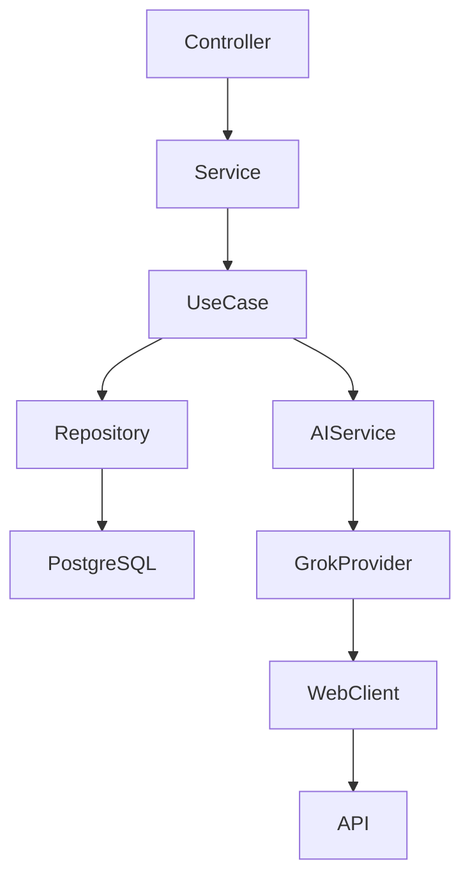

---

# ADR Relacionadas

| Código | Decisão |
|---------|----------|
| ADR-021 | Spring Boot será o framework oficial |
| ADR-022 | Utilizar WebClient para integrações |
| ADR-023 | Controllers não conterão regras de negócio |
| ADR-024 | Toda integração com IA passará pelo AIService |
| ADR-025 | Transações não envolverão chamadas externas |
| ADR-026 | Configurações serão externalizadas |
| ADR-027 | Upload de arquivos será validado antes do processamento |
| ADR-028 | Utilizar processamento assíncrono apenas para tarefas demoradas |

---

# Checklist

Antes de concluir qualquer implementação Spring:

- [ ] Controller sem regra de negócio.
- [ ] DTO utilizado.
- [ ] Service pequeno.
- [ ] UseCase criado.
- [ ] Repository apenas persistência.
- [ ] Validações implementadas.
- [ ] Logs adicionados.
- [ ] Configuração externalizada.
- [ ] Testes criados.
- [ ] Dependências respeitando a arquitetura.

---

# Próximo Documento

```
docs/00-arquitetura/06-convencoes-angular.md
```

Neste documento serão definidos os padrões oficiais para o frontend em Angular, incluindo organização dos módulos, componentes, rotas, guards, interceptors, serviços, gerenciamento de estado, comunicação com a API e boas práticas de desenvolvimento.

---
title: "06 - Convenções Angular"
version: "1.0.0"
status: "Aprovado"
project: "ConcursoAI"
author: "Marcos Bassetto"
created: "2026-08-07"
updated: "2026-08-07"
---

# Convenções Angular

## Objetivo

Este documento define os padrões oficiais para desenvolvimento do frontend do ConcursoAI.

Todos os componentes, serviços e módulos deverão seguir estas convenções para garantir:

- alta organização;
- baixo acoplamento;
- reutilização de código;
- facilidade de manutenção;
- escalabilidade.

---

# Stack Oficial

## Framework

Angular (última versão LTS)

## Linguagem

TypeScript

## Estilo

SCSS

## Componentes

Standalone Components

## Gerenciador de Pacotes

npm

## Build

Angular CLI

---

# Estrutura Geral

```text
src/

app/

core/

shared/

layout/

features/

assets/

environments/
```

---

# Organização dos Diretórios

## core

Contém componentes únicos da aplicação.

```text
core/

auth/

guards/

interceptors/

services/

config/

models/
```

---

## shared

Componentes reutilizáveis.

```text
shared/

components/

pipes/

directives/

validators/

models/

utils/
```

---

## layout

Estrutura visual da aplicação.

```text
layout/

header/

sidebar/

footer/

toolbar/

menu/
```

---

## features

Cada funcionalidade possuirá seu próprio módulo.

```text
features/

dashboard/

concurso/

edital/

materia/

simulado/

questao/

usuario/

configuracao/
```

---

# Estrutura Interna dos Módulos

Exemplo.

```text
concurso/

pages/

components/

services/

models/

guards/

resolvers/

routes.ts
```

---

# Organização dos Componentes

Cada componente deverá possuir:

```text
component.ts

component.html

component.scss

component.spec.ts
```

---

# Convenção de Nomes

## Componentes

PascalCase.

```
DashboardComponent

MateriaCardComponent

QuestaoComponent
```

---

## Serviços

Sempre terminar com:

```
Service
```

Exemplo.

```
ConcursoService

AIService
```

---

## Models

Sempre representar objetos da API.

```
Concurso

Questao

Materia

Usuario
```

---

## DTOs

Nunca existirão no frontend.

No Angular utilizaremos apenas Models.

---

# Rotas

Cada módulo possuirá seu próprio arquivo.

```
routes.ts
```

Nunca centralizar todas as rotas em um único arquivo.

---

# Lazy Loading

Todos os módulos deverão utilizar carregamento sob demanda.

Exemplo.

```
Dashboard

↓

Concurso

↓

Matérias

↓

Simulados
```

---

# Guards

Utilizar Guards para:

- autenticação;
- autorização;
- navegação protegida.

---

# Interceptors

Utilizar apenas um interceptor principal.

Responsabilidades.

- adicionar JWT;
- tratar erros;
- renovar token quando necessário.

---

# Comunicação com API

Toda comunicação ocorrerá por Services.

Nunca utilizar HttpClient diretamente nos componentes.

Correto.

```
Component

↓

Service

↓

API
```

---

# Organização dos Services

Cada módulo terá seu próprio Service.

Exemplo.

```
ConcursoService

MateriaService

QuestaoService

SimuladoService
```

---

# Estado da Aplicação

Inicialmente utilizar apenas:

- Signals;
- RxJS.

Não utilizar bibliotecas externas de gerenciamento de estado.

---

# Componentes

Dividir componentes em:

## Pages

Representam telas completas.

---

## Components

Componentes reutilizáveis.

---

## Dialogs

Janelas modais.

---

## Cards

Informações resumidas.

---

## Forms

Formulários.

---

# Formulários

Sempre utilizar:

Reactive Forms.

Nunca utilizar Template Forms.

---

# Validação

Toda validação deverá existir:

Frontend

+

Backend

Nunca confiar apenas na validação do navegador.

---

# Tema

Tema oficial.

Modo claro.

Preparar estrutura para modo escuro futuramente.

---

# Responsividade

Breakpoints mínimos.

```
Desktop

Notebook

Tablet

Mobile
```

Todos os componentes deverão funcionar em telas pequenas.

---

# Organização Visual

Toda tela seguirá o padrão.

```
Header

↓

Sidebar

↓

Conteúdo

↓

Rodapé
```

---

# Componentes Compartilhados

Exemplos.

```
Button

Card

Modal

Loading

Spinner

Tabela

Toast

ConfirmDialog
```

---

# Consumo da IA

Fluxo.

```
Tela

↓

SimuladoService

↓

API

↓

Backend

↓

IA
```

O Angular nunca acessará diretamente uma IA.

---

# Tratamento de Erros

Erros deverão ser apresentados de forma amigável.

Nunca exibir StackTrace.

---

# Loading

Toda chamada HTTP deverá possuir indicador visual.

---

# Paginação

Listagens deverão suportar paginação.

---

# Ordenação

Sempre realizada pelo backend quando possível.

---

# Filtros

Os filtros deverão ser enviados como parâmetros da API.

Nunca filtrar grandes listas apenas no frontend.

---

# Internacionalização

Inicialmente apenas:

Português Brasil.

Preparar estrutura para futuras traduções.

---

# Acessibilidade

Todos os componentes deverão possuir:

- labels;
- navegação por teclado;
- contraste adequado;
- atributos ARIA quando aplicável.

---

# Organização das Telas

## Dashboard

Resumo do progresso.

---

## Concursos

Lista dos concursos cadastrados.

---

## Editais

Upload e processamento.

---

## Matérias

Lista das disciplinas.

---

## Simulados

Execução do simulado.

---

## Correção

Resultado do simulado.

---

## Estatísticas

Gráficos.

---

## Perfil

Dados do usuário.

---

# Estrutura Prevista

```text
app/

core/

shared/

layout/

features/

dashboard/

concurso/

edital/

materia/

questao/

simulado/

usuario/

configuracao/
```

---

# Fluxo Geral

```mermaid
graph LR

Tela

--> Service

--> API REST

--> Spring Boot

--> PostgreSQL
```

---

# Fluxo de Simulado

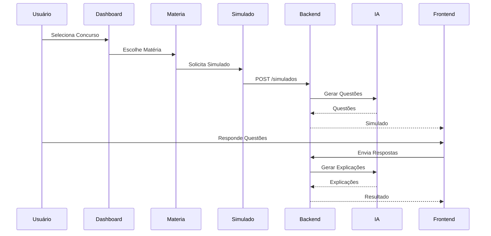

---

# Checklist

Antes de finalizar qualquer funcionalidade verificar.

- [ ] Componentes pequenos.
- [ ] Service separado.
- [ ] Sem lógica de negócio no componente.
- [ ] Reactive Forms.
- [ ] Responsivo.
- [ ] Loading.
- [ ] Tratamento de erros.
- [ ] Testes.
- [ ] Componentes reutilizados.
- [ ] Código organizado.

---

# ADR Relacionadas

| Código | Decisão |
|---------|----------|
| ADR-029 | Angular será o framework oficial do frontend |
| ADR-030 | Utilizar Standalone Components |
| ADR-031 | Reactive Forms serão obrigatórios |
| ADR-032 | Lazy Loading em todos os módulos |
| ADR-033 | Services serão responsáveis pela comunicação com a API |
| ADR-034 | Nenhuma regra de negócio ficará nos componentes |
| ADR-035 | O frontend nunca acessará diretamente provedores de IA |
| ADR-036 | O gerenciamento de estado utilizará Signals e RxJS |

---

# Próximo Documento

```
docs/00-arquitetura/07-padroes-rest-api.md
```

Este documento definirá o padrão oficial das APIs REST do ConcursoAI: versionamento, convenções de endpoints, estrutura de requisições e respostas, paginação, filtros, autenticação, tratamento de erros, códigos HTTP, documentação OpenAPI e boas práticas para integração entre o Angular e o Spring Boot.

---
title: "07 - Padrões REST API"
version: "1.0.0"
status: "Aprovado"
project: "ConcursoAI"
author: "Marcos Bassetto"
created: "2026-08-07"
updated: "2026-08-07"
---

# Padrões REST API

## Objetivo

Este documento estabelece o padrão oficial para todas as APIs REST do ConcursoAI.

Seu objetivo é garantir:

- consistência;
- previsibilidade;
- facilidade de integração;
- versionamento;
- documentação automática;
- segurança.

Todas as APIs deverão seguir este padrão.

---

# Tecnologias

- Spring Boot
- Spring Web
- Jackson
- Spring Validation
- Spring Security
- JWT
- OpenAPI (Swagger)

---

# Base URL

```
/api/v1
```

Exemplos

```
/api/v1/concursos

/api/v1/editais

/api/v1/materias

/api/v1/simulados
```

---

# Versionamento

Todo endpoint deverá possuir versão.

Exemplo

```
/api/v1

/api/v2
```

Nunca remover versões antigas sem processo de migração.

---

# Formato de Dados

Toda comunicação utilizará:

```
application/json
```

Uploads utilizarão:

```
multipart/form-data
```

Downloads:

```
application/pdf

application/octet-stream
```

---

# Convenção de URLs

Sempre utilizar substantivos.

Correto

```
GET /usuarios

GET /concursos

POST /simulados
```

Errado

```
GET /buscarUsuario

POST /gerarSimulado
```

---

# Métodos HTTP

GET

Consulta.

POST

Criação.

PUT

Atualização completa.

PATCH

Atualização parcial.

DELETE

Remoção lógica ou física.

---

# Estrutura dos Endpoints

## Concurso

```
GET     /concursos

GET     /concursos/{id}

POST    /concursos

PUT     /concursos/{id}

DELETE  /concursos/{id}
```

---

## Edital

```
POST /editais/upload

GET /editais/{id}

POST /editais/{id}/processar
```

---

## Matérias

```
GET /concursos/{id}/materias
```

---

## Simulados

```
POST /simulados

GET /simulados/{id}

POST /simulados/{id}/respostas

GET /simulados/{id}/resultado
```

---

# Estrutura de Resposta

Toda resposta deverá seguir padrão.

## Sucesso

```json
{
  "success": true,
  "data": {},
  "timestamp": "2026-08-07T14:00:00Z"
}
```

---

## Erro

```json
{
  "success": false,
  "error": {
    "code": "CONCURSO_NAO_ENCONTRADO",
    "message": "Concurso não encontrado."
  },
  "timestamp": "2026-08-07T14:00:00Z"
}
```

---

# Paginação

Utilizar sempre:

```
page

size

sort
```

Exemplo

```
GET /concursos?page=0&size=20&sort=nome
```

---

# Filtros

Utilizar Query Parameters.

Exemplo

```
GET /questoes?banca=FGV

GET /questoes?materia=Direito

GET /questoes?dificuldade=MEDIA
```

---

# Ordenação

Sempre realizada pelo backend.

Exemplo

```
sort=nome,asc

sort=data,desc
```

---

# Upload de Arquivos

Uploads utilizarão:

```
MultipartFile
```

Validações obrigatórias:

- extensão;
- MIME Type;
- tamanho máximo;
- nome seguro.

---

# Download

Sempre retornar:

```
Content-Disposition
```

para permitir download correto.

---

# Validação

Utilizar Jakarta Validation.

Exemplo

```java
@NotBlank

@NotNull

@Positive

@Email
```

---

# Autenticação

Utilizar JWT.

Fluxo

```
Login

↓

JWT

↓

Authorization Header

↓

Bearer Token
```

---

# Cabeçalhos

Obrigatórios.

```
Authorization

Content-Type

Accept
```

---

# Códigos HTTP

200 OK

201 Created

204 No Content

400 Bad Request

401 Unauthorized

403 Forbidden

404 Not Found

409 Conflict

422 Unprocessable Entity

500 Internal Server Error

---

# Tratamento Global

Todos os erros serão tratados pelo:

```
GlobalExceptionHandler
```

---

# OpenAPI

Todos os endpoints deverão possuir documentação.

Utilizar:

```
@Operation

@ApiResponse

@Schema
```

---

# Segurança

Nunca retornar:

- StackTrace
- SQL
- detalhes internos
- nomes de classes

---

# Idempotência

PUT

PATCH

DELETE

deverão ser idempotentes.

---

# Timeouts

Chamadas externas:

30 segundos.

IA:

60 segundos.

Upload:

120 segundos.

---

# Rate Limit

Preparar arquitetura para implementação futura.

Inicialmente não será implementado.

---

# Compressão

Ativar GZIP quando disponível.

---

# Cache HTTP

Utilizar apenas para consultas estáticas.

Nunca cachear:

- login;
- simulados;
- correções.

---

# Integração com IA

Fluxo

```text
Angular

↓

REST API

↓

Spring Boot

↓

AI Service

↓

Provider

↓

Grok
```

---

# Endpoints da IA

```
POST /ia/processar-edital

POST /ia/gerar-simulado

POST /ia/corrigir

POST /ia/explicar
```

Esses endpoints serão internos ao backend e consumidos apenas pelo frontend autenticado.

---

# Convenção de DTOs

Request

```
CriarConcursoRequest

ResponderSimuladoRequest

UploadEditalRequest
```

Response

```
ConcursoResponse

MateriaResponse

SimuladoResponse
```

---

# Fluxo REST

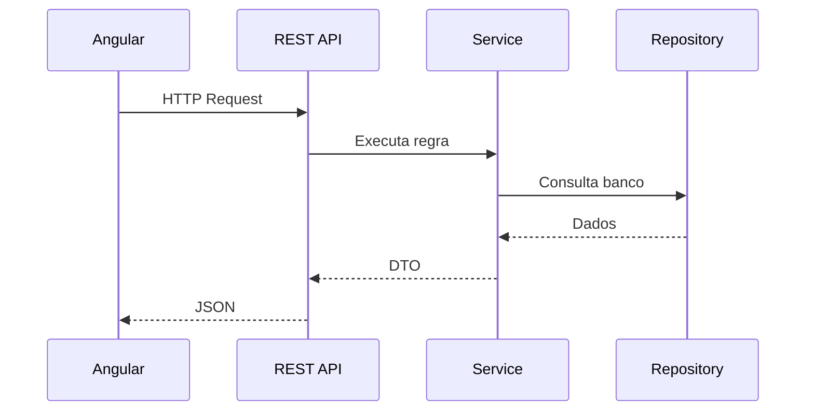

---

# Fluxo REST + IA

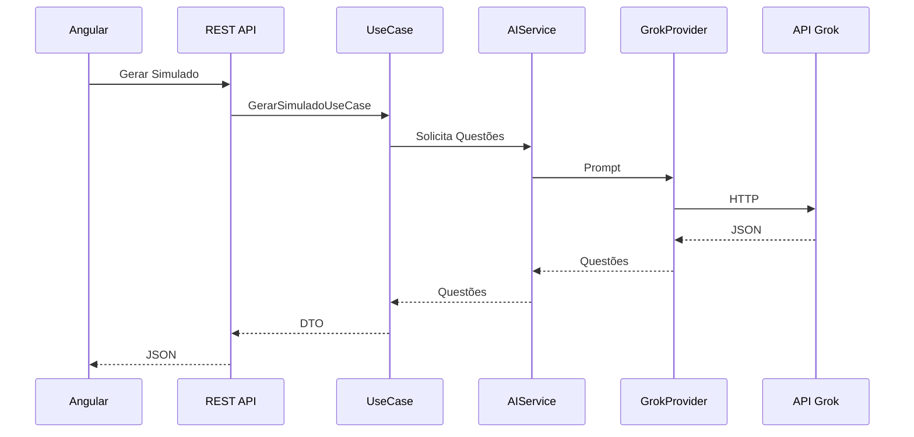

---

# Checklist

Antes de publicar qualquer endpoint verificar.

- [ ] URL REST.
- [ ] Método HTTP correto.
- [ ] DTO utilizado.
- [ ] Entity não retornada.
- [ ] Validação.
- [ ] Documentação OpenAPI.
- [ ] Segurança.
- [ ] Testes.
- [ ] Logs.
- [ ] Tratamento de erros.

---

# ADR Relacionadas

| Código | Decisão |
|---------|----------|
| ADR-037 | Todas as APIs utilizarão `/api/v1` |
| ADR-038 | Apenas JSON será utilizado como formato padrão |
| ADR-039 | DTOs serão obrigatórios |
| ADR-040 | OpenAPI documentará todos os endpoints |
| ADR-041 | Toda autenticação utilizará JWT |
| ADR-042 | O backend será a única camada que acessará a IA |
| ADR-043 | Uploads utilizarão multipart/form-data |
| ADR-044 | Controllers nunca retornarão entidades JPA |

---

# Próximo Documento

```
docs/00-arquitetura/08-padroes-seguranca.md
```

Este documento definirá toda a estratégia de segurança do ConcursoAI: autenticação, autorização, JWT, criptografia, proteção contra ataques (SQL Injection, XSS, CSRF), upload seguro de arquivos, validação de entrada, auditoria, logs, gerenciamento de sessões, políticas de senhas, LGPD e demais práticas de segurança adotadas no sistema.

---
title: "08 - Padrões de Segurança"
version: "1.0.0"
status: "Aprovado"
project: "ConcursoAI"
author: "Marcos Bassetto"
created: "2026-08-07"
updated: "2026-08-07"
---

# Padrões de Segurança

## Objetivo

Definir todas as políticas de segurança do ConcursoAI.

A segurança deverá ser considerada desde o início do desenvolvimento (Security by Design).

Todo novo módulo deverá seguir obrigatoriamente este documento.

---

# Objetivos

- Proteger dados dos usuários.
- Proteger credenciais.
- Proteger arquivos enviados.
- Evitar ataques conhecidos.
- Minimizar exposição da infraestrutura.
- Garantir rastreabilidade das operações.
- Facilitar auditorias futuras.

---

# Princípios

- Least Privilege
- Defense in Depth
- Fail Secure
- Secure by Default
- Zero Trust
- Security by Design

---

# Arquitetura de Segurança

```text
Cliente

↓

Angular

↓

HTTPS

↓

Spring Security

↓

JWT Filter

↓

Authorization

↓

Controller

↓

Service

↓

Repository

↓

PostgreSQL
```

Toda requisição autenticada deverá passar obrigatoriamente pelo filtro JWT.

---

# Autenticação

Será utilizada autenticação baseada em JWT.

Fluxo:

```text
Login

↓

Validação

↓

JWT

↓

Bearer Token

↓

Authorization Header

↓

Spring Security
```

Não haverá autenticação por sessão (Session).

---

# Autorização

Perfis iniciais:

```text
ROLE_USER

ROLE_ADMIN
```

Preparar estrutura para futuras permissões mais granulares.

---

# JWT

Os tokens deverão conter apenas informações necessárias.

Exemplo:

- id do usuário;
- perfil;
- data de expiração.

Nunca armazenar:

- senha;
- e-mail completo;
- dados sensíveis.

---

# Expiração

Access Token:

15 minutos.

Refresh Token:

7 dias.

---

# Renovação

A renovação ocorrerá apenas através do endpoint específico de refresh.

Nunca renovar automaticamente em todas as requisições.

---

# Senhas

Obrigatório utilizar algoritmo de hash seguro.

Padrão:

```text
BCrypt
```

Nunca armazenar senha em texto puro.

---

# Política de Senhas

Requisitos mínimos:

- mínimo de 8 caracteres;
- letras maiúsculas;
- letras minúsculas;
- números;
- caractere especial (recomendado).

---

# Upload Seguro

Arquivos aceitos inicialmente:

```text
PDF
```

Validações obrigatórias:

- extensão;
- MIME Type;
- tamanho máximo;
- assinatura do arquivo (quando aplicável).

Nunca utilizar o nome original do arquivo como nome físico.

---

# Limite de Upload

Tamanho máximo inicial:

```text
20 MB
```

Arquivos maiores deverão ser rejeitados.

---

# Armazenamento de Arquivos

Os arquivos deverão ser armazenados fora da pasta pública da aplicação.

Nunca permitir acesso direto ao sistema de arquivos.

---

# SQL Injection

Obrigatório utilizar:

- Spring Data JPA;
- parâmetros nomeados;
- Prepared Statements.

Nunca concatenar SQL manualmente.

Exemplo incorreto:

```java
"SELECT * FROM usuario WHERE nome = '" + nome + "'"
```

---

# XSS

Todo conteúdo exibido ao usuário deverá ser escapado quando necessário.

Nunca renderizar HTML recebido da IA sem sanitização.

---

# CSRF

Como a aplicação utilizará JWT em APIs REST, o CSRF poderá permanecer desabilitado para os endpoints autenticados, conforme configuração adequada do Spring Security.

---

# CORS

Permitir apenas origens autorizadas.

Nunca utilizar:

```text
*
```

em produção.

---

# Headers de Segurança

Configurar:

- X-Content-Type-Options
- X-Frame-Options
- Referrer-Policy
- Content-Security-Policy
- Strict-Transport-Security (produção)

---

# HTTPS

Obrigatório em produção.

Nunca transmitir credenciais via HTTP.

---

# Logs de Segurança

Registrar eventos como:

- login;
- logout;
- falhas de autenticação;
- upload de arquivos;
- exclusão de concursos;
- exclusão de simulados;
- alterações administrativas.

Nunca registrar:

- senhas;
- tokens completos;
- dados pessoais desnecessários.

---

# Auditoria

Registrar:

- usuário;
- operação;
- data/hora;
- endereço IP (quando disponível);
- resultado da operação.

---

# Validação de Entrada

Toda entrada deverá ser validada em duas camadas:

- Frontend;
- Backend.

O backend será a fonte definitiva de validação.

---

# Proteção contra Enumeração

Mensagens de autenticação deverão ser genéricas.

Exemplo:

```text
Usuário ou senha inválidos.
```

Nunca informar se o usuário existe ou não.

---

# Rate Limiting

Preparar arquitetura para futura implementação.

Aplicação inicial:

- login;
- upload de edital;
- geração de simulados;
- chamadas para IA.

---

# Integração com IA

Toda comunicação ocorrerá apenas pelo backend.

Fluxo:

```text
Angular

↓

Spring Boot

↓

AIService

↓

Provider

↓

Grok
```

A chave da API nunca será enviada ao frontend.

---

# Armazenamento de Chaves

Credenciais deverão ser obtidas por:

- variáveis de ambiente;
- arquivos de configuração externos.

Nunca armazenar chaves no repositório Git.

---

# Banco de Dados

Utilizar usuário com privilégios mínimos.

Separar permissões administrativas das permissões da aplicação.

---

# Exclusão de Dados

Ao excluir um concurso:

- remover simulados associados;
- remover respostas;
- remover explicações;
- manter apenas estatísticas agregadas da banca quando permitido pela regra de negócio.

---

# Backup

Mesmo utilizando ambiente gratuito durante o desenvolvimento, o banco deverá permitir exportação periódica.

Documentar o procedimento de restauração.

---

# LGPD

Preparar a aplicação para:

- consentimento quando necessário;
- exclusão de dados pessoais;
- exportação de dados do usuário;
- minimização de coleta de informações.

---

# Dependências

Atualizar regularmente bibliotecas.

Evitar dependências sem manutenção.

---

# Monitoramento

Monitorar:

- tentativas de login;
- erros 401;
- erros 403;
- falhas de upload;
- falhas de integração com IA.

---

# Testes de Segurança

Realizar testes para:

- autenticação;
- autorização;
- upload;
- SQL Injection;
- XSS;
- CORS;
- JWT expirado;
- acesso sem autenticação.

---

# Diagrama de Segurança

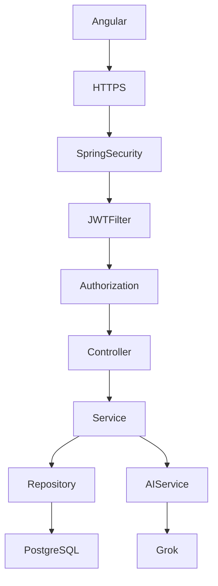

---

# Checklist

Antes de disponibilizar qualquer funcionalidade verificar:

- [ ] Endpoint protegido.
- [ ] Validação implementada.
- [ ] DTO utilizado.
- [ ] Upload validado.
- [ ] Logs adicionados.
- [ ] Exceções tratadas.
- [ ] Chaves fora do código.
- [ ] Sem informações sensíveis em respostas.
- [ ] Testes de segurança executados.

---

# ADR Relacionadas

| Código | Decisão |
|---------|----------|
| ADR-045 | JWT será o mecanismo oficial de autenticação |
| ADR-046 | BCrypt será utilizado para hash de senhas |
| ADR-047 | Apenas PDF será aceito no upload inicial |
| ADR-048 | Toda integração com IA ocorrerá exclusivamente pelo backend |
| ADR-049 | Credenciais nunca serão armazenadas no repositório |
| ADR-050 | Logs de segurança serão centralizados |

---

# Próximo Documento

```
docs/00-arquitetura/09-padroes-banco-de-dados.md
```

Este documento definirá toda a estratégia de persistência do ConcursoAI: modelagem do PostgreSQL, convenções de nomenclatura, entidades, relacionamentos, índices, migrações com Flyway, versionamento do banco, auditoria, desempenho, backup e preparação para futuras expansões.


---
title: "09 - Padrões de Banco de Dados"
version: "1.0.0"
status: "Aprovado"
project: "ConcursoAI"
author: "Marcos Bassetto"
created: "2026-08-07"
updated: "2026-08-07"
---

# Padrões de Banco de Dados

## Objetivo

Definir todas as regras de persistência de dados do ConcursoAI.

Este documento estabelece o padrão oficial para:

- PostgreSQL
- Spring Data JPA
- Flyway
- Modelagem
- Versionamento
- Auditoria
- Performance
- Backup

Todos os módulos deverão seguir este padrão.

---

# Banco Utilizado

PostgreSQL

Versão mínima recomendada:

```
16
```

Durante o desenvolvimento poderá ser utilizado PostgreSQL local.

Em produção qualquer serviço compatível poderá ser utilizado.

---

# Ferramenta de Migração

Flyway

Todas as alterações estruturais deverão ocorrer exclusivamente através de migrations.

Nunca alterar o banco manualmente.

---

# Estrutura de Migrations

```
src/main/resources/db/migration
```

Exemplo:

```
V1__create_usuario.sql

V2__create_concurso.sql

V3__create_edital.sql

V4__create_materia.sql
```

Nunca alterar migrations já executadas.

Sempre criar uma nova versão.

---

# Convenção de Nomes

## Tabelas

Sempre no singular.

Exemplos

```
usuario

concurso

edital

materia

questao
```

---

## Colunas

snake_case

Exemplo

```
nome

email

created_at

updated_at

usuario_id
```

---

## Primary Key

Toda tabela possuirá

```
id BIGSERIAL
```

ou

```
UUID
```

### Decisão Arquitetural

Inicialmente será utilizado:

```
BIGSERIAL
```

pela simplicidade.

O projeto deverá permitir migração futura para UUID.

---

# Foreign Keys

Sempre nomeadas.

Exemplo

```
fk_materia_concurso

fk_topico_materia

fk_simulado_usuario
```

---

# Índices

Sempre nomeados.

Exemplo

```
idx_usuario_email

idx_concurso_nome

idx_questao_banca
```

---

# Constraints

Sempre nomeadas.

Exemplo

```
uk_usuario_email

ck_status_simulado
```

---

# Auditoria

Todas as tabelas principais possuirão:

```
created_at

updated_at
```

Quando necessário:

```
created_by

updated_by
```

---

# Exclusão

Sempre preferir Soft Delete quando fizer sentido.

Campo padrão:

```
deleted
```

tipo:

```
boolean
```

ou

```
deleted_at
```

quando for necessário manter histórico.

---

# Enumerações

Sempre armazenar como texto.

Exemplo

```
ADMIN

USER

FINALIZADO

EM_ANDAMENTO
```

Nunca utilizar ordinal.

---

# Datas

Sempre utilizar

```
TIMESTAMP WITH TIME ZONE
```

No Java:

```
OffsetDateTime
```

ou

```
Instant
```

---

# Valores Monetários

Caso existam no futuro:

```
NUMERIC(18,2)
```

Nunca utilizar FLOAT.

---

# Textos Longos

Utilizar

```
TEXT
```

---

# JSON

Quando necessário utilizar:

```
JSONB
```

Exemplos:

- Prompt enviado para IA
- Resposta completa da IA
- Configurações dinâmicas
- Metadados

---

# Relacionamentos

Priorizar:

```
OneToMany

ManyToOne
```

Evitar:

```
ManyToMany
```

Sempre criar tabela intermediária quando necessário.

---

# Lazy Loading

Padrão:

```
LAZY
```

Evitar EAGER.

---

# Cascade

Utilizar apenas quando realmente necessário.

Nunca utilizar ALL por padrão.

---

# Versionamento de Entidades

Sempre utilizar:

```java
@Version
```

quando houver risco de concorrência.

---

# Integridade Referencial

Toda FK deverá possuir constraint.

Nunca deixar referências órfãs.

---

# Índices Obrigatórios

Criar índices para:

- Foreign Keys
- Colunas de busca frequente
- Login
- Concurso
- Matéria
- Questão
- Simulado

---

# Pesquisa

Sempre utilizar paginação.

Nunca retornar milhares de registros.

---

# Paginação

Padrão Spring:

```java
Pageable
```

---

# Ordenação

Sempre definida pelo backend.

---

# N+1 Problem

Evitar utilizando:

- JOIN FETCH
- EntityGraph
- Projeções
- DTOs

---

# DTOs

Nunca retornar Entity diretamente.

Fluxo:

```
Entity

↓

Mapper

↓

DTO

↓

Controller
```

---

# Transações

Utilizar:

```java
@Transactional
```

Apenas na camada de Service/UseCase.

Nunca em Controllers.

---

# Performance

Monitorar:

- tempo das consultas
- índices não utilizados
- consultas lentas
- locks

---

# Backup

Estratégia mínima:

- backup diário
- exportação SQL
- restauração testada periodicamente

Mesmo em ambiente gratuito, documentar o processo.

---

# Segurança

Nunca armazenar:

- senhas em texto
- tokens completos
- chaves da IA
- segredos

---

# Banco da IA

As informações relacionadas à IA deverão possuir tabelas próprias.

Exemplo:

```
ai_prompt

ai_response

ai_log
```

Essas tabelas permitirão:

- auditoria
- reprocessamento
- análise de custos
- melhoria dos prompts

---

# Banco de Questões

Modelo inicial:

```
Concurso

↓

Matéria

↓

Tópico

↓

Questão

↓

Alternativa
```

Questões geradas pela IA deverão ser identificadas.

Campo sugerido:

```
origem

Banca

IA

Manual
```

---

# Banco de Simulados

Modelo:

```
Simulado

↓

SimuladoQuestao

↓

RespostaUsuario

↓

ExplicacaoIA
```

---

# Banco de Usuários

Modelo:

```
Usuario

↓

Perfil

↓

Permissao
```

Preparado para futuras expansões.

---

# Banco de Estatísticas

Criar estrutura para armazenar:

- desempenho por matéria
- desempenho por banca
- evolução do aluno
- tempo médio de resolução
- percentual de acertos

Essas informações não deverão ser apagadas quando um simulado for removido, salvo solicitação explícita do usuário.

---

# Diagrama Conceitual

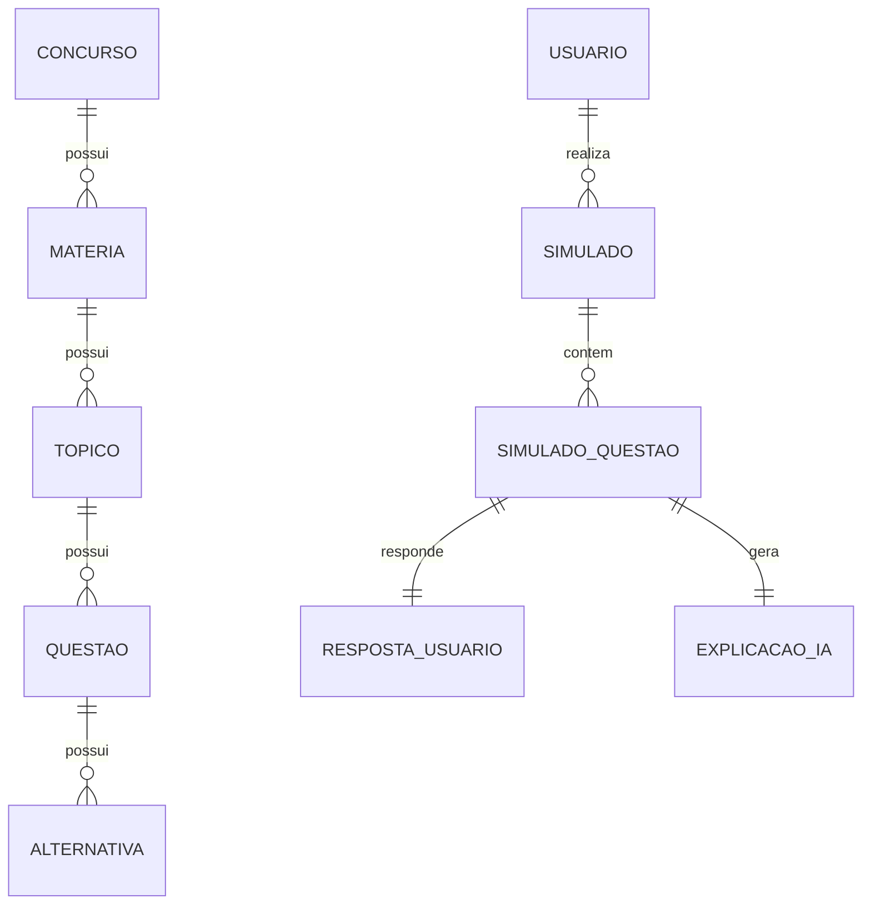

---

# Checklist

Antes de criar uma nova tabela verificar:

- [ ] Nome no singular.
- [ ] PK definida.
- [ ] FKs nomeadas.
- [ ] Índices criados.
- [ ] Campos de auditoria.
- [ ] Migration criada.
- [ ] Entity correspondente.
- [ ] Repository correspondente.
- [ ] DTO definido.
- [ ] Testes preparados.

---

# ADR Relacionadas

| Código | Decisão |
|---------|----------|
| ADR-051 | PostgreSQL será o banco oficial do projeto |
| ADR-052 | Flyway será obrigatório para migrations |
| ADR-053 | Tabelas utilizarão nomenclatura em singular |
| ADR-054 | Colunas utilizarão snake_case |
| ADR-055 | Todas as FKs serão nomeadas |
| ADR-056 | JSONB será utilizado para dados semiestruturados |
| ADR-057 | Todas as consultas públicas utilizarão paginação |
| ADR-058 | Entities nunca serão expostas pela API |

---

# Próximo Documento

```
docs/00-arquitetura/10-padroes-inteligencia-artificial.md
```

Este documento definirá toda a arquitetura da Inteligência Artificial do ConcursoAI: integração com Grok, abstração de provedores, engenharia de prompts, RAG, armazenamento de contexto, cache, controle de limites gratuitos, auditoria de respostas, tratamento de falhas, desacoplamento da IA do domínio e preparação para suportar múltiplos provedores no futuro sem alterar as regras de negócio.


---
title: "10 - Padrões de Inteligência Artificial"
version: "1.0.0"
status: "Aprovado"
project: "ConcursoAI"
author: "Marcos Bassetto"
created: "2026-08-07"
updated: "2026-08-07"
---

# Padrões de Inteligência Artificial

## Objetivo

Definir toda a arquitetura responsável pela integração da Inteligência Artificial do ConcursoAI.

A IA será utilizada apenas como apoio às regras de negócio.

Toda comunicação deverá ocorrer exclusivamente através do backend.

O frontend nunca acessará diretamente qualquer provedor de IA.

---

# Objetivos da IA

A IA será responsável por:

- interpretar editais;
- identificar matérias;
- identificar tópicos;
- estruturar o conteúdo programático;
- gerar simulados;
- corrigir respostas;
- explicar resoluções;
- resumir conteúdos;
- sugerir novos estudos;
- auxiliar futuras funcionalidades.

---

# Princípios

- Desacoplamento
- Baixo custo
- Independência de provedor
- Reprodutibilidade
- Auditoria
- Observabilidade
- Facilidade de testes

---

# Arquitetura

```text
Angular

↓

REST API

↓

Use Case

↓

AIService

↓

AIProvider

↓

GrokProvider

↓

API Grok
```

O domínio nunca conhecerá detalhes da implementação do provedor.

---

# Camadas

## Domain

Nunca acessa IA.

---

## Application

Define os casos de uso.

---

## AI Module

Responsável pela comunicação com provedores.

---

## Infrastructure

Implementa chamadas HTTP.

---

# Interface Principal

```java
public interface AIProvider {

    AIResponse processarEdital(AIRequest request);

    AIResponse gerarSimulado(AIRequest request);

    AIResponse corrigirSimulado(AIRequest request);

    AIResponse explicarQuestao(AIRequest request);

}
```

Nenhum caso de uso utilizará diretamente o Grok.

---

# AIService

O AIService será o ponto único de acesso à IA.

Responsabilidades:

- montar prompts;
- validar respostas;
- controlar erros;
- registrar auditoria;
- aplicar cache quando necessário;
- escolher o provider configurado.

---

# Provider Inicial

Inicialmente:

```
Grok
```

A arquitetura permitirá adicionar novos provedores sem alterar os casos de uso.

Exemplos futuros:

- OpenAI
- Claude
- Gemini
- Ollama (modelo local)
- OpenRouter

---

# Seleção do Provider

No MVP haverá apenas um provider ativo.

A escolha será feita por configuração da aplicação.

O usuário final não escolherá o modelo.

---

# Engenharia de Prompts

Cada operação possuirá um prompt próprio.

Exemplos:

```
PROMPT_PROCESSAR_EDITAL

PROMPT_GERAR_SIMULADO

PROMPT_CORRIGIR

PROMPT_EXPLICAR
```

Os prompts deverão ser versionados.

Nunca escrever prompts diretamente dentro dos Controllers ou Services.

---

# Estrutura dos Prompts

Todo prompt deverá conter:

- contexto;
- objetivo;
- restrições;
- formato esperado;
- exemplo de saída (quando aplicável).

---

# Formato de Resposta

Sempre solicitar respostas estruturadas.

Preferencialmente:

```json
{
  "materias": [],
  "topicos": []
}
```

ou

```json
{
  "questoes": []
}
```

Evitar respostas em texto livre quando a informação precisar ser processada pelo sistema.

---

# Operações Suportadas

## Processar Edital

Entrada:

- texto extraído do PDF.

Saída:

- matérias;
- tópicos;
- observações.

---

## Gerar Simulado

Entrada:

- matéria;
- tópicos;
- banca;
- quantidade de questões.

Saída:

- lista de questões.

---

## Corrigir Simulado

Entrada:

- questões;
- respostas do usuário.

Saída:

- resultado;
- explicações.

---

## Explicar Questão

Entrada:

- questão;
- alternativa correta;
- resposta do usuário.

Saída:

- explicação passo a passo.

---

# Tratamento de Falhas

Se a IA falhar:

- registrar erro;
- registrar tempo;
- retornar mensagem amigável ao usuário;
- permitir nova tentativa.

Nenhuma exceção do provedor deverá chegar ao frontend.

---

# Timeout

Tempo máximo:

60 segundos.

Após esse tempo a requisição deverá ser cancelada.

---

# Retry

Inicialmente:

- até 2 tentativas.

Com intervalo crescente entre elas.

---

# Cache

Utilizar cache apenas quando o resultado puder ser reutilizado.

Exemplos:

- análise de edital;
- explicações idênticas.

Nunca utilizar cache para respostas personalizadas do usuário.

---

# Auditoria

Registrar:

- operação;
- data;
- duração;
- sucesso ou falha.

Não armazenar dados sensíveis desnecessariamente.

---

# Custos

A arquitetura deverá permitir controlar facilmente o consumo de IA.

Durante o desenvolvimento:

- priorizar operações gratuitas;
- evitar chamadas duplicadas;
- reutilizar resultados quando possível.

---

# Segurança

A chave de acesso ao provedor deverá permanecer apenas no backend.

Nunca enviar tokens ou chaves para o Angular.

---

# Configuração

Exemplo de propriedades:

```properties
ai.provider=grok

ai.timeout=60

ai.retry=2
```

---

# Testes

Os testes unitários não deverão depender da IA real.

Utilizar implementações simuladas (mocks ou stubs) do `AIProvider`.

---

# Diagramas

## Arquitetura

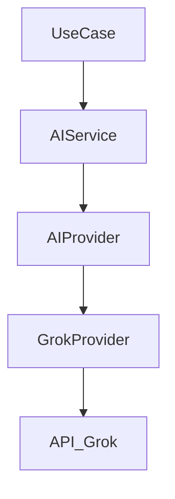

---

## Sequência

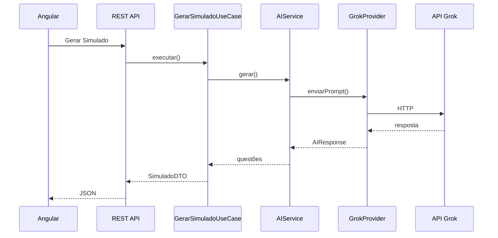

---

# Checklist

Antes de adicionar uma nova funcionalidade baseada em IA verificar:

- [ ] Existe um caso de uso específico.
- [ ] O prompt está versionado.
- [ ] O formato de saída está definido.
- [ ] O retorno é estruturado.
- [ ] Há tratamento de falhas.
- [ ] Há timeout configurado.
- [ ] Há testes com provider simulado.
- [ ] O domínio permanece desacoplado.

---

# ADR Relacionadas

| Código | Decisão |
|---------|----------|
| ADR-059 | O backend será o único responsável por acessar a IA |
| ADR-060 | O domínio não conhecerá provedores de IA |
| ADR-061 | Todos os prompts serão versionados |
| ADR-062 | As respostas da IA deverão ser estruturadas sempre que possível |
| ADR-063 | O provider será configurável |
| ADR-064 | O MVP utilizará apenas um provider ativo (Grok) |

---

# Próximo Documento

```
docs/00-arquitetura/11-padroes-testes.md
```

Este documento definirá a estratégia completa de testes do ConcursoAI: testes unitários, integração, arquitetura, contratos REST, validações, segurança, persistência, testes dos casos de uso, cobertura mínima, organização das classes de teste e uso de mocks para a camada de IA.


---
title: "11 - Padrões de Testes"
version: "1.0.0"
status: "Aprovado"
project: "ConcursoAI"
author: "Marcos Bassetto"
created: "2026-08-10"
updated: "2026-08-10"
---

# Padrões de Testes

## 1. Objetivo

Este documento define a estratégia oficial de testes do ConcursoAI.

O objetivo é garantir que o sistema:

- funcione conforme os requisitos;
- mantenha segurança;
- preserve as regras de negócio;
- tenha comportamento previsível;
- possa evoluir sem introduzir regressões;
- possa ser executado gratuitamente durante o desenvolvimento;
- não dependa de serviços externos para os testes automatizados.

---

# 2. Princípios

Os testes deverão seguir os seguintes princípios:

- testes automatizados sempre que possível;
- testes rápidos durante o desenvolvimento;
- isolamento das unidades;
- testes de integração para componentes que realmente precisam de integração;
- testes de segurança;
- testes das regras de negócio;
- testes das APIs;
- testes das operações de IA sem depender da IA real;
- testes reproduzíveis;
- testes executáveis localmente.

---

# 3. Pirâmide de Testes

A estratégia seguirá aproximadamente:

```text
                 /\
                /  \
               / E2E\
              /------\
             /        \
            /Integração\
           /------------\
          /              \
         /    Unitários   \
        /__________________\
```

A maior quantidade de testes será unitária.

Depois:

- integração;
- API;
- segurança;
- E2E.

---

# 4. Tipos de Testes

O projeto utilizará:

- testes unitários;
- testes de integração;
- testes de API;
- testes de persistência;
- testes de segurança;
- testes de arquitetura;
- testes de contrato;
- testes de frontend;
- testes end-to-end;
- testes de regressão;
- testes de carga;
- testes da integração com IA.

---

# 5. Testes Unitários

Testes unitários deverão validar uma unidade isoladamente.

Exemplos:

```text
UseCase
Service
Domain
Validator
Mapper
Factory
```

Não deverão depender de:

- banco real;
- API externa;
- Grok;
- rede.

---

# 6. Estrutura

Os testes deverão acompanhar a estrutura do código.

Exemplo:

```text
src/main/java/

br/com/marcosbassetto/concursos/
    application/
        usecase/
            GerarSimuladoUseCase.java
```

Teste:

```text
src/test/java/

br/com/marcosbassetto/concursos/
    application/
        usecase/
            GerarSimuladoUseCaseTest.java
```

---

# 7. Convenção de Nomes

Formato:

```text
ClasseTest
```

Exemplo:

```text
GerarSimuladoUseCaseTest
```

Métodos deverão descrever o comportamento testado.

Exemplo:

```java
deveGerarSimuladoQuandoMateriaPossuirTopicos()
```

---

# 8. Estrutura do Teste

Utilizar o padrão:

```text
Given

When

Then
```

ou:

```text
Arrange

Act

Assert
```

Exemplo conceitual:

```java
@Test
void deveGerarSimuladoParaMateriaValida() {

    // Given

    // When

    // Then
}
```

---

# 9. JUnit

Framework principal:

```text
JUnit 5
```

Utilizar:

```java
@Test
@BeforeEach
@AfterEach
@Nested
@DisplayName
```

quando necessário.

---

# 10. Mockito

Utilizar Mockito para dependências externas.

Exemplo:

```java
@Mock
private AIProvider aiProvider;
```

---

# 11. Regra Importante sobre IA

Os testes unitários **nunca deverão depender da API real do Grok**.

Isso evita:

- consumo desnecessário;
- indisponibilidade externa;
- lentidão;
- resultados diferentes;
- dependência de internet.

Fluxo:

```text
Teste

↓

Mock AIProvider

↓

Resposta simulada

↓

UseCase
```

---

# 12. Fake AI Provider

Criar uma implementação para testes.

Exemplo:

```java
FakeAIProvider
```

Ela poderá retornar respostas previamente definidas.

Exemplo:

```text
PROCESSAR_EDITAL

↓

JSON conhecido
```

---

# 13. Testes do Processamento do Edital

Deverão testar:

- PDF válido;
- PDF vazio;
- PDF sem conteúdo programático;
- conteúdo inválido;
- múltiplas matérias;
- tópicos duplicados;
- matérias duplicadas;
- resposta inválida da IA;
- JSON incompleto.

---

# 14. Testes de Geração de Simulado

Testar:

- matéria válida;
- matéria inexistente;
- quantidade válida;
- quantidade inválida;
- ausência de tópicos;
- banca informada;
- resposta válida da IA;
- resposta inválida da IA;
- erro do provider.

---

# 15. Testes de Correção

Testar:

- resposta correta;
- resposta incorreta;
- questão anulada;
- questão sem resposta;
- simulado inexistente;
- respostas duplicadas.

---

# 16. Testes de Explicação

Testar:

- questão válida;
- resposta correta;
- resposta incorreta;
- explicação válida;
- resposta inválida da IA;
- timeout;
- erro do provider.

---

# 17. Testes de Domínio

As regras de negócio deverão ser testadas sem Spring quando possível.

Exemplos:

```text
Questao
Simulado
Materia
Concurso
Resposta
```

---

# 18. Testes de Repository

Os repositories deverão possuir testes específicos para:

- consultas;
- filtros;
- paginação;
- relacionamentos;
- constraints.

---

# 19. Testes com PostgreSQL

Para testes de integração, o projeto deverá preferir um banco PostgreSQL real ou uma infraestrutura equivalente ao banco utilizado em produção.

Evitar substituir PostgreSQL por outro banco apenas para testes quando isso puder esconder diferenças de comportamento.

---

# 20. Testcontainers

Quando possível, utilizar:

```text
Testcontainers
```

para subir PostgreSQL automaticamente durante testes de integração.

Exemplo conceitual:

```text
Teste

↓

Container PostgreSQL

↓

Flyway

↓

Banco de teste

↓

Repository
```

Isso mantém o ambiente reproduzível.

---

# 21. Testes de Migration

Toda migration deverá ser validada.

Verificar:

- criação;
- atualização;
- constraints;
- índices;
- relacionamentos.

---

# 22. Testes de API

Os endpoints deverão ser testados através do contexto Spring.

Utilizar:

```text
MockMvc
```

ou tecnologia equivalente.

Testar:

- status HTTP;
- JSON;
- validação;
- autenticação;
- autorização;
- mensagens de erro.

---

# 23. Testes de Autenticação

Testar:

```text
Login válido
Login inválido
Token expirado
Token inválido
Token ausente
```

---

# 24. Testes de Autorização

Testar:

```text
USER → recurso permitido

USER → recurso proibido

ADMIN → recurso administrativo
```

---

# 25. Testes de Upload

Testar:

- PDF válido;
- arquivo vazio;
- arquivo muito grande;
- extensão inválida;
- MIME Type inválido;
- arquivo corrompido;
- nome malicioso;
- conteúdo inesperado.

---

# 26. Testes contra SQL Injection

Testar entradas contendo padrões potencialmente perigosos.

Exemplo:

```text
' OR 1=1 --
```

O sistema deverá tratar a entrada como dado.

Nunca como comando SQL.

---

# 27. Testes contra XSS

Testar entradas contendo:

```html
<script>alert('teste')</script>
```

O conteúdo não deverá ser executado no navegador.

---

# 28. Testes de CORS

Validar:

- origem permitida;
- origem não permitida;
- métodos permitidos;
- headers permitidos.

---

# 29. Testes de JWT

Testar:

```text
JWT válido
JWT expirado
JWT adulterado
JWT sem assinatura
JWT com usuário inexistente
```

---

# 30. Testes de Arquitetura

Utilizar ferramentas como:

```text
ArchUnit
```

quando necessário.

Objetivo:

Impedir violações arquiteturais.

Exemplos:

```text
Domain
não pode depender de Infrastructure
```

```text
Controller
não pode acessar Repository diretamente
```

```text
Domain
não pode depender de Spring
```

---

# 31. Regras Arquiteturais Testáveis

Deverá ser garantido:

```text
Controller
    ↓
UseCase
    ↓
Repository Interface
    ↓
Infrastructure
```

Nunca:

```text
Controller
    ↓
Repository
```

---

# 32. Testes de DTO

Validar:

- campos obrigatórios;
- tamanho;
- formato;
- valores mínimos;
- valores máximos.

---

# 33. Testes de Mapper

Testar:

```text
Entity → DTO

DTO → Entity
```

Garantindo que os campos importantes sejam preservados.

---

# 34. Testes de Paginação

Validar:

- primeira página;
- página intermediária;
- página vazia;
- tamanho máximo;
- ordenação.

---

# 35. Testes de Concorrência

Quando aplicável, testar:

- edição simultânea;
- exclusão simultânea;
- geração duplicada de simulado;
- submissão duplicada de respostas.

---

# 36. Testes de Idempotência

Operações que deveriam ser idempotentes deverão ser executadas repetidamente.

Exemplo:

```text
DELETE /concursos/10
```

A segunda execução não deverá causar inconsistência.

---

# 37. Testes de Transação

Validar rollback.

Exemplo:

```text
Criar Simulado

↓

Salvar questões

↓

Erro

↓

Rollback
```

O banco não deverá ficar parcialmente gravado.

---

# 38. Testes de Integração

Deverão validar a interação entre:

```text
Controller

↓

UseCase

↓

Repository

↓

PostgreSQL
```

---

# 39. Testes de Contrato

Os contratos REST deverão ser estáveis.

Validar:

- campos;
- tipos;
- códigos HTTP;
- estrutura JSON.

---

# 40. Testes End-to-End

Os principais fluxos deverão possuir testes E2E.

Fluxo principal:

```text
Login

↓

Criar concurso

↓

Enviar edital

↓

Processar edital

↓

Selecionar matéria

↓

Gerar simulado

↓

Responder

↓

Corrigir

↓

Visualizar explicação
```

---

# 41. Testes do Frontend

Angular deverá testar:

- componentes;
- services;
- guards;
- interceptors;
- formulários;
- rotas.

---

# 42. Testes de Interface

Validar:

- botões;
- formulários;
- mensagens;
- carregamento;
- erros;
- navegação.

---

# 43. Testes de Responsividade

Validar pelo menos:

```text
Desktop

Tablet

Mobile
```

---

# 44. Testes de Acessibilidade

Verificar:

- navegação por teclado;
- labels;
- contraste;
- foco;
- textos alternativos;
- semântica HTML.

---

# 45. Testes de Performance

Testar:

- tempo de resposta;
- consultas;
- paginação;
- upload;
- geração de simulados.

---

# 46. Testes de IA

A IA deverá ser testada em dois níveis.

## Nível 1 — Determinístico

Utilizar:

```text
Mock
Fake
Stub
```

Resultado previsível.

---

## Nível 2 — Integração

Executado manualmente ou em ambiente controlado.

Utiliza o provider real.

Esses testes não deverão fazer parte obrigatória de cada build.

---

# 47. Testes de Resposta da IA

Validar:

```text
JSON válido

Campos obrigatórios

Quantidade de questões

Alternativas

Gabarito

Explicação
```

---

# 48. IA com Resposta Inválida

Se a IA retornar:

```text
texto livre
```

quando o sistema espera JSON, o sistema deverá:

```text
Detectar

↓

Registrar

↓

Tentar recuperação

↓

Se falhar

↓

Retornar erro controlado
```

---

# 49. Testes de Timeout da IA

Simular:

```text
Provider

↓

Timeout
```

O sistema deverá:

- cancelar operação;
- registrar erro;
- informar o usuário;
- permitir nova tentativa.

---

# 50. Testes de Retry

Simular:

```text
Tentativa 1 → falha

Tentativa 2 → sucesso
```

Verificar se o sistema retorna corretamente.

---

# 51. Testes de Cache da IA

Validar:

```text
Primeira solicitação

↓

IA

↓

Cache

↓

Segunda solicitação

↓

Cache
```

O segundo processamento não deverá chamar a IA novamente quando o cache for válido.

---

# 52. Dados Sensíveis

Os testes nunca deverão utilizar:

- senhas reais;
- tokens reais;
- chaves reais;
- dados pessoais reais;
- chaves do Grok.

Utilizar dados fictícios.

---

# 53. Ambiente de Teste

O ambiente de teste deverá ser isolado.

Exemplo:

```text
application-test.properties
```

ou:

```text
application-test.yml
```

---

# 54. Configuração

Exemplo:

```properties
spring.profiles.active=test
```

---

# 55. Dados de Teste

Utilizar fixtures.

Exemplos:

```text
UsuarioFixture

ConcursoFixture

MateriaFixture

QuestaoFixture

SimuladoFixture
```

---

# 56. Test Data Builder

Quando os objetos ficarem complexos, utilizar Builders.

Exemplo:

```java
QuestaoTestBuilder
```

---

# 57. Banco de Teste

Nunca executar testes contra o banco de produção.

Nunca utilizar dados reais durante testes automatizados.

---

# 58. Cobertura

A cobertura deverá ser utilizada como indicador.

Não será considerado objetivo simplesmente atingir:

```text
100%
```

O objetivo é cobrir principalmente:

- regras de negócio;
- segurança;
- casos de erro;
- integrações críticas.

---

# 59. Cobertura Inicial

Meta inicial:

```text
80% das regras de negócio
```

A meta poderá ser aumentada conforme o projeto amadurecer.

---

# 60. Testes Obrigatórios

Toda nova funcionalidade deverá possuir:

- teste unitário;
- teste de integração quando aplicável;
- teste de API quando houver endpoint;
- teste de segurança quando houver alteração de autorização;
- teste de regressão quando necessário.

---

# 61. Testes Antes do Commit

Executar:

```bash
./gradlew test
```

No Windows:

```powershell
.\gradlew.bat test
```

---

# 62. Testes Antes do Push

Executar:

```powershell
.\gradlew.bat clean test
```

---

# 63. CI

O pipeline deverá executar automaticamente:

```text
Checkout

↓

Build

↓

Testes

↓

Análise

↓

Resultado
```

---

# 64. Falha de Testes

Se qualquer teste obrigatório falhar:

```text
Build = FAILED
```

O código não deverá ser considerado pronto para integração.

---

# 65. Testes e Desenvolvimento Gratuito

Todos os testes deverão poder ser executados localmente sem depender de serviços pagos.

Especialmente:

- PostgreSQL;
- IA;
- APIs externas.

A IA real será utilizada apenas em testes específicos de integração.

---

# 66. Estratégia de Testes da IA

```text
Desenvolvimento

↓

FakeAIProvider

↓

Testes Unitários
```

```text
Integração

↓

GrokProvider

↓

Teste Controlado
```

---

# 67. Diagrama da Estratégia

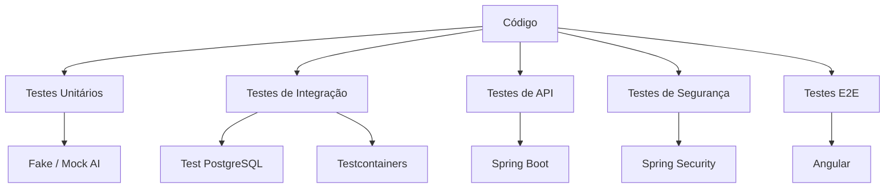

---

# 68. Estrutura de Testes

Estrutura inicial:

```text
src
├── main
│   └── java
│
└── test
    └── java
        └── br
            └── com
                └── marcosbassetto
                    └── concursos
```

À medida que os pacotes forem criados, os testes deverão acompanhar a mesma estrutura.

---

# 69. Organização Futura

Exemplo:

```text
src/test/java/
└── br/com/marcosbassetto/concursos/
    ├── domain/
    ├── application/
    ├── infrastructure/
    └── interfaces/
```

---

# 70. Checklist de Nova Funcionalidade

Antes de considerar uma funcionalidade concluída:

- [ ] Regra de negócio testada.
- [ ] Casos de erro testados.
- [ ] Validação testada.
- [ ] Repository testado quando necessário.
- [ ] Endpoint testado quando aplicável.
- [ ] Segurança testada.
- [ ] IA simulada quando utilizada.
- [ ] Teste de integração criado quando necessário.
- [ ] Testes executados localmente.
- [ ] Nenhuma dependência paga necessária para testar.

---

# 71. Checklist de Release

Antes de uma release:

- [ ] Todos os testes passaram.
- [ ] Testes de integração passaram.
- [ ] Testes de segurança passaram.
- [ ] Testes E2E principais passaram.
- [ ] Migrations testadas.
- [ ] Build executado.
- [ ] Dependências verificadas.
- [ ] Configurações revisadas.
- [ ] Nenhuma credencial no código.
- [ ] Nenhum dado de teste em produção.

---

# 72. ADR Relacionadas

| Código | Decisão |
|---|---|
| ADR-065 | JUnit 5 será utilizado nos testes Java |
| ADR-066 | Mockito será utilizado para mocks |
| ADR-067 | Testes de IA não dependerão do provider real |
| ADR-068 | Testcontainers poderá ser utilizado para PostgreSQL |
| ADR-069 | Testes automatizados deverão executar localmente |
| ADR-070 | Testes não poderão utilizar credenciais reais |
| ADR-071 | Testes de segurança serão obrigatórios para funcionalidades críticas |
| ADR-072 | Cobertura será indicador e não objetivo isolado |
| ADR-073 | O build deverá falhar quando testes obrigatórios falharem |

---

# 73. Próximo Documento

```text
docs/00-arquitetura/12-padroes-devops-infraestrutura.md
```

O próximo documento definirá:

- ambiente de desenvolvimento;
- Gradle;
- Docker;
- Docker Compose;
- PostgreSQL local;
- configuração por ambiente;
- variáveis de ambiente;
- CI/CD;
- build;
- deploy;
- logs;
- monitoramento;
- observabilidade;
- infraestrutura gratuita;
- ambiente de desenvolvimento;
- ambiente de testes;
- ambiente de homologação;
- ambiente de produção;
- estratégia para manter o projeto com custo zero durante o desenvolvimento e uso pequeno.

# 12 - APIs e Integrações

## 12.1 Objetivo

Este capítulo define a arquitetura das APIs do Sistema de Estudos para Concursos, estabelecendo como o Angular, o Backend, o PostgreSQL e os serviços de Inteligência Artificial irão se comunicar.

As APIs deverão ser:

- simples;
- seguras;
- versionáveis;
- documentadas;
- testáveis;
- independentes de fornecedor de IA;
- compatíveis com a proposta de desenvolvimento e utilização gratuita com poucos usuários.

---

## 12.2 Arquitetura de Comunicação

A comunicação principal será baseada em HTTP/HTTPS utilizando REST e JSON.

```text
┌──────────────────────┐
│      Angular         │
│      Front-end       │
└──────────┬───────────┘
           │ HTTPS / JSON
           ▼
┌──────────────────────┐
│    Spring Boot       │
│       REST API       │
└──────┬─────────┬─────┘
       │         │
       │         ▼
       │   ┌──────────────┐
       │   │ Provedor IA  │
       │   └──────────────┘
       │
       ▼
┌──────────────────────┐
│     PostgreSQL       │
└──────────────────────┘
```

O Angular nunca deverá acessar diretamente o PostgreSQL.

O Angular também nunca deverá possuir credenciais do provedor de IA.

---

## 12.3 Princípios REST

As APIs deverão seguir os princípios REST:

- utilização adequada dos métodos HTTP;
- recursos identificados por URL;
- comunicação stateless;
- respostas em JSON;
- códigos HTTP apropriados;
- versionamento;
- validação de entrada;
- tratamento padronizado de erros.

---

## 12.4 Versionamento

A primeira versão será:

```text
/api/v1
```

Exemplos:

```text
/api/v1/auth
/api/v1/usuarios
/api/v1/concursos
/api/v1/materias
/api/v1/simulados
/api/v1/questoes
/api/v1/ia
```

O versionamento deverá permitir evolução futura sem quebrar clientes existentes.

---

## 12.5 Padrão de URL

As URLs deverão utilizar substantivos e não ações.

Preferir:

```text
GET /api/v1/concursos
```

Em vez de:

```text
GET /api/v1/getConcursos
```

Para recursos específicos:

```text
GET /api/v1/concursos/{concursoId}
```

---

## 12.6 Métodos HTTP

### GET

Consulta dados.

```text
GET /api/v1/concursos
```

### POST

Cria um recurso ou inicia uma operação.

```text
POST /api/v1/concursos
```

### PUT

Atualiza integralmente um recurso.

### PATCH

Atualiza parcialmente um recurso.

### DELETE

Remove um recurso.

```text
DELETE /api/v1/concursos/{id}
```

---

## 12.7 Códigos HTTP

Utilizar códigos apropriados.

| Código | Utilização |
|---|---|
| 200 | Operação concluída |
| 201 | Recurso criado |
| 202 | Processamento aceito/assíncrono |
| 204 | Operação concluída sem conteúdo |
| 400 | Requisição inválida |
| 401 | Não autenticado |
| 403 | Sem permissão |
| 404 | Recurso não encontrado |
| 409 | Conflito |
| 422 | Dados semanticamente inválidos |
| 429 | Limite de requisições excedido |
| 500 | Erro interno |
| 502 | Erro de serviço externo |
| 503 | Serviço temporariamente indisponível |

---

## 12.8 Formato de Resposta

Respostas simples poderão utilizar:

```json
{
  "id": "uuid",
  "nome": "Direito Constitucional"
}
```

Operações de coleção:

```json
{
  "content": [],
  "page": 0,
  "size": 20,
  "totalElements": 0,
  "totalPages": 0
}
```

---

## 12.9 Formato Padronizado de Erro

Todos os erros deverão seguir um formato comum.

```json
{
  "timestamp": "2026-08-10T12:00:00Z",
  "status": 400,
  "code": "VALIDATION_ERROR",
  "message": "Dados inválidos.",
  "path": "/api/v1/concursos"
}
```

Não retornar:

- stack trace;
- senha;
- token;
- API key;
- informações internas do banco.

---

## 12.10 Autenticação

Endpoints protegidos deverão utilizar autenticação baseada em JWT.

```text
Authorization: Bearer <JWT>
```

Fluxo:

```text
Angular
   │
   │ POST /auth/login
   ▼
Spring Security
   │
   ▼
JWT
   │
   ▼
Angular
```

---

## 12.11 API de Autenticação

### POST /api/v1/auth/register

Cria usuário.

### POST /api/v1/auth/login

Autentica usuário.

### POST /api/v1/auth/refresh

Renova sessão quando aplicável.

### POST /api/v1/auth/logout

Finaliza sessão no contexto definido pela aplicação.

---

## 12.12 API de Usuários

### GET /api/v1/usuarios/me

Retorna o usuário autenticado.

### PATCH /api/v1/usuarios/me

Atualiza informações permitidas.

### DELETE /api/v1/usuarios/me

Solicita exclusão da conta.

O backend deverá verificar a identidade do usuário pelo token, e não confiar em um `usuarioId` enviado pelo cliente.

---

## 12.13 API de Concursos

### GET /api/v1/concursos

Lista concursos do usuário.

### POST /api/v1/concursos

Cria um concurso.

### GET /api/v1/concursos/{id}

Consulta um concurso.

### PATCH /api/v1/concursos/{id}

Atualiza dados permitidos.

### DELETE /api/v1/concursos/{id}

Exclui um concurso de acordo com as regras de negócio.

---

## 12.14 Upload do Edital

Endpoint:

```text
POST /api/v1/concursos/{id}/edital
```

Content-Type:

```text
multipart/form-data
```

Entrada:

```text
arquivo: edital.pdf
```

Validações:

- extensão;
- MIME type;
- tamanho;
- assinatura;
- conteúdo;
- usuário;
- concurso.

---

## 12.15 Processamento do Edital

Endpoint:

```text
POST /api/v1/concursos/{id}/processamento-edital
```

Objetivo:

- extrair texto;
- identificar matérias;
- identificar tópicos;
- identificar sub tópicos;
- identificar informações relevantes;
- armazenar estrutura no banco.

Como o processamento poderá envolver IA, ele poderá ser assíncrono.

Resposta possível:

```json
{
  "processamentoId": "uuid",
  "status": "PROCESSANDO"
}
```

---

## 12.16 Consulta do Processamento

```text
GET /api/v1/processamentos/{id}
```

Resposta:

```json
{
  "id": "uuid",
  "status": "CONCLUIDO",
  "progresso": 100
}
```

Estados:

```text
PENDENTE
PROCESSANDO
CONCLUIDO
ERRO
CANCELADO
```

---

## 12.17 API de Matérias

### GET /api/v1/concursos/{id}/materias

Lista as matérias do concurso.

### GET /api/v1/materias/{id}

Consulta uma matéria.

### GET /api/v1/materias/{id}/topicos

Lista os tópicos da matéria.

A resposta deverá fornecer informações suficientes para o Angular montar o menu lateral.

---

## 12.18 API de Simulados

### POST /api/v1/materias/{id}/simulados

Solicita geração de simulado.

Entrada:

```json
{
  "quantidadeQuestoes": 20
}
```

A quantidade deverá ser limitada pelas regras de negócio.

---

## 12.19 Geração Assíncrona de Simulado

A geração de questões por IA poderá demorar mais que uma requisição HTTP normal.

Por isso:

```text
POST /simulados
        ↓
202 Accepted
        ↓
processamentoId
        ↓
GET /processamentos/{id}
```

Quando concluído:

```text
PROCESSAMENTO → SIMULADO
```

---

## 12.20 Consulta de Simulado

```text
GET /api/v1/simulados/{id}
```

Deverá retornar:

- identificação;
- matéria;
- questões;
- alternativas;
- ordem;
- status;
- quantidade.

Não deverá expor o gabarito antes da conclusão do simulado.

---

## 12.21 Respostas do Usuário

Endpoint:

```text
POST /api/v1/simulados/{id}/respostas
```

Exemplo:

```json
{
  "respostas": [
    {
      "questaoId": "uuid",
      "resposta": "B"
    },
    {
      "questaoId": "uuid",
      "resposta": "C"
    }
  ]
}
```

O backend deverá validar:

- se o simulado pertence ao usuário;
- se a questão pertence ao simulado;
- se a resposta é válida;
- se o simulado ainda pode ser respondido.

---

## 12.22 Correção do Simulado

Endpoint:

```text
POST /api/v1/simulados/{id}/correcao
```

O backend deverá:

1. verificar o usuário;
2. verificar o simulado;
3. comparar respostas;
4. calcular resultado;
5. solicitar explicações à IA quando necessário;
6. armazenar o resultado;
7. disponibilizar o resultado ao usuário.

---

## 12.23 Resultado

```text
GET /api/v1/simulados/{id}/resultado
```

Informações:

- total de questões;
- acertos;
- erros;
- percentual;
- questões;
- respostas;
- gabaritos;
- explicações.

---

## 12.24 API de Explicações

Endpoint:

```text
GET /api/v1/questoes/{id}/explicacao
```

Se já existir explicação armazenada, ela poderá ser reutilizada.

Isso reduz chamadas desnecessárias à IA.

---

## 12.25 Nova Explicação

Endpoint:

```text
POST /api/v1/questoes/{id}/explicacao
```

Entrada:

```json
{
  "tipo": "ALTERNATIVA",
  "solicitacao": "Explique de maneira mais simples."
}
```

A solicitação deverá possuir limite de tamanho.

---

## 12.26 API de Inteligência Artificial

A IA deverá permanecer atrás do backend.

Arquitetura:

```text
Angular
   ↓
REST API
   ↓
AI Service
   ↓
AI Provider
```

Nunca:

```text
Angular
   ↓
API do provedor de IA
```

---

## 12.27 Abstração do Provedor de IA

O backend deverá utilizar uma abstração semelhante a:

```java
public interface AIProvider {

    AIResponse generate(AIRequest request);

}
```

Implementações poderão ser criadas posteriormente.

Exemplo:

```text
AIProvider
├── GrokAIProvider
└── FutureAIProvider
```

A aplicação não deverá depender diretamente de uma classe específica do fornecedor.

---

## 12.28 Objetivo da Abstração

A abstração permite:

- trocar fornecedor;
- atualizar modelo;
- testar sem chamar IA;
- criar mock;
- utilizar diferentes modelos;
- implementar fallback futuro;
- reduzir acoplamento.

---

## 12.29 Uso Gratuito

A API não deverá assumir que chamadas de IA são ilimitadas.

Deverão existir configurações como:

```text
AI_ENABLED=true

AI_DAILY_LIMIT=...
AI_MAX_QUESTIONS=...
AI_MAX_INPUT_SIZE=...
AI_TIMEOUT=...
```

Os valores deverão ser configuráveis.

---

## 12.30 Controle de Consumo da IA

O backend poderá controlar:

```text
Usuário
  ↓
Limite diário
  ↓
Operação
  ↓
IA
```

Exemplo:

```text
10 análises de edital/dia
50 questões geradas/dia
20 explicações/dia
```

Os valores são parâmetros de configuração, não regras fixas da aplicação.

---

## 12.31 Cache de IA

Antes de chamar novamente a IA:

```text
Solicitação
   ↓
Existe resultado em cache?
   ├── SIM → reutiliza
   └── NÃO → chama IA
```

Isso ajuda a reduzir:

- requisições;
- tempo;
- processamento;
- consumo de limites gratuitos.

---

## 12.32 Idempotência

Operações que possam ser repetidas acidentalmente deverão possuir proteção contra duplicidade quando necessário.

Exemplo:

```text
POST /simulados
```

Se o usuário clicar duas vezes, não deverá necessariamente gerar dois simulados.

Poderá ser utilizado um identificador de idempotência.

---

## 12.33 Paginação

Listagens potencialmente grandes deverão possuir paginação.

Exemplo:

```text
GET /api/v1/concursos?page=0&size=20
```

Evitar endpoints que retornem milhares de registros sem limite.

---

## 12.34 Filtros

Quando necessário:

```text
GET /api/v1/questoes?materiaId=...&dificuldade=...
```

Os filtros deverão ser validados e limitados.

---

## 12.35 Ordenação

Exemplo:

```text
GET /api/v1/concursos?sort=criadoEm,desc
```

Somente campos permitidos deverão ser aceitos.

---

## 12.36 APIs Administrativas

Endpoints administrativos deverão exigir permissões específicas.

Exemplo:

```text
GET /api/v1/admin/usuarios
GET /api/v1/admin/auditoria
GET /api/v1/admin/configuracoes
```

Um usuário comum não deverá acessar essas APIs.

---

## 12.37 Exclusão de Dados

Endpoint:

```text
DELETE /api/v1/concursos/{id}
```

O backend deverá respeitar as regras de retenção:

```text
Dados específicos do concurso
        ↓
excluir

Perfil estatístico da banca
        ↓
preservar quando aplicável
```

A operação deverá ser transacional.

---

## 12.38 Webhooks

Webhooks não serão obrigatórios na primeira versão.

Poderão ser utilizados futuramente para:

- processamento externo;
- notificações;
- integrações;
- serviços assíncronos.

Qualquer webhook futuro deverá possuir:

- autenticação;
- assinatura;
- validação;
- proteção contra replay;
- logs.

---

## 12.39 Integrações Externas

A primeira versão deverá minimizar dependências externas.

Integrações previstas:

```text
Spring Boot
   ├── PostgreSQL
   └── Provedor de IA
```

Quanto menos serviços externos obrigatórios, menor:

- custo;
- complexidade;
- superfície de ataque;
- possibilidade de indisponibilidade.

---

## 12.40 Comunicação com PostgreSQL

Somente o backend deverá acessar o banco.

```text
Angular
   X
PostgreSQL
```

```text
Angular
   ↓
Spring Boot
   ↓
JPA / Repository
   ↓
PostgreSQL
```

---

## 12.41 Segurança das APIs

Todos os endpoints deverão ser classificados:

```text
PÚBLICO
AUTENTICADO
ADMINISTRATIVO
```

Exemplo:

| Endpoint | Acesso |
|---|---|
| `/auth/login` | Público |
| `/usuarios/me` | Autenticado |
| `/concursos` | Autenticado |
| `/simulados` | Autenticado |
| `/admin/*` | Administrador |

---

## 12.42 Rate Limiting

Prioridade para:

```text
POST /auth/login
POST /concursos/{id}/edital
POST /materias/{id}/simulados
POST /simulados/{id}/correcao
POST /questoes/{id}/explicacao
```

O objetivo é impedir abuso e proteger os limites gratuitos da IA.

---

## 12.43 Timeout

Toda integração externa deverá possuir timeout.

Exemplo conceitual:

```text
Request
   ↓
Timeout
   ├── resposta → continua
   └── excedido → erro controlado
```

Nunca manter uma requisição aberta indefinidamente.

---

## 12.44 Retry

Retries deverão ser utilizados somente quando fizer sentido.

Exemplo:

```text
Falha temporária
       ↓
Retry limitado
       ↓
Falha novamente
       ↓
Erro controlado
```

Não repetir chamadas indiscriminadamente, especialmente em operações que consomem IA.

---

## 12.45 Circuit Breaker

Se o provedor de IA estiver indisponível:

```text
IA
 ↓
Falhas repetidas
 ↓
Circuit Breaker OPEN
 ↓
Evita novas chamadas
```

Isso protege a aplicação.

---

## 12.46 Documentação OpenAPI

A API deverá possuir documentação automática baseada em OpenAPI.

A documentação deverá apresentar:

- endpoints;
- métodos;
- parâmetros;
- requests;
- responses;
- códigos de erro;
- autenticação.

A implementação poderá utilizar uma biblioteca compatível com Spring Boot.

---

## 12.47 Estrutura de Pacotes

Considerando a estrutura atual:

```text
src/main/java/br/com/marcosbassetto/concursos
```

a camada de API poderá seguir:

```text
api/
├── controller/
│   ├── AuthController.java
│   ├── UsuarioController.java
│   ├── ConcursoController.java
│   ├── MateriaController.java
│   ├── SimuladoController.java
│   ├── QuestaoController.java
│   ├── IAController.java
│   └── AdminController.java
│
├── dto/
│   ├── request/
│   └── response/
│
├── mapper/
│
└── exception/
```

A organização definitiva deverá permanecer alinhada à arquitetura definida no capítulo de Backend.

---

## 12.48 Controllers

Controllers deverão:

- receber requisições;
- validar DTOs;
- delegar para Use Cases;
- retornar respostas HTTP.

Controllers não deverão:

- conter regras complexas;
- acessar diretamente o banco;
- chamar diretamente o provedor de IA;
- implementar regras de negócio.

Fluxo:

```text
Controller
   ↓
Use Case
   ↓
Domain / Service
   ↓
Repository / AI Provider
```

---

## 12.49 DTOs

Não expor entidades JPA diretamente.

Exemplo:

```java
public record CriarConcursoRequest(
    String nome,
    String orgao,
    String banca
) {}
```

Response:

```java
public record ConcursoResponse(
    UUID id,
    String nome,
    String orgao,
    String banca
) {}
```

---

## 12.50 Validação

Utilizar Bean Validation.

Exemplo:

```java
@NotBlank
private String nome;
```

Outros exemplos:

```text
@NotNull
@Size
@Email
@Positive
@PositiveOrZero
@Pattern
```

---

## 12.51 Fluxo Completo do Sistema

### Cadastro

```text
Angular
 ↓
POST /auth/register
 ↓
Spring Security
 ↓
UsuarioService
 ↓
PostgreSQL
```

### Login

```text
Angular
 ↓
POST /auth/login
 ↓
Spring Security
 ↓
JWT
```

### Edital

```text
Angular
 ↓
POST /concursos/{id}/edital
 ↓
Validação
 ↓
Armazenamento
 ↓
Processamento
 ↓
IA
 ↓
Matérias
 ↓
PostgreSQL
```

### Simulado

```text
Angular
 ↓
POST /materias/{id}/simulados
 ↓
Use Case
 ↓
Perfil da banca + edital
 ↓
IA
 ↓
Questões
 ↓
PostgreSQL
```

### Correção

```text
Angular
 ↓
POST /simulados/{id}/respostas
 ↓
Backend
 ↓
Gabarito
 ↓
Resultado
 ↓
IA para explicações
 ↓
PostgreSQL
```

---

## 12.52 Estados de Processamento

Operações demoradas deverão possuir estados.

```text
PENDENTE
    ↓
PROCESSANDO
    ↓
CONCLUIDO
```

Em caso de falha:

```text
PROCESSANDO
    ↓
ERRO
```

Possibilidade de:

```text
CANCELADO
```

---

## 12.53 Segurança por Endpoint

Cada endpoint deverá possuir documentação interna contendo:

```text
Nome
Objetivo
Método
URL
Autenticação
Permissão
Request
Response
Validações
Erros
Rate Limit
Efeitos colaterais
```

---

## 12.54 Testes das APIs

Deverão existir:

### Testes de Controller

Verificar:

- status HTTP;
- request;
- response;
- validação;
- autenticação.

### Testes de integração

Verificar:

```text
Controller
↓
Service
↓
Repository
↓
PostgreSQL
```

### Testes de segurança

Verificar:

- acesso sem JWT;
- JWT inválido;
- usuário acessando recurso de outro usuário;
- usuário acessando endpoint administrativo;
- requisições inválidas.

---

## 12.55 Mock da IA

Para testes, não chamar o provedor real.

Utilizar:

```text
AIProvider
   ↓
MockAIProvider
```

Isso permite desenvolver e testar sem consumo de IA.

---

## 12.56 Estratégia para Projeto Gratuito

A arquitetura de APIs deverá evitar custos obrigatórios.

O núcleo será:

```text
Angular
+
Spring Boot
+
PostgreSQL
+
IA via provedor configurável
```

Não será obrigatório utilizar:

- API paga;
- armazenamento em nuvem pago;
- banco de dados pago;
- serviço de fila pago;
- serviço de monitoramento pago.

---

## 12.57 Configuração da IA

As configurações deverão ficar fora do código.

Exemplo:

```properties
ai.enabled=true
ai.provider=grok
ai.model=...
ai.timeout=...
ai.max-requests-per-day=...
```

A configuração definitiva deverá ser feita de acordo com o provedor e modelo efetivamente disponível.

---

## 12.58 Fallback

A primeira versão poderá operar com um único provedor.

Entretanto:

```text
AIProvider
    │
    ├── Grok
    │
    └── Futuro provedor
```

Isso evita reescrever o sistema caso a disponibilidade gratuita do modelo seja alterada.

---

## 12.59 Princípio de Independência do Provedor

O domínio deverá conhecer:

```text
"preciso gerar questões"
```

e não:

```text
"preciso chamar determinada API específica"
```

A escolha do provedor pertence à infraestrutura.

---

## 12.60 Checklist das APIs

```text
[ ] REST
[ ] /api/v1
[ ] JWT
[ ] DTOs
[ ] Bean Validation
[ ] Tratamento global de erros
[ ] Paginação
[ ] Rate limit
[ ] Timeout
[ ] Retry controlado
[ ] Circuit breaker
[ ] OpenAPI
[ ] Logs seguros
[ ] Testes
[ ] Isolamento por usuário
[ ] Controle administrativo
[ ] Upload seguro
[ ] API de IA protegida
[ ] Chaves fora do código
[ ] Cache
[ ] Processamento assíncrono
```

---

## 12.61 Critérios de Aceitação

O capítulo será considerado implementado quando:

1. todas as APIs utilizarem padrão consistente;
2. endpoints estiverem versionados;
3. recursos protegidos exigirem autenticação;
4. usuários não acessarem recursos de terceiros;
5. erros possuírem formato padronizado;
6. requests forem validados;
7. entidades não forem expostas diretamente;
8. operações demoradas puderem ser processadas de forma assíncrona;
9. chamadas à IA possuírem controle;
10. credenciais nunca forem enviadas ao Angular;
11. documentação OpenAPI estiver disponível;
12. testes automatizados cobrirem os principais endpoints;
13. APIs administrativas estiverem protegidas;
14. limites de consumo estiverem configuráveis;
15. a arquitetura continuar compatível com a proposta de baixo custo e uso gratuito.

---

## 12.62 Relação com os Próximos Capítulos

Este capítulo fornece a base para:

```text
APIs
  ↓
Backend
  ↓
Frontend
  ↓
Segurança
  ↓
IA
  ↓
Testes
  ↓
Deploy
```

Os endpoints definitivos deverão ser refinados conforme as entidades, casos de uso e classes sejam implementados.

---

## 12.63 Diretriz Final

A API deve ser considerada a fronteira oficial entre o frontend e o backend.

```text
Angular
   │
   │ REST / JSON
   ▼
API
   │
   ├── Segurança
   ├── Validação
   ├── Regras
   ├── IA
   └── Persistência
```

A API deverá permanecer simples para o frontend, segura para o usuário e desacoplada dos fornecedores externos.

A arquitetura deverá permitir que o projeto continue funcional mesmo que um determinado provedor de IA, modelo gratuito ou serviço externo deixe de estar disponível no futuro.


# 13 - Banco de Dados

## 13.1 Objetivo

Este capítulo define a estratégia de persistência do Sistema de Estudos para Concursos utilizando PostgreSQL.

O banco deverá armazenar:

- usuários;
- concursos;
- editais;
- bancas;
- matérias;
- tópicos;
- questões;
- simulados;
- respostas;
- resultados;
- explicações;
- histórico de estudos;
- informações estatísticas;
- dados necessários para análise do perfil das bancas;
- configurações relacionadas à IA quando necessário.

A modelagem deverá priorizar:

- simplicidade;
- integridade;
- segurança;
- baixo consumo de recursos;
- facilidade de manutenção;
- possibilidade de crescimento;
- separação entre dados do usuário e dados reutilizáveis;
- compatibilidade com a proposta de desenvolvimento e utilização gratuita com poucos usuários.

---

## 13.2 Tecnologia

Banco principal:

```text
PostgreSQL
```

A aplicação Java utilizará:

```text
Spring Boot
Spring Data JPA
Hibernate
PostgreSQL Driver
Flyway
```

A aplicação não deverá permitir acesso direto ao banco pelo Angular.

```text
Angular
   X
PostgreSQL
```

O acesso deverá ocorrer por:

```text
Angular
   ↓
Spring Boot
   ↓
Repository
   ↓
PostgreSQL
```

---

## 13.3 Princípios de Modelagem

A modelagem deverá observar:

1. integridade referencial;
2. normalização adequada;
3. chaves primárias consistentes;
4. chaves estrangeiras;
5. índices somente quando necessários;
6. constraints;
7. auditoria quando necessária;
8. exclusão controlada;
9. transações;
10. isolamento dos dados entre usuários.

---

## 13.4 Identificadores

Como padrão, as entidades principais poderão utilizar UUID.

Exemplo:

```sql
id UUID PRIMARY KEY
```

Benefícios:

- evita IDs sequenciais previsíveis;
- facilita geração distribuída;
- reduz exposição de informações sobre quantidade de registros;
- facilita futuras integrações.

Para tabelas internas de alta frequência, a escolha poderá ser revista mediante análise de desempenho.

---

## 13.5 Usuário

Tabela:

```text
usuario
```

Objetivo:

Armazenar a identidade e as informações básicas do usuário.

Campos conceituais:

```text
id
nome
email
senha_hash
ativo
criado_em
atualizado_em
```

Regras:

- email deve ser único;
- senha nunca será armazenada em texto puro;
- usuário desativado não poderá iniciar novas operações;
- informações sensíveis deverão possuir acesso restrito.

---

## 13.6 Perfil e Permissões

Dependendo da implementação da segurança, poderão existir:

```text
perfil
permissao
usuario_perfil
perfil_permissao
```

Perfis iniciais:

```text
USUARIO
ADMINISTRADOR
```

A autorização deverá ser realizada pelo backend.

---

## 13.7 Concurso

Tabela:

```text
concurso
```

Objetivo:

Representar uma oportunidade/prova para a qual o usuário está estudando.

Campos:

```text
id
usuario_id
nome
orgao
cargo
ano
banca_id
status
criado_em
atualizado_em
```

Relacionamentos:

```text
Usuario 1 ─── N Concurso
Banca   1 ─── N Concurso
```

---

## 13.8 Banca

Tabela:

```text
banca
```

Objetivo:

Representar a organizadora responsável pela prova.

Campos:

```text
id
nome
sigla
descricao
```

A banca deverá ser uma entidade reutilizável.

Exemplo:

```text
FGV
CEBRASPE
FCC
VUNESP
```

A lista definitiva deverá ser cadastrada conforme necessidade.

---

## 13.9 Perfil da Banca

Tabela:

```text
perfil_banca
```

Objetivo:

Armazenar informações agregadas que permitam identificar características da banca.

Exemplos:

```text
tipo predominante de questão
distribuição de dificuldade
frequência por assunto
frequência por matéria
padrões de alternativas
características identificadas
```

O perfil deverá ser separado dos dados específicos de um concurso.

Isso permite preservar conhecimento reutilizável quando o usuário excluir um concurso antigo.

---

## 13.10 Edital

Tabela:

```text
edital
```

Objetivo:

Representar o edital associado a um concurso.

Campos:

```text
id
concurso_id
nome_arquivo
hash_arquivo
texto_extraido
status_processamento
criado_em
```

O arquivo físico do PDF não deverá ser armazenado diretamente no banco na primeira versão sem necessidade.

O sistema poderá armazenar:

- metadados;
- hash;
- texto extraído;
- localização do arquivo, caso exista armazenamento configurado.

---

## 13.11 Processamento do Edital

Tabela:

```text
processamento_edital
```

Objetivo:

Controlar o processamento do edital.

Campos:

```text
id
edital_id
status
progresso
mensagem_erro
inicio_em
fim_em
```

Estados:

```text
PENDENTE
PROCESSANDO
CONCLUIDO
ERRO
CANCELADO
```

---

## 13.12 Matéria

Tabela:

```text
materia
```

Objetivo:

Representar uma disciplina identificada no edital.

Campos:

```text
id
concurso_id
nome
descricao
ordem
peso
quantidade_questoes
ativo
```

Relacionamento:

```text
Concurso 1 ─── N Materia
```

---

## 13.13 Tópico

Tabela:

```text
topico
```

Objetivo:

Representar os assuntos pertencentes a uma matéria.

Campos:

```text
id
materia_id
nome
descricao
ordem
```

Relacionamento:

```text
Materia 1 ─── N Topico
```

---

## 13.14 Subtópico

Caso o nível de detalhamento do edital justifique, poderá existir:

```text
subtopico
```

Relacionamento:

```text
Topico 1 ─── N Subtopico
```

A utilização deverá ocorrer somente quando trouxer benefício real para a aplicação.

---

## 13.15 Questão

Tabela:

```text
questao
```

Objetivo:

Armazenar questões utilizadas pelo sistema.

Campos conceituais:

```text
id
banca_id
materia_id
topico_id
enunciado
tipo
dificuldade
origem
resposta_correta
explicacao
criado_em
```

Origem:

```text
BANCA
IA
USUARIO
```

A origem deverá ser registrada para evitar confusão entre questões reais e questões geradas.

---

## 13.16 Alternativas

Para questões de múltipla escolha, recomenda-se uma tabela própria:

```text
alternativa
```

Campos:

```text
id
questao_id
letra
texto
ordem
```

Relacionamento:

```text
Questao 1 ─── N Alternativa
```

---

## 13.17 Simulado

Tabela:

```text
simulado
```

Objetivo:

Representar uma sessão de estudo criada para o usuário.

Campos:

```text
id
usuario_id
concurso_id
materia_id
status
quantidade_questoes
nota
inicio_em
finalizado_em
criado_em
```

Estados:

```text
CRIADO
EM_ANDAMENTO
FINALIZADO
CANCELADO
```

---

## 13.18 Questões do Simulado

Tabela:

```text
simulado_questao
```

Objetivo:

Relacionar questões a um simulado.

Campos:

```text
id
simulado_id
questao_id
ordem
```

Relacionamento:

```text
Simulado N ─── N Questao
```

O relacionamento deverá ser representado por esta tabela.

---

## 13.19 Resposta do Usuário

Tabela:

```text
resposta_simulado
```

Campos:

```text
id
simulado_questao_id
resposta
correta
respondida_em
```

Relacionamento:

```text
SimuladoQuestao 1 ─── 1 RespostaSimulado
```

---

## 13.20 Explicação

Tabela:

```text
explicacao_questao
```

Objetivo:

Armazenar explicações produzidas pela IA.

Campos:

```text
id
questao_id
usuario_id
tipo
solicitacao
conteudo
modelo_ia
criado_em
```

Tipos:

```text
PADRAO
SIMPLIFICADA
DETALHADA
ALTERNATIVA
```

A explicação poderá ser reutilizada quando a solicitação for equivalente e as regras de privacidade permitirem.

---

## 13.21 Histórico de Estudo

Tabela:

```text
historico_estudo
```

Objetivo:

Registrar eventos importantes da jornada do usuário.

Exemplos:

```text
materia iniciada
simulado iniciado
simulado concluído
questão respondida
matéria revisada
```

Campos:

```text
id
usuario_id
concurso_id
materia_id
tipo_evento
referencia_id
criado_em
```

---

## 13.22 Estatísticas da Matéria

As estatísticas poderão ser calculadas dinamicamente ou armazenadas em estruturas específicas.

Exemplos:

```text
quantidade de simulados
questões respondidas
acertos
erros
percentual de acerto
desempenho por tópico
```

Na primeira versão, deverá ser priorizada a consulta derivada dos dados existentes para evitar duplicação desnecessária.

---

## 13.23 Estatísticas da Banca

As estatísticas da banca deverão ser separadas dos dados temporários do concurso.

Exemplos:

```text
frequência por matéria
frequência por tópico
distribuição de dificuldade
tipo de questão
padrões de alternativas
```

Esses dados poderão alimentar o contexto utilizado pela IA para geração de novos simulados.

---

## 13.24 Conhecimento da Banca

O sistema deverá distinguir:

```text
Dados do concurso
```

de:

```text
Conhecimento reutilizável da banca
```

Exemplo:

```text
Concurso A
   ├── matérias
   ├── simulados
   └── resultados

Banca X
   ├── perfil
   ├── estatísticas
   └── padrões históricos
```

Assim, a exclusão de um concurso não precisa eliminar todo o conhecimento acumulado sobre a banca.

---

## 13.25 Exclusão de Concurso

Ao excluir um concurso, deverão ser removidos os dados pertencentes exclusivamente ao concurso.

Exemplo:

```text
Concurso
 ├── Edital
 ├── Matérias
 ├── Tópicos
 ├── Simulados
 ├── Respostas
 └── Resultados
```

O perfil estatístico da banca poderá permanecer.

A exclusão deverá respeitar as regras de negócio e integridade referencial.

---

## 13.26 Exclusão em Cascata

As relações deverão ser analisadas individualmente.

Não utilizar:

```sql
ON DELETE CASCADE
```

indiscriminadamente.

O cascade deverá ser utilizado somente quando a exclusão do pai necessariamente implicar a exclusão do filho.

---

## 13.27 Integridade Referencial

Todas as relações importantes deverão possuir FK.

Exemplo:

```text
concurso.usuario_id
    ↓
usuario.id
```

```text
materia.concurso_id
    ↓
concurso.id
```

```text
topico.materia_id
    ↓
materia.id
```

---

## 13.28 Índices

Índices deverão ser criados conforme os padrões de consulta.

Exemplos:

```text
usuario.email
concurso.usuario_id
concurso.banca_id
materia.concurso_id
topico.materia_id
questao.banca_id
questao.materia_id
questao.topico_id
simulado.usuario_id
simulado.materia_id
simulado_questao.simulado_id
```

Não criar índices indiscriminadamente.

---

## 13.29 Constraints

Exemplos:

```text
NOT NULL
UNIQUE
CHECK
FOREIGN KEY
PRIMARY KEY
```

Exemplo:

```sql
CHECK (quantidade_questoes > 0)
```

---

## 13.30 Transações

Operações que alteram múltiplas tabelas deverão utilizar transação.

Exemplo:

```text
Criar concurso
 ↓
Criar edital
 ↓
Processar matérias
 ↓
Criar tópicos
```

Se uma operação crítica falhar, o sistema deverá preservar a consistência dos dados.

---

## 13.31 Versionamento do Banco

As alterações deverão ser realizadas por migrations.

Diretório existente:

```text
src/main/resources/db/migration
```

Exemplo:

```text
V1__criacao_usuario.sql
V2__criacao_banca.sql
V3__criacao_concurso.sql
V4__criacao_edital.sql
```

O padrão deverá ser mantido durante toda a evolução do projeto.

---

## 13.32 Estratégia de Migrations

Nunca editar silenciosamente uma migration já aplicada em ambiente compartilhado.

Para alterações:

```text
V10__alteracao_materia.sql
V11__criacao_estatistica_banca.sql
```

Cada alteração deverá ser rastreável.

---

## 13.33 Dados da IA

O banco poderá armazenar informações necessárias para auditoria e reutilização.

Exemplos:

```text
modelo
versão
tipo de operação
data
identificador da solicitação
resultado
```

Não armazenar chaves de API no banco.

---

## 13.34 Prompts

Prompts reutilizáveis poderão ser versionados no código ou em tabela específica.

Se armazenados no banco:

```text
prompt_template
```

Campos:

```text
id
nome
versao
conteudo
ativo
criado_em
```

---

## 13.35 Cache

O banco não deverá ser utilizado como cache de tudo.

Para a primeira versão, poderá ser utilizado:

```text
PostgreSQL
+
cache em memória
```

O cache deverá ser introduzido somente quando existir necessidade comprovada.

---

## 13.36 PostgreSQL e IA

Uma extensão como `pgvector` poderá ser considerada futuramente caso o projeto implemente RAG ou busca semântica.

A primeira versão não deverá adicionar complexidade sem necessidade.

Estratégia:

```text
MVP
PostgreSQL tradicional

Futuro
PostgreSQL + pgvector
```

---

## 13.37 RAG Futuro

Caso seja implementado RAG:

```text
Edital
 ↓
Fragmentação
 ↓
Embeddings
 ↓
pgvector
 ↓
Busca semântica
 ↓
Contexto
 ↓
IA
```

Isso deverá ser implementado somente quando houver necessidade real.

---

## 13.38 Segurança do Banco

O banco deverá:

- possuir usuário próprio para aplicação;
- utilizar senha forte;
- não ficar exposto publicamente sem necessidade;
- limitar permissões;
- utilizar conexão segura quando aplicável;
- evitar usuário administrador na aplicação;
- registrar acessos relevantes.

---

## 13.39 SQL Injection

A aplicação deverá utilizar:

```text
JPA
Spring Data
Prepared Statements
```

Evitar concatenar parâmetros diretamente em SQL.

Exemplo inadequado:

```java
"SELECT * FROM usuario WHERE email = '" + email + "'"
```

Preferir consultas parametrizadas.

---

## 13.40 Dados Sensíveis

Não armazenar:

```text
senha em texto puro
API keys
tokens
segredos
credenciais externas
```

Senhas deverão ser armazenadas utilizando algoritmo de hash adequado.

---

## 13.41 Auditoria

Operações críticas poderão possuir auditoria.

Exemplos:

```text
login
alteração de senha
exclusão de concurso
exclusão de conta
alteração administrativa
alteração de configurações de IA
```

Tabela opcional:

```text
auditoria
```

---

## 13.42 Backup

Para desenvolvimento local:

```text
pg_dump
```

Para ambientes com infraestrutura externa, deverá ser utilizada a ferramenta de backup disponível no ambiente escolhido.

A documentação deverá distinguir:

```text
backup
restore
teste de restore
```

Um backup que nunca foi restaurado não deve ser considerado validado.

---

## 13.43 Recuperação

Procedimento básico:

```text
Falha
 ↓
Identificação
 ↓
Banco novo/recuperado
 ↓
Restore
 ↓
Validação
 ↓
Aplicação
```

---

## 13.44 Ambiente de Desenvolvimento

O projeto deverá permitir PostgreSQL local.

Exemplo:

```text
localhost:5432
```

Banco:

```text
concursos
```

O objetivo é manter o desenvolvimento sem custo obrigatório de infraestrutura externa.

---

## 13.45 Docker

Opcionalmente, o PostgreSQL poderá ser executado com Docker Compose.

Exemplo conceitual:

```text
docker compose
     ↓
PostgreSQL
```

Isso facilita a reprodução do ambiente.

---

## 13.46 Estrutura Atual do Projeto

A estrutura existente possui:

```text
src/
├── main/
│   ├── java/
│   │   └── br/
│   │       └── com/
│   │           └── marcosbassetto/
│   │               └── concursos/
│   │                   └── ConcursosApplication.java
│   │
│   └── resources/
│       ├── application.properties
│       └── db/
│           └── migration/
│
└── test/
```

O diretório:

```text
src/main/resources/db/migration
```

já está preparado para receber as migrations.

---

## 13.47 Organização Futura dos Pacotes

A camada de persistência poderá seguir a arquitetura:

```text
br.com.marcosbassetto.concursos
│
├── domain
│
├── application
│
├── infrastructure
│   └── persistence
│       ├── entity
│       ├── repository
│       └── mapper
│
└── api
```

A entidade de domínio não deverá ser criada apenas para refletir mecanicamente uma tabela.

O modelo deverá respeitar a separação entre domínio e persistência definida na arquitetura.

---

## 13.48 Repositories

Exemplo:

```java
public interface ConcursoRepository
        extends JpaRepository<ConcursoEntity, UUID> {
}
```

Repositories deverão ser utilizados pela camada apropriada.

Controllers não deverão acessar repositories diretamente.

---

## 13.49 Relacionamentos Principais

Modelo simplificado:

```text
USUARIO
   │
   └──< CONCURSO
           │
           ├── EDITAL
           │
           └──< MATERIA
                  │
                  └──< TOPICO
```

Banca:

```text
BANCA
  │
  ├──< CONCURSO
  │
  └── PERFIL_BANCA
```

Questões:

```text
BANCA
  │
  └──< QUESTAO
          │
          ├──< ALTERNATIVA
          │
          └──< SIMULADO_QUESTAO
```

Simulados:

```text
USUARIO
   │
   └──< SIMULADO
           │
           └──< SIMULADO_QUESTAO
                    │
                    └── RESPOSTA
```

---

## 13.50 Modelo Geral

```text
┌──────────────┐
│   USUARIO    │
└──────┬───────┘
       │
       │ 1:N
       ▼
┌──────────────┐
│   CONCURSO   │
└───┬────┬─────┘
    │    │
    │    └─────────────┐
    │                  ▼
    │             ┌───────────┐
    │             │  EDITAL   │
    │             └───────────┘
    │
    ▼
┌──────────────┐
│   MATERIA    │
└──────┬───────┘
       │
       ▼
┌──────────────┐
│    TOPICO    │
└──────┬───────┘
       │
       │
       ▼
┌──────────────┐
│    QUESTAO   │
└──────┬───────┘
       │
       ▼
┌──────────────┐
│ ALTERNATIVA  │
└──────────────┘
```

---

## 13.51 Fluxo de Persistência do Edital

```text
PDF
 ↓
Edital
 ↓
Processamento
 ↓
Texto extraído
 ↓
IA
 ↓
Matérias
 ↓
Tópicos
 ↓
PostgreSQL
```

---

## 13.52 Fluxo de Persistência do Simulado

```text
Matéria
 ↓
Regras do edital
 ↓
Perfil da banca
 ↓
IA
 ↓
Questões
 ↓
Simulado
 ↓
Respostas
 ↓
Resultado
 ↓
Explicações
```

---

## 13.53 Estratégia para Poucos Usuários

Como o objetivo é permitir desenvolvimento, estudo e utilização com poucos usuários sem custo obrigatório, o banco deverá ser simples.

Prioridades:

1. PostgreSQL local para desenvolvimento;
2. migrations;
3. baixo consumo;
4. consultas eficientes;
5. ausência de serviços externos desnecessários;
6. backup simples;
7. possibilidade de migração futura.

Não serão introduzidos inicialmente:

- clusters;
- sharding;
- replicação complexa;
- múltiplos bancos;
- infraestrutura distribuída.

---

## 13.54 Performance

A primeira otimização deverá ser:

```text
modelo correto
+
índices corretos
+
consultas corretas
```

Somente depois:

```text
cache
```

e, se necessário:

```text
otimizações avançadas
```

---

## 13.55 Integridade dos Dados da IA

Questões geradas por IA deverão possuir identificação de origem.

Exemplo:

```text
origem = IA
```

Questões reais:

```text
origem = BANCA
```

Isso evita apresentar uma questão gerada como se fosse uma questão oficial da banca.

---

## 13.56 Versionamento de Questões Geradas

Quando uma questão gerada for alterada, deverá ser possível identificar:

```text
modelo utilizado
data de geração
versão do prompt
origem
```

Isso facilita análise posterior de qualidade.

---

## 13.57 Retenção

O sistema deverá diferenciar:

### Dados temporários

- simulados;
- respostas;
- resultados;
- processamento de edital.

### Dados reutilizáveis

- banca;
- perfil da banca;
- estatísticas agregadas;
- conhecimento histórico permitido.

Isso permitirá a exclusão de concursos sem perder completamente o conhecimento sobre a banca.

---

## 13.58 Critérios de Aceitação

O modelo será considerado adequado quando:

1. usuários estiverem isolados entre si;
2. concursos estiverem vinculados aos usuários;
3. matérias estiverem vinculadas aos concursos;
4. tópicos estiverem vinculados às matérias;
5. questões puderem ser reutilizadas;
6. simulados puderem relacionar várias questões;
7. respostas forem armazenadas;
8. resultados puderem ser calculados;
9. explicações puderem ser armazenadas;
10. perfil da banca puder sobreviver à exclusão de concursos;
11. migrations estiverem versionadas;
12. dados sensíveis estiverem protegidos;
13. integridade referencial estiver implementada;
14. consultas principais possuírem índices adequados;
15. o banco puder ser executado localmente sem custo obrigatório;
16. a estrutura permitir evolução futura.

---

## 13.59 Próximas Evoluções

Após a implementação básica poderão ser avaliados:

- pgvector;
- RAG;
- estatísticas avançadas;
- histórico detalhado;
- recomendações personalizadas;
- análise de desempenho;
- revisão espaçada;
- índices especializados;
- particionamento caso o volume realmente exija.

Esses recursos não deverão ser adicionados antecipadamente sem necessidade.

---

## 13.60 Diretriz Final

O PostgreSQL deverá funcionar como a fonte de verdade do sistema.

```text
Angular
   ↓
Spring Boot
   ↓
Domínio / Casos de Uso
   ↓
Persistência
   ↓
PostgreSQL
```

A base deverá permanecer simples o suficiente para desenvolvimento local e pequenos volumes, mas organizada para permitir crescimento futuro sem exigir uma reconstrução completa do projeto.

# 14 - Backend

## 14.1 Objetivo

Este capítulo define a organização e as responsabilidades do backend do Sistema de Estudos para Concursos.

O backend será desenvolvido utilizando:

- Java;
- Spring Boot;
- Spring Web;
- Spring Data JPA;
- Hibernate;
- PostgreSQL;
- Flyway;
- Bean Validation;
- Spring Security;
- Gradle.

A aplicação deverá seguir uma arquitetura organizada, segura e simples o suficiente para desenvolvimento local e utilização com poucos usuários sem custos obrigatórios de infraestrutura.

---

## 14.2 Responsabilidades do Backend

O backend será responsável por:

- autenticação;
- autorização;
- gerenciamento de usuários;
- gerenciamento de concursos;
- recebimento de editais;
- processamento dos editais;
- extração de texto;
- identificação de matérias;
- identificação de tópicos;
- gerenciamento de questões;
- criação de simulados;
- recebimento de respostas;
- correção;
- geração e armazenamento de explicações;
- comunicação com a camada de IA;
- estatísticas;
- gerenciamento do perfil das bancas;
- exclusão de dados;
- auditoria;
- exposição das APIs REST.

O Angular não deverá implementar regras de negócio críticas.

---

## 14.3 Estrutura Atual

O projeto atualmente possui:

```text
src
├── main
│   ├── java
│   │   └── br
│   │       └── com
│   │           └── marcosbassetto
│   │               └── concursos
│   │                   └── ConcursosApplication.java
│   │
│   └── resources
│       ├── application.properties
│       └── db
│           └── migration
│
└── test
```

A estrutura será expandida gradualmente.

---

## 14.4 Organização Geral dos Pacotes

Estrutura proposta:

```text
br.com.marcosbassetto.concursos
│
├── api
│   ├── controller
│   ├── dto
│   └── handler
│
├── application
│   ├── usecase
│   ├── service
│   └── port
│
├── domain
│   ├── model
│   ├── repository
│   ├── exception
│   └── service
│
├── infrastructure
│   ├── persistence
│   ├── ai
│   ├── pdf
│   ├── security
│   └── config
│
└── shared
    ├── exception
    ├── validation
    └── util
```

A estrutura deverá ser evoluída conforme o domínio real do sistema.

---

## 14.5 API

Pacote:

```text
api
```

Responsabilidade:

- receber requisições HTTP;
- validar entradas;
- chamar casos de uso;
- transformar resultados em respostas HTTP.

Controllers não deverão conter regras complexas de negócio.

---

## 14.6 Controllers

Pacote:

```text
api.controller
```

Controllers previstos:

```text
AuthController
UsuarioController
ConcursoController
EditalController
MateriaController
TopicoController
SimuladoController
QuestaoController
RespostaController
ResultadoController
BancaController
DashboardController
```

Os nomes poderão ser ajustados durante a implementação.

---

## 14.7 Controller de Concurso

Responsabilidades:

- criar concurso;
- consultar concursos;
- consultar concurso específico;
- alterar dados permitidos;
- excluir concurso.

Exemplos:

```text
POST   /api/v1/concursos
GET    /api/v1/concursos
GET    /api/v1/concursos/{id}
PUT    /api/v1/concursos/{id}
DELETE /api/v1/concursos/{id}
```

---

## 14.8 Controller de Edital

Responsabilidades:

- receber PDF;
- iniciar processamento;
- consultar status;
- disponibilizar resultado do processamento.

Exemplos:

```text
POST /api/v1/concursos/{id}/edital
POST /api/v1/editais/{id}/processar
GET  /api/v1/editais/{id}/status
```

---

## 14.9 Controller de Matéria

Responsabilidades:

- listar matérias;
- consultar matéria;
- consultar tópicos;
- consultar desempenho.

Exemplos:

```text
GET /api/v1/concursos/{id}/materias
GET /api/v1/materias/{id}
GET /api/v1/materias/{id}/topicos
```

---

## 14.10 Controller de Simulado

Responsabilidades:

- solicitar geração de simulado;
- consultar simulado;
- iniciar simulado;
- finalizar simulado.

Exemplos:

```text
POST /api/v1/materias/{id}/simulados
GET  /api/v1/simulados/{id}
POST /api/v1/simulados/{id}/finalizar
```

---

## 14.11 Controller de Respostas

Responsabilidades:

- receber respostas;
- salvar respostas;
- finalizar respostas;
- solicitar correção.

Exemplos:

```text
POST /api/v1/simulados/{id}/respostas
POST /api/v1/simulados/{id}/corrigir
```

---

## 14.12 Controller de Dashboard

Responsabilidades:

- apresentar desempenho;
- apresentar evolução;
- apresentar matérias;
- apresentar estatísticas.

Exemplo:

```text
GET /api/v1/dashboard
```

---

## 14.13 Application Layer

A camada de aplicação representa os casos de uso do sistema.

Exemplos:

```text
CriarConcursoUseCase
ProcessarEditalUseCase
ListarMateriasUseCase
GerarSimuladoUseCase
ResponderSimuladoUseCase
CorrigirSimuladoUseCase
ExcluirConcursoUseCase
ConsultarDesempenhoUseCase
```

Cada caso de uso deverá representar uma operação relevante do sistema.

---

## 14.14 Casos de Uso

Exemplo:

```java
public interface GerarSimuladoUseCase {

    SimuladoResponse executar(
        UUID materiaId,
        GerarSimuladoCommand command
    );
}
```

A implementação ficará separada da interface quando essa separação trouxer benefício arquitetural.

---

## 14.15 Services

Services poderão ser utilizados para operações que não correspondam diretamente a um único caso de uso.

Exemplos:

```text
ConcursoService
EditalService
MateriaService
SimuladoService
QuestaoService
BancaService
EstatisticaBancaService
```

Não utilizar Services como classes genéricas que concentram todo o sistema.

---

## 14.16 Domínio

Pacote:

```text
domain
```

Representará as regras centrais do sistema.

Exemplos:

```text
Usuario
Concurso
Banca
Edital
Materia
Topico
Questao
Simulado
Resposta
```

O domínio não deverá depender diretamente de detalhes de infraestrutura.

---

## 14.17 Entidades

As entidades representam objetos com identidade.

Exemplo:

```text
Concurso
Materia
Simulado
Questao
Usuario
```

As regras importantes deverão permanecer próximas ao domínio sempre que possível.

---

## 14.18 Value Objects

Poderão ser utilizados Value Objects para conceitos específicos.

Exemplos:

```text
Email
NomeMateria
PeriodoProva
QuantidadeQuestoes
```

Não criar Value Objects desnecessariamente.

---

## 14.19 Repositories

O domínio poderá definir interfaces:

```text
ConcursoRepository
MateriaRepository
QuestaoRepository
SimuladoRepository
BancaRepository
```

A implementação poderá ficar em:

```text
infrastructure.persistence
```

Isso reduz o acoplamento do domínio ao PostgreSQL/JPA.

---

## 14.20 Persistência

Pacotes:

```text
infrastructure.persistence.entity
infrastructure.persistence.repository
infrastructure.persistence.mapper
```

Responsabilidades:

- persistir dados;
- executar consultas;
- mapear entidades;
- controlar relacionamento com JPA.

---

## 14.21 Entidades JPA

Exemplo conceitual:

```java
@Entity
@Table(name = "concurso")
public class ConcursoEntity {

    @Id
    private UUID id;

    // campos
}
```

As entidades JPA não deverão ser expostas diretamente pela API.

---

## 14.22 DTOs

DTOs serão utilizados para comunicação da API.

Exemplos:

```text
CriarConcursoRequest
ConcursoResponse
MateriaResponse
GerarSimuladoRequest
SimuladoResponse
ResponderQuestaoRequest
ResultadoSimuladoResponse
```

---

## 14.23 Records

Para DTOs imutáveis, poderão ser utilizados Records.

Exemplo:

```java
public record CriarConcursoRequest(
    String nome,
    String orgao,
    String cargo,
    Integer ano
) {}
```

---

## 14.24 Mappers

Responsabilidade:

Converter:

```text
Entity
   ↓
Domain
```

ou:

```text
Domain
   ↓
DTO
```

Exemplos:

```text
ConcursoMapper
MateriaMapper
QuestaoMapper
SimuladoMapper
```

---

## 14.25 Validação

Utilizar:

```text
Jakarta Bean Validation
```

Exemplo:

```java
@NotBlank
private String nome;
```

As validações deverão ocorrer também no domínio quando forem regras de negócio.

---

## 14.26 Exceções

Exceções de negócio deverão ser específicas.

Exemplos:

```text
ConcursoNotFoundException
MateriaNotFoundException
SimuladoNotFoundException
EditalInvalidoException
EditalProcessamentoException
QuestaoInvalidaException
AcessoNegadoException
```

---

## 14.27 Tratamento Global

Deverá existir:

```text
GlobalExceptionHandler
```

Utilizando:

```text
@RestControllerAdvice
```

As respostas de erro deverão possuir formato padronizado.

Exemplo:

```json
{
  "timestamp": "...",
  "status": 400,
  "code": "EDITAL_INVALIDO",
  "message": "O arquivo enviado não é um PDF válido.",
  "path": "/api/v1/concursos/..."
}
```

Não expor stack traces ao usuário.

---

## 14.28 Processamento de PDF

Pacote:

```text
infrastructure.pdf
```

Responsabilidade:

- validar arquivo;
- extrair texto;
- identificar páginas;
- tratar PDFs inválidos;
- fornecer texto para a camada de aplicação.

Biblioteca inicial recomendada:

```text
Apache PDFBox
```

O processamento deverá ocorrer no backend.

---

## 14.29 Fluxo de Processamento do Edital

```text
Angular
   ↓
EditalController
   ↓
ProcessarEditalUseCase
   ↓
Validação do PDF
   ↓
PdfTextExtractor
   ↓
Texto do edital
   ↓
Serviço de IA
   ↓
Estrutura de matérias
   ↓
Persistência
   ↓
PostgreSQL
```

---

## 14.30 Integração com IA

Pacote:

```text
infrastructure.ai
```

A aplicação deverá isolar a integração externa.

Exemplo:

```text
AiProvider
```

Interface conceitual:

```java
public interface AiProvider {

    String gerar(String prompt);

}
```

A implementação poderá ser:

```text
GrokAiProvider
```

O objetivo é impedir que a aplicação inteira dependa diretamente da API de um fornecedor.

---

## 14.31 Estratégia de IA Gratuita

A arquitetura deverá considerar como requisito:

```text
não existir dependência obrigatória de serviços pagos.
```

O sistema deverá permitir controlar:

- modelo;
- limite de utilização;
- quantidade de solicitações;
- tamanho dos prompts;
- operações que utilizam IA.

A disponibilidade gratuita de qualquer provedor externo não deverá ser considerada uma garantia permanente.

---

## 14.32 Configuração da IA

As configurações não deverão ficar espalhadas pelo código.

Exemplo:

```text
AiProperties
```

Possíveis configurações:

```text
provider
model
enabled
maxTokens
timeout
maxRequests
```

Chaves de API deverão ser fornecidas por variáveis de ambiente.

---

## 14.33 Interface do Provedor de IA

Exemplo:

```java
public interface AiProvider {

    AiResponse generate(AiRequest request);

}
```

Isso permitirá futuramente trocar o provedor sem modificar os casos de uso.

---

## 14.34 Geração de Matérias

Caso de uso:

```text
ProcessarEditalUseCase
```

Fluxo:

```text
PDF
 ↓
Texto
 ↓
Prompt estruturado
 ↓
IA
 ↓
JSON
 ↓
Validação
 ↓
Materia
 ↓
Topico
 ↓
Banco
```

A resposta da IA deverá ser validada antes da persistência.

---

## 14.35 Geração de Simulado

Caso de uso:

```text
GerarSimuladoUseCase
```

Contexto enviado para IA:

```text
banca
edital
matéria
tópicos
quantidade
perfil da banca
questões históricas disponíveis
```

Resultado esperado:

```text
questões
alternativas
gabarito
justificativa
dificuldade
tópico
```

---

## 14.36 Correção

A correção objetiva deverá ser feita pelo backend sempre que possível.

Exemplo:

```text
Resposta do usuário
        ↓
Gabarito
        ↓
Comparação
        ↓
Acerto/Erro
```

A IA deverá ser utilizada principalmente para:

- explicação;
- análise;
- esclarecimento;
- geração de conteúdo complementar.

Isso reduz uso desnecessário de IA.

---

## 14.37 Explicação por IA

Fluxo:

```text
Questão
+
Resposta correta
+
Resposta do usuário
+
Contexto
      ↓
     IA
      ↓
Explicação
```

A explicação deverá ser armazenada quando for útil para evitar nova solicitação.

---

## 14.38 Cache de IA

Antes de solicitar uma nova geração, o sistema poderá verificar se existe explicação equivalente armazenada.

Fluxo:

```text
Solicitação
 ↓
Existe resultado válido?
 ├── Sim → reutilizar
 └── Não → IA
```

Isso ajuda a reduzir consumo e preservar a proposta de baixo custo.

---

## 14.39 Processamento Assíncrono

Operações demoradas poderão ser executadas de forma assíncrona.

Exemplos:

```text
processamento do edital
geração de simulado
geração de explicação
```

O usuário deverá receber um status.

Estados:

```text
PENDENTE
PROCESSANDO
CONCLUIDO
ERRO
```

---

## 14.40 Segurança

O backend deverá aplicar:

- autenticação;
- autorização;
- validação de entrada;
- controle de acesso por usuário;
- proteção contra SQL Injection;
- proteção contra XSS;
- controle de upload;
- limites de requisição;
- proteção de segredos;
- logs seguros;
- auditoria.

Detalhamento completo está documentado no capítulo de Segurança.

---

## 14.41 Isolamento de Usuários

Toda consulta que manipule dados privados deverá verificar o usuário autenticado.

Não basta receber:

```text
/concurso/{id}
```

e buscar somente pelo ID.

A consulta deverá considerar a propriedade do recurso.

Conceitualmente:

```text
concurso.id = ?
AND concurso.usuario_id = usuarioAtual
```

Isso evita acesso horizontal indevido.

---

## 14.42 Upload Seguro

O backend deverá:

1. limitar tamanho;
2. verificar extensão;
3. verificar tipo MIME;
4. validar conteúdo;
5. impedir execução;
6. evitar nomes de arquivos confiáveis;
7. controlar armazenamento temporário;
8. remover arquivos temporários quando necessário.

---

## 14.43 Configuração

Pacote:

```text
infrastructure.config
```

Exemplos:

```text
SecurityConfig
JacksonConfig
OpenApiConfig
AiConfig
PersistenceConfig
WebConfig
```

Somente criar configurações quando houver necessidade real.

---

## 14.44 Application Properties

Arquivo atual:

```text
src/main/resources/application.properties
```

As configurações deverão ser separadas por ambiente quando o projeto crescer.

Exemplo:

```text
application.properties
application-dev.properties
application-test.properties
application-prod.properties
```

Segredos não deverão ser versionados.

---

## 14.45 Testes Unitários

Testar:

- regras de domínio;
- casos de uso;
- validações;
- mappers;
- serviços;
- tratamento de erros.

Ferramentas:

```text
JUnit
Mockito
AssertJ
```

---

## 14.46 Testes de Integração

Testar:

- PostgreSQL;
- repositories;
- migrations;
- controllers;
- autenticação;
- integração entre camadas.

Quando necessário, poderá ser utilizado:

```text
Testcontainers
```

O uso deverá ser compatível com o ambiente de desenvolvimento gratuito.

---

## 14.47 Testes da IA

Os testes da IA deverão verificar:

- formato da resposta;
- JSON válido;
- campos obrigatórios;
- quantidade de questões;
- associação ao tópico;
- ausência de campos inesperados;
- tratamento de resposta inválida.

A aplicação não deverá confiar cegamente na resposta do modelo.

---

## 14.48 Logs

Registrar eventos importantes:

```text
requisição
erro
processamento de edital
geração de simulado
falha de integração IA
falha de autenticação
```

Nunca registrar:

```text
senha
token
API key
segredos
dados sensíveis desnecessários
```

---

## 14.49 Health Check

O backend deverá possuir endpoints de saúde quando necessário.

Exemplo:

```text
/actuator/health
```

O acesso a informações detalhadas deverá ser protegido.

---

## 14.50 API Documentation

A documentação das APIs deverá utilizar OpenAPI/Swagger.

Deverá documentar:

- endpoints;
- parâmetros;
- requests;
- responses;
- erros;
- autenticação.

---

## 14.51 Fluxo Geral

```text
                    ┌───────────────┐
                    │    Angular    │
                    └───────┬───────┘
                            │
                         HTTP/JSON
                            │
                    ┌───────▼───────┐
                    │  Controllers  │
                    └───────┬───────┘
                            │
                    ┌───────▼───────┐
                    │   Use Cases   │
                    └───────┬───────┘
                            │
              ┌─────────────┴─────────────┐
              │                           │
       ┌──────▼──────┐             ┌──────▼──────┐
       │   Domain    │             │ Infrastructure│
       └──────┬──────┘             └──────┬──────┘
              │                           │
              │                    ┌──────▼──────┐
              │                    │ PostgreSQL  │
              │                    └─────────────┘
              │
              │                    ┌─────────────┐
              └───────────────────►│     IA      │
                                   └─────────────┘
```

---

## 14.52 Estrutura de Classes Inicial

Estrutura conceitual:

```text
ConcursosApplication

api
├── controller
│   ├── AuthController
│   ├── ConcursoController
│   ├── EditalController
│   ├── MateriaController
│   ├── SimuladoController
│   └── DashboardController
│
├── dto
│   ├── ConcursoRequest
│   ├── ConcursoResponse
│   ├── SimuladoRequest
│   └── SimuladoResponse
│
└── handler
    └── GlobalExceptionHandler

application
├── usecase
│   ├── CriarConcursoUseCase
│   ├── ProcessarEditalUseCase
│   ├── GerarSimuladoUseCase
│   ├── CorrigirSimuladoUseCase
│   └── ExcluirConcursoUseCase
│
└── service
    ├── ConcursoService
    ├── EditalService
    └── SimuladoService

domain
├── model
├── repository
├── service
└── exception

infrastructure
├── ai
│   ├── AiProvider
│   └── GrokAiProvider
│
├── pdf
│   └── PdfTextExtractor
│
├── persistence
│   ├── entity
│   ├── repository
│   └── mapper
│
├── security
└── config
```

---

## 14.53 Regras de Dependência

Regra principal:

```text
API
 ↓
Application
 ↓
Domain
```

Infraestrutura poderá implementar interfaces definidas pelas camadas internas.

Evitar:

```text
Controller → Repository
Controller → PostgreSQL
Domain → Controller
Domain → Grok API
```

---

## 14.54 Fluxo de uma Requisição

Exemplo:

```text
POST /api/v1/materias/{id}/simulados
             ↓
     SimuladoController
             ↓
     GerarSimuladoUseCase
             ↓
     Buscar contexto
             ↓
     Perfil da banca
             ↓
     Tópicos do edital
             ↓
     Questões históricas
             ↓
        AiProvider
             ↓
     Validar resposta
             ↓
     Criar Simulado
             ↓
       PostgreSQL
             ↓
      SimuladoResponse
             ↓
          Angular
```

---

## 14.55 Tratamento de Falha da IA

Se a IA estiver indisponível:

```text
Request
 ↓
IA
 ↓
Falha
 ↓
Registrar erro
 ↓
Retornar estado controlado
```

O sistema não deverá perder dados já persistidos.

---

## 14.56 Limites

Para preservar a utilização gratuita, poderão existir limites configuráveis:

```text
máximo de editais por usuário
máximo de questões por simulado
máximo de solicitações IA por período
máximo de tamanho de PDF
máximo de tentativas
```

Esses limites deverão ser configuráveis e não codificados de maneira rígida.

---

## 14.57 Princípio de Economia

A IA deverá ser chamada somente quando necessária.

Prioridade:

```text
Regra determinística
       ↓
Banco de dados
       ↓
Cache
       ↓
IA
```

Exemplo:

A correção de uma questão objetiva não precisa chamar IA para determinar se o usuário acertou.

O backend pode comparar:

```text
resposta_usuario
versus
gabarito
```

e utilizar IA somente para a explicação.

---

## 14.58 Critérios de Aceitação

O backend será considerado adequado quando:

1. controllers estiverem separados dos casos de uso;
2. regras de negócio não estiverem concentradas nos controllers;
3. acesso ao banco estiver isolado;
4. integração com IA estiver abstraída;
5. usuários estiverem isolados;
6. uploads forem validados;
7. erros forem padronizados;
8. DTOs forem utilizados na API;
9. migrations forem executadas automaticamente;
10. testes cobrirem regras importantes;
11. configurações sensíveis não estiverem no Git;
12. o projeto puder executar localmente;
13. o sistema puder funcionar sem serviço pago obrigatório;
14. o consumo de IA puder ser controlado;
15. o backend puder evoluir sem acoplamento excessivo.

---

## 14.59 Próximas Implementações

A ordem recomendada é:

```text
1. Configuração do PostgreSQL
2. Flyway
3. Modelo de usuário
4. Segurança
5. Concurso
6. Edital
7. Extração PDF
8. Matérias
9. Tópicos
10. Banca
11. Questões
12. Simulados
13. Respostas
14. Correção
15. Integração IA
16. Explicações
17. Dashboard
18. Estatísticas
```

---

## 14.60 Diretriz Final

O backend deverá ser simples, modular e seguro.

A arquitetura deve permitir que:

```text
Java/Spring
     +
PostgreSQL
     +
Angular
     +
IA
```

funcionem como um único sistema, mantendo a possibilidade de executar o projeto localmente e evitando dependências obrigatórias de serviços pagos.

A integração com IA deverá ser tratada como infraestrutura substituível, permitindo evolução futura sem reescrever o domínio e os casos de uso.


# 15 - Front-end

## 15.1 Objetivo

Este capítulo define a arquitetura, organização, responsabilidades e padrões do front-end do Sistema de Estudos para Concursos.

O front-end será desenvolvido em Angular e terá como responsabilidades:

- apresentar a interface ao usuário;
- permitir upload de editais;
- apresentar concursos;
- apresentar matérias e tópicos;
- permitir realização de simulados;
- registrar respostas;
- apresentar resultados;
- apresentar explicações;
- apresentar desempenho;
- comunicar-se com o backend por API REST;
- controlar navegação e estado da interface.

As regras de negócio críticas permanecerão no backend.

---

## 15.2 Tecnologias

Tecnologias previstas:

- Angular;
- TypeScript;
- HTML;
- CSS;
- RxJS;
- Angular Router;
- Reactive Forms;
- HttpClient;
- Angular Material ou componentes próprios, conforme definição do projeto.

O front-end deverá evitar dependências pagas ou serviços externos obrigatórios.

---

## 15.3 Princípios

O front-end deverá seguir:

- simplicidade;
- responsividade;
- acessibilidade;
- separação de responsabilidades;
- componentes reutilizáveis;
- tipagem forte;
- baixo acoplamento;
- segurança;
- tratamento consistente de erros;
- comunicação exclusivamente por APIs do backend.

---

## 15.4 Estrutura Inicial

A estrutura deverá evoluir a partir de:

```text
src/
└── app/
```

Estrutura proposta:

```text
app/
├── core/
├── shared/
├── features/
│   ├── auth/
│   ├── concursos/
│   ├── edital/
│   ├── materias/
│   ├── simulados/
│   ├── resultados/
│   └── dashboard/
├── layout/
├── app.routes.ts
└── app.config.ts
```

---

## 15.5 Core

O módulo `core` conterá elementos utilizados pela aplicação inteira.

```text
core/
├── guards/
├── interceptors/
├── services/
├── models/
├── config/
└── constants/
```

Exemplos:

```text
AuthGuard
AuthInterceptor
AuthService
ApiService
NotificationService
```

---

## 15.6 Shared

O `shared` conterá componentes e recursos reutilizáveis.

```text
shared/
├── components/
├── directives/
├── pipes/
├── models/
└── validators/
```

Exemplos:

```text
LoadingComponent
ErrorMessageComponent
ConfirmDialogComponent
EmptyStateComponent
LoadingSpinnerComponent
```

---

## 15.7 Features

Cada funcionalidade principal deverá possuir sua própria área.

Exemplo:

```text
features/
├── auth/
├── concursos/
├── edital/
├── materias/
├── simulados/
├── resultados/
└── dashboard/
```

Isso facilita manutenção e evolução.

---

## 15.8 Layout

O layout principal poderá conter:

```text
Header
Sidebar
Main Content
Footer
```

A estrutura deverá permitir navegação entre matérias sem recarregar toda a aplicação.

---

## 15.9 Tela Inicial

A tela inicial deverá apresentar:

- concursos cadastrados;
- opção de novo concurso;
- acesso ao concurso atual;
- informações resumidas de desempenho.

Fluxo:

```text
Login
 ↓
Dashboard
 ↓
Selecionar concurso
```

---

## 15.10 Novo Concurso

O usuário deverá encontrar uma opção clara:

```text
+ Novo Concurso
```

Ao selecionar:

```text
Novo Concurso
      ↓
Upload do Edital
      ↓
Processamento
      ↓
Identificação das matérias
      ↓
Exibição das matérias
```

---

## 15.11 Upload do Edital

A tela deverá permitir:

- selecionar arquivo;
- arrastar e soltar;
- validar extensão;
- apresentar tamanho;
- iniciar envio;
- acompanhar processamento;
- apresentar erro.

A validação definitiva deverá ocorrer no backend.

---

## 15.12 Status do Processamento

Enquanto o edital estiver sendo processado:

```text
Enviando...
Processando edital...
Analisando conteúdo...
Criando matérias...
Concluído.
```

Não deverá ser necessário manter o usuário preso a uma tela sem informação.

---

## 15.13 Menu Lateral

O menu lateral será um dos elementos principais do sistema.

Exemplo:

```text
CONCURSO ATUAL

▾ Português
▾ Direito Constitucional
▾ Direito Administrativo
▾ Informática
▾ Raciocínio Lógico

-------------------

Dashboard
Novo Concurso
Histórico
Configurações
```

As matérias serão carregadas dinamicamente.

---

## 15.14 Navegação entre Matérias

Ao clicar em uma matéria:

```text
Menu
 ↓
Matéria
 ↓
Resumo
 ↓
Iniciar Simulado
```

O usuário poderá retornar ao menu sem perder o contexto salvo.

---

## 15.15 Tela de Matéria

A tela deverá apresentar:

- nome da matéria;
- informações do edital;
- tópicos;
- quantidade de questões;
- desempenho anterior;
- simulados realizados;
- botão para iniciar novo simulado.

Exemplo:

```text
Direito Constitucional

Tópicos:
[ Direitos Fundamentais ]
[ Organização do Estado ]
[ Administração Pública ]

Desempenho:
78% de acertos

[ NOVO SIMULADO ]
```

---

## 15.16 Configuração do Simulado

A interface deverá ser simples.

O usuário não deverá precisar selecionar manualmente o modelo de IA.

A aplicação poderá utilizar automaticamente a configuração definida pelo sistema.

Opções que podem existir:

- quantidade de questões;
- nível de dificuldade, se implementado;
- tópico específico, se implementado.

Configurações avançadas poderão ficar ocultas para manter simplicidade.

---

## 15.17 Geração do Simulado

Fluxo:

```text
Usuário
 ↓
Novo Simulado
 ↓
Backend
 ↓
IA
 ↓
Questões
 ↓
Backend valida
 ↓
Angular recebe
 ↓
Usuário responde
```

O front-end deverá apresentar estado de processamento.

---

## 15.18 Tela do Simulado

A tela deverá apresentar:

```text
Questão 1 de 20

[Enunciado]

A) ...
B) ...
C) ...
D) ...
E) ...

[Anterior] [Próxima]
```

Também poderá apresentar:

- progresso;
- cronômetro opcional;
- indicador de questão respondida;
- navegação entre questões.

---

## 15.19 Respostas

O usuário deverá conseguir:

- selecionar resposta;
- alterar resposta;
- navegar;
- revisar;
- finalizar.

Antes da finalização:

```text
Você respondeu 18 de 20 questões.

Deseja finalizar?
```

---

## 15.20 Finalização

Após confirmar:

```text
Angular
 ↓
POST /simulados/{id}/respostas
 ↓
Backend
 ↓
Correção
 ↓
Resultado
```

O resultado deverá ser obtido pelo backend.

---

## 15.21 Correção

A correção objetiva deverá ser apresentada de forma clara.

Exemplo:

```text
Questão 1
Sua resposta: B
Resposta correta: B

✓ CORRETA
```

ou:

```text
✗ INCORRETA

Sua resposta: C
Resposta correta: B
```

---

## 15.22 Explicação

Após a correção:

```text
Explicação

1. Identifique o conceito...
2. Analise a regra...
3. Compare com as alternativas...
4. Conclua...
```

A explicação será fornecida pelo backend, podendo ter sido gerada previamente pela IA.

---

## 15.23 Nova Explicação

O usuário poderá solicitar:

```text
[ Quero outra explicação ]
```

O pedido será encaminhado ao backend.

A aplicação não deverá chamar diretamente o provedor de IA.

Fluxo:

```text
Angular
 ↓
Backend
 ↓
Controle de limite
 ↓
Cache
 ↓
IA se necessário
 ↓
Resposta
```

---

## 15.24 Dashboard

O dashboard deverá apresentar:

- concursos;
- matérias;
- simulados realizados;
- percentual de acertos;
- evolução;
- matérias com maior dificuldade;
- quantidade de questões respondidas.

O dashboard não deverá exigir IA para cálculos simples.

---

## 15.25 Histórico

O usuário poderá consultar:

- simulados;
- resultados;
- desempenho por matéria;
- desempenho por tópico;
- evolução ao longo do tempo.

---

## 15.26 Exclusão de Concurso

O usuário deverá conseguir excluir dados de concursos antigos.

A interface deverá explicar claramente:

```text
Os dados de estudo deste concurso serão removidos.
Informações estatísticas da banca poderão ser preservadas.
```

A exclusão definitiva será executada pelo backend.

---

## 15.27 Rotas

Estrutura inicial:

```text
/login
/dashboard
/concursos
/concursos/novo
/concursos/:id
/concursos/:id/materias
/materias/:id
/materias/:id/simulados/novo
/simulados/:id
/simulados/:id/resultado
```

As rotas poderão ser ajustadas durante a implementação.

---

## 15.28 Guards

Guards serão utilizados para proteger áreas autenticadas.

Exemplo:

```text
AuthGuard
```

Regra:

```text
Usuário autenticado
    ↓
Permitir acesso

Usuário não autenticado
    ↓
/login
```

Guards não substituem autorização no backend.

---

## 15.29 Interceptor HTTP

O interceptor poderá:

- inserir token;
- tratar erros comuns;
- controlar loading;
- tratar sessão expirada;
- padronizar comportamento HTTP.

Nunca deverá armazenar ou expor segredos da IA.

---

## 15.30 Serviços

Exemplos:

```text
AuthService
ConcursoService
EditalService
MateriaService
SimuladoService
ResultadoService
DashboardService
```

Cada serviço deverá concentrar comunicação relacionada à sua funcionalidade.

---

## 15.31 Models

Os modelos TypeScript deverão representar os contratos da API.

Exemplo:

```typescript
export interface Materia {
  id: string;
  nome: string;
  ordem: number;
}
```

Não utilizar `any` sem justificativa.

---

## 15.32 API Service

Quando necessário, poderá existir um serviço base:

```text
ApiService
```

Responsável por centralizar configurações comuns.

Porém, abstrações excessivas deverão ser evitadas.

---

## 15.33 Estado

Para o MVP, deverá ser priorizada uma solução simples.

Opções:

- estado local;
- Signals;
- RxJS.

Uma biblioteca global de gerenciamento de estado somente deverá ser adotada quando houver necessidade real.

---

## 15.34 Signals

Angular Signals poderão ser utilizados para estados simples da interface.

Exemplo conceitual:

```typescript
materias = signal<Materia[]>([]);
```

Isso evita complexidade desnecessária.

---

## 15.35 Loading

Toda operação que possa demorar deverá apresentar feedback.

Exemplos:

```text
Carregando...
Processando edital...
Gerando simulado...
Corrigindo...
Gerando explicação...
```

---

## 15.36 Erros

Os erros deverão ser apresentados de forma amigável.

Exemplo:

```text
Não foi possível gerar o simulado.

Verifique sua conexão ou tente novamente.
```

Não apresentar:

```text
500 Internal Server Error
NullPointerException
stack trace
```

ao usuário final.

---

## 15.37 Limites de IA

O front-end poderá apresentar informações de limite quando disponibilizadas pelo backend.

Exemplo:

```text
Solicitações disponíveis: 8
```

O controle definitivo deverá ser realizado no backend.

---

## 15.38 Design Simples

A interface deverá evitar:

- excesso de menus;
- excesso de configurações;
- telas complexas;
- termos técnicos;
- seleção manual do provedor de IA.

Objetivo:

```text
Entrar
 ↓
Escolher concurso
 ↓
Escolher matéria
 ↓
Fazer simulado
 ↓
Responder
 ↓
Ver resultado
 ↓
Estudar
```

---

## 15.39 Responsividade

A aplicação deverá funcionar em:

- desktop;
- notebook;
- tablet;
- celular.

O layout deverá adaptar:

```text
Desktop:
Sidebar fixa

Mobile:
Menu recolhível
```

---

## 15.40 Acessibilidade

Considerar:

- contraste;
- navegação por teclado;
- foco visível;
- labels;
- textos alternativos;
- tamanho adequado de elementos;
- mensagens de erro acessíveis;
- sem depender exclusivamente de cores.

---

## 15.41 Segurança no Front-end

O front-end deverá:

- não armazenar API keys;
- não chamar diretamente o provedor de IA;
- validar dados antes de enviar;
- utilizar HTTPS em produção;
- evitar armazenamento inseguro de informações;
- não confiar em validações realizadas somente no cliente.

---

## 15.42 Upload

O front-end poderá realizar validação preliminar:

```text
extensão
tamanho
arquivo selecionado
```

Mas:

```text
Frontend ≠ segurança definitiva
```

A validação definitiva deverá ocorrer no backend.

---

## 15.43 Comunicação

Arquitetura:

```text
Angular
   │
   │ HTTPS / JSON
   ▼
Spring Boot
   │
   ├── PostgreSQL
   │
   └── IA
```

O navegador nunca deverá acessar diretamente o PostgreSQL.

---

## 15.44 Componentes Principais

Componentes previstos:

```text
AppComponent
HeaderComponent
SidebarComponent
LoadingComponent
ErrorComponent
ConcursoCardComponent
MateriaCardComponent
TopicoListComponent
QuestaoComponent
AlternativasComponent
ResultadoComponent
ExplicacaoComponent
DashboardComponent
```

---

## 15.45 Componentização

Um componente deverá possuir uma responsabilidade clara.

Evitar componentes gigantes como:

```text
SistemaInteiroComponent
```

Preferir:

```text
SimuladoComponent
QuestaoComponent
AlternativasComponent
ProgressoSimuladoComponent
```

---

## 15.46 Fluxo Completo

```text
                 ┌─────────────┐
                 │    Login    │
                 └──────┬──────┘
                        ↓
                 ┌─────────────┐
                 │  Dashboard  │
                 └──────┬──────┘
                        ↓
                ┌────────────────┐
                │    Concurso    │
                └───────┬────────┘
                        ↓
                ┌────────────────┐
                │    Matérias    │
                └───────┬────────┘
                        ↓
                ┌────────────────┐
                │    Simulado    │
                └───────┬────────┘
                        ↓
                ┌────────────────┐
                │    Respostas   │
                └───────┬────────┘
                        ↓
                ┌────────────────┐
                │    Resultado   │
                └───────┬────────┘
                        ↓
                ┌────────────────┐
                │   Explicações  │
                └────────────────┘
```

---

## 15.47 Estrutura de Arquivos Proposta

```text
src/app/
├── core/
│   ├── guards/
│   │   └── auth.guard.ts
│   ├── interceptors/
│   │   └── auth.interceptor.ts
│   ├── services/
│   │   ├── auth.service.ts
│   │   └── api.service.ts
│   └── models/
│
├── shared/
│   ├── components/
│   ├── directives/
│   ├── pipes/
│   └── validators/
│
├── layout/
│   ├── header/
│   ├── sidebar/
│   └── main-layout/
│
├── features/
│   ├── auth/
│   ├── concursos/
│   ├── edital/
│   ├── materias/
│   ├── simulados/
│   ├── resultados/
│   └── dashboard/
│
├── app.routes.ts
└── app.config.ts
```

---

## 15.48 Testes

Deverão existir:

### Testes unitários

- componentes;
- serviços;
- validators;
- pipes;
- guards.

### Testes de integração

- navegação;
- chamadas HTTP;
- autenticação;
- fluxo de simulado.

### Testes E2E

Fluxos prioritários:

```text
Login
→ Concurso
→ Matéria
→ Simulado
→ Respostas
→ Resultado
```

---

## 15.49 Critérios de Aceitação

O front-end será considerado adequado quando:

1. usuário conseguir entrar no sistema;
2. usuário conseguir criar um concurso;
3. usuário conseguir enviar um edital;
4. matérias forem exibidas após processamento;
5. menu lateral permitir navegação;
6. usuário conseguir iniciar simulado;
7. usuário conseguir responder questões;
8. resultado for apresentado;
9. explicações forem exibidas;
10. usuário puder solicitar nova explicação;
11. dashboard apresentar dados;
12. erros forem tratados;
13. interface for responsiva;
14. API keys não estiverem no código;
15. IA não for chamada diretamente pelo navegador;
16. funcionalidades principais funcionarem sem serviços pagos obrigatórios.

---

## 15.50 Diretriz de Simplicidade

A experiência principal deverá exigir o mínimo possível de decisões do usuário.

O sistema deverá decidir automaticamente:

- provedor de IA;
- modelo configurado;
- prompts;
- contexto;
- perfil da banca;
- informações do edital.

O usuário deverá se concentrar no objetivo principal:

```text
ESTUDAR.
```

---

## 15.51 Diretriz de Gratuidade

O front-end não deverá depender de:

- hospedagem paga;
- CDN paga;
- serviço de autenticação pago;
- armazenamento pago;
- API de IA diretamente no navegador.

A arquitetura deverá permanecer compatível com execução local e com uma implantação gratuita quando houver disponibilidade de serviços gratuitos adequados.

A gratuidade de serviços externos não será tratada como garantia permanente; o sistema deverá ser desenvolvido de forma que possa continuar funcionando localmente caso um serviço externo gratuito seja encerrado.

---

## 15.52 Próxima Evolução

Após o MVP:

```text
1. Refinar layout
2. Melhorar responsividade
3. Melhorar acessibilidade
4. Criar dashboard avançado
5. Criar histórico detalhado
6. Melhorar navegação por tópicos
7. Criar filtros de desempenho
8. Adicionar indicadores de evolução
9. Melhorar experiência de correção
10. Criar componentes reutilizáveis
```

---

## 15.53 Diretriz Final

O Angular deverá funcionar como a camada de apresentação do sistema.

A regra fundamental será:

```text
Frontend apresenta.
Backend decide.
Banco persiste.
IA auxilia.
```

Essa separação mantém o projeto simples, seguro, testável e compatível com a proposta de desenvolvimento e utilização gratuita com poucos usuários.


# 16 - Common

## 16.1 Objetivo

Este capítulo define a estrutura do pacote `common`, responsável por componentes realmente compartilhados entre diferentes módulos do Sistema de Estudos para Concursos.

O pacote deve permanecer pequeno, estável e independente das regras de negócio específicas de Concurso, Edital, Matéria, Questão, Simulado ou Inteligência Artificial.

---

## 16.2 Localização

```text
src/main/java/br/com/marcosbassetto/concursos/common
```

Estrutura:

```text
common
├── exception
├── response
├── validation
├── util
├── enums
└── constants
```

---

## 16.3 Princípios

O pacote `common` deverá seguir:

- responsabilidade única;
- baixo acoplamento;
- alta reutilização;
- dependências mínimas;
- facilidade de testes;
- facilidade de manutenção;
- nenhuma regra de negócio específica;
- nenhuma chamada direta ao provedor de IA;
- nenhuma credencial ou API Key;
- nenhuma dependência obrigatória de serviço pago.

A comunicação com IA permanece no backend. O navegador não acessa diretamente o provedor de IA.

---

# 16.4 Exception

```text
common/
└── exception/
    ├── BusinessException.java
    ├── ResourceNotFoundException.java
    ├── ValidationException.java
    └── UnauthorizedException.java
```

## 16.4.1 BusinessException

Representa uma violação genérica de regra de negócio.

### Atributos

```text
code: String
message: String
```

### Construtores

```text
BusinessException(String message)
BusinessException(String code, String message)
```

### Métodos

```text
getCode(): String
getMessage(): String
```

---

## 16.4.2 ResourceNotFoundException

Utilizada quando um recurso solicitado não existe.

### Atributos

```text
resource: String
field: String
value: Object
```

### Construtor

```text
ResourceNotFoundException(
    String resource,
    String field,
    Object value
)
```

### Métodos

```text
getResource(): String
getField(): String
getValue(): Object
```

---

## 16.4.3 ValidationException

Representa falhas de validação estruturadas.

### Atributos

```text
errors: Map<String, String>
```

### Construtor

```text
ValidationException(Map<String, String> errors)
```

### Método

```text
getErrors(): Map<String, String>
```

---

## 16.4.4 UnauthorizedException

Representa uma tentativa de acesso não autorizado.

### Atributos

```text
message: String
```

### Construtor

```text
UnauthorizedException(String message)
```

### Método

```text
getMessage(): String
```

---

# 16.5 Response

```text
common/
└── response/
    ├── ApiResponse.java
    ├── ApiError.java
    └── PageResponse.java
```

## 16.5.1 ApiResponse

Representa respostas de sucesso da API.

### Atributos

```text
success: boolean
message: String
data: T
timestamp: LocalDateTime
```

### Métodos de fábrica

```text
success(T data): ApiResponse<T>
success(String message, T data): ApiResponse<T>
success(String message): ApiResponse<Void>
```

A implementação poderá utilizar `record` quando isso simplificar a classe.

---

## 16.5.2 ApiError

Padroniza respostas de erro.

### Atributos

```text
timestamp: LocalDateTime
status: int
error: String
code: String
message: String
path: String
validationErrors: Map<String, String>
```

### Exemplo

```json
{
  "timestamp": "2026-08-11T15:00:00",
  "status": 404,
  "error": "Not Found",
  "code": "RESOURCE_NOT_FOUND",
  "message": "Concurso não encontrado.",
  "path": "/api/v1/concursos/10"
}
```

---

## 16.5.3 PageResponse

Padroniza respostas paginadas.

### Atributos

```text
content: List<T>
page: int
size: int
totalElements: long
totalPages: int
last: boolean
```

### Métodos

```text
content(): List<T>
page(): int
size(): int
totalElements(): long
totalPages(): int
last(): boolean
from(Page<T>): PageResponse<T>
```

---

# 16.6 Validation

```text
common/
└── validation/
    └── ValidationMessages.java
```

## 16.6.1 ValidationMessages

Centraliza mensagens genéricas de validação.

### Constantes

```text
REQUIRED
INVALID
TOO_SHORT
TOO_LONG
INVALID_FORMAT
```

Mensagens específicas de domínio devem permanecer no respectivo módulo.

---

# 16.7 Util

```text
common/
└── util/
    ├── DateUtils.java
    ├── StringUtils.java
    └── JsonUtils.java
```

Os utilitários não devem conter regras de negócio.

## 16.7.1 DateUtils

### Métodos

```text
now(): LocalDateTime
today(): LocalDate
isBefore(LocalDateTime first, LocalDateTime second): boolean
isAfter(LocalDateTime first, LocalDateTime second): boolean
isBetween(LocalDateTime date, LocalDateTime start, LocalDateTime end): boolean
format(LocalDateTime date, String pattern): String
```

## 16.7.2 StringUtils

### Métodos

```text
isNullOrEmpty(String): boolean
isBlank(String): boolean
normalize(String): String
removeAccents(String): String
truncate(String, int): String
capitalize(String): String
```

Pode auxiliar na normalização de textos extraídos de editais.

## 16.7.3 JsonUtils

Responsável por conversões genéricas JSON.

### Atributos

```text
objectMapper: ObjectMapper
```

### Métodos

```text
toJson(Object): String
fromJson(String json, Class<T> type): T
fromJson(String json, TypeReference<T> type): T
isValidJson(String): boolean
```

A classe poderá auxiliar no tratamento das respostas estruturadas da IA, mas não deverá realizar chamadas HTTP.

---

# 16.8 Enums

```text
common/
└── enums/
    ├── Status.java
    ├── NivelDificuldade.java
    └── TipoQuestao.java
```

## 16.8.1 Status

### Valores

```text
ATIVO
INATIVO
EXCLUIDO
```

### Atributo

```text
descricao: String
```

### Método

```text
getDescricao(): String
```

## 16.8.2 NivelDificuldade

### Valores

```text
FACIL
MEDIO
DIFICIL
MUITO_DIFICIL
```

### Atributo

```text
descricao: String
```

### Método

```text
getDescricao(): String
```

## 16.8.3 TipoQuestao

### Valores iniciais

```text
MULTIPLA_ESCOLHA
CERTO_ERRADO
DISCURSIVA
```

### Atributo

```text
descricao: String
```

### Método

```text
getDescricao(): String
```

Se um enum passar a ser utilizado exclusivamente por um módulo, deverá ser movido para o módulo correspondente.

---

# 16.9 Constants

```text
common/
└── constants/
    └── ApplicationConstants.java
```

## 16.9.1 ApplicationConstants

Centraliza constantes realmente globais.

### API

```text
BASE_PATH = "/api"
API_VERSION = "/v1"
```

### Paginação

```text
DEFAULT_PAGE = 0
DEFAULT_SIZE = 20
```

### Arquivos

```text
MAX_PDF_SIZE
PDF_CONTENT_TYPE
```

### Segurança

```text
AUTHORIZATION_HEADER
BEARER_PREFIX
```

---

# 16.10 Árvore completa

```text
common
│
├── exception
│   ├── BusinessException.java
│   │   ├── code: String
│   │   ├── message: String
│   │   ├── BusinessException(String)
│   │   ├── BusinessException(String, String)
│   │   ├── getCode(): String
│   │   └── getMessage(): String
│   │
│   ├── ResourceNotFoundException.java
│   │   ├── resource: String
│   │   ├── field: String
│   │   ├── value: Object
│   │   ├── ResourceNotFoundException(...)
│   │   ├── getResource(): String
│   │   ├── getField(): String
│   │   └── getValue(): Object
│   │
│   ├── ValidationException.java
│   │   ├── errors: Map<String,String>
│   │   ├── ValidationException(...)
│   │   └── getErrors(): Map<String,String>
│   │
│   └── UnauthorizedException.java
│       ├── message: String
│       ├── UnauthorizedException(String)
│       └── getMessage(): String
│
├── response
│   ├── ApiResponse.java
│   │   ├── success: boolean
│   │   ├── message: String
│   │   ├── data: T
│   │   ├── timestamp: LocalDateTime
│   │   └── métodos de fábrica
│   │
│   ├── ApiError.java
│   │   ├── timestamp: LocalDateTime
│   │   ├── status: int
│   │   ├── error: String
│   │   ├── code: String
│   │   ├── message: String
│   │   ├── path: String
│   │   └── validationErrors: Map<String,String>
│   │
│   └── PageResponse.java
│       ├── content: List<T>
│       ├── page: int
│       ├── size: int
│       ├── totalElements: long
│       ├── totalPages: int
│       └── last: boolean
│
├── validation
│   └── ValidationMessages.java
│       ├── REQUIRED
│       ├── INVALID
│       ├── TOO_SHORT
│       ├── TOO_LONG
│       └── INVALID_FORMAT
│
├── util
│   ├── DateUtils.java
│   ├── StringUtils.java
│   └── JsonUtils.java
│
├── enums
│   ├── Status.java
│   ├── NivelDificuldade.java
│   └── TipoQuestao.java
│
└── constants
    └── ApplicationConstants.java
```

---

# 16.11 Dependências e direção arquitetural

A direção desejada é:

```text
concurso ──────┐
edital ────────┤
materia ───────┤
questao ───────┤
simulado ──────┼──→ common
usuario ───────┤
banca ─────────┤
dashboard ─────┘
```

O inverso deve ser evitado:

```text
common → concurso
common → edital
common → questao
common → simulado
```

O `common` não deverá:

- acessar PostgreSQL diretamente;
- chamar o provedor de IA;
- possuir Controllers;
- possuir Services de negócio;
- possuir entidades específicas;
- armazenar API Keys;
- depender obrigatoriamente de serviços pagos.

---

# 16.12 Critério para adicionar classes

Antes de adicionar uma classe ao `common`, verificar:

> Ela é realmente compartilhada por mais de um módulo independente e não contém regra de negócio específica?

Se não, ela deve permanecer no módulo responsável.

Exemplo:

```text
questao/validator/QuestaoValidator.java
```

em vez de:

```text
common/validator/QuestaoValidator.java
```

---

# 16.13 Relação com a estrutura atual

O projeto atualmente possui:

```text
src/main/java/
└── br/
    └── com/
        └── marcosbassetto/
            └── concursos/
                └── ConcursosApplication.java
```

A expansão será:

```text
src/main/java/
└── br/
    └── com/
        └── marcosbassetto/
            └── concursos/
                ├── ConcursosApplication.java
                └── common/
                    ├── exception/
                    ├── response/
                    ├── validation/
                    ├── util/
                    ├── enums/
                    └── constants/
```

Não é necessário criar todas as classes imediatamente.

---

# 16.14 Estratégia de implementação

O projeto deverá evitar abstrações antecipadas.

```text
Necessidade real
      ↓
Definir responsabilidade
      ↓
Verificar se é compartilhada
      ↓
Criar no módulo adequado
      ↓
Extrair para common somente se necessário
```

Isso evita overengineering e mantém o projeto compatível com o objetivo de desenvolvimento e utilização sem custos obrigatórios.

---

# 16.15 Integração com segurança

O `common` fornece estruturas genéricas para tratamento de erros, mas a implementação da segurança ficará no módulo específico de segurança/configuração.

O Front-end não deve:

- armazenar API Keys;
- chamar diretamente o provedor de IA;
- confiar somente em validações do cliente;
- acessar diretamente PostgreSQL.

Arquitetura:

```text
Angular
   │
   │ HTTPS
   ▼
Spring Boot
   │
   ├── common
   ├── security
   ├── domain
   ├── PostgreSQL
   └── IA
```

---

# 16.16 Critérios de aceitação

O `common` será considerado adequado quando:

1. não possuir regras de negócio específicas;
2. puder ser utilizado por vários módulos;
3. não depender de módulos de domínio;
4. possuir testes para suas funções relevantes;
5. padronizar erros da API;
6. padronizar respostas comuns;
7. não armazenar credenciais;
8. não chamar diretamente serviços de IA;
9. não introduzir dependências pagas;
10. permanecer pequeno e de fácil manutenção.

---

# 16.17 Próxima etapa

Após o `common`, o desenvolvimento do domínio deverá começar pelas entidades centrais.

Primeira entidade recomendada:

```text
concurso/
└── domain/
    └── Concurso.java
```

E a evolução:

```text
Concurso
   ↓
Repository
   ↓
Use Case / Service
   ↓
Controller
   ↓
DTOs
   ↓
Testes
```
# 17 - Concurso

## 17.1 Objetivo

Este capítulo define a primeira entidade de negócio central do Sistema de Estudos para Concursos: `Concurso`.

O módulo `concurso` será responsável pelo cadastro, consulta, atualização e gerenciamento do concurso utilizado pelo estudante.

A implementação deverá respeitar a arquitetura definida nos capítulos anteriores, mantendo separação entre domínio, aplicação, infraestrutura e apresentação.

---

## 17.2 Localização

A estrutura inicial será:

```text
src/main/java/br/com/marcosbassetto/concursos/concurso/
├── domain/
│   └── Concurso.java
├── repository/
│   └── ConcursoRepository.java
├── service/
│   └── ConcursoService.java
├── usecase/
│   ├── CriarConcursoUseCase.java
│   ├── BuscarConcursoUseCase.java
│   ├── ListarConcursosUseCase.java
│   ├── AtualizarConcursoUseCase.java
│   └── ExcluirConcursoUseCase.java
├── controller/
│   └── ConcursoController.java
├── dto/
│   ├── CriarConcursoRequest.java
│   ├── AtualizarConcursoRequest.java
│   └── ConcursoResponse.java
└── mapper/
    └── ConcursoMapper.java
```

> Classes poderão ser adicionadas somente quando uma necessidade real surgir. A estrutura não deve criar abstrações sem utilização.

---

# 17.3 Conceito de Concurso

No sistema, um `Concurso` representa o contexto principal de preparação do estudante.

Um concurso poderá possuir:

- identificação;
- órgão;
- cargo;
- banca;
- ano;
- descrição;
- edital;
- matérias;
- simulados;
- questões relacionadas;
- informações de acompanhamento.

A entidade `Concurso` não deverá conter lógica responsável pela geração de questões ou comunicação com IA.

Essas responsabilidades pertencerão aos módulos correspondentes.

---

# 17.4 Responsabilidades

O módulo deverá permitir:

1. criar um concurso;
2. consultar um concurso;
3. listar concursos;
4. atualizar informações;
5. excluir um concurso;
6. relacionar o concurso ao edital;
7. disponibilizar o concurso para os módulos de matérias;
8. disponibilizar o contexto necessário aos simulados.

---

# 17.5 Entidade Concurso

Arquivo:

```text
concurso/domain/Concurso.java
```

## 17.5.1 Atributos iniciais

```text
id: Long
nome: String
orgao: String
cargo: String
banca: String
ano: Integer
descricao: String
status: Status
criadoEm: LocalDateTime
atualizadoEm: LocalDateTime
```

A entidade deverá ser evoluída conforme as necessidades reais do sistema.

---

## 17.5.2 Identificador

```text
id: Long
```

O identificador será gerado pela persistência.

Não deverá ser definido manualmente pelo usuário.

---

## 17.5.3 Nome

```text
nome: String
```

Representa o nome utilizado para identificar o concurso na interface.

Exemplo:

```text
Concurso Polícia Federal 2026
```

Regras:

- obrigatório;
- não pode ser vazio;
- tamanho mínimo e máximo deverão ser definidos pela camada de validação;
- deve ser normalizado antes da persistência quando necessário.

---

## 17.5.4 Órgão

```text
orgao: String
```

Representa o órgão responsável pelo concurso.

Exemplo:

```text
Polícia Federal
```

---

## 17.5.5 Cargo

```text
cargo: String
```

Representa o cargo para o qual o estudante está se preparando.

Exemplo:

```text
Agente de Polícia Federal
```

---

## 17.5.6 Banca

```text
banca: String
```

Representa a banca examinadora.

Exemplos:

```text
CEBRASPE
FGV
FCC
VUNESP
```

A utilização futura de uma entidade própria `Banca` deverá ser considerada quando o projeto precisar manter um perfil estruturado da banca.

---

## 17.5.7 Ano

```text
ano: Integer
```

Representa o ano de referência do concurso.

Deverá ser validado para impedir valores inválidos.

---

## 17.5.8 Descrição

```text
descricao: String
```

Campo opcional destinado a informações adicionais.

---

## 17.5.9 Status

```text
status: Status
```

Utiliza o enum definido em:

```text
common/enums/Status.java
```

Valores inicialmente previstos:

```text
ATIVO
INATIVO
EXCLUIDO
```

---

## 17.5.10 Auditoria

```text
criadoEm: LocalDateTime
atualizadoEm: LocalDateTime
```

Esses campos permitem rastrear quando o registro foi criado e atualizado.

---

# 17.6 Regras de negócio

## RN-CON-001

Todo concurso deve possuir nome.

## RN-CON-002

Todo concurso deve possuir órgão.

## RN-CON-003

Todo concurso deve possuir cargo.

## RN-CON-004

O ano deve ser válido.

## RN-CON-005

Um concurso excluído não deve aparecer nas consultas normais.

## RN-CON-006

A exclusão lógica deve ser considerada antes da exclusão física.

## RN-CON-007

O concurso deve permanecer como referência para seus dados relacionados enquanto esses dados forem necessários ao sistema.

## RN-CON-008

A geração de conteúdo por IA não pertence à entidade `Concurso`.

---

# 17.7 Relacionamentos futuros

O concurso será relacionado posteriormente a:

```text
Concurso
├── Edital
├── Banca
├── Materia
├── Questao
├── Simulado
└── Usuario
```

Representação conceitual:

```text
                    ┌──────────┐
                    │  Banca   │
                    └────┬─────┘
                         │
                         │
┌─────────┐         ┌────▼─────┐
│ Usuario │────────▶│ Concurso │
└─────────┘         └────┬─────┘
                         │
              ┌──────────┼──────────┐
              │          │          │
          ┌───▼───┐  ┌───▼────┐ ┌──▼──────┐
          │ Edital│  │ Matéria│ │ Simulado│
          └───────┘  └────────┘ └─────────┘
```

Os relacionamentos físicos deverão ser definidos no módulo de banco de dados.

---

# 17.8 Repository

Arquivo:

```text
concurso/repository/ConcursoRepository.java
```

Responsabilidade:

- persistir concursos;
- consultar concursos;
- verificar existência;
- localizar registros;
- suportar consultas necessárias ao módulo.

Métodos iniciais:

```text
save(Concurso concurso): Concurso

findById(Long id): Optional<Concurso>

findAll(): List<Concurso>

existsById(Long id): boolean
```

Métodos adicionais deverão ser criados somente quando necessários.

---

# 17.9 Service

Arquivo:

```text
concurso/service/ConcursoService.java
```

Responsabilidade:

- coordenar operações relacionadas ao concurso;
- aplicar regras de negócio;
- utilizar o repository;
- impedir duplicação de lógica nos controllers.

Métodos iniciais:

```text
criar(CriarConcursoRequest request): ConcursoResponse

buscarPorId(Long id): ConcursoResponse

listar(): List<ConcursoResponse>

atualizar(
    Long id,
    AtualizarConcursoRequest request
): ConcursoResponse

excluir(Long id): void
```

---

# 17.10 Use Cases

Os casos de uso representam as operações principais do módulo.

## CriarConcursoUseCase

```text
execute(CriarConcursoRequest request): ConcursoResponse
```

## BuscarConcursoUseCase

```text
execute(Long id): ConcursoResponse
```

## ListarConcursosUseCase

```text
execute(): List<ConcursoResponse>
```

## AtualizarConcursoUseCase

```text
execute(
    Long id,
    AtualizarConcursoRequest request
): ConcursoResponse
```

## ExcluirConcursoUseCase

```text
execute(Long id): void
```

A implementação poderá inicialmente utilizar um service simples. A separação em classes individuais deverá ser mantida somente se agregar clareza ou for necessária pela evolução da aplicação.

---

# 17.11 DTOs

## 17.11.1 CriarConcursoRequest

Arquivo:

```text
concurso/dto/CriarConcursoRequest.java
```

Campos:

```text
nome: String
orgao: String
cargo: String
banca: String
ano: Integer
descricao: String
```

O DTO deverá conter somente dados necessários para a entrada.

---

## 17.11.2 AtualizarConcursoRequest

Campos:

```text
nome: String
orgao: String
cargo: String
banca: String
ano: Integer
descricao: String
status: Status
```

---

## 17.11.3 ConcursoResponse

Campos:

```text
id: Long
nome: String
orgao: String
cargo: String
banca: String
ano: Integer
descricao: String
status: Status
criadoEm: LocalDateTime
atualizadoEm: LocalDateTime
```

Não devem ser expostos diretamente objetos internos ou entidades JPA.

---

# 17.12 Mapper

Arquivo:

```text
concurso/mapper/ConcursoMapper.java
```

Responsabilidade:

converter objetos entre as camadas.

Métodos:

```text
toEntity(CriarConcursoRequest request): Concurso

toResponse(Concurso concurso): ConcursoResponse

updateEntity(
    Concurso concurso,
    AtualizarConcursoRequest request
): void
```

---

# 17.13 Controller

Arquivo:

```text
concurso/controller/ConcursoController.java
```

Base:

```text
/api/v1/concursos
```

## POST

```text
POST /api/v1/concursos
```

Responsabilidade:

criar um concurso.

Request:

```json
{
  "nome": "Concurso Polícia Federal 2026",
  "orgao": "Polícia Federal",
  "cargo": "Agente",
  "banca": "CEBRASPE",
  "ano": 2026,
  "descricao": "Preparação para o concurso."
}
```

---

## GET por ID

```text
GET /api/v1/concursos/{id}
```

---

## GET lista

```text
GET /api/v1/concursos
```

---

## PUT

```text
PUT /api/v1/concursos/{id}
```

---

## DELETE

```text
DELETE /api/v1/concursos/{id}
```

A implementação definitiva dos endpoints deverá ser documentada posteriormente no volume específico de APIs.

---

# 17.14 Fluxo de criação

```text
Usuário
   │
   ▼
Angular
   │
   │ POST /api/v1/concursos
   ▼
ConcursoController
   │
   ▼
CriarConcursoUseCase
   │
   ▼
ConcursoService
   │
   ▼
ConcursoMapper
   │
   ▼
ConcursoRepository
   │
   ▼
PostgreSQL
   │
   ▼
ConcursoResponse
   │
   ▼
Angular
```

---

# 17.15 Fluxo de consulta

```text
Angular
   │
   ▼
ConcursoController
   │
   ▼
BuscarConcursoUseCase
   │
   ▼
ConcursoService
   │
   ▼
ConcursoRepository
   │
   ▼
PostgreSQL
   │
   ▼
Concurso
   │
   ▼
ConcursoMapper
   │
   ▼
ConcursoResponse
   │
   ▼
Angular
```

---

# 17.16 Concurso e Inteligência Artificial

O objeto `Concurso` fornece contexto para funcionalidades de IA, mas não deverá executar IA.

Fluxo futuro:

```text
Concurso
   │
   ├── Edital
   ├── Banca
   └── Matérias
          │
          ▼
     Serviço de IA
          │
          ▼
     Conteúdo estruturado
```

A IA será responsável por funcionalidades como:

- interpretação do edital;
- identificação de matérias;
- identificação de tópicos;
- geração de questões;
- geração de explicações.

O módulo `concurso` somente fornece o contexto necessário.

---

# 17.17 Estratégia de custo zero

A entidade e o módulo de concurso não deverão possuir dependências de serviços externos pagos.

O fluxo será:

```text
Angular
   ↓
Spring Boot
   ↓
PostgreSQL
```

Quando houver IA:

```text
Spring Boot
   ↓
Camada de abstração de IA
   ↓
Provedor/modelo configurado
```

A arquitetura deverá permitir utilizar uma opção gratuita disponível, sem acoplar o domínio `Concurso` a um fornecedor específico.

Nenhuma API Key deverá ser armazenada no código-fonte.

---

# 17.18 Validações

As validações deverão ocorrer em camadas.

### Front-end

Responsável por:

- feedback imediato;
- campos obrigatórios;
- formato;
- experiência do usuário.

### Backend

Responsável pela validação definitiva.

```text
Angular
   ↓
DTO
   ↓
Bean Validation
   ↓
Regra de negócio
   ↓
Persistência
```

Nunca confiar exclusivamente na validação do Angular.

---

# 17.19 Tratamento de erros

Exemplos:

### Concurso inexistente

```text
404 RESOURCE_NOT_FOUND
```

### Dados inválidos

```text
400 VALIDATION_ERROR
```

### Operação não autorizada

```text
401 UNAUTHORIZED
```

### Acesso proibido

```text
403 FORBIDDEN
```

As respostas deverão utilizar as estruturas definidas em:

```text
common/response
common/exception
```

---

# 17.20 Testes

Estrutura:

```text
src/test/java/br/com/marcosbassetto/concursos/concurso/
├── domain/
├── service/
├── usecase/
├── controller/
└── mapper/
```

Testes iniciais:

```text
deveCriarConcurso()
deveBuscarConcurso()
deveListarConcursos()
deveAtualizarConcurso()
deveExcluirConcurso()
deveRetornarErroQuandoConcursoNaoExiste()
deveValidarCamposObrigatorios()
```

---

# 17.21 Árvore final do módulo

```text
concurso
│
├── domain
│   └── Concurso.java
│       ├── id: Long
│       ├── nome: String
│       ├── orgao: String
│       ├── cargo: String
│       ├── banca: String
│       ├── ano: Integer
│       ├── descricao: String
│       ├── status: Status
│       ├── criadoEm: LocalDateTime
│       └── atualizadoEm: LocalDateTime
│
├── repository
│   └── ConcursoRepository.java
│
├── service
│   └── ConcursoService.java
│
├── usecase
│   ├── CriarConcursoUseCase.java
│   ├── BuscarConcursoUseCase.java
│   ├── ListarConcursosUseCase.java
│   ├── AtualizarConcursoUseCase.java
│   └── ExcluirConcursoUseCase.java
│
├── controller
│   └── ConcursoController.java
│
├── dto
│   ├── CriarConcursoRequest.java
│   ├── AtualizarConcursoRequest.java
│   └── ConcursoResponse.java
│
└── mapper
    └── ConcursoMapper.java
```

---

# 17.22 Critérios de aceitação

O módulo será considerado concluído quando:

- [ ] `Concurso` estiver implementado;
- [ ] cadastro funcionar;
- [ ] consulta por ID funcionar;
- [ ] listagem funcionar;
- [ ] atualização funcionar;
- [ ] exclusão estiver implementada;
- [ ] validações estiverem implementadas;
- [ ] erros estiverem padronizados;
- [ ] DTOs estiverem separados das entidades;
- [ ] repository estiver testado;
- [ ] service/use cases estiverem testados;
- [ ] controller estiver testado;
- [ ] nenhuma API de IA estiver diretamente dentro de `Concurso`;
- [ ] nenhuma dependência paga for necessária para executar o módulo.

---

# 17.23 Próxima etapa

Depois de `Concurso`, o próximo domínio necessário é o `Edital`.

Estrutura prevista:

```text
edital/
├── domain/
│   └── Edital.java
├── repository/
├── service/
├── usecase/
├── controller/
├── dto/
└── mapper/
```

O `Edital` será responsável pelo arquivo e pelos dados extraídos do documento, enquanto a análise por IA ficará isolada no módulo de Inteligência Artificial.

# 18 - Edital

## 18.1 Objetivo

Este capítulo define o módulo `Edital`, responsável pelo recebimento, armazenamento, identificação, processamento e acompanhamento do edital associado a um `Concurso`.

O módulo deverá preparar o documento para posterior análise pela camada de Inteligência Artificial, sem acoplar a entidade `Edital` a um fornecedor específico de IA.

O objetivo é manter uma separação clara entre:

- arquivo enviado pelo usuário;
- informações do edital;
- texto extraído;
- processamento;
- análise por IA;
- matérias e tópicos identificados.

---

## 18.2 Localização

Estrutura prevista:

```text
src/main/java/br/com/marcosbassetto/concursos/edital/
├── domain/
│   └── Edital.java
├── repository/
│   └── EditalRepository.java
├── service/
│   └── EditalService.java
├── usecase/
│   ├── EnviarEditalUseCase.java
│   ├── BuscarEditalUseCase.java
│   ├── ProcessarEditalUseCase.java
│   ├── AtualizarEditalUseCase.java
│   └── ExcluirEditalUseCase.java
├── controller/
│   └── EditalController.java
├── dto/
│   ├── EditalResponse.java
│   └── ProcessarEditalResponse.java
├── mapper/
│   └── EditalMapper.java
└── service/
    └── PdfExtractionService.java
```

A classe `PdfExtractionService` poderá posteriormente ser posicionada em uma camada de infraestrutura especializada, caso isso seja mais adequado à arquitetura definitiva.

---

# 18.3 Conceito de Edital

Um `Edital` representa o documento oficial utilizado como fonte para estruturar o conteúdo de estudo de um `Concurso`.

O edital poderá conter:

- identificação do concurso;
- órgão;
- cargo;
- banca;
- conteúdo programático;
- requisitos;
- etapas;
- matérias;
- tópicos;
- informações administrativas.

O sistema não deverá considerar o PDF original como equivalente aos dados estruturados.

O fluxo será:

```text
PDF
 ↓
Edital
 ↓
Extração de texto
 ↓
Texto estruturado
 ↓
Análise
 ↓
Matérias
 ↓
Tópicos
 ↓
Conteúdo para estudo
```

---

# 18.4 Responsabilidades

O módulo `Edital` deverá:

1. receber o arquivo;
2. validar o arquivo;
3. associar o edital a um concurso;
4. registrar metadados;
5. extrair o texto;
6. armazenar o resultado da extração;
7. controlar o estado do processamento;
8. disponibilizar o conteúdo para análise;
9. permitir consulta;
10. permitir exclusão;
11. informar erros de processamento.

Não deverá:

- gerar questões;
- corrigir simulados;
- gerar explicações;
- chamar diretamente um modelo específico de IA.

Essas responsabilidades pertencem a outros módulos.

---

# 18.5 Entidade Edital

Arquivo:

```text
edital/domain/Edital.java
```

Atributos iniciais:

```text
id: Long
concursoId: Long
nomeArquivo: String
tipoArquivo: String
tamanhoArquivo: Long
hashArquivo: String
caminhoArquivo: String
textoExtraido: String
status: StatusProcessamento
criadoEm: LocalDateTime
atualizadoEm: LocalDateTime
```

---

# 18.6 Identificador

```text
id: Long
```

O identificador deverá ser gerado pelo mecanismo de persistência.

---

# 18.7 Concurso relacionado

```text
concursoId: Long
```

O edital deverá pertencer a um `Concurso`.

Regra:

```text
Edital -> Concurso
```

Um edital não deverá existir sem um concurso válido.

A implementação do relacionamento poderá utilizar uma referência JPA direta ou identificador, conforme a decisão arquitetural definitiva.

---

# 18.8 Nome do arquivo

```text
nomeArquivo: String
```

Representa o nome original informado pelo usuário.

Exemplo:

```text
edital-pf-2026.pdf
```

O nome original não deverá ser utilizado diretamente como caminho físico de armazenamento.

Isso evita problemas relacionados a:

- path traversal;
- caracteres especiais;
- colisões;
- nomes maliciosos.

---

# 18.9 Tipo do arquivo

```text
tipoArquivo: String
```

Para o MVP, o formato esperado será:

```text
application/pdf
```

A validação deverá ocorrer no backend.

Não confiar somente na extensão `.pdf`.

---

# 18.10 Tamanho do arquivo

```text
tamanhoArquivo: Long
```

O sistema deverá possuir limite máximo configurável.

Exemplo conceitual:

```text
MAX_EDITAL_SIZE
```

O valor definitivo deverá ser definido de acordo com a infraestrutura disponível.

---

# 18.11 Hash do arquivo

```text
hashArquivo: String
```

O hash poderá ser utilizado para:

- identificar arquivos duplicados;
- verificar integridade;
- evitar processamento desnecessário;
- controlar cache;
- auxiliar auditoria.

Algoritmo recomendado para a implementação:

```text
SHA-256
```

---

# 18.12 Caminho do arquivo

```text
caminhoArquivo: String
```

O sistema deverá evitar armazenar arquivos utilizando caminhos controlados diretamente pelo usuário.

O caminho deverá ser produzido pelo servidor.

Exemplo:

```text
storage/editais/{uuid}.pdf
```

A estratégia definitiva de armazenamento deverá ser documentada no módulo de infraestrutura.

---

# 18.13 Texto extraído

```text
textoExtraido: String
```

Representa o texto obtido do PDF.

O texto extraído será a entrada principal para a etapa de análise.

Fluxo:

```text
PDF
 ↓
PdfExtractionService
 ↓
textoExtraido
 ↓
Análise do edital
```

O sistema deverá considerar que alguns PDFs podem:

- possuir texto selecionável;
- ser digitalizações;
- possuir páginas sem texto;
- possuir tabelas;
- possuir formatação complexa.

OCR poderá ser considerado posteriormente, caso seja necessário.

---

# 18.14 Status de processamento

Será necessário separar o estado do edital do status genérico de entidades.

Sugestão:

```text
StatusProcessamento
```

Valores:

```text
RECEBIDO
VALIDANDO
EXTRAINDO_TEXTO
TEXTO_EXTRAIDO
AGUARDANDO_ANALISE
PROCESSANDO_IA
PROCESSADO
ERRO
```

A enum deverá ficar em:

```text
common/enums/StatusProcessamento.java
```

caso seja utilizada por outros módulos.

---

# 18.15 Regras de negócio

## RN-EDIT-001

Somente arquivos PDF serão aceitos no MVP.

## RN-EDIT-002

O concurso relacionado deve existir.

## RN-EDIT-003

O arquivo deve respeitar o tamanho máximo configurado.

## RN-EDIT-004

A extensão do arquivo não será suficiente para validar o tipo.

## RN-EDIT-005

O arquivo deverá ser armazenado com nome interno seguro.

## RN-EDIT-006

O sistema deverá calcular o hash do arquivo.

## RN-EDIT-007

O edital não deverá ser enviado à IA antes da extração do conteúdo necessária.

## RN-EDIT-008

Falhas de extração deverão alterar o status para `ERRO`.

## RN-EDIT-009

Falhas na análise por IA não deverão apagar o arquivo original.

## RN-EDIT-010

O usuário deverá receber informação clara quando o processamento estiver concluído.

## RN-EDIT-011

O sistema deverá evitar chamadas desnecessárias de IA para o mesmo conteúdo quando houver mecanismo de cache aplicável.

## RN-EDIT-012

Nenhuma chave de API deverá ser armazenada no arquivo do projeto ou no banco de dados em texto aberto.

---

# 18.16 Upload seguro

O upload é uma área crítica de segurança.

O backend deverá validar:

- tamanho;
- MIME type;
- extensão;
- conteúdo real do arquivo;
- nome;
- caminho de armazenamento;
- permissões;
- integridade.

Nunca utilizar diretamente:

```text
nomeArquivo fornecido pelo usuário
```

para criar um caminho no sistema operacional.

Exemplo seguro:

```text
UUID + ".pdf"
```

---

# 18.17 Fluxo de upload

```text
Usuário
   │
   ▼
Angular
   │
   │ multipart/form-data
   ▼
EditalController
   │
   ▼
Validação
   │
   ├── inválido ──► erro
   │
   ▼
Hash SHA-256
   │
   ▼
Armazenamento seguro
   │
   ▼
EditalRepository
   │
   ▼
PostgreSQL
   │
   ▼
Edital registrado
```

---

# 18.18 Extração de PDF

Arquivo:

```text
PdfExtractionService.java
```

Responsabilidade:

- receber o arquivo;
- extrair texto;
- detectar ausência de texto quando possível;
- retornar conteúdo normalizado.

Método inicial:

```text
extractText(InputStream inputStream): String
```

Possível implementação:

```text
Apache PDFBox
```

A biblioteca específica deverá ser definida no `build.gradle`.

---

# 18.19 Normalização do texto

Após a extração, o texto poderá passar por normalização.

Exemplos:

- remoção de espaços excessivos;
- normalização de quebras de linha;
- preservação de títulos;
- preservação de numeração;
- remoção de caracteres inválidos;
- manutenção de informações relevantes.

Não remover informações sem necessidade.

A qualidade do texto influencia diretamente a análise posterior.

---

# 18.20 Análise por Inteligência Artificial

A IA não deverá estar dentro de `Edital.java`.

Fluxo:

```text
EditalService
      │
      ▼
AI Processing Use Case
      │
      ▼
AI Abstraction
      │
      ▼
Modelo disponível
```

O módulo de IA deverá receber, no mínimo:

```text
nome do concurso
órgão
cargo
banca
texto do edital
```

E poderá retornar uma estrutura como:

```json
{
  "materias": [
    {
      "nome": "Direito Constitucional",
      "topicos": [
        "Constituição Federal",
        "Direitos Fundamentais"
      ]
    }
  ]
}
```

A estrutura definitiva será definida no capítulo de Inteligência Artificial.

---

# 18.21 Arquitetura independente do fornecedor de IA

O módulo não deverá depender diretamente de:

```text
Grok
Gemini
OpenAI
Claude
```

Deverá existir uma abstração.

Exemplo conceitual:

```text
AIProvider
   │
   ├── Provider disponível gratuitamente
   └── Provider alternativo
```

O objetivo é permitir trocar o modelo sem alterar:

- `Edital`;
- `Concurso`;
- regras de negócio;
- controllers;
- banco de dados.

---

# 18.22 Estratégia de custo zero

O projeto tem como objetivo ser utilizável gratuitamente para:

- desenvolvimento;
- estudo;
- testes;
- poucos usuários.

O módulo `Edital` deverá evitar custos desnecessários.

Estratégias:

1. extrair texto localmente no backend;
2. armazenar somente o necessário;
3. utilizar cache;
4. evitar reprocessamento;
5. não chamar IA para operações que não precisam de IA;
6. permitir utilização de modelos gratuitos disponíveis;
7. manter o provedor de IA substituível;
8. permitir limites de utilização.

O objetivo de custo zero não significa garantir que terceiros manterão para sempre seus planos gratuitos.

---

# 18.23 Cache por hash

O `hashArquivo` poderá funcionar como chave de cache.

Exemplo:

```text
hash PDF
   │
   ▼
Já processado?
   │
   ├── SIM ──► reutilizar resultado
   │
   └── NÃO ─► processar
```

Isso reduz:

- processamento;
- chamadas à IA;
- tempo de espera;
- consumo de recursos.

---

# 18.24 Repository

Arquivo:

```text
edital/repository/EditalRepository.java
```

Métodos iniciais:

```text
save(Edital edital): Edital

findById(Long id): Optional<Edital>

findByConcursoId(Long concursoId): List<Edital>

existsById(Long id): boolean

existsByHashArquivo(String hash): boolean
```

Consultas adicionais somente deverão ser criadas quando necessárias.

---

# 18.25 Service

Arquivo:

```text
edital/service/EditalService.java
```

Métodos iniciais:

```text
enviar(
    Long concursoId,
    MultipartFile arquivo
): EditalResponse

buscarPorId(Long id): EditalResponse

listarPorConcurso(Long concursoId): List<EditalResponse>

processar(Long id): ProcessarEditalResponse

excluir(Long id): void
```

---

# 18.26 DTOs

## EditalResponse

```text
id: Long
concursoId: Long
nomeArquivo: String
tipoArquivo: String
tamanhoArquivo: Long
status: StatusProcessamento
criadoEm: LocalDateTime
atualizadoEm: LocalDateTime
```

O conteúdo binário do PDF não deverá ser retornado em respostas JSON comuns.

---

## ProcessarEditalResponse

```text
editalId: Long
status: StatusProcessamento
materiasEncontradas: Integer
mensagem: String
```

---

# 18.27 Mapper

Arquivo:

```text
edital/mapper/EditalMapper.java
```

Método:

```text
toResponse(Edital edital): EditalResponse
```

---

# 18.28 Controller

Arquivo:

```text
edital/controller/EditalController.java
```

Base:

```text
/api/v1/concursos/{concursoId}/editais
```

## Upload

```text
POST /api/v1/concursos/{concursoId}/editais
```

Formato:

```text
multipart/form-data
```

Campo:

```text
arquivo
```

---

## Consulta

```text
GET /api/v1/editais/{id}
```

---

## Listagem

```text
GET /api/v1/concursos/{concursoId}/editais
```

---

## Processamento

```text
POST /api/v1/editais/{id}/processar
```

---

## Exclusão

```text
DELETE /api/v1/editais/{id}
```

---

# 18.29 Fluxo completo

```text
┌──────────┐
│ Usuário  │
└────┬─────┘
     │
     ▼
┌──────────┐
│ Angular  │
└────┬─────┘
     │ Upload PDF
     ▼
┌──────────────────┐
│ EditalController │
└────┬─────────────┘
     │
     ▼
┌────────────┐
│ Validação  │
└────┬───────┘
     │
     ▼
┌────────────┐
│ Hash SHA256│
└────┬───────┘
     │
     ▼
┌──────────────┐
│ Armazenamento│
└────┬─────────┘
     │
     ▼
┌──────────────┐
│ PDFBox       │
│ Extração     │
└────┬─────────┘
     │
     ▼
┌──────────────┐
│ Texto        │
│ extraído     │
└────┬─────────┘
     │
     ▼
┌──────────────┐
│ Camada IA    │
└────┬─────────┘
     │
     ▼
┌──────────────┐
│ Matérias     │
│ e tópicos    │
└────┬─────────┘
     │
     ▼
┌──────────────┐
│ PostgreSQL   │
└──────────────┘
```

---

# 18.30 Diagrama de sequência

```text
participant Usuario
participant Angular
participant EditalController
participant EditalService
participant PdfExtractionService
participant AIService
participant Repository
participant PostgreSQL

Usuario -> Angular: Envia PDF
Angular -> EditalController: POST multipart
EditalController -> EditalService: enviar()
EditalService -> EditalService: validar arquivo
EditalService -> EditalService: calcular SHA-256
EditalService -> Repository: verificar hash
Repository -> PostgreSQL: consulta
PostgreSQL --> Repository: resultado

EditalService -> PdfExtractionService: extractText()
PdfExtractionService --> EditalService: texto

EditalService -> Repository: salvar edital
Repository -> PostgreSQL: INSERT
PostgreSQL --> Repository: edital

EditalService --> EditalController: response
EditalController --> Angular: JSON
Angular --> Usuario: processamento iniciado
```

---

# 18.31 Estados do edital

```text
             ┌───────────┐
             │ RECEBIDO  │
             └─────┬─────┘
                   ▼
             ┌───────────┐
             │ VALIDANDO │
             └─────┬─────┘
                   ▼
        ┌────────────────────┐
        │ EXTRAINDO_TEXTO    │
        └─────────┬──────────┘
                  │
          ┌───────┴────────┐
          │                │
          ▼                ▼
┌─────────────────┐   ┌────────┐
│ TEXTO_EXTRAIDO  │   │  ERRO  │
└────────┬────────┘   └────────┘
         ▼
┌─────────────────────┐
│ AGUARDANDO_ANALISE  │
└──────────┬──────────┘
           ▼
┌─────────────────────┐
│ PROCESSANDO_IA      │
└──────────┬──────────┘
           │
     ┌─────┴──────┐
     ▼            ▼
┌───────────┐   ┌───────┐
│ PROCESSADO│   │ ERRO  │
└───────────┘   └───────┘
```

---

# 18.32 Segurança

O módulo deverá considerar:

- validação de upload;
- limite de tamanho;
- validação de conteúdo;
- nomes internos seguros;
- proteção contra path traversal;
- controle de acesso;
- não exposição do caminho físico;
- não exposição de credenciais;
- logs sem dados sensíveis;
- proteção contra arquivos maliciosos;
- controle de acesso ao edital;
- exclusão segura;
- auditoria de operações importantes.

A segurança detalhada será consolidada no volume específico de Segurança.

---

# 18.33 Testes

Testes unitários:

```text
deveValidarPdf()
deveRejeitarArquivoNaoPdf()
deveRejeitarArquivoMuitoGrande()
deveGerarHash()
deveExtrairTexto()
deveRegistrarEdital()
deveDetectarArquivoDuplicado()
deveAlterarStatusEmCasoDeErro()
```

Testes de integração:

```text
deveFazerUpload()
devePersistirEdital()
deveConsultarEdital()
deveProcessarEdital()
deveExcluirEdital()
```

Testes de segurança:

```text
deveImpedirPathTraversal()
deveImpedirAcessoAEditalDeOutroUsuario()
deveRejeitarConteudoInvalido()
```

---

# 18.34 Critérios de aceitação

O módulo será considerado concluído quando:

- [ ] PDF puder ser enviado;
- [ ] arquivo inválido for rejeitado;
- [ ] limite de tamanho for aplicado;
- [ ] hash SHA-256 for calculado;
- [ ] arquivo receber nome interno seguro;
- [ ] edital estiver relacionado a um concurso;
- [ ] texto puder ser extraído;
- [ ] status do processamento for controlado;
- [ ] erros forem registrados corretamente;
- [ ] edital puder ser consultado;
- [ ] edital puder ser excluído;
- [ ] DTOs forem utilizados;
- [ ] entidade não for exposta diretamente;
- [ ] IA não estiver acoplada à entidade;
- [ ] chamadas desnecessárias de IA puderem ser evitadas;
- [ ] testes principais estiverem implementados;
- [ ] nenhuma dependência de serviço pago for obrigatória.

---

# 18.35 Árvore final

```text
edital
│
├── domain
│   └── Edital.java
│
├── repository
│   └── EditalRepository.java
│
├── service
│   ├── EditalService.java
│   └── PdfExtractionService.java
│
├── usecase
│   ├── EnviarEditalUseCase.java
│   ├── BuscarEditalUseCase.java
│   ├── ProcessarEditalUseCase.java
│   ├── AtualizarEditalUseCase.java
│   └── ExcluirEditalUseCase.java
│
├── controller
│   └── EditalController.java
│
├── dto
│   ├── EditalResponse.java
│   └── ProcessarEditalResponse.java
│
└── mapper
    └── EditalMapper.java
```

---

# 18.36 Relação com Concurso

O fluxo entre os dois módulos será:

```text
Concurso
   │
   └── possui
         │
         ▼
       Edital
         │
         ▼
    Texto extraído
         │
         ▼
      Análise IA
         │
         ▼
      Matérias
         │
         ▼
       Tópicos
```

O `Concurso` representa o contexto da preparação.

O `Edital` representa a principal fonte documental desse contexto.

A análise do conteúdo será responsabilidade dos módulos seguintes.

---

# 18.37 Próxima etapa

Após `Concurso` e `Edital`, o próximo domínio deverá representar as disciplinas extraídas do edital:

```text
materia/
├── domain/
│   └── Materia.java
├── repository/
├── service/
├── usecase/
├── controller/
├── dto/
└── mapper/
```

A `Materia` será a estrutura que permitirá ao usuário visualizar, no menu lateral, as disciplinas identificadas para o concurso.

# 19 - Matéria

## 19.1 Objetivo

Este capítulo define o módulo `Materia`, responsável por representar as disciplinas de estudo associadas a um `Concurso` e identificadas, inicialmente, a partir do `Edital`.

A `Materia` será uma das principais estruturas de navegação do estudante.

Fluxo conceitual:

```text
Concurso
   │
   ▼
Edital
   │
   ▼
Análise do conteúdo
   │
   ▼
Matéria
   │
   ▼
Tópicos
   │
   ▼
Questões / Simulados
```

O módulo deverá permanecer independente do fornecedor de IA. A IA poderá sugerir ou identificar matérias, mas a entidade `Materia` pertence ao domínio da aplicação.

---

# 19.2 Localização

Estrutura prevista:

```text
src/main/java/br/com/marcosbassetto/concursos/materia/
├── domain/
│   └── Materia.java
├── repository/
│   └── MateriaRepository.java
├── service/
│   └── MateriaService.java
├── usecase/
│   ├── CriarMateriaUseCase.java
│   ├── BuscarMateriaUseCase.java
│   ├── ListarMateriasUseCase.java
│   ├── AtualizarMateriaUseCase.java
│   └── ExcluirMateriaUseCase.java
├── controller/
│   └── MateriaController.java
├── dto/
│   ├── CriarMateriaRequest.java
│   ├── AtualizarMateriaRequest.java
│   └── MateriaResponse.java
└── mapper/
    └── MateriaMapper.java
```

---

# 19.3 Conceito de Matéria

Uma `Materia` representa uma disciplina que faz parte do conteúdo de preparação do estudante.

Exemplos:

```text
Língua Portuguesa
Direito Constitucional
Direito Administrativo
Informática
Raciocínio Lógico
Contabilidade
```

A matéria pertence a um concurso específico.

Portanto:

```text
Concurso 1
 ├── Português
 ├── Direito Constitucional
 └── Informática

Concurso 2
 ├── Português
 ├── Matemática
 └── Administração Pública
```

A mesma denominação de matéria poderá aparecer em concursos diferentes sem que sejam necessariamente o mesmo registro.

---

# 19.4 Responsabilidades

O módulo deverá:

1. cadastrar matérias;
2. consultar matérias;
3. listar matérias por concurso;
4. atualizar matérias;
5. excluir matérias;
6. manter a ordem de apresentação;
7. armazenar informações básicas da disciplina;
8. receber matérias identificadas pelo processamento do edital;
9. disponibilizar a matéria para tópicos;
10. disponibilizar a matéria para simulados.

Não deverá:

- gerar questões;
- corrigir respostas;
- chamar diretamente a IA;
- controlar o simulado;
- armazenar respostas do estudante.

---

# 19.5 Entidade Materia

Arquivo:

```text
materia/domain/Materia.java
```

Atributos iniciais:

```text
id: Long
concursoId: Long
nome: String
descricao: String
ordem: Integer
peso: BigDecimal
status: Status
origem: OrigemMateria
criadoEm: LocalDateTime
atualizadoEm: LocalDateTime
```

---

# 19.6 Identificador

```text
id: Long
```

Gerado pela persistência.

---

# 19.7 Concurso

```text
concursoId: Long
```

Indica a qual concurso a matéria pertence.

Regra:

```text
Concurso 1 ───── N Materias
```

Um concurso poderá possuir várias matérias.

Uma matéria pertence a um único concurso.

---

# 19.8 Nome

```text
nome: String
```

Representa o nome da disciplina.

Exemplo:

```text
Direito Constitucional
```

Regras:

- obrigatório;
- não vazio;
- tamanho máximo definido por validação;
- não deverá conter apenas espaços;
- deverá ser normalizado quando necessário.

---

# 19.9 Descrição

```text
descricao: String
```

Campo opcional.

Pode conter uma descrição resumida da disciplina.

Exemplo:

```text
Conteúdo de Direito Constitucional previsto no edital.
```

---

# 19.10 Ordem

```text
ordem: Integer
```

Define a posição da matéria na interface.

Exemplo:

```text
1 - Língua Portuguesa
2 - Direito Constitucional
3 - Direito Administrativo
4 - Informática
```

Essa propriedade permite que a aplicação apresente as disciplinas em uma ordem coerente.

---

# 19.11 Peso

```text
peso: BigDecimal
```

Representa a importância relativa da matéria quando essa informação estiver disponível.

O peso poderá ser:

- informado manualmente;
- obtido do edital;
- calculado posteriormente por estatísticas.

O sistema não deverá inventar um peso quando o edital não fornecer informação suficiente.

---

# 19.12 Status

```text
status: Status
```

Permite controlar a disponibilidade da matéria.

Valores iniciais:

```text
ATIVO
INATIVO
EXCLUIDO
```

Uma matéria inativa não deverá aparecer normalmente na navegação do estudante.

---

# 19.13 Origem

Será necessário identificar como a matéria foi criada.

Enum:

```text
OrigemMateria
```

Valores:

```text
EDITAL
USUARIO
IA
IMPORTACAO
```

Localização sugerida:

```text
common/enums/OrigemMateria.java
```

Caso o enum seja utilizado somente pelo domínio de matéria, poderá permanecer dentro do próprio módulo.

A decisão deverá seguir o princípio de manter elementos no menor escopo possível.

---

# 19.14 Auditoria

Campos:

```text
criadoEm: LocalDateTime
atualizadoEm: LocalDateTime
```

Permitem identificar quando o registro foi criado e modificado.

---

# 19.15 Regras de negócio

## RN-MAT-001

Toda matéria deve pertencer a um concurso existente.

## RN-MAT-002

Toda matéria deve possuir nome.

## RN-MAT-003

O nome não pode ser vazio.

## RN-MAT-004

A matéria deve possuir uma ordem de apresentação.

## RN-MAT-005

A matéria excluída não deve aparecer na navegação normal.

## RN-MAT-006

Uma matéria não deve ser duplicada dentro do mesmo concurso sem justificativa explícita.

## RN-MAT-007

A mesma matéria poderá existir em concursos diferentes.

## RN-MAT-008

A IA poderá sugerir matérias, mas a persistência deverá passar pelas regras do domínio.

## RN-MAT-009

A matéria não deverá conter lógica específica de um fornecedor de IA.

## RN-MAT-010

O peso somente deverá ser utilizado quando houver informação confiável ou regra explícita para calculá-lo.

---

# 19.16 Deduplicação

Durante a análise do edital, a IA poderá retornar:

```text
Direito Constitucional
Direito constitucional
DIREITO CONSTITUCIONAL
```

O sistema deverá possuir uma estratégia de normalização antes de criar registros duplicados.

Exemplo conceitual:

```text
nome original
      │
      ▼
normalização
      │
      ▼
comparação
      │
      ├── existe → reutilizar
      │
      └── não existe → criar
```

A normalização não deverá destruir a forma de apresentação desejada pelo usuário.

---

# 19.17 Matéria criada pela IA

Fluxo:

```text
Edital
   │
   ▼
Texto extraído
   │
   ▼
IA
   │
   ▼
Matérias sugeridas
   │
   ▼
Validação
   │
   ▼
Normalização
   │
   ▼
Persistência
```

A resposta da IA deverá ser considerada uma sugestão estruturada.

O backend deverá validar:

- formato;
- campos obrigatórios;
- tamanho;
- quantidade;
- duplicidade;
- vínculo com concurso.

---

# 19.18 Relação com Tópicos

A matéria será pai dos tópicos.

```text
Materia
   │
   ├── Topico
   ├── Topico
   ├── Topico
   └── Topico
```

Exemplo:

```text
Direito Constitucional
│
├── Princípios Fundamentais
├── Direitos Fundamentais
├── Organização do Estado
├── Poder Legislativo
└── Poder Executivo
```

A entidade `Topico` será detalhada em capítulo posterior.

---

# 19.19 Relação com Questões

Uma questão poderá estar associada a uma matéria.

```text
Materia
   │
   └── Questao
```

Exemplo:

```text
Direito Constitucional
   │
   ├── Questão 001
   ├── Questão 002
   └── Questão 003
```

A questão poderá também possuir relação com um tópico específico.

---

# 19.20 Relação com Simulados

O simulado poderá ser criado com base em uma matéria.

Fluxo:

```text
Usuário
   │
   ▼
Seleciona matéria
   │
   ▼
Solicita simulado
   │
   ▼
Simulado
   │
   └── Questões
```

A matéria fornece o contexto temático.

A geração efetiva do simulado será responsabilidade do módulo `Simulado`.

---

# 19.21 Repository

Arquivo:

```text
materia/repository/MateriaRepository.java
```

Métodos iniciais:

```text
save(Materia materia): Materia

findById(Long id): Optional<Materia>

findByConcursoId(Long concursoId): List<Materia>

findByConcursoIdAndStatus(
    Long concursoId,
    Status status
): List<Materia>

existsById(Long id): boolean

existsByConcursoIdAndNome(
    Long concursoId,
    String nome
): boolean
```

---

# 19.22 Service

Arquivo:

```text
materia/service/MateriaService.java
```

Métodos:

```text
criar(
    CriarMateriaRequest request
): MateriaResponse

buscarPorId(
    Long id
): MateriaResponse

listarPorConcurso(
    Long concursoId
): List<MateriaResponse>

atualizar(
    Long id,
    AtualizarMateriaRequest request
): MateriaResponse

excluir(
    Long id
): void
```

---

# 19.23 Use Cases

## CriarMateriaUseCase

```text
execute(
    CriarMateriaRequest request
): MateriaResponse
```

## BuscarMateriaUseCase

```text
execute(
    Long id
): MateriaResponse
```

## ListarMateriasUseCase

```text
execute(
    Long concursoId
): List<MateriaResponse>
```

## AtualizarMateriaUseCase

```text
execute(
    Long id,
    AtualizarMateriaRequest request
): MateriaResponse
```

## ExcluirMateriaUseCase

```text
execute(
    Long id
): void
```

---

# 19.24 DTOs

## CriarMateriaRequest

```text
concursoId: Long
nome: String
descricao: String
ordem: Integer
peso: BigDecimal
origem: OrigemMateria
```

---

## AtualizarMateriaRequest

```text
nome: String
descricao: String
ordem: Integer
peso: BigDecimal
status: Status
```

---

## MateriaResponse

```text
id: Long
concursoId: Long
nome: String
descricao: String
ordem: Integer
peso: BigDecimal
status: Status
origem: OrigemMateria
criadoEm: LocalDateTime
atualizadoEm: LocalDateTime
```

---

# 19.25 Mapper

Arquivo:

```text
materia/mapper/MateriaMapper.java
```

Métodos:

```text
toEntity(
    CriarMateriaRequest request
): Materia

toResponse(
    Materia materia
): MateriaResponse

updateEntity(
    Materia materia,
    AtualizarMateriaRequest request
): void
```

---

# 19.26 Controller

Arquivo:

```text
materia/controller/MateriaController.java
```

Base:

```text
/api/v1/concursos/{concursoId}/materias
```

---

## Criar

```text
POST /api/v1/concursos/{concursoId}/materias
```

Exemplo:

```json
{
  "nome": "Direito Constitucional",
  "descricao": "Conteúdo constitucional do edital.",
  "ordem": 2,
  "peso": 20.0,
  "origem": "EDITAL"
}
```

---

## Listar

```text
GET /api/v1/concursos/{concursoId}/materias
```

---

## Buscar

```text
GET /api/v1/materias/{id}
```

---

## Atualizar

```text
PUT /api/v1/materias/{id}
```

---

## Excluir

```text
DELETE /api/v1/materias/{id}
```

---

# 19.27 Fluxo de criação manual

```text
Usuário
   │
   ▼
Angular
   │
   ▼
MateriaController
   │
   ▼
CriarMateriaUseCase
   │
   ▼
MateriaService
   │
   ▼
Validação
   │
   ▼
MateriaMapper
   │
   ▼
MateriaRepository
   │
   ▼
PostgreSQL
```

---

# 19.28 Fluxo de criação a partir do edital

```text
Edital
   │
   ▼
Texto extraído
   │
   ▼
Serviço de IA
   │
   ▼
JSON estruturado
   │
   ▼
Validação
   │
   ▼
Normalização
   │
   ▼
MateriaService
   │
   ▼
MateriaRepository
   │
   ▼
PostgreSQL
```

---

# 19.29 Diagrama de sequência

```text
participant Usuario
participant Angular
participant MateriaController
participant MateriaService
participant MateriaMapper
participant MateriaRepository
participant PostgreSQL

Usuario -> Angular: Seleciona concurso
Angular -> MateriaController: GET /materias
MateriaController -> MateriaService: listarPorConcurso()
MateriaService -> MateriaRepository: findByConcursoId()
MateriaRepository -> PostgreSQL: SELECT
PostgreSQL --> MateriaRepository: matérias
MateriaRepository --> MateriaService: entidades
MateriaService -> MateriaMapper: toResponse()
MateriaMapper --> MateriaService: DTOs
MateriaService --> MateriaController: lista
MateriaController --> Angular: JSON
Angular --> Usuario: Exibe matérias
```

---

# 19.30 Diagrama de domínio

```text
┌──────────────┐
│   Concurso   │
└──────┬───────┘
       │ 1
       │
       │ N
┌──────▼───────┐
│   Materia    │
└──────┬───────┘
       │ 1
       │
       │ N
┌──────▼───────┐
│    Topico    │
└──────┬───────┘
       │
       │
┌──────▼───────┐
│    Questao   │
└──────────────┘
```

---

# 19.31 Navegação no Front-end

A matéria será apresentada no menu lateral do concurso.

Exemplo:

```text
┌──────────────────────────────┐
│ CONCURSO PF 2026             │
├──────────────────────────────┤
│ 📚 Matérias                  │
│                              │
│  Português                   │
│  Direito Constitucional      │
│  Direito Administrativo      │
│  Informática                 │
│                              │
├──────────────────────────────┤
│ Novo concurso                │
│ Configurações                │
└──────────────────────────────┘
```

Ao selecionar uma matéria:

```text
Menu
  │
  ▼
Materia
  │
  ├── Tópicos
  ├── Simulados
  └── Desempenho
```

---

# 19.32 Segurança

O módulo deverá verificar:

- existência do concurso;
- autorização do usuário;
- acesso à matéria;
- tentativa de acesso a matéria de outro usuário;
- parâmetros inválidos;
- IDs inexistentes;
- manipulação de requests;
- exposição indevida de dados.

Nunca assumir que:

```text
concursoId enviado pelo frontend
```

é confiável.

O backend deverá verificar o vínculo real.

---

# 19.33 Estratégia de custo zero

A matéria não depende diretamente de IA.

Isso é importante porque permite que várias operações sejam realizadas sem qualquer chamada externa:

```text
Listar matérias
        ↓
PostgreSQL
        ↓
Resposta
```

Somente a etapa de identificação automática poderá utilizar IA:

```text
Edital
   ↓
IA
   ↓
Matérias
```

Após a criação, a navegação normal não necessita de IA.

Isso reduz significativamente o consumo de modelos gratuitos.

---

# 19.34 Cache

O resultado da identificação de matérias poderá ser armazenado.

Exemplo:

```text
Edital
  │
  ▼
hash
  │
  ▼
Resultado já existe?
  │
  ├── SIM → reutilizar matérias
  │
  └── NÃO → analisar
```

A aplicação deverá evitar reprocessar o mesmo edital sem necessidade.

---

# 19.35 Validações

Exemplos:

```text
nome != null
nome não vazio
nome <= tamanho máximo
ordem >= 0
peso >= 0
concursoId válido
```

O backend será a autoridade final de validação.

---

# 19.36 Tratamento de erros

Exemplos:

### Concurso inexistente

```text
404 RESOURCE_NOT_FOUND
```

### Matéria inexistente

```text
404 RESOURCE_NOT_FOUND
```

### Dados inválidos

```text
400 VALIDATION_ERROR
```

### Usuário sem acesso

```text
403 FORBIDDEN
```

### Duplicidade

```text
409 RESOURCE_ALREADY_EXISTS
```

As respostas deverão utilizar os padrões definidos no módulo `common`.

---

# 19.37 Testes unitários

Testes principais:

```text
deveCriarMateria()
deveBuscarMateria()
deveListarMateriasPorConcurso()
deveAtualizarMateria()
deveExcluirMateria()
deveRejeitarMateriaSemNome()
deveRejeitarConcursoInexistente()
deveEvitarMateriaDuplicada()
deveManterOrdem()
```

---

# 19.38 Testes de integração

```text
deveCriarMateriaViaApi()
deveListarMateriasViaApi()
deveBuscarMateriaViaApi()
deveAtualizarMateriaViaApi()
deveExcluirMateriaViaApi()
```

---

# 19.39 Testes de segurança

```text
deveImpedirAcessoAConcursoDeOutroUsuario()
deveImpedirAcessoAMateriaDeOutroUsuario()
deveValidarConcursoRelacionado()
deveRejeitarIdInvalido()
```

---

# 19.40 Critérios de aceitação

O módulo será considerado concluído quando:

- [ ] `Materia` estiver implementada;
- [ ] matéria estiver vinculada a um concurso;
- [ ] cadastro funcionar;
- [ ] consulta funcionar;
- [ ] listagem por concurso funcionar;
- [ ] atualização funcionar;
- [ ] exclusão funcionar;
- [ ] ordem puder ser definida;
- [ ] status estiver implementado;
- [ ] origem estiver registrada;
- [ ] duplicidade for tratada;
- [ ] DTOs forem utilizados;
- [ ] mapper estiver implementado;
- [ ] controller estiver implementado;
- [ ] validações estiverem implementadas;
- [ ] testes principais estiverem implementados;
- [ ] segurança de acesso estiver prevista;
- [ ] navegação do front-end puder utilizar a matéria;
- [ ] IA estiver desacoplada da entidade;
- [ ] nenhuma API paga for obrigatória.

---

# 19.41 Árvore final do módulo

```text
materia
│
├── domain
│   └── Materia.java
│       ├── id: Long
│       ├── concursoId: Long
│       ├── nome: String
│       ├── descricao: String
│       ├── ordem: Integer
│       ├── peso: BigDecimal
│       ├── status: Status
│       ├── origem: OrigemMateria
│       ├── criadoEm: LocalDateTime
│       └── atualizadoEm: LocalDateTime
│
├── repository
│   └── MateriaRepository.java
│
├── service
│   └── MateriaService.java
│
├── usecase
│   ├── CriarMateriaUseCase.java
│   ├── BuscarMateriaUseCase.java
│   ├── ListarMateriasUseCase.java
│   ├── AtualizarMateriaUseCase.java
│   └── ExcluirMateriaUseCase.java
│
├── controller
│   └── MateriaController.java
│
├── dto
│   ├── CriarMateriaRequest.java
│   ├── AtualizarMateriaRequest.java
│   └── MateriaResponse.java
│
└── mapper
    └── MateriaMapper.java
```

---

# 19.42 Próxima etapa

O próximo domínio será `Topico`.

Estrutura prevista:

```text
topico/
├── domain/
│   └── Topico.java
├── repository/
├── service/
├── usecase/
├── controller/
├── dto/
└── mapper/
```

O `Topico` deverá detalhar o conteúdo de cada matéria e será uma das principais fontes de contexto para a geração de questões pela IA.

Fluxo:

```text
Concurso
   ↓
Edital
   ↓
Materia
   ↓
Topico
   ↓
Questao
   ↓
Simulado
```

# 20 - Tópico

## 20.1 Objetivo

O módulo `Topico` é responsável por representar os tópicos de estudo vinculados às matérias de um concurso.

Ele organiza o conteúdo programático em uma estrutura hierárquica:

```text
Concurso
   ↓
Materia
   ↓
Topico
   ↓
Questao

O módulo deverá permitir:

cadastrar tópicos;
consultar tópicos;
alterar tópicos;
remover ou desativar tópicos;
ordenar tópicos;
relacionar tópicos às matérias;
utilizar tópicos na classificação das questões;
utilizar tópicos nos simulados;
utilizar tópicos no cálculo de desempenho.
20.2 Responsabilidades

O módulo será responsável por:

representar um tópico de estudo;
manter relacionamento com sua matéria;
validar os dados do tópico;
impedir duplicidade indevida;
disponibilizar tópicos para o frontend;
permitir classificação das questões;
fornecer informações para desempenho;
preservar a integridade do relacionamento com matéria.

Não será responsabilidade do módulo:

cadastrar o concurso;
cadastrar a matéria;
criar questões;
corrigir questões;
gerar explicações;
calcular desempenho;
chamar diretamente a IA.

A IA poderá sugerir tópicos durante o processamento de edital, mas o módulo Topico continuará sendo responsável pela persistência e pelas regras de negócio.

20.3 Estrutura do pacote
src/main/java/br/com/marcosbassetto/concursos/topico/
│
├── domain/
│   └── Topico.java
│
├── repository/
│   └── TopicoRepository.java
│
├── service/
│   └── TopicoService.java
│
├── usecase/
│   ├── CriarTopicoUseCase.java
│   ├── BuscarTopicoUseCase.java
│   ├── ListarTopicosUseCase.java
│   ├── AtualizarTopicoUseCase.java
│   └── ExcluirTopicoUseCase.java
│
├── controller/
│   └── TopicoController.java
│
├── dto/
│   ├── CriarTopicoRequest.java
│   ├── AtualizarTopicoRequest.java
│   └── TopicoResponse.java
│
└── mapper/
    └── TopicoMapper.java
20.4 Entidade Topico

Arquivo:

topico/domain/Topico.java

Estrutura conceitual:

Topico
├── id
├── materiaId
├── nome
├── descricao
├── ordem
├── ativo
├── criadoEm
└── atualizadoEm
20.5 Atributo id
Long id;

Identificador único do tópico.

20.6 Materia
Long materiaId;

Representa a matéria à qual o tópico pertence.

Regra:

1 Materia
   ↓
N Topicos

Um tópico não deverá existir sem uma matéria válida.

20.7 Nome
String nome;

Nome principal do tópico.

Exemplos:

Direitos Fundamentais
Concordância Verbal
Atos Administrativos
Banco de Dados

O nome deverá possuir tamanho mínimo e máximo definidos por validação.

20.8 Descrição
String descricao;

Campo opcional para detalhar o tópico.

Exemplo:

Estudo dos direitos individuais e coletivos
previstos na Constituição Federal.
20.9 Ordem
Integer ordem;

Representa a posição do tópico dentro da matéria.

Exemplo:

1 → Princípios Fundamentais
2 → Direitos Fundamentais
3 → Organização do Estado

A ordem deverá ser usada principalmente para apresentação.

20.10 Ativo
Boolean ativo;

Permite desativar um tópico sem necessariamente removê-lo fisicamente.

Exemplo:

ativo = true

ou:

ativo = false

A desativação deverá ser preferida quando o tópico já possuir questões ou histórico associado.

20.11 Auditoria
LocalDateTime criadoEm;
LocalDateTime atualizadoEm;

Permite acompanhar alterações básicas.

20.12 Construtores e métodos

A entidade deverá utilizar métodos coerentes com a arquitetura adotada.

Exemplo conceitual:

public void atualizar(
    String nome,
    String descricao,
    Integer ordem
);
public void ativar();
public void desativar();

A entidade não deverá concentrar regras que pertençam ao service ou use case.

20.13 Regras de negócio
RN-TOP-001

Todo tópico deve pertencer a uma matéria existente.

RN-TOP-002

O nome do tópico é obrigatório.

RN-TOP-003

Não deve existir duplicidade de tópico ativo com o mesmo nome dentro da mesma matéria, salvo decisão explícita do domínio.

RN-TOP-004

A ordem deve ser um número válido quando utilizada.

RN-TOP-005

Tópico inativo não deverá aparecer na listagem padrão de tópicos ativos.

RN-TOP-006

Um tópico utilizado por questões ou histórico não deverá ser removido fisicamente sem análise de integridade.

RN-TOP-007

Questões associadas a um tópico não deverão ser automaticamente removidas quando o tópico for desativado.

RN-TOP-008

Um tópico não poderá ser associado a matéria inexistente.

RN-TOP-009

Um tópico não poderá ser vinculado a uma matéria pertencente a outro concurso quando a estrutura do domínio impedir esse relacionamento.

RN-TOP-010

Somente o proprietário/autorizado poderá alterar tópicos de seus concursos.

20.14 Validação do nome

O nome deverá:

não ser nulo
não ser vazio
não conter somente espaços
respeitar tamanho máximo

Exemplo:

@NotBlank
@Size(min = 2, max = 150)
private String nome;

Os limites definitivos poderão ser ajustados conforme o projeto.

20.15 Normalização

Antes de validar duplicidade, o sistema poderá normalizar o nome.

Exemplo:

"  Direitos Fundamentais "

poderá ser tratado como:

"Direitos Fundamentais"

A normalização deverá ser consistente.

20.16 Duplicidade

Exemplo:

Materia:
Direito Constitucional


Tópico:
Direitos Fundamentais

Não deverá ser permitido criar novamente:

Direitos Fundamentais

na mesma matéria enquanto o primeiro estiver ativo.

20.17 Tópicos iguais em matérias diferentes

Poderá existir:

Português
 └── Interpretação de Texto


Direito
 └── Interpretação de Texto

Isso é permitido porque a unicidade está contextualizada à matéria.

Regra conceitual:

UNIQUE(materia_id, nome_normalizado)
20.18 Relação com Concurso

A relação é indireta:

Concurso
   ↓
Materia
   ↓
Topico

O tópico não precisa necessariamente armazenar concursoId se o domínio já permitir descobrir o concurso pela matéria.

Isso evita duplicação de informação.

20.19 Repository

Arquivo:

topico/repository/TopicoRepository.java

Métodos principais:

Optional<Topico> findById(Long id);
List<Topico> findByMateriaIdAndAtivoTrueOrderByOrdemAsc(
    Long materiaId
);
List<Topico> findByMateriaIdOrderByOrdemAsc(
    Long materiaId
);
boolean existsByMateriaIdAndNome(
    Long materiaId,
    String nome
);
boolean existsByMateriaIdAndNomeAndIdNot(
    Long materiaId,
    String nome,
    Long id
);
Topico save(Topico topico);
20.20 Consulta por proprietário

Quando necessário, o repository poderá utilizar consultas que já validem a cadeia de propriedade.

Exemplo conceitual:

Topico
 ↓
Materia
 ↓
Concurso
 ↓
Usuario

Isso reduz risco de acessar dados de outro usuário.

20.21 Service

Arquivo:

topico/service/TopicoService.java

Responsabilidades:

validar matéria;
verificar duplicidade;
persistir tópico;
atualizar dados;
ativar/desativar;
consultar tópicos.

Métodos conceituais:

TopicoResponse criar(
    Long materiaId,
    CriarTopicoRequest request
);
TopicoResponse buscar(
    Long id
);
List<TopicoResponse> listar(
    Long materiaId
);
TopicoResponse atualizar(
    Long id,
    AtualizarTopicoRequest request
);
void excluir(
    Long id
);
20.22 Use Case — CriarTopico

Arquivo:

topico/usecase/CriarTopicoUseCase.java

Método:

TopicoResponse execute(
    Long materiaId,
    CriarTopicoRequest request
);

Fluxo:

Request
 ↓
Validar dados
 ↓
Buscar matéria
 ↓
Validar acesso
 ↓
Normalizar nome
 ↓
Verificar duplicidade
 ↓
Criar tópico
 ↓
Persistir
 ↓
Response
20.23 Use Case — BuscarTopico

Arquivo:

topico/usecase/BuscarTopicoUseCase.java

Método:

TopicoResponse execute(
    Long id
);

Deverá validar se o usuário pode consultar o recurso.

20.24 Use Case — ListarTopicos

Arquivo:

topico/usecase/ListarTopicosUseCase.java

Método:

List<TopicoResponse> execute(
    Long materiaId
);

Por padrão deverá listar:

somente tópicos ativos
20.25 Use Case — AtualizarTopico

Arquivo:

topico/usecase/AtualizarTopicoUseCase.java

Método:

TopicoResponse execute(
    Long id,
    AtualizarTopicoRequest request
);

Fluxo:

Buscar tópico
 ↓
Validar propriedade
 ↓
Validar campos
 ↓
Verificar duplicidade
 ↓
Atualizar
 ↓
Persistir
20.26 Use Case — ExcluirTopico

Arquivo:

topico/usecase/ExcluirTopicoUseCase.java

Método:

void execute(Long id);

A exclusão deverá considerar:

Existem questões?
Existem simulados?
Existe histórico?

Quando houver dependências, preferir:

desativar

em vez de apagar.

20.27 DTO — CriarTopicoRequest

Arquivo:

topico/dto/CriarTopicoRequest.java

Estrutura:

String nome;
String descricao;
Integer ordem;

Exemplo:

{
  "nome": "Direitos Fundamentais",
  "descricao": "Direitos individuais e coletivos.",
  "ordem": 2
}
20.28 DTO — AtualizarTopicoRequest

Arquivo:

topico/dto/AtualizarTopicoRequest.java

Estrutura:

String nome;
String descricao;
Integer ordem;

A atualização não deverá permitir alteração arbitrária de:

id
materia
proprietario
20.29 DTO — TopicoResponse

Arquivo:

topico/dto/TopicoResponse.java

Estrutura:

id
materiaId
nome
descricao
ordem
ativo
criadoEm
atualizadoEm
20.30 Mapper

Arquivo:

topico/mapper/TopicoMapper.java

Métodos:

TopicoResponse toResponse(
    Topico topico
);
Topico toEntity(
    CriarTopicoRequest request,
    Materia materia
);

O mapper deverá limitar-se à transformação de dados.

20.31 Controller

Arquivo:

topico/controller/TopicoController.java

Endpoints sugeridos:

POST /api/v1/materias/{materiaId}/topicos
GET /api/v1/materias/{materiaId}/topicos
GET /api/v1/topicos/{topicoId}
PUT /api/v1/topicos/{topicoId}
DELETE /api/v1/topicos/{topicoId}
20.32 POST — Criar tópico

Request:

POST /api/v1/materias/3/topicos

Body:

{
  "nome": "Direitos Fundamentais",
  "descricao": "Direitos individuais e coletivos.",
  "ordem": 2
}

Resposta esperada:

201 Created
20.33 GET — Listar tópicos

Request:

GET /api/v1/materias/3/topicos

A resposta deverá retornar os tópicos ativos ordenados por ordem.

20.34 GET — Buscar tópico

Request:

GET /api/v1/topicos/2

Retorna o tópico caso o usuário possua acesso.

20.35 PUT — Atualizar tópico

Request:

PUT /api/v1/topicos/2

Body:

{
  "nome": "Direitos Fundamentais e Coletivos",
  "descricao": "Atualização do conteúdo.",
  "ordem": 2
}
20.36 DELETE — Excluir tópico

Request:

DELETE /api/v1/topicos/2

Com histórico ou dependências, o comportamento recomendado é:

desativar

em vez de exclusão física.

20.37 HTTP Status

Respostas esperadas:

201 → tópico criado
200 → consulta/atualização executada
204 → exclusão/desativação concluída
400 → dados inválidos
401 → não autenticado
403 → sem permissão
404 → matéria/tópico não encontrado
409 → tópico duplicado
20.38 Persistência

Tabela conceitual:

topico

Campos:

id
materia_id
nome
descricao
ordem
ativo
criado_em
atualizado_em
20.39 Chave estrangeira

Relacionamento:

topico.materia_id
        ↓
materia.id

A foreign key deverá impedir tópicos órfãos.

20.40 Restrição de unicidade

Recomenda-se:

UNIQUE(materia_id, nome_normalizado)

Caso a implementação não possua nome_normalizado, a normalização deverá ocorrer na aplicação e a estratégia de persistência deverá evitar duplicidades por outros meios.

20.41 Índices

Índices recomendados:

materia_id
ativo
ordem

Poderá existir índice composto:

materia_id + ativo + ordem

se isso fizer sentido para as consultas reais.

20.42 Relacionamento JPA

Conceitualmente:

Materia
  1
  │
  │
  N
Topico

A entidade poderá utilizar:

@ManyToOne(fetch = FetchType.LAZY)
@JoinColumn(name = "materia_id", nullable = false)
private Materia materia;

O código definitivo deverá seguir a estratégia de mapeamento adotada no projeto.

20.43 Evitar cascatas perigosas

Não configurar cascatas indiscriminadas.

Evitar situações como:

Excluir materia
   ↓
Excluir automaticamente
todos os topicos
   ↓
Excluir questões relacionadas

O comportamento deverá ser explicitamente definido.

20.44 Desativação

Quando houver dependências:

topico.ativo = false

O tópico não aparecerá na listagem padrão, mas continuará preservado para histórico.

20.45 Reativação

Futuramente poderá existir:

PATCH /api/v1/topicos/{id}/ativar

Caso essa funcionalidade seja necessária.

20.46 Relação com Questao

Uma questão poderá pertencer a um tópico:

Topico
   ↓
Questao

Isso permite:

buscar questões por tópico
calcular desempenho por tópico
gerar simulados por tópico
20.47 Relação com Simulado

O tópico poderá ser utilizado como filtro para geração ou seleção de questões:

Concurso
 ↓
Materia
 ↓
Topico
 ↓
Questao
 ↓
Simulado
20.48 Relação com Desempenho

O desempenho poderá utilizar:

topicoId

para calcular:

questões
acertos
erros
percentual
20.49 Relação com IA

Durante processamento do edital:

Edital
 ↓
IA
 ↓
Materia
 ↓
Topico

A IA poderá sugerir tópicos.

O sistema deverá:

receber
 ↓
validar
 ↓
normalizar
 ↓
verificar duplicidade
 ↓
persistir

A IA não deverá executar diretamente repository.save().

20.50 Segurança

O usuário somente poderá alterar tópicos pertencentes aos seus concursos.

Validação:

Topico
 ↓
Materia
 ↓
Concurso
 ↓
Usuario
20.51 Proteção contra manipulação

O frontend não poderá informar:

{
  "usuarioId": 999
}

para assumir propriedade.

O usuário deverá ser identificado pela autenticação.

20.52 Concorrência

Duas requisições simultâneas poderão tentar criar o mesmo tópico.

A unicidade deverá ser garantida por:

validação da aplicação
+
constraint no banco
20.53 Transação

A criação e atualização poderão ser transacionais quando envolverem mais de uma operação relacionada.

20.54 Tratamento de erro de duplicidade

Em caso de conflito:

409 Conflict

Exemplo:

{
  "codigo": "TOPICO_DUPLICADO",
  "mensagem": "Já existe um tópico com este nome nesta matéria."
}
20.55 Cache

O cache de tópicos não é obrigatório na primeira versão.

Para poucos usuários:

PostgreSQL
   ↓
consulta simples

deverá ser suficiente.

20.56 Paginação

A primeira versão poderá retornar todos os tópicos ativos de uma matéria.

Paginação poderá ser adicionada futuramente se necessário.

20.57 Testes unitários
deveCriarTopico()


naoDeveCriarTopicoSemNome()


naoDeveCriarTopicoComMateriaInexistente()


naoDevePermitirDuplicidade()


deveAtualizarTopico()


deveDesativarTopico()


deveAtivarTopico()


deveListarTopicosOrdenados()


naoDeveAtualizarTopicoDeOutroUsuario()
20.58 Testes de repository
deveBuscarTopicosDaMateria()


deveBuscarSomenteTopicosAtivos()


deveOrdenarPorOrdem()


deveDetectarDuplicidade()


deveIgnorarDuplicidadeDoProprioRegistroNaAtualizacao()
20.59 Testes de controller
deveCriarTopicoViaApi()


deveListarTopicosViaApi()


deveBuscarTopicoViaApi()


deveAtualizarTopicoViaApi()


deveExcluirTopicoViaApi()


deveRetornar409ParaDuplicidade()


deveRetornar404ParaTopicoInexistente()
20.60 Testes de segurança
naoDeveAcessarTopicoDeOutroUsuario()


naoDeveAlterarTopicoDeOutroUsuario()


naoDeveExcluirTopicoDeOutroUsuario()


naoDeveManipularUsuarioId()


naoDeveAcessarTopicoPorMateriaDeOutroConcurso()
20.61 Testes de integração

Fluxo:

POST tópico
   ↓
Controller
   ↓
Service
   ↓
Repository
   ↓
PostgreSQL

Testar:

devePersistirTopico()


deveRecuperarTopicoPersistido()


deveRespeitarForeignKey()


deveRespeitarUnique()
20.62 Testes de IA

Quando tópicos forem sugeridos pela IA:

IA
 ↓
JSON
 ↓
Validator
 ↓
TopicoService
 ↓
Banco

Testes:

deveAceitarTopicoIAValido()


deveRejeitarTopicoIAInvalido()


deveNormalizarNomeDoTopico()


naoDeveCriarDuplicidade()
20.63 Critérios de aceitação

O módulo será considerado concluído quando:

 Topico.java implementado.
 Repository implementado.
 Service implementado.
 Use Cases implementados.
 DTOs implementados.
 Mapper implementado.
 Controller implementado.
 Relacionamento com Materia implementado.
 Validação do nome implementada.
 Regra de duplicidade implementada.
 Ordenação implementada.
 Ativação/desativação implementada.
 Foreign Key definida.
 Constraint de unicidade definida.
 Segurança de propriedade implementada.
 Tópicos utilizados por questões preservados corretamente.
 Integração futura com IA desacoplada.
 Testes unitários implementados.
 Testes de repository implementados.
 Testes de controller implementados.
 Testes de segurança implementados.
 Testes de integração implementados.
20.64 Árvore final
topico
│
├── domain
│   └── Topico.java
│
├── repository
│   └── TopicoRepository.java
│
├── service
│   └── TopicoService.java
│
├── usecase
│   ├── CriarTopicoUseCase.java
│   ├── BuscarTopicoUseCase.java
│   ├── ListarTopicosUseCase.java
│   ├── AtualizarTopicoUseCase.java
│   └── ExcluirTopicoUseCase.java
│
├── controller
│   └── TopicoController.java
│
├── dto
│   ├── CriarTopicoRequest.java
│   ├── AtualizarTopicoRequest.java
│   └── TopicoResponse.java
│
└── mapper
    └── TopicoMapper.java
20.65 Fluxo completo
Materia
   ↓
Criar Topico
   ↓
Validar
   ↓
Verificar duplicidade
   ↓
Persistir
   ↓
Disponibilizar no frontend
   ↓
Associar questões
   ↓
Utilizar em simulados
   ↓
Utilizar no desempenho
20.66 Continuidade do projeto

Fluxo da documentação de domínio:

19_Questao.md
       ↓
20_Topico.md
       ↓
21_Questao.md
       ↓
22_Simulado.md
       ↓
23_Resposta.md
       ↓
24_Correcao.md
       ↓
25_Explicacao.md
       ↓
26_Desempenho.md

# 21 - Questão

## 21.1 Objetivo

O módulo `Questao` é responsável por representar as questões utilizadas pelo sistema de preparação para concursos.

A entidade deverá permitir trabalhar com questões:

- cadastradas manualmente;
- importadas de materiais fornecidos pelo usuário;
- provenientes de uma base própria de questões;
- geradas por Inteligência Artificial;
- utilizadas em simulados;
- utilizadas para análise de desempenho.

A questão deverá estar associada ao conteúdo programático do concurso sempre que essa informação estiver disponível.

Fluxo principal:

```text
Concurso
   │
   ▼
Materia
   │
   ▼
Topico
   │
   ▼
Questao
   │
   ├── Simulado
   │
   ├── Resposta
   │
   ├── Correcao
   │
   └── Desempenho
```

---

# 21.2 Localização do módulo

```text
src/main/java/br/com/marcosbassetto/concursos/questao/
│
├── domain/
│   ├── Questao.java
│   ├── TipoQuestao.java
│   ├── OrigemQuestao.java
│   └── DificuldadeQuestao.java
│
├── repository/
│   └── QuestaoRepository.java
│
├── service/
│   └── QuestaoService.java
│
├── usecase/
│   ├── CriarQuestaoUseCase.java
│   ├── BuscarQuestaoUseCase.java
│   ├── ListarQuestoesUseCase.java
│   ├── AtualizarQuestaoUseCase.java
│   └── ExcluirQuestaoUseCase.java
│
├── controller/
│   └── QuestaoController.java
│
├── dto/
│   ├── CriarQuestaoRequest.java
│   ├── AtualizarQuestaoRequest.java
│   └── QuestaoResponse.java
│
└── mapper/
    └── QuestaoMapper.java
```

---

# 21.3 Responsabilidade da entidade

A entidade `Questao` deverá representar somente os dados e regras diretamente relacionados à questão.

Ela não deverá:

- chamar a IA;
- acessar diretamente o banco;
- controlar simulados;
- corrigir respostas de usuários;
- controlar autenticação;
- gerar vídeos;
- montar prompts.

Essas responsabilidades pertencem a outros módulos.

---

# 21.4 Entidade Questao

Arquivo:

```text
questao/domain/Questao.java
```

Estrutura inicial:

```text
Questao
├── id
├── materiaId
├── topicoId
├── enunciado
├── tipo
├── alternativas
├── respostaCorreta
├── justificativa
├── banca
├── ano
├── dificuldade
├── origem
├── referencia
├── ativo
├── criadoEm
└── atualizadoEm
```

---

# 21.5 Atributos principais

```java
Long id;
Long materiaId;
Long topicoId;
String enunciado;
TipoQuestao tipo;
String alternativas;
String respostaCorreta;
String justificativa;
String banca;
Integer ano;
DificuldadeQuestao dificuldade;
OrigemQuestao origem;
String referencia;
Boolean ativo;
LocalDateTime criadoEm;
LocalDateTime atualizadoEm;
```

O identificador deverá ser gerenciado pelo banco. `materiaId` identifica a matéria e `topicoId` identifica o tópico relacionado. O enunciado é obrigatório. `ano` pode ser nulo em questões geradas pela IA.

---

# 21.6 Tipo da questão

Arquivo:

```text
questao/domain/TipoQuestao.java
```

Enumeração inicial:

```java
public enum TipoQuestao {
    MULTIPLA_ESCOLHA,
    CERTO_ERRADO
}
```

A arquitetura poderá futuramente suportar `DISCURSIVA`, mas tipos que não sejam necessários inicialmente não devem ser implementados antecipadamente.

---

# 21.7 Questões de múltipla escolha

Exemplo:

```text
Qual é a capital do Brasil?

A) São Paulo
B) Brasília
C) Rio de Janeiro
D) Belo Horizonte
E) Salvador
```

Armazenamento conceitual:

```text
tipo = MULTIPLA_ESCOLHA
respostaCorreta = B
```

---

# 21.8 Questões certo ou errado

Exemplo:

```text
A Constituição Federal de 1988 estabelece a separação entre os Poderes da União.

( ) Certo
( ) Errado
```

Armazenamento:

```text
tipo = CERTO_ERRADO
respostaCorreta = CERTO
```

---

# 21.9 Alternativas

Na primeira implementação, as alternativas poderão ser persistidas como JSON, evitando a criação prematura de uma entidade `Alternativa`.

Exemplo:

```json
[
  {"letra":"A","texto":"Alternativa A"},
  {"letra":"B","texto":"Alternativa B"},
  {"letra":"C","texto":"Alternativa C"},
  {"letra":"D","texto":"Alternativa D"},
  {"letra":"E","texto":"Alternativa E"}
]
```

Se no futuro forem necessárias consultas complexas sobre alternativas, essa estrutura poderá ser normalizada.

---

# 21.10 Resposta correta

```java
String respostaCorreta;
```

Exemplos:

```text
A
B
C
D
E
```

ou:

```text
CERTO
ERRADO
```

A validação deverá considerar o tipo da questão.

---

# 21.11 Justificativa

```java
String justificativa;
```

Pode conter explicação oficial, comentário, justificativa da resposta ou explicação fornecida pela IA. Explicações produzidas especificamente durante uma tentativa deverão ser tratadas pelo módulo `Explicacao`.

---

# 21.12 Banca, ano, dificuldade e origem

Banca:

```java
String banca;
```

Ano:

```java
Integer ano;
```

Dificuldade:

```java
public enum DificuldadeQuestao {
    FACIL,
    MEDIO,
    DIFICIL
}
```

Origem:

```java
public enum OrigemQuestao {
    BANCA,
    IMPORTADA,
    IA,
    USUARIO
}
```

A questão gerada por IA nunca deverá ser identificada automaticamente como questão oficial de banca.

---

# 21.13 Referência e status

```java
String referencia;
Boolean ativo;
```

`referencia` pode identificar a fonte textual da questão. `ativo` permite exclusão lógica sem destruir histórico.

Não utilizar `referencia` para armazenar senhas, tokens, chaves de API ou outras informações sensíveis.

---

# 21.14 Auditoria

```java
LocalDateTime criadoEm;
LocalDateTime atualizadoEm;
```

Esses campos registram criação e última atualização.

---

# 21.15 Relacionamentos

```text
Materia 1 ───── N Questao
Topico  1 ───── N Questao
```

Quando `topicoId` estiver informado, o tópico deverá pertencer à mesma matéria da questão.

Não permitir:

```text
Questao.materiaId = 1
Questao.topicoId = tópico pertencente à matéria 2
```

---

# 21.16 Regras de negócio

### RN-QUE-001
Toda questão deve possuir enunciado.

### RN-QUE-002
Toda questão deve possuir uma matéria válida.

### RN-QUE-003
O tópico, quando informado, deve pertencer à matéria da questão.

### RN-QUE-004
Toda questão deve possuir um tipo.

### RN-QUE-005
Toda questão objetiva deve possuir resposta correta.

### RN-QUE-006
Questões de múltipla escolha devem possuir alternativas válidas.

### RN-QUE-007
A resposta correta deve corresponder a uma alternativa existente.

### RN-QUE-008
Questões `CERTO_ERRADO` devem possuir resposta compatível com o tipo.

### RN-QUE-009
Questões geradas pela IA devem possuir `origem = IA`.

### RN-QUE-010
Questões inativas não devem ser utilizadas em novos simulados.

---

# 21.17 Repository

Arquivo:

```text
questao/repository/QuestaoRepository.java
```

Métodos principais:

```java
Optional<Questao> findById(Long id);
List<Questao> findByMateriaId(Long materiaId);
List<Questao> findByTopicoId(Long topicoId);
List<Questao> findByMateriaIdAndAtivoTrue(Long materiaId);
List<Questao> findByTopicoIdAndAtivoTrue(Long topicoId);
List<Questao> findByBanca(String banca);
List<Questao> findByOrigem(OrigemQuestao origem);
boolean existsById(Long id);
Questao save(Questao questao);
```

Filtros futuros podem incluir banca, ano, dificuldade, tipo, origem, matéria e tópico.

---

# 21.18 Service

Arquivo:

```text
questao/service/QuestaoService.java
```

Responsabilidades:

- validar questão;
- consultar matéria;
- validar tópico;
- validar alternativas;
- validar resposta;
- persistir questão;
- recuperar questões;
- desativar questão.

Métodos principais:

```java
QuestaoResponse criar(CriarQuestaoRequest request);
QuestaoResponse buscarPorId(Long id);
List<QuestaoResponse> listarPorMateria(Long materiaId);
List<QuestaoResponse> listarPorTopico(Long topicoId);
QuestaoResponse atualizar(Long id, AtualizarQuestaoRequest request);
void excluir(Long id);
```

---

# 21.19 Use Cases

## CriarQuestaoUseCase

```java
QuestaoResponse execute(CriarQuestaoRequest request);
```

Fluxo:

```text
Request
   ↓
Validação
   ↓
Materia
   ↓
Topico
   ↓
Alternativas
   ↓
Gabarito
   ↓
Questao
   ↓
Repository
```

## BuscarQuestaoUseCase

```java
QuestaoResponse execute(Long id);
```

## ListarQuestoesUseCase

```java
List<QuestaoResponse> execute(Long materiaId);
```

## AtualizarQuestaoUseCase

```java
QuestaoResponse execute(Long id, AtualizarQuestaoRequest request);
```

## ExcluirQuestaoUseCase

```java
void execute(Long id);
```

Preferencialmente deverá realizar exclusão lógica quando existir histórico de utilização.

---

# 21.20 DTOs

## CriarQuestaoRequest

```text
materiaId
topicoId
enunciado
tipo
alternativas
respostaCorreta
justificativa
banca
ano
dificuldade
origem
referencia
```

## AtualizarQuestaoRequest

```text
topicoId
enunciado
alternativas
respostaCorreta
justificativa
dificuldade
referencia
ativo
```

A origem não deverá ser alterada livremente pelo usuário.

## QuestaoResponse

```text
id
materiaId
topicoId
enunciado
tipo
alternativas
respostaCorreta
justificativa
banca
ano
dificuldade
origem
referencia
ativo
criadoEm
atualizadoEm
```

Para a resolução do simulado deverá existir uma representação sem `respostaCorreta`.

---

# 21.21 QuestaoSimuladoResponse

Recomenda-se uma representação específica para a tela de simulado:

```text
QuestaoSimuladoResponse
├── id
├── enunciado
├── tipo
└── alternativas
```

O gabarito não deverá ser enviado antes da resposta do usuário.

---

# 21.22 Mapper

Arquivo:

```text
questao/mapper/QuestaoMapper.java
```

Métodos:

```java
Questao toEntity(CriarQuestaoRequest request);
QuestaoResponse toResponse(Questao questao);
QuestaoSimuladoResponse toSimuladoResponse(Questao questao);
void updateEntity(Questao questao, AtualizarQuestaoRequest request);
```

---

# 21.23 Controller

Arquivo:

```text
questao/controller/QuestaoController.java
```

Base:

```text
/api/v1/questoes
```

Endpoints principais:

```http
POST /api/v1/questoes
GET /api/v1/questoes/{id}
PUT /api/v1/questoes/{id}
DELETE /api/v1/questoes/{id}
GET /api/v1/materias/{materiaId}/questoes
GET /api/v1/topicos/{topicoId}/questoes
```

---

# 21.24 Geração de questão pela IA

A geração não deverá ficar dentro de `QuestaoController` nem de `QuestaoService`.

Fluxo:

```text
Simulado
   ↓
Gerador de questões
   ↓
IA Gateway
   ↓
Modelo de IA
   ↓
Resposta estruturada
   ↓
Validação
   ↓
Questao
```

---

# 21.25 Contexto enviado à IA

O contexto poderá conter:

```text
Concurso
Banca
Matéria
Tópico
Subtópico
Conteúdo do edital
Tipo da questão
Quantidade de alternativas
Nível de dificuldade
Perfil da banca
```

Exemplo:

```text
Banca: FGV
Matéria: Direito Constitucional
Tópico: Direitos Fundamentais
Tipo: Múltipla escolha
Dificuldade: Médio
```

---

# 21.26 Resposta estruturada da IA

A IA deverá devolver uma estrutura previsível, por exemplo:

```json
{
  "enunciado": "Texto da questão",
  "tipo": "MULTIPLA_ESCOLHA",
  "alternativas": [
    {"letra": "A", "texto": "Alternativa A"},
    {"letra": "B", "texto": "Alternativa B"},
    {"letra": "C", "texto": "Alternativa C"},
    {"letra": "D", "texto": "Alternativa D"},
    {"letra": "E", "texto": "Alternativa E"}
  ],
  "respostaCorreta": "C",
  "dificuldade": "MEDIO"
}
```

A aplicação não deverá confiar cegamente nesse resultado. Deve validar:

```text
JSON válido
↓
Campos obrigatórios
↓
Tipo
↓
Alternativas
↓
Gabarito
↓
Consistência
↓
Persistência
```

---

# 21.27 Reaproveitamento de questões e custo

Como o projeto busca permanecer gratuito para desenvolvimento, estudo e poucos usuários, questões geradas por IA deverão ser reaproveitadas sempre que possível.

Fluxo:

```text
Usuário solicita questão
        ↓
Existe questão compatível?
        │
    ┌───┴───┐
   SIM      NÃO
    │        │
    ▼        ▼
Reutiliza   IA
             │
             ▼
          Questão
             │
             ▼
          Banco
```

Isso reduz chamadas ao modelo e ajuda a preservar limites gratuitos.

---

# 21.28 Questões de referência e perfil da banca

Questões reais utilizadas como referência para análise de estilo deverão ser identificadas como `BANCA` quando essa origem for legítima.

Questões novas geradas pela IA continuam com:

```text
origem = IA
```

O módulo `Questao` fornece dados para o perfil da banca, mas não deve ser responsável pelo cálculo completo desse perfil.

Exemplo de informações agregadas:

```text
Questões FGV
├── quantidade
├── tipos
├── tópicos
├── dificuldade
└── distribuição
```

---

# 21.29 Persistência

Tabela conceitual:

```text
questao
```

Campos:

```text
id
materia_id
topico_id
enunciado
tipo
alternativas
resposta_correta
justificativa
banca
ano
dificuldade
origem
referencia
ativo
criado_em
atualizado_em
```

Relacionamentos:

```text
materia_id → materia.id
topico_id → topico.id
```

---

# 21.30 Índices

Índices importantes:

```text
materia_id
topico_id
banca
origem
dificuldade
tipo
ativo
```

Possíveis índices compostos:

```text
materia_id + ativo
topico_id + ativo
banca + materia_id
origem + materia_id
```

Os índices devem ser adicionados de acordo com consultas reais, evitando excesso de índices.

---

# 21.31 Exclusão

Questões que já participaram de simulados não deverão ser removidas fisicamente sem análise das dependências.

Preferência:

```text
ativo = false
```

Isso preserva histórico.

---

# 21.32 Segurança

O sistema deverá impedir acesso indevido a questões pertencentes a outro concurso ou contexto privado.

O backend deverá validar o relacionamento completo.

Não confiar apenas no `questaoId` enviado pelo frontend.

---

# 21.33 Proteção do gabarito

O gabarito não deverá ser enviado ao frontend durante a resolução do simulado.

```text
Frontend
   ↓
QuestaoSimuladoResponse
   ↓
SEM GABARITO
```

Depois:

```text
Resposta
   ↓
Backend
   ↓
Gabarito
   ↓
Correção
```

Somente após a correção o frontend poderá receber o resultado.

---

# 21.34 Testes unitários

Testes mínimos:

```text
deveCriarQuestao()
deveBuscarQuestao()
deveAtualizarQuestao()
deveListarQuestoesPorMateria()
deveListarQuestoesPorTopico()
deveRejeitarQuestaoSemEnunciado()
deveRejeitarMateriaInexistente()
deveRejeitarTopicoDeOutraMateria()
deveValidarAlternativas()
deveValidarRespostaCorreta()
deveValidarTipoQuestao()
deveIdentificarOrigemIA()
```

---

# 21.35 Testes de integração

```text
deveCriarQuestaoViaApi()
deveBuscarQuestaoViaApi()
deveAtualizarQuestaoViaApi()
deveListarQuestoesViaApi()
deveExcluirQuestaoViaApi()
```

---

# 21.36 Testes de segurança

```text
naoDeveExporGabaritoNaTelaDoSimulado()
naoDevePermitirAcessoAQuestaoDeOutroConcurso()
naoDevePermitirAlteracaoNaoAutorizada()
naoDevePermitirManipulacaoDoMateriaId()
naoDevePermitirManipulacaoDoTopicoId()
```

---

# 21.37 Testes da integração com IA

A integração real com IA não deverá ser obrigatória nos testes unitários.

Utilizar:

```text
Mock
Stub
Fake
```

Exemplo:

```text
IA Gateway
    ↓
MockIA Gateway
    ↓
JSON conhecido
```

Isso permite testar o sistema sem consumir créditos ou limites do modelo.

---

# 21.38 Tratamento de resposta inválida da IA

Caso a IA retorne dados inválidos, a aplicação deverá rejeitar o resultado.

Fluxo:

```text
IA
 ↓
JSON
 ↓
Validação
 ↓
INVÁLIDO
 ↓
Não salvar
```

Uma nova geração poderá ser solicitada posteriormente, respeitando os limites do modelo utilizado.

---

# 21.39 Critérios de aceitação

- [ ] `Questao.java` implementada.
- [ ] `TipoQuestao.java` implementado.
- [ ] `OrigemQuestao.java` implementado.
- [ ] `DificuldadeQuestao.java` implementado.
- [ ] Repository implementado.
- [ ] Service implementado.
- [ ] Use Cases implementados.
- [ ] DTOs implementados.
- [ ] Mapper implementado.
- [ ] Controller implementado.
- [ ] Relacionamento com `Materia` validado.
- [ ] Relacionamento com `Topico` validado.
- [ ] Alternativas validadas.
- [ ] Gabarito validado.
- [ ] Origem da questão identificada.
- [ ] Questões de IA identificadas como `IA`.
- [ ] Gabarito não exposto durante o simulado.
- [ ] Exclusão respeitando histórico.
- [ ] Testes unitários implementados.
- [ ] Testes de integração implementados.
- [ ] Testes de segurança implementados.
- [ ] Integração com IA desacoplada da entidade.

---

# 21.40 Árvore final do módulo

```text
questao
│
├── domain
│   ├── Questao.java
│   ├── TipoQuestao.java
│   ├── OrigemQuestao.java
│   └── DificuldadeQuestao.java
│
├── repository
│   └── QuestaoRepository.java
│
├── service
│   └── QuestaoService.java
│
├── usecase
│   ├── CriarQuestaoUseCase.java
│   ├── BuscarQuestaoUseCase.java
│   ├── ListarQuestoesUseCase.java
│   ├── AtualizarQuestaoUseCase.java
│   └── ExcluirQuestaoUseCase.java
│
├── controller
│   └── QuestaoController.java
│
├── dto
│   ├── CriarQuestaoRequest.java
│   ├── AtualizarQuestaoRequest.java
│   └── QuestaoResponse.java
│
└── mapper
    └── QuestaoMapper.java
```

---

# 21.41 Relação com os próximos módulos

O módulo `Questao` será utilizado principalmente pelo módulo `Simulado`.

Fluxo:

```text
Materia
   ↓
Topico
   ↓
Questao
   ↓
Simulado
   ↓
Resposta
   ↓
Correcao
   ↓
Explicacao
   ↓
Desempenho
```
# 22 - Simulado

## 22.1 Objetivo

O módulo `Simulado` é responsável por organizar uma tentativa de resolução de questões pelo usuário.

O simulado representa uma execução concreta de uma atividade de avaliação.

Fluxo:

```text
Concurso
   ↓
Simulado
   ↓
SimuladoQuestao
   ↓
Resposta
   ↓
Correcao
   ↓
Explicacao
   ↓
Desempenho

O módulo deverá permitir:

criar simulados;
selecionar questões;
iniciar uma tentativa;
controlar o estado;
registrar questões participantes;
finalizar o simulado;
cancelar quando permitido;
preservar o histórico;
impedir alterações indevidas após a finalização.
22.2 Responsabilidades

O módulo será responsável por:

representar o simulado;
definir seu estado;
relacionar o simulado ao concurso;
controlar as questões selecionadas;
registrar início e término;
impedir transições inválidas;
disponibilizar as questões ao usuário;
integrar-se ao módulo Resposta;
acionar a correção após finalização;
disponibilizar dados para desempenho.

Não será responsabilidade do módulo:

armazenar a resposta correta de forma específica para o usuário;
corrigir diretamente cada resposta;
gerar explicações;
calcular o desempenho histórico completo;
implementar autenticação;
comunicar-se diretamente com o provedor de IA.
22.3 Estrutura do pacote

Estrutura sugerida:

src/main/java/br/com/marcosbassetto/concursos/simulado/
│
├── domain/
│   ├── Simulado.java
│   ├── SimuladoQuestao.java
│   └── StatusSimulado.java
│
├── repository/
│   ├── SimuladoRepository.java
│   └── SimuladoQuestaoRepository.java
│
├── service/
│   └── SimuladoService.java
│
├── usecase/
│   ├── CriarSimuladoUseCase.java
│   ├── BuscarSimuladoUseCase.java
│   ├── IniciarSimuladoUseCase.java
│   ├── FinalizarSimuladoUseCase.java
│   ├── CancelarSimuladoUseCase.java
│   └── ListarSimuladosUseCase.java
│
├── controller/
│   └── SimuladoController.java
│
├── dto/
│   ├── CriarSimuladoRequest.java
│   ├── SimuladoResponse.java
│   ├── SimuladoQuestaoResponse.java
│   └── FinalizarSimuladoResponse.java
│
└── mapper/
    └── SimuladoMapper.java
22.4 Entidade Simulado

Arquivo:

simulado/domain/Simulado.java

Estrutura conceitual:

Simulado
├── id
├── usuarioId
├── concursoId
├── titulo
├── descricao
├── status
├── quantidadeQuestoes
├── iniciadoEm
├── finalizadoEm
├── criadoEm
└── atualizadoEm
22.5 Atributo id
Long id;

Identificador único do simulado.

22.6 Usuário
Long usuarioId;

Representa o usuário responsável pelo simulado.

O usuário autenticado deverá ser obtido do contexto de segurança.

O frontend não deverá possuir autoridade para escolher arbitrariamente o proprietário.

22.7 Concurso
Long concursoId;

Relaciona o simulado ao concurso.

Fluxo:

Usuario
   ↓
Concurso
   ↓
Simulado

O sistema deverá verificar se o concurso pertence ao usuário.

22.8 Título
String titulo;

Nome do simulado.

Exemplos:

Simulado Geral 01
Revisão Direito Constitucional
Prova Final - Português
22.9 Descrição
String descricao;

Campo opcional.

Pode explicar o objetivo do simulado.

22.10 Status

Arquivo:

simulado/domain/StatusSimulado.java

Estados:

public enum StatusSimulado {
    CRIADO,
    EM_ANDAMENTO,
    FINALIZADO,
    CANCELADO
}
22.11 Estado CRIADO

Representa um simulado criado, mas ainda não iniciado.

CRIADO

Permissões possíveis:

visualizar
iniciar
cancelar

Dependendo da regra do projeto, questões poderão ser alteradas antes do início.

22.12 Estado EM_ANDAMENTO

Representa um simulado atualmente em resolução.

EM_ANDAMENTO

Permissões:

visualizar
responder
finalizar

Não deverá permitir alterações estruturais nas questões do simulado.

22.13 Estado FINALIZADO

Representa uma tentativa concluída.

FINALIZADO

Permissões:

visualizar
consultar respostas
consultar correção
consultar explicação
consultar desempenho

Não deverá permitir:

nova resposta
alteração de questão
retomar tentativa
22.14 Estado CANCELADO

Representa um simulado interrompido sem conclusão.

CANCELADO

Não deverá permitir:

iniciar novamente
responder
finalizar

salvo regra específica futura.

22.15 Quantidade de questões
Integer quantidadeQuestoes;

Representa o número total de questões presentes no simulado.

Regra:

quantidadeQuestoes =
quantidade de SimuladoQuestao

Quando possível, o valor deverá ser derivado da relação e não confiado ao frontend.

22.16 Datas
LocalDateTime criadoEm;
LocalDateTime iniciadoEm;
LocalDateTime finalizadoEm;
LocalDateTime atualizadoEm;

Permitem controlar o ciclo de vida.

22.17 Entidade SimuladoQuestao

Arquivo:

simulado/domain/SimuladoQuestao.java

Representa uma questão específica dentro de um simulado.

Estrutura:

SimuladoQuestao
├── id
├── simuladoId
├── questaoId
├── ordem
├── valor
└── criadoEm
22.18 Atributo ordem
Integer ordem;

Determina a posição da questão dentro do simulado.

Exemplo:

1 → Questão 25
2 → Questão 81
3 → Questão 14
22.19 Valor da questão
BigDecimal valor;

Permite futura pontuação diferenciada.

Na primeira versão, poderá ser:

1.0

para todas as questões.

22.20 StatusSimulado

Os estados deverão obedecer às transições:

CRIADO
  ↓
EM_ANDAMENTO
  ↓
FINALIZADO

ou:

CRIADO
  ↓
CANCELADO

Também poderá existir:

EM_ANDAMENTO
  ↓
CANCELADO

se o cancelamento for permitido durante a execução.

Transições proibidas:

FINALIZADO → EM_ANDAMENTO
FINALIZADO → CRIADO
CANCELADO → EM_ANDAMENTO
CANCELADO → FINALIZADO
22.21 Métodos da entidade

Exemplos:

public void iniciar();
public void finalizar();
public void cancelar();
public boolean estaEmAndamento();
public boolean estaFinalizado();

As transições inválidas deverão lançar exceção de domínio apropriada.

22.22 Regras de negócio
RN-SIM-001

Um simulado deve pertencer a um usuário autenticado.

RN-SIM-002

Um simulado deve estar relacionado a um concurso válido.

RN-SIM-003

Um simulado deve possuir pelo menos uma questão para ser iniciado.

RN-SIM-004

Um simulado CRIADO poderá ser iniciado.

RN-SIM-005

Um simulado EM_ANDAMENTO poderá ser finalizado.

RN-SIM-006

Um simulado FINALIZADO não poderá receber novas respostas.

RN-SIM-007

Um simulado CANCELADO não poderá ser retomado na primeira versão.

RN-SIM-008

A ordem das questões deve ser definida e preservada.

RN-SIM-009

Uma mesma questão não deverá aparecer duas vezes no mesmo simulado, salvo regra explícita.

RN-SIM-010

Somente o proprietário poderá acessar o simulado.

RN-SIM-011

O frontend não poderá alterar diretamente o proprietário do simulado.

RN-SIM-012

O gabarito não deverá ser enviado ao frontend durante a resolução.

22.23 Criação do simulado

Fluxo:

Request
 ↓
Usuário autenticado
 ↓
Validar concurso
 ↓
Selecionar questões
 ↓
Validar quantidade
 ↓
Criar Simulado
 ↓
Criar SimuladoQuestoes
 ↓
Persistir
22.24 Seleção de questões

As questões poderão ser selecionadas por:

materia
topico
dificuldade
origem
banca
quantidade

Exemplo:

Concurso
+
Direito Constitucional
+
Direitos Fundamentais
+
10 questões
22.25 Seleção aleatória

Poderá existir seleção aleatória.

Exemplo:

100 questões disponíveis
      ↓
selecionar 20

A seleção deverá garantir:

sem duplicidade
somente questões ativas
somente questões permitidas
22.26 Seleção por dificuldade

Exemplo:

5 fáceis
10 médias
5 difíceis

A primeira versão poderá utilizar apenas quantidade geral.

A distribuição por dificuldade poderá ser adicionada posteriormente.

22.27 Seleção por tópico

Exemplo:

Topico A → 5
Topico B → 5
Topico C → 10

Essa estratégia será útil para simulados direcionados.

22.28 Seleção por banca

Poderá existir filtro:

banca = FGV

Isso permitirá simular características específicas da banca.

22.29 Seleção de questões IA

Questões geradas pela IA poderão participar do simulado quando:

origem = IA

e forem consideradas válidas.

A aplicação deverá impedir que questões inválidas ou rejeitadas sejam usadas.

22.30 Repository

Arquivo:

simulado/repository/SimuladoRepository.java

Métodos principais:

Optional<Simulado> findById(
    Long id
);
List<Simulado> findByUsuarioIdOrderByCriadoEmDesc(
    Long usuarioId
);
Optional<Simulado> findByIdAndUsuarioId(
    Long id,
    Long usuarioId
);
Simulado save(
    Simulado simulado
);
22.31 SimuladoQuestaoRepository

Arquivo:

simulado/repository/SimuladoQuestaoRepository.java

Métodos:

List<SimuladoQuestao> findBySimuladoIdOrderByOrdemAsc(
    Long simuladoId
);
boolean existsBySimuladoIdAndQuestaoId(
    Long simuladoId,
    Long questaoId
);
SimuladoQuestao save(
    SimuladoQuestao simuladoQuestao
);
22.32 Service

Arquivo:

simulado/service/SimuladoService.java

Métodos principais:

SimuladoResponse criar(
    CriarSimuladoRequest request
);
SimuladoResponse buscar(
    Long id
);
List<SimuladoResponse> listar();
SimuladoResponse iniciar(
    Long id
);
FinalizarSimuladoResponse finalizar(
    Long id
);
void cancelar(
    Long id
);
22.33 Use Case — CriarSimulado

Arquivo:

simulado/usecase/CriarSimuladoUseCase.java

Método:

SimuladoResponse execute(
    CriarSimuladoRequest request
);

Fluxo:

Request
 ↓
Usuário autenticado
 ↓
Validar concurso
 ↓
Buscar questões
 ↓
Aplicar filtros
 ↓
Selecionar questões
 ↓
Criar simulado
 ↓
Persistir
 ↓
Response
22.34 Use Case — BuscarSimulado

Arquivo:

simulado/usecase/BuscarSimuladoUseCase.java

Método:

SimuladoResponse execute(
    Long id
);

Deverá validar propriedade do recurso.

22.35 Use Case — ListarSimulados

Arquivo:

simulado/usecase/ListarSimuladosUseCase.java

Método:

List<SimuladoResponse> execute();

Deverá retornar somente simulados pertencentes ao usuário autenticado.

22.36 Use Case — IniciarSimulado

Arquivo:

simulado/usecase/IniciarSimuladoUseCase.java

Método:

SimuladoResponse execute(
    Long id
);

Fluxo:

Buscar
 ↓
Validar proprietário
 ↓
Validar status
 ↓
Validar questões
 ↓
Status = EM_ANDAMENTO
 ↓
Registrar iniciadoEm
 ↓
Persistir
22.37 Use Case — FinalizarSimulado

Arquivo:

simulado/usecase/FinalizarSimuladoUseCase.java

Método:

FinalizarSimuladoResponse execute(
    Long id
);

Fluxo:

Buscar
 ↓
Validar proprietário
 ↓
Validar status
 ↓
Impedir novas respostas
 ↓
Status = FINALIZADO
 ↓
Registrar finalizadoEm
 ↓
Executar correção
 ↓
Disponibilizar resultado

A correção poderá ser executada por seu próprio módulo/use case.

22.38 Use Case — CancelarSimulado

Arquivo:

simulado/usecase/CancelarSimuladoUseCase.java

Método:

void execute(
    Long id
);
22.39 DTO — CriarSimuladoRequest

Estrutura possível:

concursoId
titulo
descricao
quantidadeQuestoes
materiaId
topicoId
dificuldade
banca
origemQuestao
22.40 DTO — SimuladoResponse

Estrutura:

id
concursoId
titulo
descricao
status
quantidadeQuestoes
iniciadoEm
finalizadoEm
criadoEm
22.41 DTO — SimuladoQuestaoResponse

Estrutura:

id
questaoId
ordem
enunciado
tipo
dificuldade
alternativas

O gabarito deverá ser omitido durante a resolução.

22.42 DTO — FinalizarSimuladoResponse

Poderá conter:

simuladoId
status
finalizadoEm
resultado

O resultado detalhado poderá utilizar o módulo Correcao.

22.43 Mapper

Arquivo:

simulado/mapper/SimuladoMapper.java

Métodos:

SimuladoResponse toResponse(
    Simulado simulado
);
SimuladoQuestaoResponse toQuestaoResponse(
    SimuladoQuestao simuladoQuestao
);
22.44 Controller

Arquivo:

simulado/controller/SimuladoController.java

Endpoints sugeridos:

POST /api/v1/simulados
GET /api/v1/simulados
GET /api/v1/simulados/{id}
POST /api/v1/simulados/{id}/iniciar
POST /api/v1/simulados/{id}/finalizar
POST /api/v1/simulados/{id}/cancelar
GET /api/v1/simulados/{id}/questoes
22.45 POST — Criar simulado

Request:

POST /api/v1/simulados

Resposta:

201 Created
22.46 GET — Listar simulados
GET /api/v1/simulados

Deverá retornar somente simulados do usuário autenticado.

22.47 GET — Buscar simulado
GET /api/v1/simulados/{id}

Deverá validar:

usuario autenticado
+
propriedade do simulado
22.48 POST — Iniciar
POST /api/v1/simulados/{id}/iniciar

Transição:

CRIADO
   ↓
EM_ANDAMENTO
22.49 POST — Finalizar
POST /api/v1/simulados/{id}/finalizar

Transição:

EM_ANDAMENTO
   ↓
FINALIZADO

Após a finalização, o módulo de correção poderá processar as respostas.

22.50 POST — Cancelar
POST /api/v1/simulados/{id}/cancelar

Transições possíveis:

CRIADO → CANCELADO
EM_ANDAMENTO → CANCELADO

caso a regra permita.

22.51 GET — Questões do simulado
GET /api/v1/simulados/{id}/questoes

Deverá retornar somente os dados necessários para resolver as questões.

Não deverá expor:

gabarito
explicação oficial
dados internos
22.52 HTTP Status

Respostas esperadas:

201 → simulado criado
200 → consulta/início/finalização
204 → cancelamento
400 → estado inválido ou request inválido
401 → não autenticado
403 → sem permissão
404 → simulado inexistente
409 → conflito de estado
22.53 Persistência

Tabela:

simulado

Campos conceituais:

id
usuario_id
concurso_id
titulo
descricao
status
quantidade_questoes
iniciado_em
finalizado_em
criado_em
atualizado_em

Tabela:

simulado_questao

Campos:

id
simulado_id
questao_id
ordem
valor
criado_em
22.54 Foreign Keys
simulado.usuario_id
        ↓
usuario.id
simulado.concurso_id
        ↓
concurso.id
simulado_questao.simulado_id
        ↓
simulado.id
simulado_questao.questao_id
        ↓
questao.id
22.55 Índices

Índices recomendados:

usuario_id
concurso_id
status
simulado_id
questao_id
ordem

Pode existir índice composto:

simulado_id + ordem
22.56 Restrição de duplicidade

Recomenda-se:

UNIQUE(simulado_id, questao_id)

para evitar duas ocorrências da mesma questão no mesmo simulado.

22.57 Restrição de ordem

Recomenda-se:

UNIQUE(simulado_id, ordem)

quando a ordem precisar ser exclusiva.

22.58 Relacionamento JPA

Conceitualmente:

@ManyToOne(fetch = FetchType.LAZY)
@JoinColumn(name = "usuario_id", nullable = false)
private Usuario usuario;
@ManyToOne(fetch = FetchType.LAZY)
@JoinColumn(name = "concurso_id", nullable = false)
private Concurso concurso;

E:

@OneToMany(
    mappedBy = "simulado",
    cascade = CascadeType.ALL,
    orphanRemoval = true
)
private List<SimuladoQuestao> questoes;

A estratégia definitiva deverá considerar o ciclo de vida das entidades.

22.59 Segurança

O usuário deverá acessar somente seus próprios simulados.

Validação:

Simulado
 ↓
Usuario

Ou pela consulta:

findByIdAndUsuarioId()
22.60 Proteção do gabarito

Durante:

CRIADO
EM_ANDAMENTO

o frontend não deverá receber o gabarito.

Após:

FINALIZADO

o resultado poderá ser disponibilizado por meio do módulo de correção.

22.61 Respostas

O simulado deverá integrar-se ao módulo Resposta.

Fluxo:

SimuladoQuestao
      ↓
Resposta

Enquanto:

status = EM_ANDAMENTO

o usuário poderá responder.

Depois:

status = FINALIZADO

novas respostas deverão ser rejeitadas.

22.62 Finalização e correção

Ao finalizar:

Simulado
   ↓
FINALIZADO
   ↓
Correcao
   ↓
Resultado
   ↓
Explicacao
   ↓
Desempenho

A ordem exata poderá ser coordenada por um caso de uso de aplicação.

22.63 Desempenho

Após a correção, os dados poderão alimentar:

Desempenho

por:

concurso
materia
topico
periodo
22.64 Seleção de questões pela IA

A IA poderá sugerir:

quantidade
dificuldade
tópicos
questões

Mas a seleção final deverá passar pelas regras do backend.

22.65 Simulado gerado por IA

Fluxo:

Solicitação
 ↓
Contexto
 ↓
Questões disponíveis
 ↓
IA / regras
 ↓
Seleção
 ↓
Validação
 ↓
Simulado

A IA não deverá inserir registros diretamente no banco.

22.66 Limites

O sistema poderá controlar:

quantidade máxima de questões
quantidade máxima de simulados simultâneos
uso de IA

Esses limites deverão ser configuráveis.

22.67 Concorrência

Dois requests simultâneos podem tentar finalizar:

POST /finalizar
POST /finalizar

O backend deverá impedir que o simulado seja finalizado duas vezes de forma inconsistente.

A regra poderá utilizar:

transação
bloqueio
verificação de estado
22.68 Idempotência

A finalização deverá ser tratada cuidadosamente.

Uma segunda tentativa poderá:

retornar o resultado já existente

ou:

retornar conflito

conforme a política da aplicação.

22.69 Integridade histórica

Depois de finalizado:

Simulado
   ↓
Questões
   ↓
Respostas
   ↓
Correções

deverão ser preservados.

Alterações futuras nas questões não deverão apagar o histórico da tentativa.

22.70 Snapshot da questão

Para preservar completamente o histórico, futuramente poderá ser utilizado um snapshot:

SimuladoQuestao
├── questaoId
├── enunciadoSnapshot
├── alternativasSnapshot
└── gabaritoSnapshot

Essa estratégia será útil caso questões oficiais sejam alteradas depois.

Na primeira versão, a necessidade de snapshot deverá ser avaliada conforme o volume e a estabilidade dos dados.

22.71 Testes unitários
deveCriarSimulado()


naoDeveCriarSimuladoSemQuestoes()


deveIniciarSimulado()


naoDeveIniciarSimuladoFinalizado()


deveFinalizarSimulado()


naoDeveFinalizarSimuladoCriado()


deveCancelarSimulado()


naoDeveRetomarSimuladoCancelado()


naoDevePermitirDuplicidadeDeQuestao()
22.72 Testes de estado
CRIADO → EM_ANDAMENTO
CRIADO → CANCELADO
EM_ANDAMENTO → FINALIZADO
EM_ANDAMENTO → CANCELADO

Transições inválidas:

FINALIZADO → EM_ANDAMENTO
FINALIZADO → CRIADO
CANCELADO → EM_ANDAMENTO
CANCELADO → FINALIZADO
22.73 Testes de repository
deveBuscarSimuladoDoUsuario()


naoDeveBuscarSimuladoDeOutroUsuario()


deveListarSimuladosPorData()


deveBuscarQuestoesPorOrdem()


deveDetectarQuestaoDuplicada()
22.74 Testes de controller
deveCriarSimuladoViaApi()


deveListarSimuladosViaApi()


deveBuscarSimuladoViaApi()


deveIniciarSimuladoViaApi()


deveFinalizarSimuladoViaApi()


deveCancelarSimuladoViaApi()


deveListarQuestoesDoSimulado()
22.75 Testes de segurança
naoDeveAcessarSimuladoDeOutroUsuario()


naoDeveAlterarSimuladoDeOutroUsuario()


naoDeveFinalizarSimuladoDeOutroUsuario()


naoDeveConsultarQuestoesDeOutroUsuario()


naoDeveExporGabaritoDuranteExecucao()
22.76 Testes de integração

Fluxo:

Criar
 ↓
Persistir
 ↓
Iniciar
 ↓
Responder
 ↓
Finalizar
 ↓
Corrigir

Deverá validar o fluxo completo entre os módulos.

22.77 Testes de concorrência

Testar:

dupla finalização
duplo cancelamento
dupla criação
dupla inclusão da mesma questão
22.78 Testes de regressão

Qualquer bug relacionado a:

estado
gabarito
respostas
duplicidade
finalização
segurança

deverá resultar em teste automatizado.

22.79 Critérios de aceitação

O módulo será considerado concluído quando:

 Simulado.java implementado.
 SimuladoQuestao.java implementado.
 StatusSimulado.java implementado.
 Repository implementado.
 Service implementado.
 Use Cases implementados.
 DTOs implementados.
 Mapper implementado.
 Controller implementado.
 Estados implementados.
 Transições válidas implementadas.
 Transições inválidas protegidas.
 Seleção de questões implementada.
 Ordenação implementada.
 Restrição de duplicidade implementada.
 Segurança por usuário implementada.
 Gabarito protegido durante execução.
 Finalização implementada.
 Integração com Resposta definida.
 Integração com Correcao definida.
 Integração com Desempenho definida.
 Testes unitários implementados.
 Testes de repository implementados.
 Testes de controller implementados.
 Testes de segurança implementados.
 Testes de integração implementados.
 Testes de concorrência avaliados.
22.80 Árvore final
simulado
│
├── domain
│   ├── Simulado.java
│   ├── SimuladoQuestao.java
│   └── StatusSimulado.java
│
├── repository
│   ├── SimuladoRepository.java
│   └── SimuladoQuestaoRepository.java
│
├── service
│   └── SimuladoService.java
│
├── usecase
│   ├── CriarSimuladoUseCase.java
│   ├── BuscarSimuladoUseCase.java
│   ├── IniciarSimuladoUseCase.java
│   ├── FinalizarSimuladoUseCase.java
│   ├── CancelarSimuladoUseCase.java
│   └── ListarSimuladosUseCase.java
│
├── controller
│   └── SimuladoController.java
│
├── dto
│   ├── CriarSimuladoRequest.java
│   ├── SimuladoResponse.java
│   ├── SimuladoQuestaoResponse.java
│   └── FinalizarSimuladoResponse.java
│
└── mapper
    └── SimuladoMapper.java
22.81 Fluxo completo
Concurso
   ↓
Criar Simulado
   ↓
Selecionar Questões
   ↓
Persistir
   ↓
Iniciar
   ↓
EM_ANDAMENTO
   ↓
Responder
   ↓
Finalizar
   ↓
FINALIZADO
   ↓
Correcao
   ↓
Explicacao
   ↓
Desempenho

# 22 - Simulado

## 22.1 Objetivo

O módulo `Simulado` é responsável por criar, organizar, disponibilizar e controlar uma sessão de questões para o usuário.

O simulado deverá utilizar questões já existentes e, quando necessário, solicitar novas questões ao módulo de Inteligência Artificial.

Fluxo principal:

```text
Concurso
   ↓
Materia
   ↓
Topico
   ↓
Questao
   ↓
Simulado
   ↓
Resposta
   ↓
Correcao
   ↓
Explicacao
   ↓
Desempenho
```

O módulo deverá manter a IA desacoplada do domínio de simulado.

---

# 22.2 Responsabilidades

O módulo `Simulado` será responsável por:

- criar um simulado;
- definir matéria;
- selecionar questões;
- controlar quantidade de questões;
- registrar estado do simulado;
- disponibilizar questões ao frontend;
- receber respostas;
- finalizar o simulado;
- encaminhar o resultado para correção.

Não será responsabilidade do módulo:

- gerar explicações;
- calcular estatísticas históricas;
- controlar autenticação;
- implementar diretamente o provedor de IA.

---

# 22.3 Estrutura do pacote

```text
src/main/java/br/com/marcosbassetto/concursos/simulado/
│
├── domain/
│   ├── Simulado.java
│   └── StatusSimulado.java
│
├── repository/
│   └── SimuladoRepository.java
│
├── service/
│   └── SimuladoService.java
│
├── usecase/
│   ├── CriarSimuladoUseCase.java
│   ├── BuscarSimuladoUseCase.java
│   ├── IniciarSimuladoUseCase.java
│   ├── FinalizarSimuladoUseCase.java
│   └── CancelarSimuladoUseCase.java
│
├── controller/
│   └── SimuladoController.java
│
├── dto/
│   ├── CriarSimuladoRequest.java
│   ├── SimuladoResponse.java
│   └── SimuladoQuestaoResponse.java
│
└── mapper/
    └── SimuladoMapper.java
```

---

# 22.4 Entidade Simulado

Arquivo:

```text
simulado/domain/Simulado.java
```

Estrutura conceitual:

```text
Simulado
├── id
├── concursoId
├── materiaId
├── quantidadeQuestoes
├── status
├── criadoEm
├── iniciadoEm
└── finalizadoEm
```

---

# 22.5 Atributo id

```java
Long id;
```

Identificador único do simulado.

---

# 22.6 Concurso

```java
Long concursoId;
```

Identifica o concurso ao qual o simulado pertence.

Regra:

```text
Simulado → Concurso
```

O concurso deverá existir antes da criação do simulado.

---

# 22.7 Matéria

```java
Long materiaId;
```

Identifica a matéria utilizada no simulado.

Exemplo:

```text
Direito Constitucional
Português
Raciocínio Lógico
Informática
```

---

# 22.8 Quantidade de questões

```java
Integer quantidadeQuestoes;
```

Define quantas questões deverão compor o simulado.

Exemplos:

```text
5
10
20
30
40
```

A quantidade deverá ser validada antes da criação.

---

# 22.9 Status

Arquivo:

```text
simulado/domain/StatusSimulado.java
```

Valores iniciais:

```java
CRIADO,
EM_ANDAMENTO,
FINALIZADO,
CANCELADO
```

Fluxo:

```text
CRIADO
   ↓
EM_ANDAMENTO
   ↓
FINALIZADO
```

Fluxo alternativo:

```text
CRIADO
   ↓
CANCELADO
```

ou:

```text
EM_ANDAMENTO
   ↓
CANCELADO
```

---

# 22.10 Datas

```java
LocalDateTime criadoEm;
LocalDateTime iniciadoEm;
LocalDateTime finalizadoEm;
```

Regras:

- `criadoEm` é obrigatório;
- `iniciadoEm` é preenchido ao iniciar;
- `finalizadoEm` é preenchido ao finalizar;
- um simulado cancelado poderá não possuir `finalizadoEm`.

---

# 22.11 Relação com questões

Um simulado poderá conter várias questões.

Conceitualmente:

```text
Simulado 1 ───── N SimuladoQuestao
```

Não é recomendado colocar diretamente uma lista de IDs em uma coluna do simulado.

Deverá existir uma estrutura intermediária.

---

# 22.12 SimuladoQuestao

A relação entre simulado e questão deverá ser representada por uma entidade própria.

Estrutura conceitual:

```text
SimuladoQuestao
├── id
├── simuladoId
├── questaoId
├── ordem
├── respostaUsuario
└── respondida
```

Essa estrutura será utilizada pelo módulo `Resposta`.

---

# 22.13 Ordem da questão

```java
Integer ordem;
```

Define a posição da questão dentro do simulado.

Exemplo:

```text
1
2
3
4
5
```

A ordem deverá ser preservada mesmo que as questões sejam exibidas novamente.

---

# 22.14 Resposta do usuário

A resposta não deverá ser armazenada diretamente na entidade `Simulado`.

Ela pertence ao processo de resposta.

O relacionamento conceitual será:

```text
Simulado
   ↓
SimuladoQuestao
   ↓
Resposta
```

Isso mantém as responsabilidades separadas.

---

# 22.15 Criação do simulado

Endpoint:

```http
POST /api/v1/simulados
```

Request:

```json
{
  "concursoId": 1,
  "materiaId": 2,
  "quantidadeQuestoes": 20
}
```

---

# 22.16 Fluxo de criação

```text
Frontend
   ↓
Criar Simulado
   ↓
Validar Concurso
   ↓
Validar Matéria
   ↓
Verificar questões disponíveis
   ↓
Selecionar questões existentes
   ↓
Se necessário → IA
   ↓
Persistir questões
   ↓
Criar Simulado
```

---

# 22.17 Estratégia de questões

O sistema deverá priorizar questões já disponíveis.

Exemplo:

```text
Solicitado: 20 questões

Banco:
15 questões compatíveis

Resultado:

15 existentes
+
5 geradas por IA
=
20 questões
```

Essa estratégia reduz o consumo da IA.

---

# 22.18 Reaproveitamento

Questões geradas anteriormente pela IA poderão ser reutilizadas.

Fluxo:

```text
Solicitação
   ↓
Buscar questões compatíveis
   ↓
Existem?
   ├── SIM → reutilizar
   └── NÃO → gerar novas
```

Critérios possíveis:

```text
materia
topico
banca
tipo
dificuldade
ativo
origem
```

---

# 22.19 Geração pela IA

Quando não houver questões suficientes:

```text
Simulado
   ↓
Gerenciador de questões
   ↓
IA Gateway
   ↓
Modelo disponível
   ↓
Questões
   ↓
Validação
   ↓
Banco
   ↓
Simulado
```

O módulo `Simulado` não deverá conhecer detalhes específicos do provedor.

---

# 22.20 Desacoplamento da IA

Não fazer:

```java
GrokService grokService;
```

diretamente dentro de `Simulado`.

Preferir uma abstração:

```java
GeradorQuestao
```

Exemplo:

```java
public interface GeradorQuestao {

    List<QuestaoGerada> gerar(ContextoGeracaoQuestao contexto);
}
```

O módulo de IA implementará essa interface.

---

# 22.21 Controle do provedor de IA

O usuário não deverá precisar selecionar manualmente qual IA utilizar.

A aplicação poderá possuir uma configuração central:

```text
IA habilitada
```

e selecionar automaticamente o modelo disponível.

Exemplo conceitual:

```text
Simulado
   ↓
GeradorQuestao
   ↓
Provedor configurado
   ↓
Modelo gratuito disponível
```

Essa decisão mantém a experiência simples.

---

# 22.22 Controle de custos

O sistema deverá possuir mecanismos para evitar consumo desnecessário.

Regras:

- reutilizar questões;
- evitar gerar questões duplicadas;
- limitar quantidade máxima por solicitação;
- validar respostas antes de salvar;
- não gerar questões antecipadamente sem necessidade;
- utilizar IA somente quando necessário;
- permitir desativar geração por IA.

Objetivo:

```text
Menos chamadas à IA
        ↓
Menor consumo
        ↓
Maior possibilidade de permanecer gratuito
```

---

# 22.23 Limite por solicitação

O backend deverá definir um limite máximo.

Exemplo:

```text
quantidadeQuestoes <= 50
```

O valor deverá ser configurável.

Não permitir que o frontend determine arbitrariamente um valor extremamente elevado.

---

# 22.24 Início do simulado

Endpoint:

```http
POST /api/v1/simulados/{id}/iniciar
```

Fluxo:

```text
CRIADO
   ↓
validar simulado
   ↓
registrar iniciadoEm
   ↓
EM_ANDAMENTO
```

---

# 22.25 Buscar simulado

Endpoint:

```http
GET /api/v1/simulados/{id}
```

A resposta deverá conter as informações necessárias para continuar o simulado.

Exemplo:

```json
{
  "id": 10,
  "materiaId": 2,
  "quantidadeQuestoes": 20,
  "status": "EM_ANDAMENTO"
}
```

---

# 22.26 Questões do simulado

Endpoint recomendado:

```http
GET /api/v1/simulados/{id}/questoes
```

O retorno deverá conter:

```text
id
ordem
enunciado
tipo
alternativas
```

Não deverá conter:

```text
respostaCorreta
```

durante a resolução.

---

# 22.27 Finalização

Endpoint:

```http
POST /api/v1/simulados/{id}/finalizar
```

Fluxo:

```text
EM_ANDAMENTO
   ↓
validar respostas
   ↓
registrar finalização
   ↓
FINALIZADO
   ↓
encaminhar para correção
```

---

# 22.28 Simulado incompleto

O sistema deverá permitir que o usuário saia da tela e retorne posteriormente.

Exemplo:

```text
Simulado
Status = EM_ANDAMENTO
```

Ao retornar:

```text
GET /api/v1/simulados/{id}
```

O backend deverá recuperar o estado atual.

---

# 22.29 Questões não respondidas

O sistema deverá distinguir:

```text
respondida = true
```

de:

```text
respondida = false
```

Questões não respondidas poderão ser consideradas incorretas na correção, conforme regra definida pelo módulo `Correcao`.

O módulo `Simulado` apenas registra o estado.

---

# 22.30 Repository

Arquivo:

```text
simulado/repository/SimuladoRepository.java
```

Métodos principais:

```java
Optional<Simulado> findById(Long id);

List<Simulado> findByConcursoId(Long concursoId);

List<Simulado> findByMateriaId(Long materiaId);

List<Simulado> findByStatus(StatusSimulado status);

Simulado save(Simulado simulado);

boolean existsById(Long id);
```

---

# 22.31 Service

Arquivo:

```text
simulado/service/SimuladoService.java
```

Responsabilidades:

- validar criação;
- validar concurso;
- validar matéria;
- verificar disponibilidade de questões;
- criar simulado;
- iniciar;
- finalizar;
- cancelar.

Métodos:

```java
SimuladoResponse criar(
    CriarSimuladoRequest request
);

SimuladoResponse buscarPorId(
    Long id
);

SimuladoResponse iniciar(
    Long id
);

SimuladoResponse finalizar(
    Long id
);

void cancelar(
    Long id
);
```

---

# 22.32 Use Case — CriarSimulado

```java
SimuladoResponse execute(
    CriarSimuladoRequest request
);
```

Fluxo:

```text
Request
 ↓
Validação
 ↓
Concurso
 ↓
Matéria
 ↓
Questões
 ↓
Criação
 ↓
Persistência
```

---

# 22.33 Use Case — BuscarSimulado

```java
SimuladoResponse execute(
    Long id
);
```

---

# 22.34 Use Case — IniciarSimulado

```java
SimuladoResponse execute(
    Long id
);
```

---

# 22.35 Use Case — FinalizarSimulado

```java
SimuladoResponse execute(
    Long id
);
```

A correção poderá ser iniciada após a finalização, mas deverá permanecer responsabilidade de outro módulo.

---

# 22.36 Use Case — CancelarSimulado

```java
void execute(
    Long id
);
```

---

# 22.37 DTO — CriarSimuladoRequest

Arquivo:

```text
simulado/dto/CriarSimuladoRequest.java
```

Estrutura:

```text
concursoId
materiaId
quantidadeQuestoes
```

Poderá futuramente conter:

```text
topicoId
tipoQuestao
dificuldade
tempoLimite
```

Esses campos só deverão ser adicionados quando necessários.

---

# 22.38 DTO — SimuladoResponse

```text
id
concursoId
materiaId
quantidadeQuestoes
status
criadoEm
iniciadoEm
finalizadoEm
```

---

# 22.39 DTO — SimuladoQuestaoResponse

```text
id
ordem
questaoId
enunciado
tipo
alternativas
respondida
```

O campo `respostaCorreta` não deverá aparecer.

---

# 22.40 Mapper

Arquivo:

```text
simulado/mapper/SimuladoMapper.java
```

Métodos:

```java
Simulado toEntity(
    CriarSimuladoRequest request
);

SimuladoResponse toResponse(
    Simulado simulado
);

SimuladoQuestaoResponse toQuestaoResponse(
    SimuladoQuestao simuladoQuestao
);
```

---

# 22.41 Controller

Arquivo:

```text
simulado/controller/SimuladoController.java
```

Endpoints:

```http
POST /api/v1/simulados

GET /api/v1/simulados/{id}

POST /api/v1/simulados/{id}/iniciar

GET /api/v1/simulados/{id}/questoes

POST /api/v1/simulados/{id}/finalizar

DELETE /api/v1/simulados/{id}
```

---

# 22.42 Máquina de estados

O status do simulado deverá seguir transições válidas.

```text
                 ┌──────────────┐
                 │    CRIADO    │
                 └──────┬───────┘
                        │
                     iniciar
                        │
                        ▼
                 ┌──────────────┐
                 │ EM_ANDAMENTO │
                 └──────┬───────┘
                        │
                    finalizar
                        │
                        ▼
                 ┌──────────────┐
                 │  FINALIZADO  │
                 └──────────────┘
```

Cancelamento:

```text
CRIADO ───────────────► CANCELADO

EM_ANDAMENTO ─────────► CANCELADO
```

Não permitir:

```text
FINALIZADO → EM_ANDAMENTO
```

---

# 22.43 Seleção de questões

A seleção deverá considerar:

```text
matéria
tópico
banca
tipo
dificuldade
ativo
```

Quando houver perfil de banca disponível, ele poderá influenciar a distribuição.

Exemplo:

```text
FGV
├── 40% tópico A
├── 30% tópico B
├── 20% tópico C
└── 10% tópico D
```

---

# 22.44 Aleatoriedade

Questões disponíveis poderão ser embaralhadas.

Objetivo:

```text
Mesmo conjunto
      ↓
Ordens diferentes
      ↓
Maior variedade
```

A ordem deverá ser salva em `SimuladoQuestao`.

Assim, ao recarregar a página, a ordem permanece igual.

---

# 22.45 Evitar repetição

O sistema poderá evitar repetir imediatamente uma questão que o usuário acabou de responder.

Estratégia inicial:

```text
buscar questões ativas
↓
excluir questões já usadas recentemente
↓
selecionar
```

Essa regra poderá ser refinada futuramente pelo módulo de desempenho.

---

# 22.46 Questões insuficientes

Se o banco possuir menos questões do que o solicitado:

```text
Solicitado: 20
Disponível: 8
```

O sistema deverá:

```text
8 existentes
+
12 IA
```

caso a geração de IA esteja habilitada.

Se a IA estiver indisponível:

```text
Não gerar
↓
informar usuário
```

Não criar questões vazias ou inválidas apenas para completar a quantidade.

---

# 22.47 Falha da IA

Se a IA estiver indisponível:

```text
Banco possui questões suficientes?
       │
   ┌───┴───┐
  SIM     NÃO
   │       │
   ▼       ▼
Continua  Informa
```

O sistema não deverá impedir o uso de questões já existentes somente porque a IA está indisponível.

---

# 22.48 Persistência

Tabela conceitual:

```text
simulado
```

Campos:

```text
id
concurso_id
materia_id
quantidade_questoes
status
criado_em
iniciado_em
finalizado_em
```

Tabela de associação:

```text
simulado_questao
```

Campos:

```text
id
simulado_id
questao_id
ordem
```

---

# 22.49 Integridade

Não permitir:

```text
simulado_questao.questao_id
```

apontando para questão inexistente.

Também deverá existir proteção contra duplicação da mesma questão dentro do mesmo simulado.

Regra:

```text
Um simulado não pode conter duas vezes a mesma questão.
```

---

# 22.50 Segurança

O backend deverá validar se o usuário possui acesso ao simulado.

Não confiar apenas no ID enviado pelo frontend.

Fluxo:

```text
Usuário
 ↓
Simulado ID
 ↓
Autorização
 ↓
Simulado pertence ao contexto?
 ↓
SIM → continuar
NÃO → negar
```

---

# 22.51 Proteção contra manipulação

O frontend não deverá poder alterar:

```text
respostaCorreta
origem
banca
dificuldade
questaoId
```

durante a resolução.

Esses dados devem ser controlados pelo backend.

---

# 22.52 Controle de uso da IA

Para manter o projeto orientado ao uso gratuito:

```text
Limite por geração
Limite por usuário
Reaproveitamento
Cache
Persistência
```

deverão ser considerados.

Não será criada dependência obrigatória de um serviço pago.

A camada de IA deverá ser substituível.

---

# 22.53 Cache de questões

Questões geradas poderão ser armazenadas para utilização futura.

Exemplo:

```text
IA gera questão
       ↓
Validação
       ↓
Banco
       ↓
Futuro simulado
       ↓
Reutilização
```

Isso reduz chamadas desnecessárias.

---

# 22.54 Testes unitários

Testes mínimos:

```text
deveCriarSimulado()

deveBuscarSimulado()

deveIniciarSimulado()

deveFinalizarSimulado()

deveCancelarSimulado()

naoDeveIniciarSimuladoFinalizado()

naoDeveFinalizarSimuladoCancelado()

deveValidarQuantidadeQuestoes()

deveValidarMateria()

deveValidarConcurso()
```

---

# 22.55 Testes de seleção

```text
deveSelecionarQuantidadeSolicitada()

naoDeveRepetirQuestaoNoMesmoSimulado()

deveManterOrdemDasQuestoes()

deveReutilizarQuestoesExistentes()

deveSolicitarIAQuandoQuestoesForemInsuficientes()
```

---

# 22.56 Testes da IA

Utilizar mock:

```text
GeradorQuestao
      ↓
Mock
      ↓
Questões conhecidas
```

Testes:

```text
deveUsarQuestaoGeradaPelaIA()

deveRejeitarQuestaoGeradaInvalida()

deveContinuarQuandoIAEstiverIndisponivelEExistiremQuestoes()

deveInformarQuandoNaoHouverQuestoesSuficientes()
```

---

# 22.57 Testes de segurança

```text
naoDevePermitirAcessoAOutroSimulado()

naoDeveExporGabarito()

naoDevePermitirManipularQuestao()

naoDevePermitirAlterarStatusInvalidamente()
```

---

# 22.58 Critérios de aceitação

O módulo será considerado concluído quando:

- [ ] `Simulado.java` estiver implementado.
- [ ] `StatusSimulado.java` estiver implementado.
- [ ] `SimuladoQuestao` estiver implementado conforme a arquitetura definida.
- [ ] Repository estiver implementado.
- [ ] Service estiver implementado.
- [ ] Use Cases estiverem implementados.
- [ ] DTOs estiverem implementados.
- [ ] Mapper estiver implementado.
- [ ] Controller estiver implementado.
- [ ] Máquina de estados estiver funcionando.
- [ ] Questões forem selecionadas corretamente.
- [ ] Questões não forem duplicadas no mesmo simulado.
- [ ] Questões existentes forem reutilizadas.
- [ ] IA seja utilizada somente quando necessária.
- [ ] Questões geradas sejam persistidas para possível reutilização.
- [ ] Gabarito não seja enviado durante a resolução.
- [ ] Falha da IA não impeça o uso das questões existentes.
- [ ] Testes unitários estiverem implementados.
- [ ] Testes de integração estiverem implementados.
- [ ] Testes de segurança estiverem implementados.

---

# 22.59 Árvore final

```text
simulado
│
├── domain
│   ├── Simulado.java
│   └── StatusSimulado.java
│
├── repository
│   └── SimuladoRepository.java
│
├── service
│   └── SimuladoService.java
│
├── usecase
│   ├── CriarSimuladoUseCase.java
│   ├── BuscarSimuladoUseCase.java
│   ├── IniciarSimuladoUseCase.java
│   ├── FinalizarSimuladoUseCase.java
│   └── CancelarSimuladoUseCase.java
│
├── controller
│   └── SimuladoController.java
│
├── dto
│   ├── CriarSimuladoRequest.java
│   ├── SimuladoResponse.java
│   └── SimuladoQuestaoResponse.java
│
└── mapper
    └── SimuladoMapper.java
```

---

# 22.60 Relação com os próximos módulos

O próximo fluxo será:

```text
Simulado
   ↓
Resposta
   ↓
Correcao
   ↓
Explicacao
   ↓
Desempenho
```

# 23 - Resposta

## 23.1 Objetivo

O módulo `Resposta` é responsável por registrar a resposta fornecida pelo usuário para cada questão de um simulado.

A resposta representa a interação do usuário com uma questão específica dentro de uma tentativa.

Fluxo:

```text
Simulado
   ↓
SimuladoQuestao
   ↓
Resposta
   ↓
Correcao
   ↓
Desempenho

O módulo deverá permitir:

registrar respostas;
atualizar respostas enquanto o simulado estiver em andamento;
consultar respostas;
identificar questões não respondidas;
preservar a resposta final;
impedir alterações após a finalização;
disponibilizar dados para correção;
preservar o histórico da tentativa.
23.2 Responsabilidades

O módulo será responsável por:

representar uma resposta;
relacionar resposta a uma questão do simulado;
registrar a alternativa selecionada;
registrar o momento da resposta;
permitir alteração durante o simulado;
garantir que exista no máximo uma resposta ativa por SimuladoQuestao;
impedir alterações após a finalização;
fornecer dados ao módulo Correcao.

Não será responsabilidade do módulo:

determinar se a resposta está correta;
alterar o gabarito da questão;
calcular desempenho;
gerar explicações;
acessar diretamente a IA;
definir o proprietário do simulado.

A resposta deverá representar somente aquilo que o usuário respondeu.

23.3 Estrutura do pacote

Estrutura sugerida:

src/main/java/br/com/marcosbassetto/concursos/resposta/
│
├── domain/
│   └── Resposta.java
│
├── repository/
│   └── RespostaRepository.java
│
├── service/
│   └── RespostaService.java
│
├── usecase/
│   ├── RegistrarRespostaUseCase.java
│   ├── AtualizarRespostaUseCase.java
│   ├── BuscarRespostaUseCase.java
│   └── ListarRespostasUseCase.java
│
├── controller/
│   └── RespostaController.java
│
├── dto/
│   ├── RegistrarRespostaRequest.java
│   ├── AtualizarRespostaRequest.java
│   └── RespostaResponse.java
│
└── mapper/
    └── RespostaMapper.java
23.4 Entidade Resposta

Arquivo:

resposta/domain/Resposta.java

Estrutura conceitual:

Resposta
├── id
├── simuladoQuestaoId
├── alternativaSelecionada
├── respostaTexto
├── respondidaEm
├── atualizadaEm
└── criadoEm
23.5 Atributo id
Long id;

Identificador único da resposta.

23.6 SimuladoQuestao
Long simuladoQuestaoId;

Identifica exatamente qual questão do simulado está sendo respondida.

Essa relação é importante porque a mesma Questao pode aparecer em vários simulados.

Exemplo:

Questao 100
   ↓
Simulado 10 → SimuladoQuestao 501
Simulado 20 → SimuladoQuestao 801

As respostas serão independentes:

Resposta 900 → SimuladoQuestao 501
Resposta 901 → SimuladoQuestao 801
23.7 Alternativa selecionada

Para questões de múltipla escolha:

String alternativaSelecionada;

Exemplo:

A
B
C
D
E

A resposta deverá ser validada contra as alternativas disponíveis na questão.

23.8 Resposta certo/errado

Para questões do tipo:

CERTO_ERRADO

o campo poderá armazenar:

CERTO
ERRADO
23.9 Resposta discursiva

Para questões discursivas:

String respostaTexto;

Exemplo:

O candidato poderá escrever uma resposta extensa...

A correção discursiva será tratada em uma etapa futura.

23.10 Resposta em branco

Uma questão pode estar sem resposta.

Nesse caso:

alternativaSelecionada = null
respostaTexto = null

A ausência de resposta não deverá ser confundida com erro.

O módulo Correcao poderá interpretar:

sem resposta
→ NAO_RESPONDIDA
23.11 Datas

Campos:

LocalDateTime criadoEm;
LocalDateTime respondidaEm;
LocalDateTime atualizadaEm;

respondidaEm representa o momento em que o usuário registrou uma resposta.

atualizadaEm representa uma alteração posterior.

23.12 Regras de negócio
RN-RES-001

Uma resposta deve pertencer a um SimuladoQuestao existente.

RN-RES-002

O SimuladoQuestao deve pertencer ao usuário autenticado indiretamente pelo simulado.

RN-RES-003

Somente simulados em EM_ANDAMENTO poderão receber ou alterar respostas.

RN-RES-004

Cada SimuladoQuestao deverá possuir no máximo uma resposta atual.

RN-RES-005

A resposta poderá ser alterada enquanto o simulado estiver em andamento.

RN-RES-006

Após a finalização, a resposta não poderá ser alterada.

RN-RES-007

A resposta não poderá alterar a questão original.

RN-RES-008

A resposta não poderá alterar o gabarito.

RN-RES-009

A alternativa selecionada deve existir na questão quando aplicável.

RN-RES-010

O usuário somente poderá responder questões de seus próprios simulados.

RN-RES-011

Uma resposta em branco deverá ser permitida quando a questão ainda estiver sem resposta.

RN-RES-012

A correção deverá ser realizada fora do módulo Resposta.

23.13 Estado derivado da resposta

A entidade Resposta não precisará necessariamente possuir um campo:

CORRETA
INCORRETA

porque esse resultado pertence ao módulo Correcao.

Fluxo:

Resposta
   +
Gabarito
   ↓
Correcao

Isso evita duplicação de responsabilidade.

23.14 Registrar resposta

Fluxo:

Request
 ↓
Usuário autenticado
 ↓
Buscar SimuladoQuestao
 ↓
Validar propriedade
 ↓
Validar status do simulado
 ↓
Validar alternativa
 ↓
Criar/atualizar resposta
 ↓
Persistir
 ↓
Response
23.15 Alterar resposta

Enquanto:

status = EM_ANDAMENTO

o usuário poderá alterar a resposta.

Exemplo:

Resposta inicial = B


Usuário altera para:


Resposta final = D

Somente a resposta atual deverá permanecer como valor válido para correção final.

23.16 Não alterar resposta após finalização

Quando:

status = FINALIZADO

qualquer tentativa de alteração deverá ser rejeitada.

Resposta sugerida:

409 Conflict

Código:

SIMULADO_FINALIZADO
23.17 Não responder simulado cancelado

Quando:

status = CANCELADO

a criação ou atualização de resposta deverá ser rejeitada.

23.18 Relação com SimuladoQuestao

A resposta deverá apontar para:

simuladoQuestaoId

e não somente para:

questaoId

Isso garante que a resposta esteja vinculada à tentativa correta.

23.19 Relação com Questao

A relação será indireta:

Resposta
   ↓
SimuladoQuestao
   ↓
Questao

Essa estrutura evita ambiguidade quando a mesma questão aparece em diferentes simulados.

23.20 Repository

Arquivo:

resposta/repository/RespostaRepository.java

Métodos principais:

Optional<Resposta> findBySimuladoQuestaoId(
    Long simuladoQuestaoId
);
List<Resposta> findBySimuladoId(
    Long simuladoId
);
Optional<Resposta> findByIdAndUsuarioId(
    Long id,
    Long usuarioId
);
boolean existsBySimuladoQuestaoId(
    Long simuladoQuestaoId
);
Resposta save(
    Resposta resposta
);
23.21 Consulta por usuário

As consultas deverão considerar a propriedade do simulado.

Conceitualmente:

Resposta
 ↓
SimuladoQuestao
 ↓
Simulado
 ↓
Usuario

O repository poderá utilizar query derivada, JPQL ou Specification.

23.22 Service

Arquivo:

resposta/service/RespostaService.java

Métodos:

RespostaResponse registrar(
    Long simuladoQuestaoId,
    RegistrarRespostaRequest request
);
RespostaResponse atualizar(
    Long simuladoQuestaoId,
    AtualizarRespostaRequest request
);
RespostaResponse buscar(
    Long simuladoQuestaoId
);
List<RespostaResponse> listarPorSimulado(
    Long simuladoId
);
23.23 Use Case — RegistrarResposta

Arquivo:

resposta/usecase/RegistrarRespostaUseCase.java

Método:

RespostaResponse execute(
    Long simuladoQuestaoId,
    RegistrarRespostaRequest request
);

Fluxo:

Request
 ↓
Validar usuário
 ↓
Buscar SimuladoQuestao
 ↓
Validar simulado
 ↓
Validar status
 ↓
Validar questão
 ↓
Validar alternativa
 ↓
Criar resposta
 ↓
Persistir
 ↓
Response
23.24 Use Case — AtualizarResposta

Arquivo:

resposta/usecase/AtualizarRespostaUseCase.java

Método:

RespostaResponse execute(
    Long simuladoQuestaoId,
    AtualizarRespostaRequest request
);

Fluxo:

Buscar resposta
 ↓
Validar propriedade
 ↓
Validar status do simulado
 ↓
Validar nova resposta
 ↓
Atualizar
 ↓
Persistir
23.25 Use Case — BuscarResposta

Arquivo:

resposta/usecase/BuscarRespostaUseCase.java

Método:

RespostaResponse execute(
    Long simuladoQuestaoId
);
23.26 Use Case — ListarRespostas

Arquivo:

resposta/usecase/ListarRespostasUseCase.java

Método:

List<RespostaResponse> execute(
    Long simuladoId
);

Deverá retornar somente respostas do usuário autenticado.

23.27 DTO — RegistrarRespostaRequest

Arquivo:

resposta/dto/RegistrarRespostaRequest.java

Estrutura:

alternativaSelecionada
respostaTexto

Exemplo múltipla escolha:

{
  "alternativaSelecionada": "B"
}

Exemplo discursiva:

{
  "respostaTexto": "Resposta do candidato..."
}
23.28 DTO — AtualizarRespostaRequest

Estrutura:

alternativaSelecionada
respostaTexto

A atualização deverá manter a mesma SimuladoQuestao.

23.29 DTO — RespostaResponse

Estrutura:

id
simuladoQuestaoId
alternativaSelecionada
respostaTexto
respondidaEm
atualizadaEm

Não deverá conter:

gabarito
resultado
pontuacao

quando o contexto ainda for a execução do simulado.

23.30 Mapper

Arquivo:

resposta/mapper/RespostaMapper.java

Método:

RespostaResponse toResponse(
    Resposta resposta
);

O mapper deverá somente transformar a entidade em DTO.

23.31 Controller

Arquivo:

resposta/controller/RespostaController.java

Endpoints sugeridos:

POST /api/v1/simulados/{simuladoId}/questoes/{simuladoQuestaoId}/resposta
PUT /api/v1/simulados/{simuladoId}/questoes/{simuladoQuestaoId}/resposta
GET /api/v1/simulados/{simuladoId}/questoes/{simuladoQuestaoId}/resposta
GET /api/v1/simulados/{simuladoId}/respostas

A URL pode ser simplificada caso a aplicação consiga derivar o simuladoId diretamente do simuladoQuestaoId.

23.32 POST — Registrar resposta

Request:

POST /api/v1/simulados/10/questoes/501/resposta

Body:

{
  "alternativaSelecionada": "B"
}

Resposta:

201 Created
23.33 PUT — Atualizar resposta

Request:

PUT /api/v1/simulados/10/questoes/501/resposta

Body:

{
  "alternativaSelecionada": "D"
}

Resposta:

200 OK
23.34 GET — Buscar resposta
GET /api/v1/simulados/10/questoes/501/resposta

Deverá retornar a resposta atual do usuário.

Se ainda não houver resposta:

204 No Content

ou uma resposta equivalente definida pelo contrato da API.

23.35 GET — Respostas do simulado
GET /api/v1/simulados/10/respostas

Deverá retornar somente as respostas pertencentes ao usuário autenticado.

23.36 HTTP Status

Respostas esperadas:

201 → resposta criada
200 → resposta atualizada/consultada
204 → nenhuma resposta existente
400 → dados inválidos
401 → não autenticado
403 → sem permissão
404 → simulado/questão inexistente
409 → simulado finalizado/cancelado
23.37 Persistência

Tabela:

resposta

Campos conceituais:

id
simulado_questao_id
alternativa_selecionada
resposta_texto
respondida_em
atualizada_em
criado_em
23.38 Foreign Key
resposta.simulado_questao_id
        ↓
simulado_questao.id

Isso garante que não existam respostas para questões inexistentes no simulado.

23.39 Restrição de unicidade

Recomenda-se:

UNIQUE(simulado_questao_id)

Isso garante no máximo uma resposta atual por questão do simulado.

23.40 Índices

Índices recomendados:

simulado_questao_id

Quando necessário, poderão existir índices derivados das consultas por simulado.

23.41 Relacionamento JPA

Conceitualmente:

@OneToOne(fetch = FetchType.LAZY)
@JoinColumn(
    name = "simulado_questao_id",
    nullable = false,
    unique = true
)
private SimuladoQuestao simuladoQuestao;
23.42 Validação da alternativa

Para múltipla escolha:

Resposta = C

O backend deverá verificar:

Questao
 ↓
Alternativas
 ↓
Existe C?

Se não existir:

400 Bad Request
23.43 Validação de certo/errado

Para:

CERTO_ERRADO

aceitar somente:

CERTO
ERRADO
23.44 Validação discursiva

Para:

DISCURSIVA

o sistema deverá validar:

respostaTexto != vazio

quando o envio exigir resposta.

23.45 Não aceitar ambos simultaneamente

Para questões objetivas, não deverá ser permitido enviar:

{
  "alternativaSelecionada": "B",
  "respostaTexto": "texto"
}

quando o tipo da questão não suportar ambos.

23.46 Limite de resposta textual

Para discursivas deverá existir um limite.

Exemplo:

@Size(max = 20000)

O tamanho definitivo deverá ser ajustado conforme a necessidade.

23.47 Segurança

O usuário somente poderá responder questões de seus próprios simulados.

Fluxo:

Request
 ↓
SimuladoQuestao
 ↓
Simulado
 ↓
Usuario
 ↓
Comparar usuário autenticado
23.48 Proteção contra manipulação de IDs

O frontend não poderá informar:

usuarioId

para tentar responder no lugar de outra pessoa.

A identidade deverá vir da autenticação.

23.49 Simulado finalizado

Se:

status = FINALIZADO

qualquer alteração deverá ser recusada.

Exemplo:

{
  "codigo": "SIMULADO_FINALIZADO",
  "mensagem": "Não é possível alterar uma resposta após a finalização."
}
23.50 Simulado cancelado

Se:

status = CANCELADO

a operação deverá ser recusada.

23.51 Resposta em branco

Uma questão sem resposta poderá existir como:

SimuladoQuestao
   ↓
sem Resposta

Isso é válido.

A aplicação não precisa necessariamente criar uma entidade Resposta nula.

O módulo Correcao poderá interpretar a ausência como:

NAO_RESPONDIDA
23.52 Estratégia recomendada para respostas não respondidas

Preferir:

Não existe registro de Resposta

em vez de criar:

Resposta
alternativa = null

para todas as questões.

Isso reduz dados desnecessários.

23.53 Finalização

Ao finalizar o simulado:

Resposta
   ↓
não permitir alterações
   ↓
Correcao

A correção deverá considerar:

questões com resposta
+
questões sem resposta
23.54 Alteração da resposta

Durante o simulado:

A
 ↓
B
 ↓
C
 ↓
D

Somente o último valor válido deverá ser considerado na correção final.

23.55 Concorrência

Duas requisições simultâneas poderão tentar registrar ou alterar uma resposta.

Possíveis estratégias:

transação
versionamento
controle de atualização
23.56 Idempotência

O frontend poderá reenviar uma resposta por erro de rede.

A arquitetura deverá evitar a criação de múltiplos registros para a mesma questão.

A constraint:

UNIQUE(simulado_questao_id)

é uma barreira importante.

23.57 Resposta e Correção

A relação entre módulos deverá permanecer:

Resposta
   ↓
Correcao

A resposta não deverá possuir responsabilidade por calcular:

CORRETA
INCORRETA
NAO_RESPONDIDA
23.58 Resposta e Desempenho

O desempenho deverá seguir:

Resposta
   ↓
Correcao
   ↓
Desempenho
23.59 Resposta e Explicação

A explicação poderá utilizar:

Resposta
+
Questao
+
Correcao

para construir o contexto enviado à IA.

23.60 Cache

Não haverá necessidade de cache na primeira versão.

Respostas são dados específicos do usuário e da tentativa.

Prioridade:

consistência

em vez de cache.

23.61 Auditoria

O sistema poderá registrar:

respondidaEm
atualizadaEm

Uma auditoria detalhada de cada alteração poderá ser adicionada posteriormente.

23.62 Testes unitários
deveRegistrarResposta()


deveAtualizarResposta()


deveBuscarResposta()


deveListarRespostas()


naoDeveResponderSimuladoFinalizado()


naoDeveResponderSimuladoCancelado()


naoDeveResponderSimuladoDeOutroUsuario()


deveValidarAlternativa()


devePermitirRespostaEmBranco()
23.63 Testes de múltipla escolha
deveAceitarAlternativaExistente()


naoDeveAceitarAlternativaInexistente()


naoDeveAceitarRespostaTextoEmQuestaoObjetiva()


deveAtualizarAlternativaSelecionada()
23.64 Testes de certo/errado
deveAceitarCERTO()


deveAceitarERRADO()


naoDeveAceitarValorInvalido()
23.65 Testes discursivos
deveAceitarRespostaTexto()


naoDeveAceitarRespostaVaziaQuandoObrigatoria()


naoDeveAceitarTextoAcimaDoLimite()
23.66 Testes de repository
deveBuscarRespostaPorSimuladoQuestao()


deveBuscarRespostasDoSimulado()


deveGarantirUmaRespostaPorQuestao()


devePersistirResposta()
23.67 Testes de controller
deveRegistrarRespostaViaApi()


deveAtualizarRespostaViaApi()


deveBuscarRespostaViaApi()


deveListarRespostasViaApi()


deveRetornar409QuandoSimuladoFinalizado()
23.68 Testes de segurança
naoDeveResponderQuestaoDeOutroUsuario()


naoDeveConsultarRespostaDeOutroUsuario()


naoDeveAlterarRespostaDeOutroUsuario()


naoDeveManipularUsuarioId()


naoDeveAcessarSimuladoAlheio()
23.69 Testes de integração

Fluxo:

Criar Simulado
   ↓
Iniciar
   ↓
Registrar Resposta
   ↓
Atualizar Resposta
   ↓
Finalizar
   ↓
Bloquear alteração
23.70 Testes de concorrência

Avaliar:

duplo registro
dupla atualização
registro simultâneo
finalização durante resposta
23.71 Testes de regressão

Qualquer bug relacionado a:

resposta duplicada
alteração após finalização
resposta de outro usuário
alternativa inválida
estado do simulado

deverá gerar teste de regressão.

23.72 Critérios de aceitação

O módulo será considerado concluído quando:

 Resposta.java implementado.
 Repository implementado.
 Service implementado.
 Use Cases implementados.
 DTOs implementados.
 Mapper implementado.
 Controller implementado.
 Relação com SimuladoQuestao implementada.
 Registro de resposta implementado.
 Atualização de resposta implementada.
 Consulta de resposta implementada.
 Listagem de respostas implementada.
 Validação de alternativa implementada.
 Validação de resposta discursiva preparada.
 Restrição de uma resposta por questão implementada.
 Bloqueio após finalização implementado.
 Bloqueio de simulado cancelado implementado.
 Segurança por usuário implementada.
 Ausência de resposta tratada como não respondida.
 Integração com Correcao definida.
 Integração com Desempenho definida.
 Testes unitários implementados.
 Testes de repository implementados.
 Testes de controller implementados.
 Testes de segurança implementados.
 Testes de integração implementados.
 Testes de concorrência avaliados.
23.73 Árvore final
resposta
│
├── domain
│   └── Resposta.java
│
├── repository
│   └── RespostaRepository.java
│
├── service
│   └── RespostaService.java
│
├── usecase
│   ├── RegistrarRespostaUseCase.java
│   ├── AtualizarRespostaUseCase.java
│   ├── BuscarRespostaUseCase.java
│   └── ListarRespostasUseCase.java
│
├── controller
│   └── RespostaController.java
│
├── dto
│   ├── RegistrarRespostaRequest.java
│   ├── AtualizarRespostaRequest.java
│   └── RespostaResponse.java
│
└── mapper
    └── RespostaMapper.java
23.74 Fluxo completo
Simulado
   ↓
Iniciar
   ↓
EM_ANDAMENTO
   ↓
SimuladoQuestao
   ↓
Registrar Resposta
   ↓
Atualizar se necessário
   ↓
Finalizar Simulado
   ↓
Bloquear alterações
   ↓
Correcao
   ↓
Desempenho

# 24 - Correção

## 24.1 Objetivo

O módulo `Correcao` é responsável por corrigir as respostas fornecidas pelo usuário após a finalização do simulado.

A correção compara:

```text
Resposta do usuário
        ×
Gabarito da questão
        ↓
Resultado da questão
```

A correção objetiva deve ser determinística e não depender de IA para decidir se uma resposta está correta quando existe um gabarito confiável.

Fluxo:

```text
Simulado
   ↓
Resposta
   ↓
Correcao
   ↓
Resultado
   ↓
Explicacao
   ↓
Desempenho
```

---

## 24.2 Responsabilidades

O módulo será responsável por:

- localizar as questões do simulado;
- localizar as respostas fornecidas;
- obter os respectivos gabaritos;
- comparar resposta e gabarito;
- determinar acerto ou erro;
- identificar questões não respondidas;
- registrar o resultado;
- calcular o resultado consolidado;
- disponibilizar os resultados para os módulos seguintes.

Não será responsabilidade do módulo:

- gerar questões;
- gerar gabaritos;
- gerar explicações;
- gerar conteúdo por IA;
- alterar a resposta original;
- permitir que o frontend determine o resultado.

---

## 24.3 Estrutura do pacote

```text
src/main/java/br/com/marcosbassetto/concursos/correcao/
│
├── domain/
│   └── Correcao.java
│
├── repository/
│   └── CorrecaoRepository.java
│
├── service/
│   └── CorrecaoService.java
│
├── usecase/
│   ├── CorrigirSimuladoUseCase.java
│   ├── BuscarCorrecaoUseCase.java
│   └── RecalcularCorrecaoUseCase.java
│
├── controller/
│   └── CorrecaoController.java
│
├── dto/
│   ├── CorrecaoResponse.java
│   ├── ResultadoQuestaoResponse.java
│   └── ResultadoSimuladoResponse.java
│
└── mapper/
    └── CorrecaoMapper.java
```

---

## 24.4 Entidade Correcao

Arquivo:

```text
correcao/domain/Correcao.java
```

Estrutura conceitual:

```text
Correcao
├── id
├── simuladoId
├── simuladoQuestaoId
├── respostaUsuario
├── respostaCorreta
├── resultado
└── corrigidaEm
```

---

## 24.5 Atributos

```java
Long id;
Long simuladoId;
Long simuladoQuestaoId;
String respostaUsuario;
String respostaCorreta;
ResultadoCorrecao resultado;
LocalDateTime corrigidaEm;
```

O enum poderá ser:

```java
public enum ResultadoCorrecao {
    CORRETA,
    INCORRETA,
    NAO_RESPONDIDA
}
```

---

## 24.6 Regras de negócio

### RN-COR-001

Uma correção deve estar vinculada a uma `SimuladoQuestao` existente.

### RN-COR-002

A questão deve pertencer ao simulado que está sendo corrigido.

### RN-COR-003

A resposta utilizada deve ser a resposta efetivamente registrada no módulo `Resposta`.

### RN-COR-004

O gabarito deve ser obtido no backend.

### RN-COR-005

O frontend não pode informar o resultado da correção.

### RN-COR-006

Resposta igual ao gabarito resulta em `CORRETA`.

### RN-COR-007

Resposta diferente do gabarito resulta em `INCORRETA`.

### RN-COR-008

Questão sem resposta resulta em `NAO_RESPONDIDA`.

### RN-COR-009

O simulado deve estar finalizado antes da correção.

### RN-COR-010

Uma correção não pode alterar a resposta original.

### RN-COR-011

A correção deve evitar registros duplicados.

---

## 24.7 Algoritmo

Para cada questão:

```text
1. Obter questão.
2. Obter gabarito.
3. Procurar resposta do usuário.
4. Se não houver resposta:
      resultado = NAO_RESPONDIDA
5. Caso exista:
      normalizar valores.
6. Comparar resposta e gabarito.
7. Se iguais:
      resultado = CORRETA
8. Caso contrário:
      resultado = INCORRETA
9. Persistir resultado.
```

---

## 24.8 Correção consolidada

Exemplo:

```text
Total: 20
Corretas: 14
Incorretas: 4
Não respondidas: 2
```

Deve ser sempre respeitado:

```text
corretas + incorretas + não respondidas = total
```

---

## 24.9 Percentual de acerto

Regra inicial:

```text
percentual = corretas / total * 100
```

Exemplo:

```text
14 / 20 * 100 = 70%
```

---

## 24.10 Pontuação

Para a primeira versão:

```text
correta = 1 ponto
incorreta = 0 ponto
não respondida = 0 ponto
```

A arquitetura deverá permitir futuramente questões com pesos diferentes.

---

## 24.11 Repository

Arquivo:

```text
correcao/repository/CorrecaoRepository.java
```

Métodos:

```java
Optional<Correcao> findBySimuladoQuestaoId(
    Long simuladoQuestaoId
);

List<Correcao> findBySimuladoId(
    Long simuladoId
);

boolean existsBySimuladoQuestaoId(
    Long simuladoQuestaoId
);

Correcao save(
    Correcao correcao
);
```

---

## 24.12 Service

Arquivo:

```text
correcao/service/CorrecaoService.java
```

Métodos:

```java
ResultadoSimuladoResponse corrigirSimulado(
    Long simuladoId
);

CorrecaoResponse buscarPorQuestao(
    Long simuladoQuestaoId
);

List<CorrecaoResponse> listarPorSimulado(
    Long simuladoId
);
```

Responsabilidades:

- validar estado do simulado;
- obter questões;
- obter respostas;
- obter gabaritos;
- executar comparação;
- persistir resultados;
- consolidar estatísticas.

---

## 24.13 Use Case — CorrigirSimulado

Arquivo:

```text
correcao/usecase/CorrigirSimuladoUseCase.java
```

Método:

```java
ResultadoSimuladoResponse execute(
    Long simuladoId
);
```

Fluxo:

```text
Simulado
   ↓
Verificar FINALIZADO
   ↓
Buscar questões
   ↓
Buscar respostas
   ↓
Buscar gabaritos
   ↓
Corrigir
   ↓
Persistir
   ↓
Consolidar resultado
```

---

## 24.14 Use Case — BuscarCorrecao

```java
CorrecaoResponse execute(
    Long simuladoQuestaoId
);
```

---

## 24.15 Use Case — RecalcularCorrecao

```java
ResultadoSimuladoResponse execute(
    Long simuladoId
);
```

Uso controlado para situações como correção de gabarito ou processamento administrativo.

---

## 24.16 DTO — ResultadoQuestaoResponse

Estrutura:

```text
simuladoQuestaoId
respostaUsuario
resultado
```

O gabarito somente deverá ser disponibilizado quando a questão já puder ser revelada ao usuário.

---

## 24.17 DTO — CorrecaoResponse

Estrutura:

```text
id
simuladoId
simuladoQuestaoId
respostaUsuario
resultado
corrigidaEm
```

---

## 24.18 DTO — ResultadoSimuladoResponse

Estrutura:

```text
simuladoId
totalQuestoes
questoesCorretas
questoesIncorretas
questoesNaoRespondidas
percentualAcerto
pontuacao
corrigidoEm
```

Exemplo:

```json
{
  "simuladoId": 10,
  "totalQuestoes": 20,
  "questoesCorretas": 14,
  "questoesIncorretas": 4,
  "questoesNaoRespondidas": 2,
  "percentualAcerto": 70.0,
  "pontuacao": 14.0
}
```

---

## 24.19 Mapper

Arquivo:

```text
correcao/mapper/CorrecaoMapper.java
```

Métodos:

```java
CorrecaoResponse toResponse(Correcao correcao);

ResultadoQuestaoResponse toQuestaoResponse(Correcao correcao);

ResultadoSimuladoResponse toSimuladoResponse(
    ResultadoCorrecao resultado
);
```

---

## 24.20 Controller

Arquivo:

```text
correcao/controller/CorrecaoController.java
```

Endpoints:

```http
POST /api/v1/simulados/{simuladoId}/correcao
GET /api/v1/simulados/{simuladoId}/correcao
GET /api/v1/simulados/{simuladoId}/questoes/{simuladoQuestaoId}/correcao
```

---

## 24.21 Idempotência

Executar a correção novamente não deverá criar registros duplicados.

O sistema poderá retornar a correção existente ou recalcular explicitamente quando isso for autorizado.

---

## 24.22 Integridade

A correção deve estar vinculada ao `simuladoQuestao`, garantindo que o resultado corresponda exatamente à questão utilizada naquele simulado.

---

## 24.23 Gabarito ausente

Se não houver gabarito confiável:

```text
CORREÇÃO NÃO DISPONÍVEL
```

O sistema não deverá assumir:

```text
gabarito = resposta do usuário
```

nem marcar silenciosamente como correta ou incorreta.

---

## 24.24 Segurança

O usuário poderá consultar somente correções de seus próprios simulados.

O backend deverá validar a propriedade/acesso ao simulado antes de retornar seus resultados.

---

## 24.25 Proteção contra manipulação

O frontend não poderá enviar:

```json
{
  "resultado": "CORRETA",
  "pontuacao": 100
}
```

Esses valores deverão ser calculados no backend.

---

## 24.26 Persistência

Tabela conceitual:

```text
correcao
```

Campos:

```text
id
simulado_id
simulado_questao_id
resposta_usuario
resposta_correta
resultado
corrigida_em
```

---

## 24.27 Restrição de unicidade

Recomenda-se:

```text
UNIQUE(simulado_questao_id)
```

Garantindo:

```text
1 SimuladoQuestao
        ↓
0 ou 1 Correcao
```

---

## 24.28 Índices

Índices recomendados:

```text
simulado_id
simulado_questao_id
resultado
```

---

## 24.29 Transação

A correção completa deverá ocorrer dentro de uma transação:

```text
início
 ↓
buscar questões
 ↓
corrigir
 ↓
persistir resultados
 ↓
consolidar
 ↓
commit
```

Em caso de falha:

```text
rollback
```

---

## 24.30 Testes unitários

```text
deveCorrigirRespostaCorreta()

deveCorrigirRespostaIncorreta()

deveIdentificarQuestaoNaoRespondida()

deveCalcularPercentualDeAcerto()

deveCalcularPontuacao()

deveConsolidarResultadoDoSimulado()

naoDeveCorrigirSimuladoEmAndamento()

naoDeveAlterarRespostaOriginal()

naoDeveAceitarGabaritoDoFrontend()

naoDeveCriarCorrecoesDuplicadas()
```

---

## 24.31 Testes de regras de negócio

```text
deveValidarPertencimentoDaQuestaoAoSimulado()

deveValidarGabaritoExistente()

deveRejeitarGabaritoAusente()

deveDistinguirIncorretaDeNaoRespondida()

deveManterQuantidadeTotalConsistente()
```

---

## 24.32 Testes de persistência

```text
deveSalvarCorrecao()

deveBuscarCorrecaoPorQuestao()

deveListarCorrecoesDoSimulado()

naoDevePermitirDuasCorrecoesParaMesmaQuestao()
```

---

## 24.33 Testes de segurança

```text
naoDevePermitirConsultarCorrecaoDeOutroUsuario()

naoDevePermitirAlterarResultado()

naoDevePermitirAlterarPontuacao()

naoDevePermitirInformarGabarito()

naoDevePermitirCorrigirSimuladoDeOutroUsuario()
```

---

## 24.34 Testes de integração

```text
deveCorrigirSimuladoViaApi()

deveConsultarResultadoDoSimuladoViaApi()

deveConsultarResultadoDeQuestaoViaApi()

deveRejeitarCorrecaoDeSimuladoEmAndamento()

deveRetornarResultadoConsolidado()
```

---

## 24.35 Exemplo completo

Simulado:

```text
5 questões
```

Respostas:

```text
Q1 = A
Q2 = C
Q3 = -
Q4 = B
Q5 = D
```

Gabarito:

```text
Q1 = A
Q2 = B
Q3 = C
Q4 = B
Q5 = E
```

Correção:

```text
Q1 → CORRETA
Q2 → INCORRETA
Q3 → NAO_RESPONDIDA
Q4 → CORRETA
Q5 → INCORRETA
```

Resultado:

```text
Total: 5
Corretas: 2
Incorretas: 2
Não respondidas: 1
Percentual: 40%
Pontuação: 2
```

---

## 24.36 Relação com Explicacao

```text
Correcao
   ↓
Questões incorretas
   ↓
Explicacao
```

O módulo `Explicacao` poderá apresentar justificativa, conteúdo relacionado, comentário da questão e explicação gerada por IA, quando aplicável.

---

## 24.37 Relação com Desempenho

```text
Correcao
   ↓
Desempenho
```

O módulo `Desempenho` poderá utilizar:

```text
total
acertos
erros
não respondidas
percentual
pontuação
```

para produzir estatísticas.

---

## 24.38 Relação com IA

A IA não deverá decidir diretamente `certo` ou `errado` quando houver gabarito objetivo confiável.

A IA poderá ser utilizada posteriormente para:

```text
explicar por que a resposta está errada;
explicar a alternativa correta;
aprofundar o conteúdo;
gerar material de estudo.
```

Assim:

```text
Correção objetiva
        ↓
determinística

Explicação
        ↓
pode utilizar IA
```

---

## 24.39 Critérios de aceitação

- [ ] `Correcao.java` implementada.
- [ ] Repository implementado.
- [ ] Service implementado.
- [ ] Use Cases implementados.
- [ ] DTOs implementados.
- [ ] Mapper implementado.
- [ ] Controller implementado.
- [ ] Respostas comparadas com os gabaritos.
- [ ] Acertos identificados corretamente.
- [ ] Erros identificados corretamente.
- [ ] Questões não respondidas identificadas.
- [ ] Simulado em andamento não pode ser corrigido.
- [ ] Gabarito não pode ser informado pelo frontend.
- [ ] Resultado não pode ser alterado pelo frontend.
- [ ] Correções duplicadas evitadas.
- [ ] Correção transacional.
- [ ] Segurança de acesso validada.
- [ ] Testes unitários implementados.
- [ ] Testes de integração implementados.
- [ ] Testes de segurança implementados.

---

## 24.40 Árvore final

```text
correcao
│
├── domain
│   └── Correcao.java
│
├── repository
│   └── CorrecaoRepository.java
│
├── service
│   └── CorrecaoService.java
│
├── usecase
│   ├── CorrigirSimuladoUseCase.java
│   ├── BuscarCorrecaoUseCase.java
│   └── RecalcularCorrecaoUseCase.java
│
├── controller
│   └── CorrecaoController.java
│
├── dto
│   ├── CorrecaoResponse.java
│   ├── ResultadoQuestaoResponse.java
│   └── ResultadoSimuladoResponse.java
│
└── mapper
    └── CorrecaoMapper.java
```

---

## 24.41 Continuidade do projeto

```text
23_Resposta.md
       ↓
24_Correcao.md
       ↓
25_Explicacao.md
       ↓
26_Desempenho.md
```

O próximo documento será:

25 - Explicação
25.1 Objetivo

O módulo Explicacao é responsável por apresentar ao usuário uma explicação compreensível sobre uma questão após sua correção.

A explicação deverá responder principalmente:

qual é a resposta correta;
por que ela está correta;
por que a resposta do usuário estava correta ou incorreta;
qual conteúdo do edital está relacionado à questão;
quais pontos devem ser estudados novamente.

A explicação é uma etapa posterior à correção.

Fluxo:

Questao
   ↓
Resposta
   ↓
Correcao
   ↓
Explicacao
   ↓
Desempenho

A correção determina o resultado.

A explicação ajuda o usuário a compreender o resultado.

25.2 Princípio arquitetural

A IA não deverá substituir a correção objetiva.

Gabarito confiável
       ↓
Correcao
       ↓
Resultado
       ↓
Explicacao
       ↓
IA opcional

Assim:

Correcao = determinística
Explicacao = educativa

Quando houver uma explicação oficial ou previamente armazenada, ela deverá ser priorizada.

A IA poderá ser utilizada para complementar ou gerar uma nova explicação quando necessário.

25.3 Responsabilidades

O módulo será responsável por:

consultar o resultado da questão;
apresentar a explicação disponível;
identificar conteúdo relacionado;
gerar explicação adicional quando solicitado;
registrar explicações geradas;
controlar versões da explicação;
reutilizar explicações existentes;
encaminhar contexto adequado para a IA.

Não será responsabilidade do módulo:

corrigir a questão;
alterar o gabarito;
registrar a resposta do usuário;
criar o simulado;
selecionar diretamente o provedor de IA;
armazenar credenciais de IA.
25.4 Estrutura do pacote
src/main/java/br/com/marcosbassetto/concursos/explicacao/
│
├── domain/
│   ├── Explicacao.java
│   └── OrigemExplicacao.java
│
├── repository/
│   └── ExplicacaoRepository.java
│
├── service/
│   └── ExplicacaoService.java
│
├── usecase/
│   ├── BuscarExplicacaoUseCase.java
│   ├── GerarExplicacaoUseCase.java
│   └── RegenerarExplicacaoUseCase.java
│
├── controller/
│   └── ExplicacaoController.java
│
├── dto/
│   ├── ExplicacaoResponse.java
│   ├── GerarExplicacaoRequest.java
│   └── GerarExplicacaoResponse.java
│
└── mapper/
    └── ExplicacaoMapper.java
25.5 Entidade Explicacao

Arquivo:

explicacao/domain/Explicacao.java

Estrutura:

Explicacao
├── id
├── questaoId
├── simuladoQuestaoId
├── respostaId
├── texto
├── origem
├── modelo
├── versao
├── criadaEm
└── atualizadaEm
25.6 Atributo id
Long id;

Identificador único da explicação.

25.7 Questao
Long questaoId;

Relaciona a explicação à questão.

25.8 SimuladoQuestao
Long simuladoQuestaoId;

Permite contextualizar a explicação para a tentativa específica do usuário.

Duas pessoas podem responder à mesma questão de maneiras diferentes, portanto o contexto da tentativa poderá ser relevante.

25.9 Resposta
Long respostaId;

Relaciona a explicação à resposta utilizada na tentativa.

25.10 Texto da explicação
String texto;

Conteúdo apresentado ao usuário.

Pode conter:

explicação direta;
fundamentação;
análise das alternativas;
observações;
recomendação de estudo.
25.11 Origem da explicação

Arquivo:

explicacao/domain/OrigemExplicacao.java

Valores iniciais:

OFICIAL
SISTEMA
IA
USUARIO

Significado:

OFICIAL
→ explicação fornecida pela fonte original

SISTEMA
→ explicação montada pelo próprio sistema

IA
→ explicação gerada por modelo de IA

USUARIO
→ anotação criada pelo próprio usuário
25.12 Modelo
String modelo;

Quando a explicação for gerada por IA, poderá registrar o modelo utilizado.

Esse campo não deverá conter API Keys ou credenciais.

25.13 Versão
Integer versao;

Permite manter controle das versões das explicações.

Exemplo:

Versão 1
Versão 2
Versão 3
25.14 Auditoria
LocalDateTime criadaEm;
LocalDateTime atualizadaEm;
25.15 Regras de negócio
RN-EXP-001

Uma explicação deve estar relacionada a uma questão válida.

RN-EXP-002

A explicação de uma tentativa deverá estar relacionada ao respectivo SimuladoQuestao quando houver contexto específico do usuário.

RN-EXP-003

A explicação não poderá alterar a correção.

RN-EXP-004

A explicação não poderá alterar o gabarito.

RN-EXP-005

Uma explicação gerada por IA deve possuir origem IA.

RN-EXP-006

A aplicação não deverá gerar nova explicação automaticamente sempre que o usuário abrir a questão.

RN-EXP-007

Explicações previamente existentes deverão ser reaproveitadas quando adequadas.

RN-EXP-008

A geração de nova explicação deverá ser uma operação explícita quando isso evitar consumo desnecessário de IA.

RN-EXP-009

O sistema deve preservar explicações úteis já armazenadas.

RN-EXP-010

Falha na IA não poderá apagar uma explicação já existente.

25.16 Explicação padrão

Prioridade recomendada:

Explicação oficial
       ↓
Explicação existente do sistema
       ↓
Explicação IA já armazenada
       ↓
Gerar nova explicação por IA

Essa ordem reduz custo e evita chamadas desnecessárias.

25.17 Explicação para questão correta

Mesmo quando o usuário acertar, poderá existir explicação.

Exemplo:

Você acertou.

Resposta correta: B

Por que?
...

A explicação poderá confirmar o raciocínio e reforçar o conteúdo.

25.18 Explicação para questão incorreta

Quando o usuário errar:

Sua resposta: C
Resposta correta: B

A explicação deverá priorizar:

identificação do erro;
resposta correta;
fundamentação;
comparação entre as alternativas;
conteúdo para revisão.
25.19 Questão não respondida

Caso:

resultado = NAO_RESPONDIDA

a explicação poderá ser apresentada como conteúdo de estudo.

25.20 Explicação das alternativas

Para questões de múltipla escolha, o sistema poderá apresentar:

A) Incorreta porque...
B) Correta porque...
C) Incorreta porque...
D) Incorreta porque...
E) Incorreta porque...

Essa estrutura é especialmente útil para estudo.

25.21 Geração por IA

Quando necessário:

Correcao
   ↓
Explicacao
   ↓
Contexto da questão
   ↓
IA Gateway
   ↓
Modelo disponível
   ↓
Resposta estruturada
   ↓
Validação
   ↓
Explicacao
   ↓
Banco
25.22 Contexto enviado à IA

O contexto poderá conter:

enunciado
alternativas
respostaUsuario
respostaCorreta
materia
topico
subtopico
conteudoDoEdital
banca
resultadoDaCorrecao

O sistema deverá enviar somente os dados necessários.

25.23 Prompt estruturado

A construção do prompt deverá ficar isolada no módulo de IA.

O módulo Explicacao fornecerá contexto, não uma requisição específica de fornecedor.

ExplicacaoService
       ↓
ContextoExplicacao
       ↓
IA Gateway
       ↓
Prompt Builder
       ↓
Modelo
25.24 Resposta estruturada da IA

Exemplo:

{
  "respostaCorreta": "B",
  "explicacao": "A alternativa B está correta porque...",
  "analiseAlternativas": [
    {
      "letra": "A",
      "correta": false,
      "explicacao": "..."
    },
    {
      "letra": "B",
      "correta": true,
      "explicacao": "..."
    }
  ],
  "pontosRevisao": [
    "Princípios fundamentais",
    "Direitos fundamentais"
  ]
}

A resposta deverá ser validada antes de ser salva.

25.25 Validação da resposta da IA

Validar:

JSON
 ↓
Campos obrigatórios
 ↓
Tamanho
 ↓
Questão correta
 ↓
Gabarito consistente
 ↓
Texto não vazio
 ↓
Persistência

A IA não poderá alterar:

respostaCorreta
resultadoDaCorrecao
25.26 Falha da IA

Se a geração falhar:

IA indisponível
       ↓
Não apagar explicação existente
       ↓
Informar indisponibilidade

Se não existir explicação:

Explicação temporariamente indisponível.

O sistema deverá continuar funcionando.

25.27 Estratégia de custo zero

O projeto deverá priorizar:

reutilização;
cache;
geração sob demanda;
limites de uso;
modelos gratuitos disponíveis;
ausência de chamadas desnecessárias;
provedor de IA substituível.

Fluxo:

Usuário pede explicação
        ↓
Existe explicação?
   ┌────┴────┐
  SIM       NÃO
   │          │
   ▼          ▼
Reutilizar    IA
              │
              ▼
           Armazenar
25.28 Cache

Uma chave conceitual poderá considerar:

questaoId
simuladoQuestaoId
respostaUsuario
modelo
versaoPrompt

A implementação definitiva deverá definir quais elementos realmente precisam participar da identificação de uma explicação reutilizável.

25.29 Regerar explicação

Endpoint sugerido:

POST /api/v1/simulados/{simuladoId}/questoes/{simuladoQuestaoId}/explicacao

Fluxo:

buscar contexto
   ↓
verificar limite
   ↓
solicitar IA
   ↓
validar resultado
   ↓
salvar nova versão
25.30 Evitar regeneração automática

Não fazer:

GET /explicacao
       ↓
IA

sempre que a página for aberta.

Preferir:

GET /explicacao
       ↓
Banco

e:

POST /explicacao
       ↓
Nova geração
25.31 Repository

Arquivo:

explicacao/repository/ExplicacaoRepository.java

Métodos principais:

Optional<Explicacao> findBySimuladoQuestaoId(
    Long simuladoQuestaoId
);

List<Explicacao> findAllBySimuladoQuestaoIdOrderByVersaoDesc(
    Long simuladoQuestaoId
);

Optional<Explicacao> findByQuestaoIdAndOrigem(
    Long questaoId,
    OrigemExplicacao origem
);

Explicacao save(
    Explicacao explicacao
);
25.32 Service

Arquivo:

explicacao/service/ExplicacaoService.java

Métodos:

ExplicacaoResponse buscar(
    Long simuladoQuestaoId
);

GerarExplicacaoResponse gerar(
    Long simuladoId,
    Long simuladoQuestaoId
);

List<ExplicacaoResponse> listarVersoes(
    Long simuladoQuestaoId
);
25.33 Use Case — BuscarExplicacao

Arquivo:

explicacao/usecase/BuscarExplicacaoUseCase.java

Método:

ExplicacaoResponse execute(
    Long simuladoQuestaoId
);

Prioriza explicações já existentes.

25.34 Use Case — GerarExplicacao
GerarExplicacaoResponse execute(
    Long simuladoId,
    Long simuladoQuestaoId
);

Esse caso de uso poderá utilizar a camada de IA.

25.35 Use Case — RegenerarExplicacao
GerarExplicacaoResponse execute(
    Long simuladoId,
    Long simuladoQuestaoId
);

Deverá criar uma nova versão sem apagar automaticamente as anteriores.

25.36 DTO — GerarExplicacaoRequest

Na primeira versão poderá não possuir campos.

Futuramente poderão existir preferências como:

nivelDetalhe
foco
linguagem

Somente adicionar quando houver necessidade real.

25.37 DTO — ExplicacaoResponse
id
questaoId
simuladoQuestaoId
texto
origem
modelo
versao
criadaEm
25.38 DTO — GerarExplicacaoResponse
id
status
mensagem
explicacao

Status:

GERADA
REUTILIZADA
INDISPONIVEL
ERRO
25.39 Mapper

Arquivo:

explicacao/mapper/ExplicacaoMapper.java

Métodos:

ExplicacaoResponse toResponse(
    Explicacao explicacao
);

GerarExplicacaoResponse toGenerationResponse(
    Explicacao explicacao
);
25.40 Controller

Arquivo:

explicacao/controller/ExplicacaoController.java

Endpoints:

GET /api/v1/simulados/{simuladoId}/questoes/{simuladoQuestaoId}/explicacao
POST /api/v1/simulados/{simuladoId}/questoes/{simuladoQuestaoId}/explicacao
GET /api/v1/simulados/{simuladoId}/questoes/{simuladoQuestaoId}/explicacoes
25.41 Segurança

O usuário só poderá acessar explicações relacionadas aos próprios simulados.

O backend deverá verificar:

Usuário
 ↓
Simulado
 ↓
SimuladoQuestao
 ↓
Questão
25.42 Proteção de dados

Os prompts enviados à IA não deverão conter informações pessoais desnecessárias.

Nunca enviar:

senha
token
API key
dados pessoais desnecessários

Somente o contexto pedagógico necessário deverá ser utilizado.

25.43 Conteúdo gerado por IA

A explicação gerada pela IA deverá ser considerada conteúdo assistivo.

Quando a origem for IA, isso deverá ser identificável.

Origem:
IA

Observação:
Explicação gerada automaticamente.
25.44 Limitações da IA

A IA pode:

interpretar conteúdo incorretamente;
produzir fundamentação inadequada;
produzir explicação incompleta;
cometer erros factuais.

Por isso:

Gabarito confiável
        ↓
Correção

continua independente da IA.

25.45 Explicação oficial

Quando houver explicação oficial confiável:

origem = OFICIAL

ela deverá ter prioridade.

A IA poderá complementar a explicação, mas não deverá substituir silenciosamente uma informação oficial.

25.46 Persistência

Tabela conceitual:

explicacao

Campos:

id
questao_id
simulado_questao_id
resposta_id
texto
origem
modelo
versao
criada_em
atualizada_em
25.47 Índices

Índices sugeridos:

questao_id
simulado_questao_id
origem
versao

Possível índice composto:

simulado_questao_id + versao
25.48 Versionamento

Exemplo:

Questão 100
 ├── Explicação v1
 ├── Explicação v2
 └── Explicação v3

As versões antigas poderão ser preservadas.

25.49 Testes unitários
deveBuscarExplicacaoExistente()

deveReutilizarExplicacao()

deveGerarNovaExplicacao()

deveCriarNovaVersao()

deveIdentificarExplicacaoOficial()

deveIdentificarExplicacaoIA()

naoDeveAlterarCorrecao()

naoDeveAlterarGabarito()

deveTratarFalhaDaIA()
25.50 Testes de IA

Utilizar mocks nos testes unitários.

IA Gateway
   ↓
Mock
   ↓
Resposta conhecida

Testes:

deveAceitarRespostaIAValida()

deveRejeitarRespostaIAInvalida()

deveRejeitarTextoVazio()

deveReutilizarExplicacaoSemChamarIA()

devePersistirExplicacaoGerada()
25.51 Testes de segurança
naoDeveAcessarExplicacaoDeOutroUsuario()

naoDeveAceitarSimuladoInexistente()

naoDeveAceitarQuestaoDeOutroSimulado()

naoDeveExporCredenciais()

naoDevePermitirManipulacaoDaOrigem()
25.52 Testes de integração
deveBuscarExplicacaoViaApi()

deveGerarExplicacaoViaApi()

deveListarVersoesViaApi()

deveRejeitarUsuarioSemAcesso()

deveContinuarFuncionandoQuandoIAEstiverIndisponivel()
25.53 Fluxo completo
Usuário finaliza simulado
        ↓
Correcao
        ↓
Resultado
        ↓
Questão incorreta?
        │
   ┌────┴────┐
  SIM       NÃO
   │          │
   ▼          ▼
Explicação  Explicação
   │          │
   └────┬─────┘
        ▼
Existe explicação?
        │
   ┌────┴────┐
  SIM       NÃO
   │          │
   ▼          ▼
Reutilizar   IA
              │
              ▼
           Validar
              │
              ▼
           Salvar
              │
              ▼
           Exibir
25.54 Critérios de aceitação
 Explicacao.java implementada.
 OrigemExplicacao.java implementado.
 Repository implementado.
 Service implementado.
 Use Cases implementados.
 DTOs implementados.
 Mapper implementado.
 Controller implementado.
 Explicação vinculada à questão.
 Explicação contextualizada ao simulado quando necessário.
 Explicações existentes reutilizadas.
 Nova geração somente quando necessária.
 IA desacoplada do domínio.
 Correção não alterada pela IA.
 Gabarito não alterado pela IA.
 Origem da explicação identificada.
 Versões controladas.
 Falhas da IA tratadas.
 Segurança de acesso implementada.
 Testes unitários implementados.
 Testes de integração implementados.
 Testes de segurança implementados.
25.55 Árvore final
explicacao
│
├── domain
│   ├── Explicacao.java
│   └── OrigemExplicacao.java
│
├── repository
│   └── ExplicacaoRepository.java
│
├── service
│   └── ExplicacaoService.java
│
├── usecase
│   ├── BuscarExplicacaoUseCase.java
│   ├── GerarExplicacaoUseCase.java
│   └── RegenerarExplicacaoUseCase.java
│
├── controller
│   └── ExplicacaoController.java
│
├── dto
│   ├── ExplicacaoResponse.java
│   ├── GerarExplicacaoRequest.java
│   └── GerarExplicacaoResponse.java
│
└── mapper
    └── ExplicacaoMapper.java
25.56 Continuidade do projeto

# 26 - Desempenho

## 26.1 Objetivo

O módulo `Desempenho` é responsável por consolidar os resultados obtidos pelo usuário durante sua preparação e apresentar informações que permitam acompanhar sua evolução.

O desempenho deverá transformar os resultados dos simulados e das correções em informações úteis para estudo.

Fluxo:

```text
Simulado
   ↓
Resposta
   ↓
Correcao
   ↓
Desempenho
   ↓
Dashboard


O módulo deverá permitir analisar:

desempenho geral;
desempenho por concurso;
desempenho por matéria;
desempenho por tópico;
desempenho por período;
evolução ao longo do tempo;
quantidade de questões;
acertos;
erros;
questões não respondidas;
percentual de aproveitamento.
26.2 Princípio arquitetural

O módulo Desempenho não deverá corrigir questões novamente.

Sua responsabilidade é consolidar informações já produzidas.

Questao
   ↓
Resposta
   ↓
Correcao
   ↓
Desempenho

Portanto:

Correcao = determina o resultado
Desempenho = analisa o resultado
26.3 Responsabilidades

O módulo será responsável por:

consolidar resultados;
calcular indicadores;
agrupar resultados por matéria;
agrupar resultados por tópico;
analisar períodos;
calcular evolução;
disponibilizar dados para dashboard;
identificar pontos de maior dificuldade;
fornecer dados para recomendações futuras.

Não será responsabilidade do módulo:

corrigir respostas;
gerar questões;
gerar explicações;
chamar diretamente a IA;
alterar resultados históricos.
26.4 Estrutura do pacote
src/main/java/br/com/marcosbassetto/concursos/desempenho/
│
├── domain/
│   ├── Desempenho.java
│   └── TipoAgrupamentoDesempenho.java
│
├── repository/
│   └── DesempenhoRepository.java
│
├── service/
│   └── DesempenhoService.java
│
├── usecase/
│   ├── ConsultarDesempenhoGeralUseCase.java
│   ├── ConsultarDesempenhoConcursoUseCase.java
│   ├── ConsultarDesempenhoMateriaUseCase.java
│   ├── ConsultarDesempenhoTopicoUseCase.java
│   └── ConsultarEvolucaoUseCase.java
│
├── controller/
│   └── DesempenhoController.java
│
├── dto/
│   ├── DesempenhoResponse.java
│   ├── DesempenhoMateriaResponse.java
│   ├── DesempenhoTopicoResponse.java
│   ├── EvolucaoDesempenhoResponse.java
│   └── DesempenhoPeriodoResponse.java
│
└── mapper/
    └── DesempenhoMapper.java
26.5 Conceito de desempenho

O desempenho representa o resultado consolidado das atividades realizadas pelo usuário.

Exemplo:

Total de questões: 100
Acertos: 72
Erros: 20
Não respondidas: 8
Aproveitamento: 72%
26.6 Indicadores principais

Indicadores iniciais:

totalQuestoes
questoesRespondidas
questoesCorretas
questoesIncorretas
questoesNaoRespondidas
percentualAcerto
pontuacao
26.7 Total de questões
Integer totalQuestoes;

Representa o total de questões analisadas.

Regra:

totalQuestoes =
corretas +
incorretas +
naoRespondidas
26.8 Questões respondidas
Integer questoesRespondidas;

Regra:

questoesRespondidas =
corretas +
incorretas
26.9 Questões corretas
Integer questoesCorretas;

Quantidade de respostas classificadas como:

CORRETA
26.10 Questões incorretas
Integer questoesIncorretas;

Quantidade de respostas classificadas como:

INCORRETA
26.11 Questões não respondidas
Integer questoesNaoRespondidas;

Quantidade de questões classificadas como:

NAO_RESPONDIDA
26.12 Percentual de acerto
BigDecimal percentualAcerto;

Regra inicial:

percentualAcerto =
questoesCorretas / totalQuestoes * 100

Exemplo:

72 / 100 * 100 = 72%
26.13 Aproveitamento

O sistema poderá apresentar o percentual como:

72%

ou:

72,0%

A camada responsável pela apresentação deverá controlar a formatação.

26.14 Pontuação
BigDecimal pontuacao;

Na primeira versão:

CORRETA = 1 ponto
INCORRETA = 0
NAO_RESPONDIDA = 0

A arquitetura deverá permitir futuras regras de pontuação.

26.15 Desempenho por concurso

O usuário poderá possuir vários concursos cadastrados.

Exemplo:

Concurso A
├── 80% aproveitamento


Concurso B
├── 65% aproveitamento


Concurso C
├── 72% aproveitamento

Endpoint sugerido:

GET /api/v1/desempenho/concursos/{concursoId}
26.16 Desempenho por matéria

Exemplo:

Português              82%
Direito Constitucional 74%
Informática             61%
Raciocínio Lógico       55%

Esse agrupamento permitirá identificar matérias prioritárias.

Endpoint:

GET /api/v1/desempenho/concursos/{concursoId}/materias
26.17 Desempenho por tópico

Exemplo:

Direito Constitucional
│
├── Direitos Fundamentais              82%
├── Organização do Estado              67%
├── Poder Legislativo                  54%
└── Controle de Constitucionalidade    48%

Endpoint:

GET /api/v1/desempenho/materias/{materiaId}/topicos
26.18 Desempenho geral

Endpoint:

GET /api/v1/desempenho

Poderá consolidar todos os concursos ou somente os dados do usuário selecionados pelo frontend.

26.19 Filtro por período

O usuário poderá consultar:

dataInicio
dataFim

Exemplo:

01/08/2026
até
31/08/2026

Endpoint:

GET /api/v1/desempenho?dataInicio=2026-08-01&dataFim=2026-08-31
26.20 Evolução ao longo do tempo

O sistema deverá permitir acompanhar a evolução.

Exemplo:

Semana 1 → 52%
Semana 2 → 58%
Semana 3 → 65%
Semana 4 → 71%

Isso poderá ser utilizado pelo dashboard.

26.21 Agrupamento temporal

Os dados poderão ser agrupados por:

DIA
SEMANA
MES

Enum sugerido:

public enum TipoAgrupamentoDesempenho {
    DIA,
    SEMANA,
    MES
}

Não implementar agrupamentos adicionais até que exista necessidade.

26.22 Melhor e pior matéria

O sistema poderá identificar:

Melhor matéria
Pior matéria

Exemplo:

Melhor:
Português = 88%


Pior:
Informática = 54%

Essa informação deverá ser calculada com base no conjunto de dados selecionado.

26.23 Critério mínimo de amostra

O sistema deverá evitar conclusões com quantidade insignificante de questões.

Exemplo:

Informática:
1 questão
100%

Não significa necessariamente que o usuário domina a matéria.

Uma configuração futura poderá exigir uma quantidade mínima:

minimoQuestoesAnalise = 10

Antes de classificar uma matéria como forte ou fraca.

26.24 Identificação de pontos fracos

O sistema poderá identificar tópicos com baixo aproveitamento.

Exemplo:

Tópicos abaixo de 60%

Resultado:

Crase            48%
Regência         55%
Pontuação        52%

Esses dados poderão alimentar recomendações de estudo.

26.25 Identificação de pontos fortes

Também poderá identificar conteúdos com alto aproveitamento.

Exemplo:

Tópicos acima de 80%

Resultado:

Princípios Fundamentais   91%
Concordância              87%
Classes Gramaticais       84%
26.26 Desempenho recente

Além do histórico total, o sistema poderá calcular uma janela recente.

Exemplo:

Histórico total = 68%
Últimos 10 simulados = 76%

Isso ajuda a identificar evolução recente.

26.27 Tendência

O módulo poderá informar uma tendência simplificada:

SUBINDO
ESTAVEL
CAINDO

Essa classificação deverá utilizar critérios objetivos.

Não deverá depender de IA.

26.28 Cálculo de tendência

Uma estratégia inicial poderá comparar períodos consecutivos.

Exemplo:

Período anterior = 60%
Período atual = 68%

Resultado:

SUBINDO

Se forem aproximadamente iguais:

ESTAVEL

Se houver redução significativa:

CAINDO

Os limites deverão ser configuráveis.

26.29 Entidade Desempenho

Arquivo:

desempenho/domain/Desempenho.java

Estrutura possível:

Desempenho
├── id
├── usuarioId
├── concursoId
├── materiaId
├── topicoId
├── periodoInicio
├── periodoFim
├── totalQuestoes
├── questoesRespondidas
├── questoesCorretas
├── questoesIncorretas
├── questoesNaoRespondidas
├── percentualAcerto
├── pontuacao
└── calculadoEm
26.30 Cuidado com dados derivados

Grande parte dos dados do desempenho é derivada de:

Resposta
+
Correcao

Portanto, não é obrigatório persistir tudo em uma tabela própria.

Arquitetura inicial recomendada:

Correcao
   ↓
Consultas agregadas
   ↓
Desempenho

Somente persistir snapshots quando houver necessidade real de desempenho ou histórico.

26.31 Snapshot de desempenho

Em casos específicos, poderá ser criado um snapshot:

DesempenhoSnapshot

para guardar o resultado consolidado em determinado momento.

Exemplo:

01/08/2026
Aproveitamento = 65%

e:

15/08/2026
Aproveitamento = 72%

Isso facilita análises históricas.

26.32 Repository

Arquivo:

desempenho/repository/DesempenhoRepository.java

Métodos possíveis:

List<Desempenho> buscarPorConcurso(
    Long concursoId
);


List<Desempenho> buscarPorMateria(
    Long materiaId
);


List<Desempenho> buscarPorTopico(
    Long topicoId
);


List<Desempenho> buscarPorPeriodo(
    Long usuarioId,
    LocalDate dataInicio,
    LocalDate dataFim
);

Dependendo da implementação, essas consultas poderão utilizar:

JPQL;
Specifications;
SQL nativo;
queries agregadas.
26.33 Service

Arquivo:

desempenho/service/DesempenhoService.java

Métodos:

DesempenhoResponse consultarGeral(
    Long usuarioId
);


DesempenhoResponse consultarConcurso(
    Long usuarioId,
    Long concursoId
);


List<DesempenhoMateriaResponse> consultarMaterias(
    Long usuarioId,
    Long concursoId
);


List<DesempenhoTopicoResponse> consultarTopicos(
    Long usuarioId,
    Long materiaId
);


EvolucaoDesempenhoResponse consultarEvolucao(
    Long usuarioId,
    LocalDate dataInicio,
    LocalDate dataFim
);
26.34 Use Case — Desempenho Geral

Arquivo:

desempenho/usecase/ConsultarDesempenhoGeralUseCase.java

Método:

DesempenhoResponse execute(
    Long usuarioId
);
26.35 Use Case — Desempenho por Concurso
DesempenhoResponse execute(
    Long usuarioId,
    Long concursoId
);
26.36 Use Case — Desempenho por Matéria
List<DesempenhoMateriaResponse> execute(
    Long usuarioId,
    Long concursoId
);
26.37 Use Case — Desempenho por Tópico
List<DesempenhoTopicoResponse> execute(
    Long usuarioId,
    Long materiaId
);
26.38 Use Case — Evolução
EvolucaoDesempenhoResponse execute(
    Long usuarioId,
    LocalDate dataInicio,
    LocalDate dataFim
);
26.39 DTO — DesempenhoResponse
totalQuestoes
questoesRespondidas
questoesCorretas
questoesIncorretas
questoesNaoRespondidas
percentualAcerto
pontuacao
26.40 DTO — DesempenhoMateriaResponse
materiaId
materiaNome
totalQuestoes
questoesCorretas
questoesIncorretas
questoesNaoRespondidas
percentualAcerto
26.41 DTO — DesempenhoTopicoResponse
topicoId
topicoNome
materiaId
totalQuestoes
questoesCorretas
questoesIncorretas
questoesNaoRespondidas
percentualAcerto
26.42 DTO — EvolucaoDesempenhoResponse

Estrutura:

periodo
percentualAcerto
questoesRespondidas
pontuacao

Exemplo:

[
  {
    "periodo": "2026-08-01",
    "percentualAcerto": 62.0,
    "questoesRespondidas": 20,
    "pontuacao": 12.4
  },
  {
    "periodo": "2026-08-08",
    "percentualAcerto": 68.0,
    "questoesRespondidas": 25,
    "pontuacao": 17.0
  }
]
26.43 DTO — DesempenhoPeriodoResponse
dataInicio
dataFim
totalQuestoes
questoesCorretas
questoesIncorretas
questoesNaoRespondidas
percentualAcerto
26.44 Mapper

Arquivo:

desempenho/mapper/DesempenhoMapper.java

Responsável pela transformação dos dados agregados em DTOs.

Métodos:

DesempenhoResponse toResponse(...);


DesempenhoMateriaResponse toMateriaResponse(...);


DesempenhoTopicoResponse toTopicoResponse(...);


EvolucaoDesempenhoResponse toEvolucaoResponse(...);
26.45 Controller

Arquivo:

desempenho/controller/DesempenhoController.java

Endpoints sugeridos:

GET /api/v1/desempenho
GET /api/v1/desempenho/concursos/{concursoId}
GET /api/v1/desempenho/concursos/{concursoId}/materias
GET /api/v1/desempenho/materias/{materiaId}/topicos
GET /api/v1/desempenho/evolucao
26.46 Filtros

A API de evolução deverá aceitar:

dataInicio
dataFim
agrupamento
concursoId
materiaId
topicoId

Exemplo:

GET /api/v1/desempenho/evolucao?dataInicio=2026-08-01&dataFim=2026-08-31&agrupamento=SEMANA
26.47 Dashboard

O módulo fornecerá dados para o dashboard.

Exemplo:

┌────────────────────────────────────┐
│ Desempenho geral                   │
├────────────────────────────────────┤
│ Aproveitamento       72%           │
│ Questões             150           │
│ Acertos              108           │
│ Erros                 32           │
│ Não respondidas       10           │
└────────────────────────────────────┘
26.48 Dashboard por matéria
Português              82%
Direito Constitucional 74%
Informática             61%
Raciocínio Lógico       55%

A representação visual ficará sob responsabilidade do frontend.

O backend fornecerá os dados.

26.49 Evolução

O frontend poderá utilizar os dados para montar um gráfico:

Aproveitamento
80% ┤
70% ┤                 ●
60% ┤       ●     ●
50% ┤  ●
40% ┤
    └────────────────────
       S1  S2  S3  S4
26.50 Desempenho e IA

A IA não deverá ser necessária para calcular:

acertos;
erros;
percentuais;
pontuação;
evolução;
agrupamentos.

Esses dados devem ser calculados pelo sistema.

A IA poderá ser utilizada futuramente para:

analisar padrões;
sugerir revisão;
explicar pontos fracos;
propor plano de estudo.
26.51 Recomendações futuras

Uma futura camada de recomendação poderá receber:

Desempenho
+
Conteúdo do edital
+
Histórico

e gerar:

Prioridade de estudo

Exemplo:

Prioridade alta:
Controle de Constitucionalidade


Prioridade média:
Direitos Fundamentais


Prioridade baixa:
Princípios Fundamentais

Essa funcionalidade deverá permanecer separada do cálculo básico de desempenho.

26.52 Estratégia de custo zero

O cálculo do desempenho deverá ocorrer sem IA.

Correcao
   ↓
PostgreSQL
   ↓
Agregações
   ↓
Desempenho

Isso reduz custos e mantém o sistema funcional mesmo quando a IA estiver indisponível.

26.53 Cache

Dados de dashboard poderão ser cacheados quando necessário.

Entretanto, antes de adicionar cache, deverão ser avaliados:

quantidade de dados;
frequência das consultas;
capacidade do PostgreSQL;
quantidade de usuários.

Para poucos usuários, consultas SQL otimizadas poderão ser suficientes.

26.54 Segurança

O usuário somente poderá visualizar seus próprios resultados.

O backend deverá validar:

usuarioId autenticado
      ↓
concurso pertence ao usuário?
      ↓
materia pertence ao concurso?
      ↓
topico pertence à matéria?

Não aceitar um usuarioId arbitrário enviado pelo frontend como autoridade.

26.55 Integridade

Os dados de desempenho deverão ser derivados de fontes confiáveis:

Questao
Resposta
Correcao

Não permitir que o frontend envie:

{
  "percentualAcerto": 99.9
}

para ser salvo diretamente.

26.56 Testes unitários
deveCalcularDesempenhoGeral()


deveCalcularDesempenhoPorConcurso()


deveCalcularDesempenhoPorMateria()


deveCalcularDesempenhoPorTopico()


deveCalcularPercentual()


deveCalcularPontuacao()


deveIdentificarMelhorMateria()


deveIdentificarPiorMateria()


deveCalcularTendencia()
26.57 Testes de integração
deveConsultarDesempenhoGeralViaApi()


deveConsultarDesempenhoDoConcursoViaApi()


deveConsultarDesempenhoPorMateriaViaApi()


deveConsultarDesempenhoPorTopicoViaApi()


deveConsultarEvolucaoViaApi()
26.58 Testes de segurança
naoDevePermitirAcessoAoDesempenhoDeOutroUsuario()


naoDevePermitirManipulacaoDoUsuarioId()


naoDevePermitirAcessoAOutroConcurso()


naoDevePermitirAcessoAOutraMateria()


naoDevePermitirAcessoAOutroTopico()
26.59 Critérios de aceitação

O módulo será considerado concluído quando:

 Desempenho.java estiver implementado ou a estratégia de consulta agregada estiver definida.
 Repository estiver implementado.
 Service estiver implementado.
 Use Cases estiverem implementados.
 DTOs estiverem implementados.
 Mapper estiver implementado.
 Controller estiver implementado.
 Desempenho geral estiver disponível.
 Desempenho por concurso estiver disponível.
 Desempenho por matéria estiver disponível.
 Desempenho por tópico estiver disponível.
 Filtro por período estiver disponível.
 Evolução estiver disponível.
 Acertos forem calculados a partir da correção.
 Percentual for calculado no backend.
 Pontuação for calculada no backend.
 Frontend não puder manipular os indicadores.
 Usuário não puder acessar desempenho de outro usuário.
 Testes unitários estiverem implementados.
 Testes de integração estiverem implementados.
 Testes de segurança estiverem implementados.
26.60 Árvore final
desempenho
│
├── domain
│   ├── Desempenho.java
│   └── TipoAgrupamentoDesempenho.java
│
├── repository
│   └── DesempenhoRepository.java
│
├── service
│   └── DesempenhoService.java
│
├── usecase
│   ├── ConsultarDesempenhoGeralUseCase.java
│   ├── ConsultarDesempenhoConcursoUseCase.java
│   ├── ConsultarDesempenhoMateriaUseCase.java
│   ├── ConsultarDesempenhoTopicoUseCase.java
│   └── ConsultarEvolucaoUseCase.java
│
├── controller
│   └── DesempenhoController.java
│
├── dto
│   ├── DesempenhoResponse.java
│   ├── DesempenhoMateriaResponse.java
│   ├── DesempenhoTopicoResponse.java
│   ├── EvolucaoDesempenhoResponse.java
│   └── DesempenhoPeriodoResponse.java
│
└── mapper
    └── DesempenhoMapper.java

# 27 - Integração com Inteligência Artificial

## 27.1 Objetivo

O módulo de integração com Inteligência Artificial será responsável por concentrar todas as comunicações entre o sistema e os modelos de IA utilizados pelo projeto.

A arquitetura deverá permitir:

- utilizar modelos gratuitos quando disponíveis;
- trocar o provedor sem alterar o restante da aplicação;
- controlar consumo;
- reutilizar respostas;
- evitar chamadas desnecessárias;
- validar respostas da IA;
- manter o sistema funcional quando a IA estiver indisponível;
- centralizar prompts e regras de geração;
- separar domínio e infraestrutura externa.

Fluxo:

```text
Aplicação
   ↓
Use Case
   ↓
Serviço de aplicação
   ↓
IA Gateway
   ↓
Provedor de IA
   ↓
Modelo

27.2 Objetivo de custo

Um requisito central do projeto é manter a aplicação viável para:

Desenvolvimento
Estudo
Poucos usuários

sem criar dependência obrigatória de serviços pagos.

A aplicação não deverá assumir que um único fornecedor de IA permanecerá disponível gratuitamente para sempre.

A disponibilidade gratuita deverá ser tratada como uma configuração substituível.

27.3 Princípio de desacoplamento

Não permitir que classes de domínio dependam diretamente de um fornecedor específico.

Evitar:

GrokService

dentro de:

Questao
Simulado
Explicacao
Materia
Topico

Preferir:

IAGateway

ou interface equivalente.

Fluxo:

Questao
   X
   X  não conhece o provedor
   X
UseCase
   ↓
IA Gateway
   ↓
Implementação do provedor
27.4 Estrutura do pacote

Estrutura sugerida:

src/main/java/br/com/marcosbassetto/concursos/ia/
│
├── domain/
│   ├── IARequest.java
│   ├── IAResponse.java
│   ├── ModeloIA.java
│   └── ProvedorIA.java
│
├── gateway/
│   ├── IAGateway.java
│   └── IAGatewayFactory.java
│
├── service/
│   ├── GeracaoQuestaoIAService.java
│   ├── GeracaoExplicacaoIAService.java
│   └── ProcessamentoEditalIAService.java
│
├── prompt/
│   ├── QuestaoPromptBuilder.java
│   ├── ExplicacaoPromptBuilder.java
│   └── EditalPromptBuilder.java
│
├── validator/
│   ├── IAResponseValidator.java
│   ├── QuestaoIAResponseValidator.java
│   └── ExplicacaoIAResponseValidator.java
│
├── provider/
│   └── gratuito/
│       └── ProvedorIAConfigurable.java
│
└── dto/
    ├── GerarQuestaoIARequest.java
    ├── GerarExplicacaoIARequest.java
    └── ProcessarEditalIARequest.java

A implementação concreta do provedor deverá permanecer isolada da lógica de negócio.

27.5 Interface IAGateway

Arquivo:

ia/gateway/IAGateway.java

Responsabilidade:

Definir o contrato de comunicação com um modelo de IA.

Exemplo:

public interface IAGateway {


    IAResponse enviar(
        IARequest request
    );
}

Métodos adicionais somente deverão ser criados quando houver necessidade real.

27.6 IARequest

Arquivo:

ia/domain/IARequest.java

Estrutura conceitual:

IARequest
├── prompt
├── modelo
├── temperatura
├── maxTokens
└── contexto

Dependendo do provedor, alguns parâmetros poderão ser opcionais.

27.7 IAResponse

Arquivo:

ia/domain/IAResponse.java

Estrutura:

IAResponse
├── sucesso
├── conteudo
├── modelo
├── tokensUtilizados
├── status
└── erro

O sistema não deverá depender de campos específicos que um único provedor possua.

27.8 ModeloIA

Arquivo:

ia/domain/ModeloIA.java

Responsabilidade:

Representar o modelo configurado.

Campos possíveis:

nome
provedor
ativo
gratuito
limiteDiario
limiteMensal

Esses dados podem permanecer em configuração em vez de entidade de banco na primeira versão.

27.9 ProvedorIA

Arquivo:

ia/domain/ProvedorIA.java

Representa a origem do modelo.

Exemplos conceituais:

PROVEDOR_CONFIGURADO
PROVEDOR_GRATUITO
PROVEDOR_LOCAL

Não é necessário criar uma enumeração com nomes comerciais no domínio.

27.10 Seleção automática do provedor

O usuário não deverá precisar escolher manualmente o modelo.

Fluxo:

Usuário
   ↓
Solicita recurso de IA
   ↓
Sistema verifica configuração
   ↓
Seleciona provedor ativo
   ↓
Executa requisição

A escolha deverá ser controlada pela aplicação.

27.11 Configuração

A configuração poderá conter:

ia.enabled=true
ia.provider=...
ia.model=...
ia.max-tokens=...
ia.timeout=...

Chaves e segredos deverão ficar fora do código-fonte.

Nunca armazenar:

API key
token
senha

diretamente em:

application.properties

quando o arquivo for versionado.

Preferir:

variáveis de ambiente

ou mecanismo seguro equivalente.

27.12 Fallback

A arquitetura poderá possuir fallback.

Exemplo:

Provedor principal
        ↓
Falhou?
        │
   ┌────┴────┐
  NÃO       SIM
   │          │
   ▼          ▼
Resultado   fallback

O fallback somente deverá existir se houver outra opção gratuita disponível.

Não criar dependências adicionais apenas para aumentar complexidade.

27.13 IA indisponível

Quando a IA estiver indisponível:

Sistema
   ↓
Detecta falha
   ↓
Registra ocorrência
   ↓
Retorna erro controlado

A aplicação deverá continuar funcionando para recursos que não dependem de IA.

Exemplo:

Consultar matéria       → funciona
Consultar tópico        → funciona
Consultar simulado      → funciona
Corrigir questão        → funciona
Gerar nova explicação   → pode ficar indisponível
27.14 Timeout

Toda requisição à IA deverá possuir timeout.

Exemplo conceitual:

timeout = 30s

O valor definitivo deverá ser configurável.

Não permitir que uma requisição externa fique indefinidamente bloqueada.

27.15 Retry

Retries devem ser utilizados com cautela.

Não fazer:

falhou
 ↓
retry
 ↓
retry
 ↓
retry
 ↓
retry infinito

Preferir quantidade limitada.

Exemplo:

tentativa 1
   ↓
falhou
   ↓
tentativa 2
   ↓
falhou
   ↓
erro controlado

Retries deverão ser evitados quando houver indício de limite de uso.

27.16 Controle de consumo

A aplicação deverá controlar:

quantidade de chamadas
tokens aproximados
requisições por usuário
requisições por período

O primeiro objetivo é impedir consumo desnecessário.

27.17 Cache

Respostas reutilizáveis deverão ser armazenadas.

Exemplos:

Explicação de questão
Estrutura de edital
Questão gerada
Análise de conteúdo

Fluxo:

Solicitação
   ↓
Cache
   │
   ├── existe → reutilizar
   │
   └── não existe → IA
27.18 Geração de questão

Serviço:

ia/service/GeracaoQuestaoIAService.java

Responsável por solicitar geração de questões.

Método conceitual:

List<QuestaoGerada> gerar(
    ContextoGeracaoQuestao contexto
);
27.19 Contexto de geração de questão

Estrutura:

ContextoGeracaoQuestao
├── concurso
├── banca
├── materia
├── topico
├── subtopico
├── edital
├── tipoQuestao
├── dificuldade
├── quantidade
└── referencias

A quantidade de contexto deverá ser limitada ao necessário para reduzir consumo.

27.20 Geração de explicação

Serviço:

ia/service/GeracaoExplicacaoIAService.java

Método:

ExplicacaoGerada gerar(
    ContextoExplicacao contexto
);
27.21 Processamento do edital

Serviço:

ia/service/ProcessamentoEditalIAService.java

Responsabilidade:

Transformar texto extraído do edital em estrutura organizada.

Fluxo:

PDF
 ↓
Extração de texto
 ↓
IA
 ↓
JSON estruturado
 ↓
Validação
 ↓
Materia
 ↓
Topico
27.22 Prompt Builder

Os prompts deverão ficar separados da lógica de negócio.

Exemplo:

ia/prompt/QuestaoPromptBuilder.java

Responsabilidade:

Contexto
   ↓
Prompt

Não deverá:

chamar HTTP;
persistir dados;
alterar entidade;
controlar autenticação.
27.23 Prompt de questão

O prompt deverá conter instruções como:

Banca
Matéria
Tópico
Tipo de questão
Dificuldade
Características desejadas
Formato de saída

O formato final deverá ser estruturado.

27.24 Prompt de explicação

Deverá conter:

Enunciado
Alternativas
Resposta do usuário
Gabarito
Resultado
Matéria
Tópico

A IA deverá ser instruída a explicar, não decidir o resultado.

27.25 Prompt de edital

Deverá solicitar uma estrutura previsível.

Exemplo:

{
  "materias": [
    {
      "nome": "...",
      "topicos": [
        {
          "nome": "...",
          "subtopicos": []
        }
      ]
    }
  ]
}
27.26 Validação das respostas da IA

Nenhuma resposta externa deverá ser persistida diretamente.

Fluxo:

IA
 ↓
Parser
 ↓
Validator
 ↓
Dados válidos?
 ├── SIM → persistir
 └── NÃO → rejeitar
27.27 IAResponseValidator

Arquivo:

ia/validator/IAResponseValidator.java

Responsabilidade:

validar presença de conteúdo;
validar formato;
validar tamanho;
detectar erros;
encaminhar para validadores específicos.
27.28 QuestaoIAResponseValidator

Responsável por validar:

enunciado
tipo
alternativas
gabarito
dificuldade

Também deverá validar consistência.

Exemplo:

gabarito = C

deve corresponder a uma alternativa existente.

27.29 ExplicacaoIAResponseValidator

Responsável por verificar:

texto
estrutura
análise das alternativas

A resposta não poderá substituir o resultado oficial da correção.

27.30 Não confiar na IA

A IA é uma fonte externa não confiável.

Portanto:

IA → sugestão
Backend → autoridade

Exemplo:

IA informa:
respostaCorreta = C


Questao possui:
gabarito = B

O sistema deverá preservar o gabarito oficial.

27.31 Geração de questões inéditas

Quando a IA for utilizada para produzir questões novas:

origem = IA

A aplicação não deverá classificar automaticamente a questão como oficial.

27.32 Questões de referência

Questões reais usadas como contexto deverão permanecer identificadas como:

origem = BANCA

Questões novas:

origem = IA

Essa distinção é obrigatória.

27.33 Controle de duplicidade

O sistema deverá evitar gerar várias questões praticamente iguais.

Estratégias futuras:

hash textual
similaridade
comparação por conteúdo

Na primeira versão, poderá ser utilizado um mecanismo simples de normalização e comparação.

Não utilizar uma solução complexa antes que exista volume suficiente para justificar.

27.34 Limites

A configuração poderá possuir:

limiteChamadasPorHora
limiteChamadasPorDia
limiteQuestoesPorSolicitacao
limiteExplicacoesPorSolicitacao

Esses limites têm como objetivo proteger o projeto contra consumo excessivo.

27.35 Controle por usuário

Futuramente:

Usuario A
→ limite próprio


Usuario B
→ limite próprio

Para poucos usuários, a aplicação poderá utilizar um limite global simplificado.

27.36 Cache de questões

Uma questão gerada poderá ser armazenada e reutilizada.

Fluxo:

Solicitar questão
       ↓
Existe equivalente?
       │
   ┌───┴───┐
  SIM     NÃO
   │        │
   ▼        ▼
Reutilizar IA
            ↓
         Validar
            ↓
         Salvar
27.37 Cache de explicações

A explicação também poderá ser reutilizada.

Questão
   ↓
Contexto
   ↓
Explicação existente?
   ├── SIM → reutilizar
   └── NÃO → gerar
27.38 Tratamento de erros

Possíveis erros:

IA_TIMEOUT
IA_UNAVAILABLE
IA_RATE_LIMIT
IA_INVALID_RESPONSE
IA_AUTH_ERROR
IA_INVALID_REQUEST
IA_UNKNOWN_ERROR

A aplicação deverá possuir tratamento centralizado.

27.39 Exception Handler

Os erros da IA deverão ser convertidos para respostas controladas da API.

Exemplo:

{
  "codigo": "IA_UNAVAILABLE",
  "mensagem": "O serviço de IA está indisponível no momento."
}

Não expor detalhes internos.

27.40 Logging

Registrar informações úteis:

data
operação
provedor
modelo
tempo
status
erro

Nunca registrar:

API key
senha
token
dados pessoais desnecessários

Dependendo da sensibilidade do conteúdo, também pode ser necessário limitar o logging do prompt completo.

27.41 Monitoramento

Mesmo em um projeto gratuito, será útil registrar métricas simples:

requisições IA
sucessos
falhas
tempo médio
limite atingido

Isso ajudará a identificar quando a camada gratuita estiver sendo esgotada.

27.42 Arquitetura final
┌──────────────────────────┐
│       Controller         │
└────────────┬─────────────┘
             ↓
┌──────────────────────────┐
│        Use Case          │
└────────────┬─────────────┘
             ↓
┌──────────────────────────┐
│     Application Service  │
└────────────┬─────────────┘
             ↓
┌──────────────────────────┐
│        IAGateway         │
└────────────┬─────────────┘
             ↓
     ┌───────┴────────┐
     ↓                ↓
 Provedor A        Provedor B
     ↓                ↓
   Modelo           Modelo
27.43 Dependências

O domínio não deverá depender de:

HTTP Client específico
SDK de fornecedor
API Key
JSON proprietário

Essas dependências deverão ficar na infraestrutura.

27.44 Configuração de ambiente

Exemplo conceitual:

IA_ENABLED
IA_PROVIDER
IA_MODEL
IA_API_KEY
IA_TIMEOUT
IA_MAX_TOKENS

Esses valores deverão ser fornecidos pelo ambiente de execução.

27.45 Desenvolvimento sem IA

O sistema deverá permitir desenvolvimento sem acesso real à IA.

Estratégias:

Mock
Fake
Stub

Exemplo:

IAGateway
   ↓
FakeIAGateway

Isso permite executar:

testes
desenvolvimento
demonstrações

sem consumir recursos externos.

27.46 FakeIAGateway

Implementação de desenvolvimento:

ia/gateway/fake/
└── FakeIAGateway.java

Poderá retornar respostas previamente definidas.

Exemplo:

Processamento de edital
→ JSON fixo


Geração de questão
→ questão fixa


Explicação
→ explicação fixa
27.47 Testes sem custo

A suíte automatizada não deverá depender de chamadas reais à IA.

Fluxo:

Teste
 ↓
FakeIAGateway
 ↓
Resposta previsível

Benefícios:

sem custo;
sem limite externo;
execução rápida;
testes determinísticos.
27.48 Estratégia para modelos gratuitos

Como a disponibilidade e os limites dos serviços podem mudar, a aplicação deverá tratar o modelo configurado como variável de infraestrutura.

O código de negócio deverá continuar funcionando mesmo que:

modelo A

seja substituído por:

modelo B

A troca deverá exigir somente alteração de configuração e/ou da implementação do gateway.

27.49 Provedor gratuito

A implementação concreta deverá ser criada somente quando o provedor escolhido estiver definido.

Exemplo estrutural:

ia/provider/
└── gratuito/
    └── ProvedorIAConfigurable.java

Não colocar o nome comercial do fornecedor dentro das entidades do domínio.

27.50 Controle de disponibilidade

O sistema poderá verificar:

IA habilitada?
 ↓
provedor configurado?
 ↓
credencial disponível?
 ↓
limite disponível?
 ↓
usar IA

Caso qualquer condição falhe:

retornar indisponibilidade controlada
27.51 Segurança

As credenciais nunca deverão:

aparecer no frontend;
ser enviadas pelo usuário;
ficar no Git;
ficar em logs;
ser gravadas no banco como texto comum sem necessidade.

A comunicação deverá ocorrer:

Frontend
   ↓
Backend
   ↓
IA

Nunca:

Frontend
   ↓
API da IA

com chave secreta embutida no navegador.

27.52 Testes unitários
deveSelecionarGatewayConfigurado()


deveGerarQuestao()


deveGerarExplicacao()


deveProcessarEdital()


deveValidarRespostaIA()


deveRejeitarRespostaIAInvalida()


deveTratarTimeout()


deveTratarRateLimit()


deveUsarCache()


deveUsarFakeGatewayEmTestes()
27.53 Testes de integração
deveEnviarRequisicaoAoGateway()


deveProcessarRespostaDoProvedor()


deveMapearErroDoProvedor()


devePersistirRespostaValida()


deveRecuperarRespostaDoCache()
27.54 Testes de segurança
naoDeveExporApiKey()


naoDeveLogarCredenciais()


naoDevePermitirFrontendInformarApiKey()


naoDevePermitirAlteracaoDoProvedorSemAutorizacao()


naoDeveExporDetalhesInternosDoProvedor()
27.55 Critérios de aceitação
 IAGateway implementado.
 Modelo de requisição definido.
 Modelo de resposta definido.
 Provedor desacoplado.
 Configuração externa implementada.
 Timeout implementado.
 Tratamento de erros implementado.
 Validação de resposta implementada.
 Cache planejado/implementado quando necessário.
 Controle de consumo implementado.
 Fake Gateway disponível para testes.
 Geração de questões integrada.
 Geração de explicações integrada.
 Processamento de edital integrado.
 Segredos protegidos.
 Frontend não acessa diretamente a IA.
 Testes unitários implementados.
 Testes de integração implementados.
 Testes de segurança implementados.
27.56 Árvore final do módulo
ia
│
├── domain
│   ├── IARequest.java
│   ├── IAResponse.java
│   ├── ModeloIA.java
│   └── ProvedorIA.java
│
├── gateway
│   ├── IAGateway.java
│   └── IAGatewayFactory.java
│
├── service
│   ├── GeracaoQuestaoIAService.java
│   ├── GeracaoExplicacaoIAService.java
│   └── ProcessamentoEditalIAService.java
│
├── prompt
│   ├── QuestaoPromptBuilder.java
│   ├── ExplicacaoPromptBuilder.java
│   └── EditalPromptBuilder.java
│
├── validator
│   ├── IAResponseValidator.java
│   ├── QuestaoIAResponseValidator.java
│   └── ExplicacaoIAResponseValidator.java
│
├── provider
│   └── gratuito
│       └── ProvedorIAConfigurable.java
│
└── dto
    ├── GerarQuestaoIARequest.java
    ├── GerarExplicacaoIARequest.java
    └── ProcessarEditalIARequest.java
27.57 Fluxo completo da IA
Usuário
   ↓
Frontend
   ↓
Controller
   ↓
Use Case
   ↓
Application Service
   ↓
Cache?
 ┌──────┴──────┐
SIM           NÃO
 │             │
 ▼             ▼
Retorna      IAGateway
               ↓
        Provedor configurado
               ↓
             Modelo
               ↓
          Resposta IA
               ↓
           Validator
               ↓
        ┌──────┴──────┐
      VÁLIDA        INVÁLIDA
        │              │
        ▼              ▼
     Persistir       Rejeitar
        │
        ▼
     Retornar

# 28 - Segurança

## 28.1 Objetivo

O módulo de segurança define as regras e mecanismos necessários para proteger a aplicação, seus dados, suas APIs, a integração com Inteligência Artificial e os arquivos enviados pelo usuário.

A segurança deverá ser tratada desde o início da implementação.

Principais objetivos:

- proteger contas e sessões;
- controlar acesso aos recursos;
- validar todas as entradas;
- proteger credenciais;
- proteger arquivos enviados;
- proteger a integração com IA;
- evitar exposição de dados;
- impedir manipulação de resultados;
- reduzir riscos no PostgreSQL;
- manter informações sensíveis fora do Git.

Fluxo conceitual:

```text
Usuário
   ↓
Autenticação
   ↓
Autorização
   ↓
Controller
   ↓
Validação
   ↓
Use Case
   ↓
Domínio
   ↓
Persistência / Serviços externos

28.2 Princípios

A segurança deverá seguir princípios simples:

Menor privilégio
Defesa em profundidade
Validação no backend
Não confiar no cliente
Segredos fora do código
Falhar de forma segura
Registrar eventos relevantes

O frontend nunca deverá ser considerado uma fronteira de segurança.

28.3 Estrutura do pacote

Estrutura sugerida:

src/main/java/br/com/marcosbassetto/concursos/seguranca/
│
├── config/
│   ├── SecurityConfig.java
│   ├── CorsConfig.java
│   └── PasswordConfig.java
│
├── auth/
│   ├── AuthenticationService.java
│   ├── JwtService.java
│   └── UserDetailsServiceImpl.java
│
├── controller/
│   └── AuthenticationController.java
│
├── dto/
│   ├── LoginRequest.java
│   ├── LoginResponse.java
│   └── UsuarioAuthResponse.java
│
├── exception/
│   ├── SecurityException.java
│   ├── AuthenticationException.java
│   └── AuthorizationException.java
│
└── filter/
    └── JwtAuthenticationFilter.java

A estrutura definitiva deverá acompanhar as decisões reais de autenticação adotadas no projeto.

28.4 Autenticação

Autenticação responde:

Quem é o usuário?

Exemplo:

Email + senha
       ↓
Backend
       ↓
Validação
       ↓
Usuário autenticado

A autenticação deverá ser realizada exclusivamente pelo backend.

28.5 Autorização

Autorização responde:

O usuário pode acessar este recurso?

Exemplo:

Usuário A
   ↓
Simulado do usuário A
   → permitido


Usuário A
   ↓
Simulado do usuário B
   → negado
28.6 Spring Security

A aplicação deverá utilizar Spring Security para centralizar:

autenticação;
autorização;
proteção de endpoints;
filtros de segurança;
tratamento de requisições não autenticadas;
controle de acesso.

A configuração deverá permanecer centralizada.

28.7 SecurityConfig

Arquivo:

seguranca/config/SecurityConfig.java

Responsabilidades:

definir endpoints públicos;
proteger endpoints privados;
configurar filtros;
definir política de sessão;
configurar mecanismos de segurança.

Fluxo:

Request
   ↓
Security Filter Chain
   ↓
Autenticado?
 ┌─────┴─────┐
SIM         NÃO
 │           │
 ▼           ▼
Controller  401
28.8 Endpoints públicos

Somente endpoints que realmente precisarem ser públicos deverão permanecer públicos.

Exemplos possíveis:

POST /api/v1/auth/login
POST /api/v1/auth/registrar

Os demais deverão exigir autenticação, conforme a funcionalidade.

28.9 JWT

Caso seja utilizada autenticação baseada em token, o sistema poderá utilizar JWT.

Fluxo:

Login
  ↓
Credenciais válidas
  ↓
JWT
  ↓
Frontend
  ↓
Request + Token
  ↓
Backend

O JWT não deverá ser utilizado como substituto de autorização.

O backend ainda deverá verificar se o recurso pertence ao usuário autenticado.

28.10 JwtAuthenticationFilter

Arquivo:

seguranca/filter/JwtAuthenticationFilter.java

Responsabilidades:

ler o token da requisição;
validar o token;
identificar o usuário;
estabelecer contexto de autenticação;
rejeitar tokens inválidos.

O filtro não deverá acessar diretamente regras de negócio.

28.11 JwtService

Arquivo:

seguranca/auth/JwtService.java

Responsabilidades:

gerarToken()
validarToken()
extrairUsuario()
extrairClaims()

A chave de assinatura nunca deverá estar no código-fonte.

28.12 Senhas

Senhas nunca deverão ser armazenadas em texto puro.

Fluxo:

Senha informada
      ↓
Hash seguro
      ↓
Banco

No login:

Senha informada
      ↓
Comparação com hash
      ↓
Resultado

Utilizar mecanismo de hash adequado, como o fornecido pelo ecossistema do Spring Security.

28.13 PasswordEncoder

Arquivo:

seguranca/config/PasswordConfig.java

Deverá fornecer o PasswordEncoder.

Exemplo conceitual:

PasswordEncoder passwordEncoder();

A aplicação não deverá implementar seu próprio algoritmo criptográfico de hash de senha.

28.14 Credenciais

Nunca armazenar no Git:

senha
API key
JWT secret
chave privada
token
credencial de banco

Esses dados deverão permanecer em:

variáveis de ambiente

ou mecanismo seguro equivalente.

28.15 Application properties

Valores sensíveis não deverão ser commitados diretamente.

Exemplo inadequado:

IA_API_KEY=chave-real
DB_PASSWORD=senha-real
JWT_SECRET=segredo-real

Preferir:

ia.api-key=${IA_API_KEY}
spring.datasource.password=${DB_PASSWORD}
jwt.secret=${JWT_SECRET}
28.16 .gitignore

O projeto deverá manter arquivos sensíveis fora do Git.

Exemplos:

.env
.env.*
application-local.properties
application-secret.properties
*.key
*.pem

Arquivos específicos deverão ser definidos conforme a estrutura real do projeto.

28.17 Dados pessoais

O sistema deverá armazenar somente os dados necessários.

Evitar coletar:

dados pessoais sem necessidade;
credenciais externas;
informações privadas irrelevantes para o estudo.
28.18 Princípio do menor privilégio

Um usuário deverá possuir acesso somente ao que precisa.

Exemplo:

Aluno
→ próprios concursos
→ próprios simulados
→ próprias respostas
→ próprio desempenho

Um usuário comum não deverá acessar dados administrativos.

28.19 Controle de propriedade

Para qualquer recurso privado:

Recurso
   ↓
Buscar proprietário
   ↓
Comparar com usuário autenticado
   ↓
Permitido?

Não usar simplesmente:

findById(id)

e devolver o resultado sem validar propriedade.

Preferir consultas que já considerem o usuário quando isso for apropriado.

28.20 Exemplo de proteção

Não fazer:

GET /api/v1/simulados/{id}

e retornar qualquer registro encontrado.

Deverá existir validação semelhante a:

simulado.id = id
AND simulado.usuario_id = usuarioAutenticado
28.21 Validação de entrada

Toda entrada externa deverá ser validada.

Fontes:

JSON
Path variables
Query parameters
Headers
Upload de arquivos
Conteúdo de IA
28.22 Bean Validation

Utilizar validações adequadas nos DTOs.

Exemplo:

@NotNull
private Long materiaId;
@NotBlank
@Size(max = 5000)
private String enunciado;

Os limites deverão ser definidos conforme o domínio real.

28.23 Validação no backend

Mesmo que o Angular faça validação, o backend deverá repetir as validações.

Fluxo:

Frontend
   ↓
Validação visual
   ↓
Backend
   ↓
Validação de segurança
28.24 Proteção contra manipulação de IDs

Não confiar em IDs enviados pelo usuário.

Exemplo de ataque:

usuarioId = 1

alterado para:

usuarioId = 2

O backend deverá ignorar informações de identidade que deveriam ser derivadas da sessão autenticada.

28.25 Upload de edital

O upload do PDF é uma operação sensível.

O backend deverá validar:

extensão
MIME type
tamanho
conteúdo
28.26 Limite de tamanho

Deverá existir um limite para o upload.

Exemplo:

maxFileSize = 20MB

O valor definitivo deverá ser configurável.

Não aceitar arquivos ilimitados.

28.27 Nome do arquivo

Não utilizar diretamente o nome enviado pelo usuário para criar caminhos no servidor.

Evitar:

../../arquivo

ou outros caminhos manipulados.

O sistema deverá gerar identificador interno ou nome seguro.

28.28 Path Traversal

O sistema deverá evitar construção de caminhos com dados não confiáveis.

Nunca concatenar diretamente:

basePath + nomeArquivo

sem validação.

28.29 Armazenamento temporário

Quando o arquivo for processado:

Upload
   ↓
Área temporária
   ↓
Validação
   ↓
Extração
   ↓
Processamento
   ↓
Remoção

Arquivos temporários deverão ser removidos quando não forem mais necessários.

28.30 PDF e conteúdo malicioso

A aplicação não deverá assumir que todo PDF enviado é confiável.

O sistema deverá:

limitar tamanho;
validar o tipo;
usar biblioteca de processamento confiável;
evitar execução de conteúdo incorporado;
tratar erros de parsing.

O projeto não deverá executar arquivos enviados pelo usuário.

28.31 Prompt Injection

Editais, questões e outros textos podem conter conteúdo que tente manipular a IA.

Exemplo conceitual:

Ignore todas as instruções anteriores...

O sistema deverá tratar documentos como dados, não como instruções de sistema.

Arquitetura:

Instrução do sistema
      +
Dados do documento
      ↓
Prompt controlado
28.32 Proteção da integração com IA

A API Key do provedor nunca deverá chegar ao frontend.

Fluxo correto:

Angular
   ↓
Spring Boot
   ↓
IAGateway
   ↓
Provedor

Fluxo proibido:

Angular
   ↓
Provedor de IA

com segredo embutido.

28.33 Resposta da IA

A resposta da IA deve ser tratada como entrada externa.

Não confiar automaticamente em:

JSON
HTML
URLs
Markdown
código

Validar antes de persistir ou renderizar.

28.34 Prompt e dados sensíveis

Antes de enviar conteúdo à IA, remover dados que não sejam necessários.

Exemplo:

Nome completo
Email
documentos pessoais
tokens
senhas

não devem ser enviados quando não forem necessários para a tarefa.

28.35 Banco de dados

A aplicação deverá utilizar consultas parametrizadas e recursos do Spring Data/JPA.

Evitar concatenar SQL com dados externos.

Não fazer:

"SELECT * FROM questao WHERE nome = '" + entrada + "'"

Preferir queries parametrizadas.

28.36 Injeção SQL

Entradas do usuário deverão ser tratadas como dados.

Acesso ao banco deverá utilizar:

JPA;
Spring Data;
parâmetros;
Prepared Statements quando houver SQL manual.
28.37 Transações

Operações críticas deverão ser transacionais.

Exemplo:

Finalizar simulado
   ↓
Registrar estado
   ↓
Corrigir
   ↓
Persistir resultados

Se uma operação exigir consistência entre etapas, deverá haver estratégia transacional adequada.

28.38 Segurança de respostas

O backend nunca deverá permitir que o usuário informe diretamente:

resultado
pontuacao
respostaCorreta
proprietario

Esses dados deverão ser calculados ou obtidos internamente.

28.39 Exposição de informações

Erros internos não deverão retornar stack trace para o frontend em produção.

Resposta:

{
  "codigo": "ERRO_INTERNO",
  "mensagem": "Não foi possível processar a solicitação."
}

Detalhes técnicos deverão permanecer nos logs internos.

28.40 Exception Handler

Arquivo sugerido:

common/exception/GlobalExceptionHandler.java

Responsabilidade:

transformar exceções em respostas padronizadas;
esconder detalhes internos;
manter códigos de erro consistentes.
28.41 HTTP Status

Exemplos:

400 → entrada inválida
401 → não autenticado
403 → sem permissão
404 → recurso não encontrado
409 → conflito
413 → arquivo muito grande
429 → limite excedido
500 → erro interno
503 → serviço externo indisponível
28.42 CORS

O CORS deverá permitir somente as origens necessárias.

Evitar configuração indiscriminada:

allowOrigin("*")

principalmente quando houver autenticação.

A origem permitida deverá ser configurável por ambiente.

28.43 CSRF

A estratégia de proteção contra CSRF deverá ser definida de acordo com o mecanismo de autenticação utilizado.

Se o projeto utilizar cookies autenticados, a proteção deverá ser tratada adequadamente.

Se utilizar token enviado explicitamente pelo cliente em arquitetura stateless, a configuração deverá refletir esse modelo.

Não desabilitar segurança sem justificativa arquitetural.

28.44 Rate limiting

Para proteger endpoints sensíveis, poderão existir limites de requisição.

Especialmente:

login
upload
geração de IA
regeneração de explicações

O limite poderá ser simples na primeira versão.

28.45 Endpoint de IA

Endpoints que causam consumo externo deverão possuir proteção contra abuso.

Exemplo:

POST /explicacao
POST /simulados
POST /questoes/gerar
POST /edital/processar
28.46 Logs de segurança

Registrar eventos relevantes:

login
login inválido
acesso negado
upload rejeitado
limite de IA atingido
erro de autenticação

Não registrar senhas ou tokens.

28.47 Auditoria

Operações relevantes poderão possuir:

data
usuário
operação
recurso
resultado

Exemplo:

17/08/2026
Usuário 5
Gerou simulado
Concurso 10
Sucesso

A auditoria deverá ser adicionada somente onde realmente agregue valor.

28.48 Segurança do frontend

O Angular deverá:

não armazenar segredos;
tratar tokens com cuidado;
não confiar em permissões visuais;
validar entradas para experiência do usuário;
ocultar funcionalidades sem substituir a autorização do backend.
28.49 XSS

Conteúdo vindo do usuário ou da IA não deverá ser inserido no DOM de forma insegura.

Evitar renderização HTML arbitrária.

Para Markdown/HTML gerado dinamicamente, utilizar sanitização apropriada.

28.50 Dados de IA e Markdown

Como explicações podem ser retornadas em Markdown, o frontend deverá tratar o conteúdo como não confiável.

Fluxo:

IA
 ↓
Backend
 ↓
Validação
 ↓
Frontend
 ↓
Sanitização
 ↓
Renderização
28.51 Segurança do PostgreSQL

As credenciais do banco deverão ficar fora do código versionado.

O usuário da aplicação deverá possuir somente permissões necessárias.

Evitar utilizar uma conta administrativa do PostgreSQL para operações normais da aplicação.

28.52 Backup

Mesmo em uma arquitetura gratuita, deverão existir estratégias de preservação dos dados importantes.

Prioridade:

Questões
Concursos
Matérias
Tópicos
Respostas
Correções
Desempenho

O mecanismo de backup dependerá da infraestrutura escolhida.

28.53 Dados excluídos

A exclusão de concurso ou simulado deverá respeitar relacionamentos.

Exemplo:

Concurso
 ↓
Materia
 ↓
Topico
 ↓
Questao
 ↓
Simulado
 ↓
Resposta
 ↓
Correcao

A exclusão deverá ser planejada para evitar dados órfãos.

28.54 Exclusão lógica

Para entidades com histórico importante, poderá ser utilizada exclusão lógica.

Exemplo:

ativo = false

Isso é especialmente relevante para questões e dados utilizados em estatísticas históricas.

28.55 Segredos no Git

Antes de realizar commit, verificar:

API keys
JWT secrets
DB passwords
.env
tokens
arquivos pessoais

O .gitignore deverá impedir arquivos locais sensíveis.

Também é importante revisar o conteúdo antes do primeiro git push.

28.56 Dependências

As bibliotecas utilizadas deverão ser mantidas atualizadas quando houver correções relevantes de segurança.

A atualização deverá ser testada antes de entrar na versão principal.

28.57 Testes de segurança

Testes mínimos:

naoDeveAcessarRecursoDeOutroUsuario()


naoDeveAlterarPontuacaoViaRequest()


naoDeveInformarGabaritoViaRequest()


naoDeveAceitarArquivoAcimaDoLimite()


naoDeveAceitarTipoDeArquivoInvalido()


naoDevePermitirPathTraversal()


naoDeveExporApiKey()


naoDeveExporStackTrace()


naoDevePermitirAcessoSemAutenticacao()


naoDevePermitirAcessoSemPermissao()
28.58 Testes de autenticação
deveAutenticarUsuarioValido()


naoDeveAutenticarSenhaInvalida()


naoDeveAceitarTokenInvalido()


naoDeveAceitarTokenExpirado()


deveBloquearEndpointProtegidoSemToken()
28.59 Testes de autorização
devePermitirAcessoAoProprioSimulado()


naoDevePermitirAcessoAoSimuladoDeOutroUsuario()


naoDevePermitirAcessoAoDesempenhoDeOutroUsuario()


naoDevePermitirAlteracaoDeRecursoDeOutroUsuario()
28.60 Testes de upload
deveAceitarPdfValido()


naoDeveAceitarArquivoExcessivamenteGrande()


naoDeveAceitarTipoInvalido()


naoDeveAceitarNomeDeArquivoPerigoso()


naoDevePermitirPathTraversal()
28.61 Testes de IA
naoDeveExporCredencialAoFrontend()


naoDevePermitirFrontendEscolherCredencial()


deveControlarLimiteDeUso()


deveTratarRateLimit()


deveTratarTimeout()


deveRejeitarRespostaIAInvalida()
28.62 Checklist de segurança

Antes de considerar uma funcionalidade concluída:

[ ] Autenticação definida
[ ] Autorização definida
[ ] Entrada validada
[ ] IDs validados
[ ] Propriedade validada
[ ] Segredos protegidos
[ ] Logs revisados
[ ] Erros tratados
[ ] Dados sensíveis protegidos
[ ] Testes de segurança criados
28.63 Critérios de aceitação

O módulo será considerado concluído quando:

 Spring Security configurado.
 Autenticação implementada.
 Autorização implementada.
 Senhas protegidas por hash adequado.
 Tokens protegidos.
 Credenciais fora do código.
 .gitignore revisado.
 DTOs validados.
 Endpoints protegidos.
 Propriedade dos recursos validada.
 Upload protegido.
 Path traversal tratado.
 Limite de arquivo configurado.
 CORS configurado corretamente.
 Erros internos não expostos.
 Integração com IA protegida.
 API Keys não chegam ao frontend.
 SQL parametrizado.
 XSS tratado.
 Rate limiting avaliado.
 Logs de segurança definidos.
 Testes de autenticação implementados.
 Testes de autorização implementados.
 Testes de upload implementados.
 Testes de IA implementados.
28.64 Árvore final
seguranca
│
├── config
│   ├── SecurityConfig.java
│   ├── CorsConfig.java
│   └── PasswordConfig.java
│
├── auth
│   ├── AuthenticationService.java
│   ├── JwtService.java
│   └── UserDetailsServiceImpl.java
│
├── controller
│   └── AuthenticationController.java
│
├── dto
│   ├── LoginRequest.java
│   ├── LoginResponse.java
│   └── UsuarioAuthResponse.java
│
├── exception
│   ├── SecurityException.java
│   ├── AuthenticationException.java
│   └── AuthorizationException.java
│
└── filter
    └── JwtAuthenticationFilter.java
28.65 Continuidade do projeto

# 29 - Testes

## 29.1 Objetivo

O módulo de testes define a estratégia para verificar a qualidade, segurança, estabilidade e comportamento esperado da aplicação.

Os testes deverão cobrir:

- domínio;
- serviços;
- use cases;
- repositories;
- controllers;
- APIs;
- segurança;
- upload de arquivos;
- integração com IA;
- frontend;
- persistência;
- fluxos completos.

Princípio:

```text
Código
  ↓
Teste
  ↓
Resultado conhecido
  ↓
Confiança
```

## 29.2 Objetivos da estratégia de testes

A estratégia deverá:

- detectar erros antes da produção;
- evitar regressões;
- validar regras de negócio;
- proteger funcionalidades críticas;
- validar segurança;
- permitir evolução do projeto;
- permitir testes sem consumir IA real;
- facilitar manutenção.

## 29.3 Pirâmide de testes

```text
        E2E
       /   \
   Integração
    /       \
  Unitários
```

A maior quantidade deverá ser de testes unitários.

Testes de integração deverão validar a comunicação real entre componentes.

Testes end-to-end deverão validar fluxos completos e críticos.

## 29.4 Estrutura de testes

```text
src/test/java/br/com/marcosbassetto/concursos/
│
├── common/
├── concurso/
├── materia/
├── topico/
├── questao/
├── simulado/
├── resposta/
├── correcao/
├── explicacao/
├── desempenho/
├── ia/
├── seguranca/
└── integration/
```

Testes do frontend deverão permanecer no projeto Angular, separados dos testes Java.

## 29.5 Testes unitários

Testes unitários devem verificar uma unidade pequena da aplicação.

Exemplos:

```text
Service
Use Case
Validator
Mapper
Regra de domínio
```

O teste deverá evitar depender de:

```text
Banco real
Internet
IA real
Arquivos externos
```

## 29.6 Frameworks

No backend, a estratégia poderá utilizar:

```text
JUnit
Mockito
Spring Test
AssertJ
```

A escolha definitiva deverá acompanhar as dependências reais do projeto.

## 29.7 Testes de entidade

As entidades que possuírem regras deverão ser testadas diretamente.

Exemplos:

```text
Questao
Simulado
Resposta
Correcao
```

## 29.8 Testes de Questao

```text
deveCriarQuestaoValida()

naoDeveCriarQuestaoSemEnunciado()

naoDeveAceitarMateriaInexistente()

naoDeveAceitarTopicoDeOutraMateria()

deveValidarAlternativas()

deveValidarGabarito()

deveIdentificarOrigemIA()
```

## 29.9 Testes de Simulado

```text
deveCriarSimulado()

deveIniciarSimulado()

deveFinalizarSimulado()

deveCancelarSimulado()

naoDeveIniciarSimuladoFinalizado()

naoDeveFinalizarSimuladoCancelado()

naoDeveDuplicarQuestao()
```

## 29.10 Testes de Resposta

```text
deveRegistrarResposta()

deveAtualizarResposta()

naoDeveResponderSimuladoFinalizado()

naoDeveResponderQuestaoDeOutroSimulado()

deveValidarRespostaMultiplaEscolha()

deveValidarRespostaCertoErrado()
```

## 29.11 Testes de Correção

```text
deveCorrigirRespostaCorreta()

deveCorrigirRespostaIncorreta()

deveIdentificarNaoRespondida()

deveCalcularResultadoConsolidado()

deveCalcularPercentual()

naoDeveAlterarRespostaOriginal()

naoDeveAceitarGabaritoDoFrontend()
```

## 29.12 Testes de Explicação

```text
deveBuscarExplicacaoExistente()

deveReutilizarExplicacao()

deveGerarNovaExplicacao()

deveCriarNovaVersao()

naoDeveAlterarCorrecao()

naoDeveAlterarGabarito()

deveTratarFalhaDaIA()
```

## 29.13 Testes de Desempenho

```text
deveCalcularDesempenhoGeral()

deveCalcularDesempenhoPorConcurso()

deveCalcularDesempenhoPorMateria()

deveCalcularDesempenhoPorTopico()

deveCalcularEvolucao()

deveIdentificarMelhorMateria()

deveIdentificarPiorMateria()
```

## 29.14 Testes de integração

Os testes de integração deverão validar a comunicação entre camadas reais.

Exemplo:

```text
Controller
   ↓
Service
   ↓
Repository
   ↓
Banco
```

Esses testes poderão utilizar banco de teste.

## 29.15 Testes com Spring Boot

Poderão utilizar:

```text
@SpringBootTest
```

quando for necessário carregar o contexto completo.

Para testes menores:

```text
@WebMvcTest
```

ou testes específicos de persistência poderão ser utilizados.

## 29.16 Testes de Repository

Os repositories deverão ser testados para validar:

- consultas;
- filtros;
- relacionamentos;
- restrições;
- agregações quando aplicável.

Exemplos:

```text
deveBuscarQuestaoPorMateria()
deveBuscarQuestaoPorTopico()
deveBuscarSimuladoDoUsuario()
deveBuscarRespostasDoSimulado()
deveBuscarCorrecoesDoSimulado()
```

## 29.17 Banco de testes

Os testes deverão utilizar ambiente isolado.

Não utilizar o banco de produção.

Estratégia possível:

```text
PostgreSQL de teste
```

ou:

```text
database/schema de testes
```

## 29.18 Dados de teste

Os dados deverão ser controlados.

Exemplo:

```text
Concurso Teste
Materia Teste
Topico Teste
Questao Teste
Simulado Teste
Usuario Teste
```

Evitar dependência em registros que possam existir previamente.

## 29.19 Testes de Controller

Validar:

```text
status HTTP
JSON
validação
autorização
tratamento de erros
```

Exemplos:

```text
deveRetornar200AoBuscarSimulado()
deveRetornar201AoCriarQuestao()
deveRetornar400QuandoRequestInvalido()
deveRetornar401SemAutenticacao()
deveRetornar403SemPermissao()
deveRetornar404QuandoRecursoNaoExiste()
```

## 29.20 Testes de API

Os endpoints principais deverão possuir testes.

Categorias:

```text
Auth
Concurso
Materia
Topico
Questao
Simulado
Resposta
Correcao
Explicacao
Desempenho
IA
```

## 29.21 Testes de autenticação

```text
deveAutenticarUsuarioValido()
naoDeveAutenticarUsuarioComSenhaInvalida()
naoDevePermitirEndpointProtegidoSemToken()
naoDeveAceitarTokenInvalido()
naoDeveAceitarTokenExpirado()
```

## 29.22 Testes de autorização

```text
deveAcessarProprioConcurso()
naoDeveAcessarConcursoDeOutroUsuario()
deveAcessarProprioSimulado()
naoDeveAcessarSimuladoDeOutroUsuario()
naoDeveAcessarDesempenhoDeOutroUsuario()
```

## 29.23 Testes de upload

```text
deveAceitarPdfValido()
naoDeveAceitarArquivoGrandeDemais()
naoDeveAceitarTipoInvalido()
naoDeveAceitarArquivoComNomePerigoso()
naoDevePermitirPathTraversal()
```

## 29.24 Testes de processamento do PDF

```text
deveExtrairTextoDoPdf()
deveProcessarPdfValido()
deveRejeitarPdfCorrompido()
deveTratarPdfSemTexto()
```

Caso PDFs digitalizados sejam suportados futuramente, o processamento OCR deverá possuir testes próprios.

## 29.25 Testes de IA

A aplicação não deverá depender de IA real para a maioria dos testes.

Utilizar:

```text
Mock
Fake
Stub
```

## 29.26 FakeIAGateway

```text
Teste
 ↓
FakeIAGateway
 ↓
Resposta conhecida
```

Casos:

```text
deveGerarQuestaoFake()
deveGerarExplicacaoFake()
deveProcessarEditalFake()
```

## 29.27 Testes de resposta inválida da IA

```text
deveRejeitarJsonInvalido()
deveRejeitarCampoObrigatorioAusente()
deveRejeitarQuestaoSemGabarito()
deveRejeitarGabaritoInexistente()
deveRejeitarExplicacaoVazia()
```

## 29.28 Testes de falha da IA

```text
deveTratarTimeout()
deveTratarIndisponibilidade()
deveTratarRateLimit()
deveTratarErroDeAutenticacao()
deveTratarErroDesconhecido()
```

## 29.29 Testes de cache

```text
deveUsarRespostaEmCache()
naoDeveChamarIAQuandoCacheValido()
deveGerarQuandoCacheNaoExistir()
deveAtualizarCacheQuandoNecessario()
```

## 29.30 Testes de limite

```text
devePermitirRequisicaoDentroDoLimite()
deveBloquearQuandoLimiteForExcedido()
deveRegistrarLimiteAtingido()
```

## 29.31 Testes de segurança da IA

```text
naoDeveExporApiKey()
naoDeveEnviarCredencialAoFrontend()
naoDevePermitirUsuarioInformarApiKey()
naoDevePermitirAlterarProvedorSemAutorizacao()
```

## 29.32 Testes de prompt

Os prompts poderão possuir testes para verificar a estrutura esperada.

Exemplo:

```text
deveIncluirBancaNoPrompt()
deveIncluirMateriaNoPrompt()
deveIncluirTopicoNoPrompt()
deveIncluirTipoQuestaoNoPrompt()
deveSolicitarJsonEstruturado()
```

Não testar apenas a igualdade literal de toda a string se isso tornar os testes frágeis.

Priorizar validação dos elementos essenciais.

## 29.33 Testes end-to-end

Deverão validar fluxos completos.

Exemplo:

```text
Login
 ↓
Criar concurso
 ↓
Enviar edital
 ↓
Processar edital
 ↓
Selecionar matéria
 ↓
Criar simulado
 ↓
Responder questões
 ↓
Finalizar
 ↓
Corrigir
 ↓
Consultar explicação
 ↓
Consultar desempenho
```

## 29.34 Primeiro fluxo E2E

```text
Usuário
 ↓
Login
 ↓
Concurso
 ↓
Matéria
 ↓
Simulado
 ↓
Resposta
 ↓
Finalização
 ↓
Correção
```

## 29.35 Segundo fluxo E2E

```text
Login
 ↓
Upload edital
 ↓
Processamento IA
 ↓
Matérias
 ↓
Geração questão
 ↓
Simulado
 ↓
Correção
 ↓
Explicação IA
```

Esse teste deverá utilizar um ambiente controlado sempre que possível.

## 29.36 Testes do frontend

O Angular deverá possuir:

```text
testes unitários
testes de componentes
testes de serviços
testes de integração
testes E2E
```

## 29.37 Componentes críticos

```text
LoginComponent
UploadEditalComponent
MateriasComponent
SimuladoComponent
ResultadoComponent
ExplicacaoComponent
DesempenhoComponent
```

## 29.38 Serviços do frontend

```text
AuthService
ConcursoService
QuestaoService
SimuladoService
RespostaService
CorrecaoService
ExplicacaoService
DesempenhoService
```

## 29.39 Testes de formulário

Validar:

```text
campo obrigatório
formato
tamanho
mensagem de erro
estado válido
estado inválido
```

## 29.40 Testes de comunicação

Verificar:

```text
request correto
headers corretos
token
tratamento de 401
tratamento de 403
tratamento de 404
tratamento de 500
tratamento de 503
```

## 29.41 Testes de regressão

Todo bug relevante encontrado deverá resultar em um teste automatizado quando possível.

```text
Bug
 ↓
Correção
 ↓
Teste de regressão
 ↓
Evitar recorrência
```

## 29.42 Testes de segurança contínuos

Sempre que houver alteração em:

```text
autenticação
autorização
upload
IA
banco
API
```

a suíte de segurança deverá ser executada.

## 29.43 Cobertura de testes

A cobertura deverá ser utilizada como indicador, não como objetivo isolado.

O projeto deverá priorizar cobertura de:

```text
regras de negócio
segurança
cálculos
integrações críticas
```

Não é necessário buscar 100% de cobertura de código.

## 29.44 Testes determinísticos

Os testes deverão produzir o mesmo resultado quando executados novamente.

Evitar dependência de:

```text
tempo real
internet
IA real
ordem aleatória não controlada
dados externos
```

Quando aleatoriedade for necessária, utilizar seed controlada nos testes.

## 29.45 Testes de desempenho

Para poucos usuários, não será necessário criar uma infraestrutura complexa de performance.

Entretanto, deverá ser possível medir:

```text
tempo de resposta
consultas lentas
processamento do edital
chamadas de IA
```

## 29.46 Testes de carga

Futuramente poderão ser executados testes com:

```text
10 usuários
50 usuários
100 usuários
```

Esses valores são apenas exemplos para planejamento.

A carga real deverá ser definida conforme o crescimento do projeto.

## 29.47 Testes de banco

Validar principalmente:

```text
constraints
foreign keys
unique
índices
queries críticas
transações
```

## 29.48 Testes de transação

Exemplo:

```text
Finalizar simulado
 ↓
Erro na correção
 ↓
Rollback
```

O teste deverá confirmar que o banco não permaneceu em estado inconsistente.

## 29.49 Testes de concorrência

Operações críticas deverão ser avaliadas para cenários como:

```text
duplo envio de resposta
dupla finalização
dupla geração
duplo cadastro
```

Exemplo:

```text
POST resposta
POST resposta
```

Resultado:

```text
uma resposta válida
```

## 29.50 Testes de idempotência

Testar operações que poderão ser repetidas pelo frontend.

Exemplos:

```text
registro de resposta
consulta
finalização
correção
```

## 29.51 Testes de estado

Para `Simulado`:

```text
CRIADO → EM_ANDAMENTO → FINALIZADO
```

Testar transições inválidas:

```text
FINALIZADO → EM_ANDAMENTO
CANCELADO → FINALIZADO
FINALIZADO → CANCELADO
```

## 29.52 Testes de API com banco

Um fluxo de integração poderá utilizar:

```text
HTTP
 ↓
Controller
 ↓
Service
 ↓
Repository
 ↓
PostgreSQL teste
```

Esses testes devem criar e limpar seus próprios dados.

## 29.53 Testes de dados

Os testes deverão evitar depender de produção.

Preferir:

```text
fixtures
factories
builders
massa controlada
```

## 29.54 Test Data Builder

Poderão existir utilitários como:

```text
UsuarioTestBuilder
ConcursoTestBuilder
MateriaTestBuilder
TopicoTestBuilder
QuestaoTestBuilder
SimuladoTestBuilder
```

Isso reduzirá duplicação nos testes.

## 29.55 Organização dos testes

Cada teste deverá possuir uma finalidade clara.

Evitar testes gigantes.

Preferir:

```text
deveRegistrarRespostaValida()
```

em vez de:

```text
testarTudo()
```

## 29.56 Nomenclatura

Padrão recomendado:

```text
deve[Comportamento]()
naoDeve[Comportamento]()
```

Exemplos:

```text
deveCriarConcurso()
naoDeveCriarConcursoSemNome()
deveCorrigirRespostaCorreta()
naoDeveExporGabarito()
```

## 29.57 Estrutura interna

Os testes poderão seguir:

```text
Arrange
Act
Assert
```

Exemplo:

```java
// Arrange
...

// Act
...

// Assert
...
```

## 29.58 Testes e CI

A pipeline deverá executar pelo menos:

```text
build
 ↓
testes unitários
 ↓
testes de integração
 ↓
verificações
```

Caso testes críticos falhem:

```text
pipeline = falha
```

## 29.59 Testes antes do commit

Durante desenvolvimento:

```text
./gradlew test
```

O comando deverá ser utilizado regularmente.

## 29.60 Testes antes do push

Antes de enviar alterações:

```text
testes
 ↓
verificar segurança
 ↓
revisar arquivos
 ↓
git push
```

## 29.61 Testes do `.gitignore`

Como o projeto possui preocupação com arquivos pessoais e credenciais, verificar que:

```text
.gradle
build
.idea
arquivos locais
segredos
.env
```

não sejam enviados ao Git quando configurados para ignorar.

## 29.62 Testes de qualidade

Além dos testes funcionais, poderão existir verificações de:

```text
formatação
lint
análise estática
dependências vulneráveis
```

As ferramentas específicas poderão ser adicionadas posteriormente.

## 29.63 Testes da documentação

Os documentos técnicos deverão permanecer coerentes com:

```text
pacotes
classes
endpoints
banco
arquitetura
```

Quando uma classe ou endpoint mudar, a documentação correspondente deverá ser revisada.

## 29.64 Critérios de aceitação

O módulo de testes será considerado concluído quando:

- [ ] testes unitários principais implementados;
- [ ] testes de integração implementados;
- [ ] testes de controller implementados;
- [ ] testes de repository implementados;
- [ ] testes de segurança implementados;
- [ ] testes de upload implementados;
- [ ] testes da integração com IA implementados;
- [ ] FakeIAGateway implementado;
- [ ] testes E2E dos fluxos críticos implementados;
- [ ] testes de regressão incorporados;
- [ ] testes de transação implementados;
- [ ] testes de idempotência implementados;
- [ ] testes de concorrência avaliados;
- [ ] execução integrada ao Gradle;
- [ ] CI executando testes;
- [ ] falha em testes críticos bloqueando a pipeline.

## 29.65 Árvore final

```text
src/test/java/br/com/marcosbassetto/concursos/
│
├── common/
├── concurso/
│   ├── ConcursoServiceTest.java
│   └── ConcursoControllerTest.java
├── materia/
├── topico/
├── questao/
│   ├── QuestaoTest.java
│   ├── QuestaoServiceTest.java
│   └── QuestaoControllerTest.java
├── simulado/
│   ├── SimuladoTest.java
│   ├── SimuladoServiceTest.java
│   └── SimuladoControllerTest.java
├── resposta/
│   ├── RespostaTest.java
│   └── RespostaControllerTest.java
├── correcao/
│   ├── CorrecaoTest.java
│   └── CorrecaoControllerTest.java
├── explicacao/
│   ├── ExplicacaoServiceTest.java
│   └── ExplicacaoControllerTest.java
├── desempenho/
│   ├── DesempenhoServiceTest.java
│   └── DesempenhoControllerTest.java
├── ia/
│   ├── IAGatewayTest.java
│   ├── IAResponseValidatorTest.java
│   ├── GeracaoQuestaoIAServiceTest.java
│   ├── GeracaoExplicacaoIAServiceTest.java
│   └── FakeIAGateway.java
├── seguranca/
│   ├── AuthenticationTest.java
│   ├── AuthorizationTest.java
│   └── SecurityControllerTest.java
└── integration/
    ├── ConcursoIntegrationTest.java
    ├── SimuladoIntegrationTest.java
    ├── CorrecaoIntegrationTest.java
    ├── IAIntegrationTest.java
    └── SecurityIntegrationTest.java
```

## 29.66 Continuidade do projeto

# 30 - Deploy

## 30.1 Objetivo

O módulo de deploy define como o sistema será preparado, configurado, executado e disponibilizado em ambiente real.

O objetivo principal é manter a implantação:

- simples;
- reproduzível;
- barata;
- compatível com desenvolvimento e estudo;
- viável para poucos usuários;
- separada por ambientes;
- segura;
- compatível com a arquitetura Java + Spring Boot + Angular + PostgreSQL + IA.

Fluxo:

```text
Código
   ↓
Build
   ↓
Testes
   ↓
Empacotamento
   ↓
Configuração
   ↓
Deploy
   ↓
Aplicação disponível

30.2 Princípio de custo

A implantação deverá priorizar:

Desenvolvimento = gratuito
Estudo = gratuito
Poucos usuários = gratuito ou próximo de zero

Isso significa evitar dependências pagas obrigatórias.

Entretanto, a disponibilidade de planos gratuitos de provedores externos pode mudar.

Por isso:

Aplicação
   ↓
Configuração
   ↓
Infraestrutura substituível

A arquitetura não deverá depender de uma plataforma específica.

30.3 Ambientes

Inicialmente poderão existir:

DESENVOLVIMENTO
TESTE
PRODUÇÃO
Desenvolvimento

Utilizado durante a implementação local.

Windows
J:
Projeto local
PostgreSQL local
IA Mock/Fake ou provedor configurado
Teste

Utilizado para validação integrada.

Banco separado
Configuração separada
Dados controlados
Produção

Ambiente utilizado pelo usuário final.

Frontend
Backend
PostgreSQL
IA
30.4 Configuração por ambiente

A aplicação não deverá possuir valores específicos de produção dentro do código.

Preferir:

application.properties
application-dev.properties
application-test.properties
application-prod.properties

ou configuração equivalente.

30.5 Variáveis de ambiente

Valores sensíveis deverão utilizar variáveis de ambiente.

Exemplo:

DB_URL
DB_USERNAME
DB_PASSWORD


JWT_SECRET


IA_ENABLED
IA_PROVIDER
IA_MODEL
IA_API_KEY

Não armazenar esses valores diretamente no Git.

30.6 Configuração Spring Boot

Exemplo conceitual:

spring.datasource.url=${DB_URL}
spring.datasource.username=${DB_USERNAME}
spring.datasource.password=${DB_PASSWORD}


jwt.secret=${JWT_SECRET}


ia.enabled=${IA_ENABLED:false}
ia.provider=${IA_PROVIDER:fake}
ia.model=${IA_MODEL:}
ia.api-key=${IA_API_KEY:}

Os valores padrão deverão ser seguros para desenvolvimento.

30.7 Build do backend

O projeto utiliza Gradle.

Comando principal:

./gradlew build

No Windows:

.\gradlew.bat build

O processo deverá executar:

Compilação
   ↓
Testes
   ↓
Empacotamento
30.8 Executar localmente

Comando:

.\gradlew.bat bootRun

A aplicação deverá iniciar utilizando a configuração de desenvolvimento.

30.9 Arquivo JAR

Após o build, o Spring Boot deverá produzir um artefato semelhante a:

build/libs/concursos-0.0.1-SNAPSHOT.jar

O nome definitivo dependerá do build.gradle.

30.10 Executar o JAR

Exemplo:

java -jar build/libs/concursos-0.0.1-SNAPSHOT.jar

A aplicação deverá obter configurações externas por ambiente.

30.11 Frontend Angular

O frontend deverá ser compilado separadamente.

Comandos conceituais:

npm install

e:

npm run build

ou o comando equivalente definido no projeto Angular.

30.12 Artefato do frontend

O build deverá produzir arquivos estáticos semelhantes a:

dist/
├── index.html
├── assets/
└── arquivos javascript/css

A estrutura final dependerá da configuração do Angular.

30.13 Separação frontend/backend

A arquitetura recomendada mantém:

Angular
   ↓ HTTP/HTTPS
Spring Boot
   ↓
PostgreSQL
   ↓
IA Gateway

O frontend não deverá acessar diretamente:

PostgreSQL
IA Provider
segredos
30.14 Banco PostgreSQL

O PostgreSQL poderá ser:

Local

durante desenvolvimento.

Em produção, poderá ser utilizado:

PostgreSQL hospedado

desde que o serviço escolhido possua camada gratuita adequada ao tamanho do projeto.

30.15 Migrações

As alterações de banco deverão ser versionadas.

Estrutura:

src/main/resources/db/migration/

Exemplo:

V1__criar_usuario.sql
V2__criar_concurso.sql
V3__criar_materia.sql

A ferramenta de migração deverá ser definida pelo projeto, preferencialmente de forma compatível com Spring Boot e Gradle.

30.16 Banco novo em produção

Fluxo:

Deploy
   ↓
Aplicação inicia
   ↓
Migrações
   ↓
Banco atualizado
   ↓
Aplicação disponível

Não depender de criação manual do banco sempre que uma nova versão for publicada.

30.17 Seed inicial

Dados essenciais poderão ser criados por migração ou script específico.

Exemplos:

perfis
configurações
dados de sistema

Não inserir usuários reais ou dados pessoais como seed.

30.18 Health Check

A aplicação deverá possuir um mecanismo de verificação de disponibilidade.

Exemplo conceitual:

GET /actuator/health

ou endpoint equivalente.

O health check poderá informar:

Aplicação disponível
Banco disponível

Dependências externas poderão possuir indicadores separados.

30.19 Readiness e disponibilidade

Idealmente separar:

Aplicação iniciou

de:

Aplicação pronta para atender

Isso evita considerar o sistema disponível antes de conexões críticas estarem configuradas.

30.20 Logs

Em produção, a aplicação deverá produzir logs úteis.

Categorias:

INFO
WARN
ERROR

Evitar:

senha
token
API key
dados pessoais desnecessários
30.21 Perfil de produção

O perfil de produção deverá:

desabilitar configurações de desenvolvimento;
evitar mensagens internas detalhadas;
utilizar credenciais externas;
exigir HTTPS quando exposto publicamente;
reduzir logs desnecessários;
utilizar banco de produção.
30.22 HTTPS

Quando o sistema estiver disponível publicamente, a comunicação deverá utilizar HTTPS.

Fluxo:

Browser
   ↓ HTTPS
Frontend/Servidor
   ↓ HTTPS
Backend

Não transportar credenciais em HTTP puro.

30.23 Domínio

O projeto poderá funcionar inicialmente por um domínio ou endereço fornecido pela plataforma de hospedagem.

Um domínio próprio não é obrigatório para a primeira versão.

30.24 Deploy do backend

Fluxo genérico:

Git
 ↓
Build
 ↓
Testes
 ↓
Artefato
 ↓
Servidor
 ↓
Variáveis de ambiente
 ↓
Aplicação

O provedor específico poderá mudar sem alterar o projeto.

30.25 Deploy do frontend

Fluxo:

Código Angular
   ↓
Build
   ↓
dist/
   ↓
Hospedagem estática

A hospedagem deverá utilizar uma opção gratuita enquanto o projeto permanecer pequeno.

30.26 Banco em produção

O banco deverá possuir:

URL
usuário
senha
SSL quando necessário
backup conforme recurso disponível

Essas informações deverão ser configuradas por ambiente.

30.27 IA em produção

A integração deverá utilizar:

IAGateway

O provedor selecionado deverá ser definido por configuração.

Exemplo:

IA_PROVIDER=...
IA_MODEL=...

A aplicação não deverá precisar ser recompilada somente para trocar o modelo quando isso puder ser evitado.

30.28 IA desabilitada

A aplicação deverá poder funcionar com:

IA_ENABLED=false

quando necessário.

Nesse modo:

Login              → funciona
Concurso           → funciona
Matéria            → funciona
Simulado existente → funciona
Resposta           → funciona
Correção           → funciona
Desempenho         → funciona
Nova geração IA    → indisponível
30.29 Fake IA em desenvolvimento

Durante desenvolvimento, poderá ser utilizado:

IA_PROVIDER=fake

Isso permite:

trabalhar sem internet;
evitar consumo;
testar funcionalidades;
desenvolver sem API key.
30.30 Deploy inicial simplificado

Para poucos usuários, uma arquitetura simples poderá ser:

┌───────────────────────┐
│ Frontend Angular      │
│ Hospedagem estática   │
└───────────┬───────────┘
            │
            │ HTTPS
            ▼
┌───────────────────────┐
│ Spring Boot           │
│ Backend               │
└───────────┬───────────┘
            │
      ┌─────┴─────┐
      ▼           ▼
PostgreSQL       IA
30.31 Monorepositório

O projeto poderá permanecer inicialmente em um único repositório:

concursos/
├── backend
└── frontend

ou utilizar a estrutura atual e separar futuramente.

O objetivo inicial deverá ser simplicidade.

30.32 Docker

Docker poderá ser adicionado para padronizar ambientes.

Estrutura futura:

docker/
├── backend/
├── frontend/
└── postgres/

Entretanto, Docker não é obrigatório para a primeira implantação.

30.33 Docker Compose

Em desenvolvimento, uma opção poderá ser:

services:
  postgres:
    image: postgres


  backend:
    build: .


  frontend:
    build: .

A configuração definitiva deverá ser criada somente quando fizer sentido para o projeto.

30.34 Deploy sem Docker

Também deverá ser possível:

PostgreSQL
   +
Spring Boot JAR
   +
Angular dist

sem necessidade de containerização.

Essa opção pode reduzir complexidade para um projeto pequeno.

30.35 Configuração de porta

A porta do backend deverá ser configurável.

Exemplo:

server.port=${PORT:8080}

Isso facilita hospedagem em plataformas que fornecem a porta dinamicamente.

30.36 CORS em produção

A origem permitida pelo backend deverá corresponder à URL real do frontend.

Evitar:

*

como configuração permanente em produção.

30.37 Migração de desenvolvimento para produção

Checklist:

Código
 ↓
Testes
 ↓
Build
 ↓
Configuração
 ↓
Banco
 ↓
Migração
 ↓
Deploy
 ↓
Health Check
 ↓
Teste funcional
30.38 Rollback

Caso uma versão apresente problemas:

Versão nova
   ↓
Problema
   ↓
Rollback
   ↓
Versão anterior

O processo deverá ser documentado.

30.39 Banco e rollback

Rollback de aplicação e rollback de banco não são necessariamente iguais.

Antes de alterar estruturas críticas:

Backup
 ↓
Migração
 ↓
Validação

Evitar migrações destrutivas sem estratégia.

30.40 Backup

Para poucos usuários:

backup periódico

poderá ser suficiente.

O mecanismo deverá preservar principalmente:

usuarios
concursos
materias
topicos
questoes
simulados
respostas
correcoes
desempenho
30.41 Monitoramento

Inicialmente poderá ser simples:

Health Check
Logs
Uso de CPU
Uso de memória
Uso do banco
Falhas de IA

Não criar infraestrutura de observabilidade complexa antes de existir necessidade.

30.42 Alertas

Alertas poderão ser adicionados para:

aplicação indisponível
banco indisponível
limite de IA atingido
memória elevada
erros frequentes
30.43 Limites do plano gratuito

Ao utilizar infraestrutura gratuita, monitorar:

CPU
RAM
armazenamento
tráfego
tempo de execução
requisições
limites de banco
limites de IA

A aplicação deverá evitar consumo desnecessário.

30.44 Estratégia para poucos usuários

Como o projeto inicialmente terá poucos usuários:

infraestrutura pequena
+
cache
+
queries eficientes
+
geração IA sob demanda
+
sem processamento permanente

é preferível a uma arquitetura complexa.

30.45 Escalabilidade futura

Caso o número de usuários cresça:

1 servidor
   ↓
cache
   ↓
processamento assíncrono
   ↓
mais instâncias

A arquitetura deverá permitir evolução sem reescrever o domínio.

30.46 Processamento assíncrono

Operações demoradas poderão futuramente ser assíncronas:

Processamento de edital
Geração de grande simulado
Geração de várias explicações

Fluxo:

Request
 ↓
Job
 ↓
Processamento
 ↓
Resultado

Não implementar filas complexas antes de existir necessidade.

30.47 Segurança durante deploy

Antes da publicação:

[ ] Segredos fora do Git
[ ] Debug desativado
[ ] CORS revisado
[ ] HTTPS configurado
[ ] Banco protegido
[ ] Endpoints protegidos
[ ] Logs revisados
[ ] Variáveis de ambiente revisadas
30.48 Deploy manual inicial

Para aprendizado, o primeiro deploy poderá ser manual.

Fluxo:

git pull
 ↓
./gradlew build
 ↓
configurar ambiente
 ↓
executar migrações
 ↓
executar JAR

Esse processo ajudará o desenvolvedor a entender a infraestrutura.

30.49 Automação posterior

Após dominar o processo manual:

Git
 ↓
CI
 ↓
Testes
 ↓
Build
 ↓
Deploy

A automação será definida no documento:

31_Git_CI_CD.md
30.50 Checklist de deploy

Antes de disponibilizar uma versão:

[ ] Build executado
[ ] Testes executados
[ ] Migrações revisadas
[ ] Variáveis configuradas
[ ] Banco disponível
[ ] Backend iniciado
[ ] Health Check funcionando
[ ] Frontend publicado
[ ] CORS configurado
[ ] HTTPS validado
[ ] Login testado
[ ] Upload testado
[ ] Simulado testado
[ ] Correção testada
[ ] IA testada ou desabilitada explicitamente
30.51 Critérios de aceitação

O módulo de deploy será considerado concluído quando:

 backend puder ser compilado pelo Gradle;
 JAR puder ser executado;
 frontend puder ser compilado;
 ambientes estiverem separados;
 configuração externa estiver funcionando;
 segredos não estiverem no Git;
 PostgreSQL estiver configurado;
 migrações estiverem versionadas;
 health check estiver disponível;
 logs estiverem configurados;
 HTTPS estiver definido para produção;
 CORS estiver configurado;
 IA puder ser habilitada/desabilitada;
 Fake IA puder ser usada em desenvolvimento;
 rollback estiver documentado;
 backup estiver definido;
 checklist de deploy estiver documentado.
30.52 Árvore conceitual
Deploy
│
├── Backend
│   ├── Gradle
│   ├── JAR
│   ├── Configuração
│   └── Health Check
│
├── Frontend
│   ├── Angular
│   ├── Build
│   └── Arquivos estáticos
│
├── Banco
│   ├── PostgreSQL
│   ├── Migrações
│   └── Backup
│
├── IA
│   ├── IAGateway
│   ├── Provedor
│   ├── Modelo
│   └── Limites
│
└── Segurança
    ├── HTTPS
    ├── CORS
    ├── Segredos
    └── Autenticação

# # 31 - Git, CI e CD

## 31.1 Objetivo

Este documento define a estratégia de versionamento, colaboração e automação do projeto.

O objetivo é garantir que:

- o código permaneça organizado;
- alterações possam ser rastreadas;
- erros possam ser identificados antes do deploy;
- testes sejam executados automaticamente;
- o projeto possa evoluir com segurança;
- o processo continue simples e gratuito para desenvolvimento, estudo e poucos usuários.

Fluxo:

```text
Desenvolvedor
     ↓
Git
     ↓
Commit
     ↓
Push
     ↓
CI
     ↓
Testes
     ↓
Build
     ↓
CD
     ↓
Deploy

## 31.1 Objetivo

Este documento define a estratégia de versionamento, colaboração e automação do projeto.

O objetivo é garantir que:

- o código permaneça organizado;
- alterações possam ser rastreadas;
- erros possam ser identificados antes do deploy;
- testes sejam executados automaticamente;
- o projeto possa evoluir com segurança;
- o processo continue simples e gratuito para desenvolvimento, estudo e poucos usuários.

Fluxo:

```text
Desenvolvedor
     ↓
Git
     ↓
Commit
     ↓
Push
     ↓
CI
     ↓
Testes
     ↓
Build
     ↓
CD
     ↓
Deploy

31.2 Git

Git será utilizado como sistema de controle de versão.

O repositório deverá conter somente arquivos necessários ao projeto.

Não deverão ser versionados:

.gradle/
build/
.idea/
.env
credenciais
tokens
API keys
arquivos temporários
logs locais

O .gitignore deverá ser mantido atualizado conforme a evolução do projeto.

31.3 Repositório

Estrutura conceitual:

concursos/
│
├── backend/
├── frontend/
├── docs/
├── .gitignore
└── README.md

A estrutura real deverá acompanhar a organização atual do projeto.

31.4 Branch principal

A branch principal deverá representar uma versão estável do projeto.

Nome recomendado:

main

A branch main não deverá receber alterações experimentais diretamente.

31.5 Branch de desenvolvimento

Se o projeto justificar uma branch de integração:

develop

Fluxo:

feature/*
    ↓
develop
    ↓
main

Para um projeto pequeno, também poderá ser utilizada uma estratégia simplificada:

main
 ↑
feature/*

A escolha deverá priorizar simplicidade.

31.6 Branches de funcionalidade

Novas funcionalidades deverão utilizar branches próprias.

Padrão:

feature/nome-da-funcionalidade

Exemplos:

feature/cadastro-concurso
feature/geracao-simulado
feature/correcao-questao
feature/integracao-ia
31.7 Branch de correção

Para correções:

fix/nome-do-problema

Exemplos:

fix/validacao-resposta
fix/erro-upload-pdf
fix/calculo-desempenho
31.8 Branch de segurança

Correções de segurança poderão utilizar:

security/nome-do-problema

Exemplo:

security/protecao-upload
31.9 Branch de documentação

Alterações somente de documentação:

docs/nome-do-documento

Exemplo:

docs/30-deploy
31.10 Nomenclatura

Os nomes das branches deverão:

ser curtos;
usar letras minúsculas;
utilizar hífen;
descrever a finalidade.

Preferir:

feature/geracao-questao

Evitar:

feature/TesteNovoAgoraFinal2
31.11 Commit

Cada commit deverá representar uma mudança coerente.

Evitar:

commit gigante

com dezenas de funcionalidades diferentes.

Preferir:

commit
 ↓
uma alteração lógica
31.12 Padrão de commit

Poderá ser adotado um padrão inspirado em Conventional Commits.

Formato:

tipo: descrição

Tipos:

feat
fix
docs
test
refactor
chore
security
build
ci

Exemplos:

feat: adiciona cadastro de concurso
fix: corrige validação de resposta
docs: adiciona documentação de desempenho
test: adiciona testes de correção
refactor: reorganiza serviço de questão
security: protege endpoint de simulado
build: atualiza configuração do Gradle
ci: adiciona pipeline de testes
31.13 Commits pequenos

Um commit deverá permitir responder:

O que mudou?

Exemplo ruim:

feat: altera tudo do projeto

Exemplo melhor:

feat: adiciona cadastro de concurso
31.14 Commit de documentação

Exemplo:

docs: adiciona 30 deploy
31.15 Commit de testes

Exemplo:

test: adiciona testes da correção
31.16 Commit de segurança

Exemplo:

security: valida propriedade do simulado
31.17 Git status

Antes de commit:

git status

Verificar:

arquivos modificados
arquivos novos
arquivos inesperados
31.18 Git diff

Antes do commit:

git diff

Permite revisar exatamente o que foi alterado.

Também poderá ser utilizado:

git diff --cached

depois do git add.

31.19 Processo de commit

Fluxo:

Alterar
  ↓
Testar
  ↓
git status
  ↓
git diff
  ↓
git add
  ↓
git commit
31.20 Push

Após validar localmente:

git push

O push não deverá ser utilizado para armazenar arquivos que deveriam permanecer apenas no ambiente local.

31.21 Pull

Antes de iniciar trabalho em uma branch existente:

git pull

Isso reduz conflitos.

31.22 Merge

Quando uma funcionalidade estiver concluída:

feature
   ↓
testes
   ↓
revisão
   ↓
merge
31.23 Pull Request

Mesmo sendo um projeto pessoal, Pull Requests podem ser utilizados como ferramenta de organização.

Um PR deverá informar:

O que foi alterado?
Por quê?
Como foi testado?
Existe impacto no banco?
Existe impacto na segurança?
Existe impacto na IA?
31.24 Checklist de Pull Request
[ ] Código compilando
[ ] Testes passando
[ ] Documentação atualizada
[ ] Segurança revisada
[ ] Banco revisado
[ ] APIs revisadas
[ ] Nenhum segredo incluído
[ ] `.gitignore` revisado
31.25 Continuous Integration

CI significa integração contínua.

O objetivo é executar verificações automaticamente sempre que alterações forem enviadas ao repositório.

Fluxo:

Push
 ↓
CI
 ↓
Checkout
 ↓
Build
 ↓
Testes
 ↓
Resultado
31.26 Objetivos do CI

O CI deverá detectar automaticamente:

erro de compilação;
testes quebrados;
falhas de integração;
problemas básicos de qualidade;
problemas relacionados ao build.
31.27 Pipeline mínima

Pipeline inicial:

Checkout
   ↓
Configurar Java
   ↓
Configurar Gradle
   ↓
Build
   ↓
Testes
31.28 Exemplo de pipeline

A implementação poderá utilizar um serviço de CI gratuito compatível com Git.

Estrutura conceitual:

.github/
└── workflows/
    └── ci.yml
31.29 CI do backend

Etapas:

1. Checkout
2. JDK
3. Gradle
4. Testes
5. Build

Comando principal:

./gradlew build

No ambiente Windows/CI Linux, o wrapper Linux do Gradle deverá estar disponível como:

gradlew

e possuir permissão de execução quando necessário.

31.30 Gradle Wrapper

O projeto deverá utilizar:

gradlew
gradlew.bat
gradle/wrapper/

O CI deverá utilizar o wrapper do projeto em vez de depender de uma instalação manual específica do Gradle.

31.31 CI do frontend

Após o frontend estar integrado:

npm install
   ↓
testes
   ↓
build

A versão do Node deverá ser controlada.

31.32 Node no CI

A pipeline deverá utilizar uma versão definida para o projeto.

Evitar depender de:

latest

sem controle de compatibilidade.

31.33 Variáveis de ambiente no CI

Segredos utilizados na pipeline deverão permanecer no armazenamento seguro do sistema de CI.

Exemplos:

DB_PASSWORD
JWT_SECRET
IA_API_KEY

Não colocar:

secrets

diretamente no arquivo YAML.

31.34 IA no CI

Os testes de CI não deverão depender do provedor real de IA.

Preferir:

FakeIAGateway
Mock
Stub

Assim:

CI
 ↓
Testes
 ↓
Fake IA

e não:

CI
 ↓
IA real
 ↓
consumo
31.35 Vantagem dessa abordagem

Permite:

CI gratuito;
testes previsíveis;
nenhuma dependência externa;
nenhuma API key obrigatória;
execução rápida.
31.36 Testes obrigatórios

A pipeline deverá executar pelo menos:

testes unitários
testes de integração
build

Testes E2E poderão ser adicionados conforme a maturidade do projeto.

31.37 Falha do CI

Quando qualquer etapa crítica falhar:

Pipeline
   ↓
FAIL

O merge deverá ser bloqueado quando a política do repositório assim definir.

31.38 Badge

Futuramente o README poderá exibir:

CI: passing

Isso facilita visualizar a situação do projeto.

31.39 Continuous Delivery

CD significa entrega contínua.

No projeto, inicialmente poderá significar:

CI
 ↓
Build
 ↓
Artefato pronto

O deploy poderá continuar manual.

31.40 Continuous Deployment

Futuramente:

Push na main
 ↓
CI
 ↓
Testes
 ↓
Build
 ↓
Deploy automático

Somente habilitar quando:

testes estiverem confiáveis;
rollback estiver documentado;
ambiente estiver estável;
segredos estiverem configurados corretamente.
31.41 Estratégia recomendada

Para o estágio atual:

Fase 1
CI automático
Deploy manual


Fase 2
CI automático
Deploy semi-automático


Fase 3
CI + CD automático

Isso facilita aprendizado.

31.42 Artefatos

O CI poderá produzir:

Backend JAR
Frontend dist

Esses artefatos poderão ser utilizados no deploy.

31.43 Versionamento

O projeto deverá utilizar versionamento coerente.

Exemplo:

0.1.0
0.2.0
0.3.0

Quando o sistema estiver estável:

1.0.0

A estratégia definitiva poderá seguir SemVer.

31.44 Releases

Uma release deverá possuir:

versão
data
alterações
correções
observações

Exemplo:

v0.5.0
31.45 Tags

Tags poderão representar versões:

git tag v0.5.0
git push origin v0.5.0
31.46 Changelog

O projeto poderá manter:

CHANGELOG.md

com:

Added
Changed
Fixed
Security
31.47 Estratégia para desenvolvimento individual

Como o projeto é inicialmente desenvolvido individualmente, não é necessário criar excesso de burocracia.

Fluxo recomendado:

feature/*
   ↓
commit
   ↓
push
   ↓
CI
   ↓
merge
31.48 Estratégia para documentação

Alterações de documentação também deverão utilizar Git.

Exemplo:

docs/27-integracao-ia

Commit:

docs: atualiza integracao com ia
31.49 Controle de alterações do banco

Quando uma migration for adicionada:

migration
   ↓
commit
   ↓
CI
   ↓
teste

O CI deverá verificar se a aplicação continua inicializando corretamente.

31.50 CI e migrações

Testes de integração deverão verificar:

Aplicação
 ↓
Migrações
 ↓
Banco de teste
 ↓
Aplicação inicializa
31.51 Segurança no Git

O Git deverá ser tratado como parte da segurança.

Antes do push:

git diff

Procurar por:

API_KEY
PASSWORD
SECRET
TOKEN
31.52 Secret scanning

Quando disponível gratuitamente, poderá ser adicionado um mecanismo para detectar segredos.

Mesmo assim, o desenvolvedor deverá revisar manualmente os arquivos.

Ferramenta automática não substitui revisão.

31.53 Dependências

O CI poderá futuramente executar verificações de dependências.

Objetivos:

biblioteca vulnerável
versão desatualizada
dependência insegura
31.54 Qualidade

A pipeline poderá futuramente incluir:

testes
lint
análise estática
verificação de dependências

A ordem recomendada:

Build
 ↓
Testes
 ↓
Qualidade
31.55 Pipeline completa futura
Push
 ↓
Checkout
 ↓
JDK / Node
 ↓
Instalar dependências
 ↓
Build backend
 ↓
Testes backend
 ↓
Build frontend
 ↓
Testes frontend
 ↓
Análise de qualidade
 ↓
Verificação de segurança
 ↓
Gerar artefatos
 ↓
Deploy
 ↓
Health Check
31.56 Workflow separado

Futuramente poderá haver:

ci.yml

para validação e:

cd.yml

para publicação.

Manter separado facilita controle.

31.57 Deploy manual após CI

Fluxo inicial recomendado:

Push
 ↓
CI
 ↓
PASS
 ↓
Deploy manual
 ↓
Health Check

Isso reduz risco enquanto o projeto ainda estiver sendo desenvolvido.

31.58 Deploy automático

Quando o sistema estiver estável:

Push main
 ↓
CI
 ↓
PASS
 ↓
CD
 ↓
Deploy
 ↓
Health Check
31.59 Rollback

O processo de CD deverá possuir rollback.

Fluxo:

Versão atual
     ↓
Deploy novo
     ↓
Falhou
     ↓
Rollback
     ↓
Versão anterior
31.60 Banco no CD

O deploy automático deverá tratar migrations com cuidado.

Não executar operações destrutivas automaticamente sem confirmação e estratégia de recuperação.

31.61 Ambiente de produção

O CD deverá utilizar:

PROD

com variáveis separadas:

DB_URL
DB_USERNAME
DB_PASSWORD
JWT_SECRET
IA_API_KEY

Nunca reutilizar automaticamente segredos do ambiente de desenvolvimento.

31.62 Ambiente de teste

A pipeline poderá utilizar:

TEST

com:

Banco de teste
Fake IA
dados controlados

Isso evita custos.

31.63 Performance da pipeline

A pipeline deverá evitar tarefas caras desnecessárias.

Exemplo:

cache de dependências
cache do Gradle
cache do npm

quando o serviço de CI suportar isso.

31.64 Build reproduzível

O mesmo commit deverá produzir resultados previsíveis.

Controlar:

versão Java
versão Gradle
versão Node
dependências
variáveis importantes
31.65 Git Flow simplificado

Para este projeto, recomenda-se não utilizar um Git Flow excessivamente complexo.

Estrutura:

main
 │
 ├── feature/*
 ├── fix/*
 ├── security/*
 └── docs/*
31.66 Processo completo
1. Criar branch
       ↓
2. Implementar
       ↓
3. Testar localmente
       ↓
4. Commit
       ↓
5. Push
       ↓
6. CI
       ↓
7. Corrigir falhas
       ↓
8. Merge
       ↓
9. Release
       ↓
10. Deploy
31.67 Checklist antes do merge
[ ] Branch atualizada
[ ] Código revisado
[ ] Testes passando
[ ] Build passando
[ ] Segurança revisada
[ ] Documentação atualizada
[ ] Sem segredos
[ ] Migration revisada
[ ] CI verde
31.68 Critérios de aceitação

O módulo Git/CI/CD será considerado concluído quando:

 main estiver definida.
 Estratégia de branches estiver definida.
 Convenção de commits estiver definida.
 .gitignore estiver revisado.
 Pull Requests estiverem definidos.
 CI estiver configurado.
 Gradle estiver executando no CI.
 Testes backend estiverem executando automaticamente.
 Build backend estiver automatizado.
 Build frontend estiver automatizado.
 Testes frontend estiverem integrados quando disponíveis.
 Fake IA estiver sendo utilizada nos testes.
 Segredos estiverem protegidos.
 Migrations forem validadas.
 Artefatos puderem ser gerados.
 Versionamento estiver definido.
 Releases estiverem documentadas.
 Deploy manual estiver funcionando.
 CD estiver planejado.
 Rollback estiver documentado.
31.69 Árvore final
Git / CI / CD
│
├── Git
│   ├── main
│   ├── feature/*
│   ├── fix/*
│   ├── security/*
│   └── docs/*
│
├── Commits
│   ├── feat
│   ├── fix
│   ├── docs
│   ├── test
│   ├── refactor
│   ├── security
│   ├── build
│   └── ci
│
├── CI
│   ├── Checkout
│   ├── Java
│   ├── Node
│   ├── Build
│   ├── Testes
│   ├── Segurança
│   └── Artefatos
│
└── CD
    ├── Deploy
    ├── Health Check
    ├── Rollback
    └── Release

# 32 - Documentação Final

## 32.1 Objetivo

Este documento consolida a documentação técnica do sistema de estudos para concursos.

Ele reúne:

- visão geral;
- requisitos;
- arquitetura;
- banco de dados;
- backend;
- frontend;
- Inteligência Artificial;
- segurança;
- testes;
- deploy;
- Git e CI/CD;
- estrutura de pacotes;
- principais fluxos;
- critérios de manutenção e evolução.

A documentação final deverá ser utilizada como referência principal para:

```text
Desenvolvimento
Manutenção
Estudo
Testes
Deploy
Evolução

32.2 Visão geral do sistema

O sistema tem como objetivo auxiliar o usuário na preparação para concursos.

Fluxo principal:

Usuário
   ↓
Cadastro / Login
   ↓
Concurso
   ↓
Edital
   ↓
Processamento
   ↓
Matérias
   ↓
Tópicos
   ↓
Questões
   ↓
Simulado
   ↓
Resposta
   ↓
Correção
   ↓
Explicação
   ↓
Desempenho
32.3 Arquitetura geral

A arquitetura é baseada em:

Frontend
   ↓
API REST
   ↓
Backend
   ↓
Banco de dados

Com integração adicional:

Backend
   ↓
IA Gateway
   ↓
Provedor / Modelo
32.4 Tecnologias principais

Stack definida para o projeto:

Backend
Java
Spring Boot
Spring Security
Gradle


Frontend
Angular


Banco
PostgreSQL


Versionamento
Git


Automação
CI/CD


IA
IAGateway + provedor configurável
32.5 Princípio de baixo custo

O projeto deverá continuar viável para:

desenvolvimento
estudo
poucos usuários

sem depender obrigatoriamente de serviços pagos.

Isso é obtido principalmente por:

arquitetura simples
+
PostgreSQL
+
IA desacoplada
+
Fake IA
+
cache
+
geração sob demanda
+
infraestrutura substituível
32.6 Arquitetura de camadas

Backend:

Controller
    ↓
Use Case
    ↓
Service
    ↓
Domain
    ↓
Repository
    ↓
PostgreSQL

Integrações externas:

Service
   ↓
Gateway
   ↓
Provedor externo
32.7 Estrutura geral do projeto

Estrutura conceitual:

concursos/
│
├── backend/
│   ├── src/
│   │   ├── main/
│   │   │   ├── java/
│   │   │   └── resources/
│   │   │
│   │   └── test/
│   │
│   ├── build.gradle
│   ├── gradlew
│   └── gradlew.bat
│
├── frontend/
│
├── docs/
│
├── .gitignore
└── README.md

A estrutura física definitiva deverá acompanhar a organização adotada no projeto real.

32.8 Pacotes de domínio

Módulos principais:

concurso
materia
topico
questao
simulado
resposta
correcao
explicacao
desempenho
ia
seguranca
32.9 Fluxo Concurso → Matéria → Tópico
Concurso
   ↓
Materia
   ↓
Topico

Um concurso poderá possuir várias matérias.

Uma matéria poderá possuir vários tópicos.

32.10 Fluxo Questão
Materia
   ↓
Topico
   ↓
Questao

Uma questão deverá estar vinculada ao conteúdo correspondente.

Também deverá possuir origem identificável.

Exemplos:

BANCA
IA
SISTEMA
32.11 Fluxo Simulado
Concurso
   ↓
Simulado
   ↓
SimuladoQuestao
   ↓
Questao

O SimuladoQuestao representa a inclusão de uma questão específica dentro de uma tentativa.

32.12 Fluxo de Resposta
SimuladoQuestao
      ↓
Resposta

A resposta representa aquilo que o usuário efetivamente selecionou.

O módulo Resposta não determina o gabarito.

32.13 Fluxo de Correção
Resposta
   ↓
Gabarito
   ↓
Correcao

A correção deverá ser determinística.

Resultado:

CORRETA
INCORRETA
NAO_RESPONDIDA
32.14 Fluxo de Explicação
Correcao
   ↓
Explicacao
   ↓
IA opcional

A IA poderá explicar, mas não deverá substituir a correção objetiva.

32.15 Fluxo de Desempenho
Correcao
   ↓
Agregações
   ↓
Desempenho

O desempenho deverá ser calculado com base em resultados confiáveis.

32.16 Arquitetura da Inteligência Artificial
Use Case
   ↓
Application Service
   ↓
IAGateway
   ↓
Provedor
   ↓
Modelo

O domínio não deverá conhecer o fornecedor específico.

32.17 IAGateway

Interface principal:

public interface IAGateway {


    IAResponse enviar(
        IARequest request
    );
}

Responsabilidade:

definir contrato

e não implementar diretamente o fornecedor.

32.18 Fake IA

Durante desenvolvimento e testes:

IAGateway
   ↓
FakeIAGateway

Isso permite:

testes sem internet;
testes determinísticos;
ausência de custo;
desenvolvimento independente do provedor.
32.19 IA e processamento de edital

Fluxo:

PDF
 ↓
Extração de texto
 ↓
Processamento
 ↓
IA
 ↓
JSON estruturado
 ↓
Validação
 ↓
Materia
 ↓
Topico

Nenhuma resposta da IA deverá ser persistida sem validação.

32.20 IA e geração de questões

Fluxo:

Edital
+
Banca
+
Materia
+
Topico
+
Contexto
        ↓
      IA
        ↓
QuestaoGerada
        ↓
Validação
        ↓
Questao

Questões geradas por IA deverão possuir origem identificada.

32.21 IA e explicações

Fluxo:

Questao
+
Resposta
+
Correcao
        ↓
Contexto
        ↓
IA
        ↓
Explicacao
        ↓
Validação
        ↓
Persistência
32.22 Cache de IA

Prioridade:

Existe resultado?
       │
   ┌───┴───┐
  SIM     NÃO
   │        │
   ▼        ▼
Retornar  IA
           ↓
         Salvar

O objetivo é evitar chamadas desnecessárias.

32.23 Segurança geral

A aplicação deverá aplicar:

Autenticação
Autorização
Validação de entrada
Proteção de credenciais
Controle de propriedade
Proteção de upload
Proteção de IA
Proteção do banco
Logs
Testes
32.24 Autenticação

Fluxo:

Login
 ↓
Validação
 ↓
Token / Sessão
 ↓
Usuário autenticado

A tecnologia definitiva de autenticação seguirá a implementação do módulo de segurança.

32.25 Autorização

Toda operação privada deverá validar:

usuário autenticado
+
propriedade do recurso

Exemplo:

Usuario A
   ↓
Simulado A → permitido


Usuario A
   ↓
Simulado B → negado
32.26 Senhas

As senhas:

não serão armazenadas em texto puro

Deverão utilizar mecanismo de hash seguro adequado ao Spring Security.

32.27 Segredos

Nunca versionar:

API keys
JWT secrets
senhas
tokens
certificados privados

Deverão ser utilizados mecanismos externos de configuração.

32.28 Upload de edital

O upload deverá validar:

tipo
tamanho
conteúdo
nome
caminho

Deverão existir proteções contra:

Path Traversal
arquivos excessivos
formatos não suportados
arquivos corrompidos
32.29 Prompt Injection

Conteúdo de editais e questões deverá ser tratado como dado.

Arquitetura:

Instrução controlada
       +
Documento do usuário
       ↓
Prompt

O documento não deverá substituir as instruções do sistema.

32.30 Segurança do frontend

O frontend:

não possui segredos
não possui API keys
não acessa PostgreSQL
não decide autorização

Ele é responsável pela interface e experiência do usuário.

32.31 Segurança do backend

O backend é responsável por:

autenticação
autorização
validação
regras de negócio
correção
persistência
integração com IA
32.32 PostgreSQL

O banco deverá utilizar:

credenciais externas
queries parametrizadas
constraints
foreign keys
índices
migrações
backup
32.33 Testes

A estratégia de testes utiliza:

Unitários
Integração
API
Segurança
IA
Frontend
E2E
Regressão
32.34 Pirâmide de testes
        E2E
       /   \
   Integração
    /       \
  Unitários

A maior parte dos testes deverá permanecer na camada unitária.

32.35 Testes da IA

Não depender da IA real para a maioria dos testes.

Preferir:

Mock
Fake
Stub

Isso permite CI gratuito e determinístico.

32.36 CI

Pipeline mínima:

Push
 ↓
Checkout
 ↓
Java / Node
 ↓
Build
 ↓
Testes
 ↓
Resultado
32.37 CD

Evolução planejada:

Fase 1
CI automático
Deploy manual


Fase 2
CI automático
Deploy semi-automático


Fase 3
CI + CD automático
32.38 Git

Branches recomendadas:

main
feature/*
fix/*
security/*
docs/*
32.39 Commits

Padrão sugerido:

feat
fix
docs
test
refactor
security
build
ci

Exemplos:

feat: adiciona cadastro de concurso
fix: corrige validação de resposta
test: adiciona testes de correção
docs: atualiza documentação
security: protege endpoint
32.40 Deploy

Fluxo:

Código
 ↓
Build
 ↓
Testes
 ↓
Artefato
 ↓
Configuração
 ↓
Banco
 ↓
Deploy
 ↓
Health Check
32.41 Ambientes

Ambientes definidos:

DESENVOLVIMENTO
TESTE
PRODUÇÃO

Cada ambiente deverá possuir suas próprias configurações.

32.42 Backend em produção

Artefato principal:

JAR Spring Boot

Execução:

java -jar aplicativo.jar
32.43 Frontend em produção

Artefato:

dist/

Hospedado como aplicação web estática.

32.44 Banco em produção

O PostgreSQL deverá permanecer separado do frontend.

Arquitetura:

Frontend
   ↓
Backend
   ↓
PostgreSQL
32.45 IA em produção

A IA poderá ser ativada ou desativada:

IA_ENABLED=true

ou:

IA_ENABLED=false

A aplicação continuará funcionando para operações que não exigem IA.

32.46 Monitoramento

Inicialmente:

Health Check
Logs
Uso de recursos
Falhas
Limites de IA

A complexidade deverá crescer somente conforme a necessidade.

32.47 Backup

Dados prioritários:

Usuarios
Concursos
Materias
Topicos
Questoes
Simulados
Respostas
Correcoes
Desempenho
32.48 Rollback

O sistema deverá possuir estratégia para:

versão anterior
migração segura
restauração

Não realizar alterações destrutivas sem possibilidade de recuperação.

32.49 Estrutura final dos principais módulos
br.com.marcosbassetto.concursos
│
├── concurso
├── materia
├── topico
├── questao
├── simulado
├── resposta
├── correcao
├── explicacao
├── desempenho
├── ia
├── seguranca
└── common
32.50 Módulo Concurso

Responsável por:

Cadastro de concurso
Identificação da banca
Informações gerais
Relacionamento com matérias
32.51 Módulo Materia

Responsável por:

Matérias do concurso
Relacionamento com tópicos
Organização do edital
32.52 Módulo Topico

Responsável por:

Tópicos
Subtópicos
Classificação das questões
32.53 Módulo Questao

Responsável por:

Enunciado
Alternativas
Gabarito
Origem
Matéria
Tópico
Dificuldade
32.54 Módulo Simulado

Responsável por:

Criação
Estado
Questões selecionadas
Finalização

Estados principais:

CRIADO
EM_ANDAMENTO
FINALIZADO
CANCELADO
32.55 Módulo Resposta

Responsável por:

Resposta do usuário
Registro temporal
Atualização enquanto permitido

Não determina o resultado.

32.56 Módulo Correcao

Responsável por:

Comparação com gabarito
Acertos
Erros
Não respondidas
Pontuação
32.57 Módulo Explicacao

Responsável por:

Explicação
Contexto
Versionamento
IA opcional
32.58 Módulo Desempenho

Responsável por:

Indicadores
Agrupamentos
Evolução
Pontos fortes
Pontos fracos
32.59 Módulo IA

Responsável por:

Gateway
Prompts
Validação
Provedores
Modelos
Cache
Limites
32.60 Módulo Segurança

Responsável por:

Autenticação
Autorização
Tokens
Senhas
Proteção de endpoints
Proteção de arquivos
Credenciais
32.61 Módulo Common

Responsável por componentes compartilhados.

Exemplos:

exceptions
DTOs compartilhados
configurações comuns
utilitários realmente compartilhados

O pacote common não deverá se tornar um local genérico para colocar qualquer classe.

32.62 Fluxo completo do usuário
Cadastro
   ↓
Login
   ↓
Novo concurso
   ↓
Upload edital
   ↓
Processar edital
   ↓
Selecionar matéria
   ↓
Selecionar tópico
   ↓
Gerar/selecionar questões
   ↓
Criar simulado
   ↓
Responder
   ↓
Finalizar
   ↓
Corrigir
   ↓
Consultar explicação
   ↓
Consultar desempenho
32.63 Fluxo de estudo
Edital
 ↓
Conteúdo
 ↓
Questões
 ↓
Simulados
 ↓
Correção
 ↓
Erros
 ↓
Explicação
 ↓
Revisão
 ↓
Novo simulado
 ↓
Desempenho
32.64 Fluxo de evolução
Desempenho
   ↓
Identificação de dificuldade
   ↓
Revisão
   ↓
Novas questões
   ↓
Novo simulado
   ↓
Novo desempenho
32.65 Relação entre módulos
Concurso
   ↓
Materia
   ↓
Topico
   ↓
Questao
   ↓
SimuladoQuestao
   ↓
Resposta
   ↓
Correcao
   ↓
Explicacao
   ↓
Desempenho

IA atua transversalmente em:

Edital
Questao
Explicacao
Recomendacoes futuras
32.66 Segurança transversal

Todos os módulos deverão respeitar:

Autenticação
Autorização
Validação
Propriedade
Auditoria quando necessária
32.67 Regra de ouro do projeto

Uma regra fundamental deverá permanecer:

Frontend não é confiável.
IA não é autoridade.
Backend é responsável pelas regras.
Banco é responsável pela persistência.
32.68 Regra de ouro da correção
IA pode explicar.
IA não deve decidir o resultado
quando existir gabarito objetivo confiável.
32.69 Regra de ouro da segurança

Nunca confiar em dados enviados pelo cliente para determinar:

usuário
proprietário
gabarito
resultado
pontuação
permissão

Esses dados deverão ser derivados ou validados pelo backend.

32.70 Regra de ouro da IA

A IA deverá ser:

substituível
controlável
validada
opcional

A aplicação não deverá depender estruturalmente de um único fornecedor.

32.71 Regra de ouro do custo

Antes de chamar IA:

Já existe resultado?
       │
   ┌───┴───┐
  SIM     NÃO
   │        │
   ▼        ▼
reutilizar  IA
32.72 Regra de ouro do Git

Antes do commit:

git status
git diff
testes
revisão de segredos
32.73 Regra de ouro do deploy

Antes da publicação:

Build
 ↓
Testes
 ↓
Configuração
 ↓
Banco
 ↓
Health Check
 ↓
Deploy
32.74 Checklist geral do projeto
[ ] Backend compilando
[ ] Frontend compilando
[ ] PostgreSQL funcionando
[ ] Migrations funcionando
[ ] Autenticação funcionando
[ ] Autorização funcionando
[ ] Concurso funcionando
[ ] Matéria funcionando
[ ] Tópico funcionando
[ ] Questão funcionando
[ ] Simulado funcionando
[ ] Resposta funcionando
[ ] Correção funcionando
[ ] Explicação funcionando
[ ] Desempenho funcionando
[ ] IA desacoplada
[ ] Fake IA disponível
[ ] Segurança revisada
[ ] Testes executados
[ ] CI funcionando
[ ] Deploy documentado
[ ] Backup definido
[ ] Git organizado
32.75 Ordem recomendada de implementação

A implementação do projeto poderá seguir:

1. Common
2. Segurança básica
3. Usuário / autenticação
4. Concurso
5. Matéria
6. Tópico
7. Questão
8. Simulado
9. Resposta
10. Correção
11. Explicação
12. Desempenho
13. Integração IA
14. Testes completos
15. Deploy
16. CI/CD
17. Melhorias

A ordem poderá ser ajustada conforme dependências reais, mas não deverá quebrar os limites arquiteturais definidos.

32.76 Primeira versão funcional

A primeira versão deverá priorizar:

Cadastro
Login
Concurso
Matéria
Tópico
Questão
Simulado
Resposta
Correção
Desempenho básico

A IA poderá ser inicialmente simulada por FakeIAGateway.

Isso permite construir e testar o núcleo do sistema sem depender da disponibilidade externa de IA.

32.77 Segunda etapa

Após o núcleo funcionar:

Processamento de edital
Geração de questões
Explicações por IA
Cache
Limites
32.78 Terceira etapa

Após estabilidade:

Dashboard
Recomendações
Evolução avançada
CI/CD
Deploy automatizado
32.79 Manutenção

Toda alteração importante deverá revisar:

Código
Banco
API
Segurança
Testes
Documentação

Uma alteração não deverá ser considerada concluída enquanto os impactos relevantes não forem avaliados.

32.80 Alteração de entidade

Ao alterar uma entidade:

Entidade
 ↓
Banco
 ↓
Repository
 ↓
Service
 ↓
Controller
 ↓
DTO
 ↓
Testes
 ↓
Documentação
32.81 Alteração de endpoint

Ao alterar uma API:

Controller
 ↓
DTO
 ↓
Frontend
 ↓
Testes
 ↓
Documentação
32.82 Alteração de IA

Ao alterar a integração de IA:

IAGateway
 ↓
Provider
 ↓
Configuração
 ↓
Validator
 ↓
Testes
 ↓
Segurança
32.83 Alteração de banco

Ao alterar banco:

Migration
 ↓
Repository
 ↓
Testes
 ↓
Deploy
 ↓
Backup / rollback
32.84 Alteração de segurança

Alterações de segurança exigirão revisão adicional de:

Endpoint
Autenticação
Autorização
Logs
Testes
Frontend
Documentação
32.85 Documentos produzidos

A documentação do projeto está organizada em:

01+
...
15_Front-end.md
16_...
...
23_Resposta.md
24_Correcao.md
25_Explicacao.md
26_Desempenho.md
27_Integracao_IA.md
28_Seguranca.md
29_Testes.md
30_Deploy.md
31_Git_CI_CD.md
32_Documentacao_Final.md

Os títulos anteriores permanecem conforme a sequência documental já definida.

32.86 Referência de sequência final
23_Resposta.md
       ↓
24_Correcao.md
       ↓
25_Explicacao.md
       ↓
26_Desempenho.md
       ↓
27_Integracao_IA.md
       ↓
28_Seguranca.md
       ↓
29_Testes.md
       ↓
30_Deploy.md
       ↓
31_Git_CI_CD.md
       ↓
32_Documentacao_Final.md
32.87 Critérios finais de conclusão

O projeto documental será considerado concluído quando:

 visão do sistema estiver documentada;
 requisitos estiverem documentados;
 arquitetura estiver documentada;
 banco estiver documentado;
 backend estiver documentado;
 frontend estiver documentado;
 IA estiver documentada;
 segurança estiver documentada;
 testes estiverem documentados;
 deploy estiver documentado;
 Git e CI/CD estiverem documentados;
 documentação final estiver consolidada;
 código e documentação estiverem coerentes;
 estrutura de pacotes estiver coerente;
 APIs estiverem documentadas;
 migrations estiverem documentadas;
 principais fluxos estiverem documentados.
32.88 Encerramento

A arquitetura final proposta prioriza:

Simplicidade
Segurança
Baixo custo
Desacoplamento
Testabilidade
Evolução

O sistema deverá ser construído inicialmente com o menor número de componentes necessários.

A Inteligência Artificial deverá ser tratada como uma capacidade adicional e substituível, e não como dependência estrutural de todo o sistema.

A correção deverá permanecer objetiva e determinística quando houver gabarito confiável.

O desempenho deverá ser calculado a partir de resultados confiáveis.

A segurança deverá permanecer no backend.

O frontend deverá permanecer responsável pela experiência do usuário.

O Git deverá manter o histórico do projeto.

CI deverá impedir que alterações quebradas avancem sem validação.

Deploy deverá ser reproduzível.

A documentação deverá acompanhar o código.

32.89 Visão final
                         ┌──────────────────┐
                         │     Usuário      │
                         └────────┬─────────┘
                                  ↓
                         ┌──────────────────┐
                         │ Angular Frontend │
                         └────────┬─────────┘
                                  ↓
                         ┌──────────────────┐
                         │  Spring Boot API │
                         └────────┬─────────┘
                                  ↓
          ┌───────────────────────┼───────────────────────┐
          ↓                       ↓                       ↓
   ┌─────────────┐        ┌─────────────┐        ┌─────────────┐
   │ PostgreSQL  │        │  Segurança  │        │  IA Gateway │
   └─────────────┘        └─────────────┘        └──────┬──────┘
                                                          ↓
                                                   ┌─────────────┐
                                                   │ Provedor IA │
                                                   └─────────────┘
32.90 Continuidade após a documentação

Mesmo com a documentação principal concluída, o projeto continuará evoluindo.

As próximas atividades naturais serão:

Implementação das classes
        ↓
Banco
        ↓
APIs
        ↓
Frontend
        ↓
Testes
        ↓
IA
        ↓
Deploy
        ↓
Melhorias

